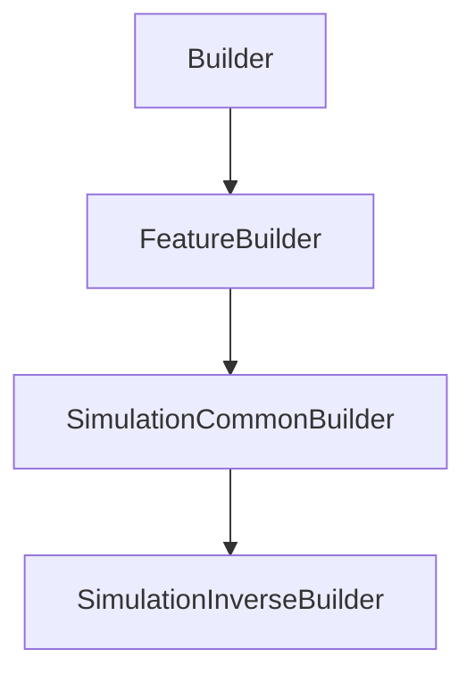

# SimulationInverseBuilder

## Class Inheritance

**Classes:**

- [Builder](class-builder.md)
- [FeatureBuilder](class-featurebuilder.md)
- [SimulationCommonBuilder](class-simulationcommonbuilder.md)
- [SimulationInverseBuilder](class-simulationinversebuilder.md)

## Description

Represents an Inverse Simulation Builder.

## Member Summary

| Member | Type |
| --- | --- |
| [SourceFaceFilteringReferences](#sourcefacefilteringreferences) | public |
| [StopOnPassNumber](#stoponpassnumber) | public |
| [NumberOfPasses](#numberofpasses) | public |
| [StopOnDuration](#stoponduration) | public |
| [Duration](#duration) | public |
| [MaximumNumberOfPaths](#maximumnumberofpaths) | public |
| [UsePartFamilies](#usepartfamilies) | public |
| [FamilySelection](#familyselection) | public |
| [SourcesOptions](#sourcesoptions) | public |
| [GeometriesOptions](#geometriesoptions) | public |
| [SensorsOptions](#sensorsoptions) | public |
| [AddSourceFaceFilteringReferences](#addsourcefacefilteringreferences) | public |
| [DeleteSourceFaceFilteringReferences](#deletesourcefacefilteringreferences) | public |

## Public Static Attributes

### SourceFaceFilteringReferences

`list[int] SourceFaceFilteringReferences`

Gets the sources faces filtering.

The SourcesFacesFilteringRef property returns a list of feature tag.  
**Value type**: List of integer.

---

### StopOnPassNumber

`bool StopOnPassNumber`

Gets or sets the property to enable stop on pass number.

True: Enables stop on PassNumber property  
False: Disables stop on PassNumber property  
**Value type**: Boolean.  
  
The default value is True.

---

### NumberOfPasses

`int NumberOfPasses`

Gets or sets the number of passes.

**Prerequisite**: The StopOnPassNumber property must be True.  
**Value type**: Integer.  
**Range**: the value must be superior to 0.  
  
The default value is 5.

---

### StopOnDuration

`Duration StopOnDuration`

Gets or sets the duration.

**Prerequisite**: The StopOnDuration property must be True.  
  
Time necessary to reach for the simulation to end.  
**Value type**: Double (in second).  
**Range**: The value must be superior to 0.0.  
  
The default value is 1800.0 s.

---

### Duration

`float Duration`

toto

toto

---

### MaximumNumberOfPaths

`int MaximumNumberOfPaths`

Gets or sets the maximum number of paths.

**Prerequisite**: The EnableLightExpert property must be True.  
  
The Maximum paths corresponds to the maximum number of rays the Light Path Finder file (\*.lpf or \*.lp3) can contain.  
**Value type**: Integer.  
**Range**: The value must be superior to 0.  
  
The default value is 100,000.

---

### UsePartFamilies

`bool UsePartFamilies`

Gets or sets the property to use family tables.

True: Enables multi-configuration to run in the simulation.  
False: Disables multi-configuration to run in the simulation.  
**Value type**: Boolean.  
  
The default value is False.

---

### FamilySelection

`list[str] FamilySelection`

Gets or sets the family selection list.

**Prerequisite**: The UseFamilyTables property must be True.  
  
Selects the configurations to run with the simulation.  
**Value type**: List of string.  
  
The default value is an empty list.

---

### SourcesOptions

`list[SourceOptions] SourcesOptions`

Gets the list of source options.

**Value type**: List of CSourceOptions.  
  
The number of elements corresponds to the number of sources in the simulation.

---

### GeometriesOptions

`list[GeometryOptions] GeometriesOptions`

Gets the list of geometry options.

**Value type**: List of CGeometryOptions.  
  
The number of elements corresponds to the number of geometries in the simulation.

---

### SensorsOptions

`list[SensorOptions] SensorsOptions`

Gets the list of sensor options.

**Value type**: List of CSensorOptions.  
  
The number of elements corresponds to the number of sensors in the simulation.

## Public Member Functions

### AddSourceFaceFilteringReferences

`void AddSourceFaceFilteringReferences(self, tags)`

Adds sources faces filtering into the simulation.

The AddSourceFaceFilteringRefs function takes a list of feature tag as parameter.

**Parameters**:

- `list[int] tags`: List of tags.

---

### DeleteSourceFaceFilteringReferences

`void DeleteSourceFaceFilteringReferences(self, tags)`

Deletes sources faces filtering from the simulation.

The DeleteSourceFaceFilteringRefs function takes a list of feature tag as parameter.

**Parameters**:

- `list[int] tags`: List of tags.
