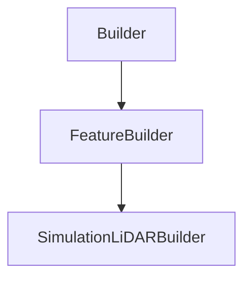

# SimulationLiDARBuilder

## Class Inheritance

**Classes:**

- [Builder](class-builder.md)
- [FeatureBuilder](class-featurebuilder.md)
- [SimulationLiDARBuilder](class-simulationlidarbuilder.md)

## Description

Represents an LiDAR Simulation Builder.

## Member Summary

| Member | Type | Description |
| --- | --- | --- |
| [Geometries](#geometries) | public | Gets or sets geometries tag. |
| [Sensors](#sensors) | public | Gets or sets sensor features. |
| [FeatureSimulation](#featuresimulation) | public | Gets the simulation feature object. |
| [StopOnRaysNumber](#stoponraysnumber) | public | Gets or sets the property to enable stop on rays number. |
| [RaysNumber](#raysnumber) | public | Gets or sets the number of rays. |
| [RayNumberMultiplier](#raynumbermultiplier) | public | Gets or sets the ray number multiplier. |
| [StopOnDuration](#stoponduration) | public | Gets or sets the property to stop on duration. |
| [Duration](#duration) | public | Gets or sets the duration. |
| [SourceGridSampling](#sourcegridsampling) | public | Gets or sets the grid sampling of the source. |
| [SensorPixelGridSampling](#sensorpixelgridsampling) | public | Gets or sets the pixel grid sampling of the sensor. |
| [Timeline](#timeline) | public | Gets or sets the property to enable the timeline. |
| [TimelineStart](#timelinestart) | public | Gets or sets the timeline start. |
| [TimelineEnd](#timelineend) | public | Gets or sets the timeline end. |
| [UseAmbientMaterial](#useambientmaterial) | public | Gets or sets the property to enable ambient material. |
| [AmbientMaterial](#ambientmaterial) | public | Gets or sets the ambient material. |
| [FieldsOfView](#fieldsofview) | public | Gets or sets the property to enable the field of view. |
| [MapOfDepth](#mapofdepth) | public | Gets or sets the property to enable the map of depth. |
| [RawTimeOfFlight](#rawtimeofflight) | public | Gets or sets the property to enable the raw time of flight. |
| [UsePresetSettings](#usepresetsettings) | public | Gets or sets the property to enable preset settings. |
| [Preset](#preset) | public | Gets or sets the Preset object. |
| [AllPreset](#allpreset) | public | Gets all Preset. |
| [Settings](#settings) | public | Gets or sets the simulation settings. |
| [UsePartFamilies](#usepartfamilies) | public | Gets or sets the property to use family tables. |
| [FamilySelection](#familyselection) | public | Gets or sets the family selection list. |
| [RemoveGeometries](#removegeometries) | public | Deletes geometries from the simulation. |
| [RemoveSensors](#removesensors) | public | Deletes sensors from the simulation. |

## Public Static Attributes

### Geometries

`list[int] Geometries`

Gets or sets geometries tag.

The Geometries property returns a list of feature tag.

---

### Sensors

`list[Feature] Sensors`

Gets or sets sensor features.

Gets or sets the current sensor features that are in the simulation.  
  
**Value type**: List of Feature object.

---

### FeatureSimulation

`FeatureSimulation FeatureSimulation`

Gets the simulation feature object.

Gets the simulation feature in order to launch simulations.  
  
**Value type**: FeatureSimulation object.

---

### StopOnRaysNumber

`bool StopOnRaysNumber`

Gets or sets the property to enable stop on rays number.

True: Enables stop on RaysNumber property.  
False: Disables stop on RaysNumber property.  
  
**Value type**: Boolean.  
  
The default value is True.

---

### RaysNumber

`int RaysNumber`

Gets or sets the number of rays.

**Prerequisite**: The StopOnRaysNumber property must be True.  
  
Number of rays necessary to reach for the simulation to end.  
  
**Value type**: Integer.  
**Range**: The value must be superior to 0.  
  
The default value is 200.

---

### RayNumberMultiplier

`int RayNumberMultiplier`

Gets or sets the ray number multiplier.

**Prerequisite**: The StopOnRaysNumber property must be True.  
  
The values are:  
0 - Rays.  
1 - Kilo-Rays.  
2 - Mega-Rays.  
3 - Giga-Rays.  
  
**Value type**: Integer.  
  
The default value is 1.

---

### StopOnDuration

`bool StopOnDuration`

Gets or sets the property to stop on duration.

True: Enables stop on Duration property  
False: Disables stop on Duration property  
  
**Value type**: Boolean.  
  
The default value is False.

---

### Duration

`float Duration`

Gets or sets the duration.

**Prerequisite**: The StopOnDuration property must be True.  
  
Time necessary to reach for the simulation to end.  
  
**Value type**: Double (in second).  
**Range**: The value must be superior to 0.0.  
  
The default value is 1800.0 s.

---

### SourceGridSampling

`int SourceGridSampling`

Gets or sets the grid sampling of the source.

**Value type**: Integer.  
**Range**: The value must be superior to 0.  
  
The default value is 100000.

---

### SensorPixelGridSampling

`int SensorPixelGridSampling`

Gets or sets the pixel grid sampling of the sensor.

**Value type**: Integer.  
**Range**: The value must be superior to 0.  
  
The default value is 5.

---

### Timeline

`bool Timeline`

Gets or sets the property to enable the timeline.

True: Enables the Timeline.  
False: Disables the Timeline.  
  
**Value type**: Boolean.  
  
The default value is False.

---

### TimelineStart

`float TimelineStart`

Gets or sets the timeline start.

**Prerequisite**: The Timeline property must be True.  
  
**Value type**: Double (in second).  
**Range**: The value must be superior to 0.0.  
  
The default value is 0.0 s.

---

### TimelineEnd

`float TimelineEnd`

Gets or sets the timeline end.

**Prerequisite**: The Timeline property must be True.  
  
**Value type**: Double (in second).  
**Range**: The value must be superior to the timeline start.  
  
The default value is 500.0 s.

---

### UseAmbientMaterial

`bool UseAmbientMaterial`

Gets or sets the property to enable ambient material.

True: Enables Ambient Material.  
False: Disables Ambient Material.  
  
**Value type**: Boolean.  
  
The default value is False.

---

### AmbientMaterial

`Feature AmbientMaterial`

Gets or sets the ambient material.

The AmbientMaterial property takes a feature and returns a feature.  
  
**Value type**: Feature object.  
  
The default value is None.

---

### FieldsOfView

`bool FieldsOfView`

Gets or sets the property to enable the field of view.

True: Enables the visualization of the source, sensor and lidar fields of view to be displayed in the 3D view after simulation.  
False: Disables the visualization of the source, sensor and lidar fields of view to be displayed in the 3D view after simulation.  
  
**Value type**: Boolean.  
  
The default value is True.

---

### MapOfDepth

`bool MapOfDepth`

Gets or sets the property to enable the map of depth.

True: Enables the map of depth to be generated after simulation.  
False: Disables the map of depth to be generated after simulation.  
  
**Value type**: Boolean.  
  
The default value is True.

---

### RawTimeOfFlight

`bool RawTimeOfFlight`

Gets or sets the property to enable the raw time of flight.

True: Enables the raw time of flight.  
False: Disables the raw time of flight.  
  
**Value type**: Boolean.  
  
The default value is True.

---

### UsePresetSettings

`bool UsePresetSettings`

Gets or sets the property to enable preset settings.

True: Enables Preset Settings  
False: Disables Preset Settings  
  
**Value type**: Boolean.  
  
The default value is False.

---

### Preset

`DataModels::CPreset Preset`

Gets or sets the Preset object.

A preset is a predefined set of the general simulation settings.  
  
**Value type**: Preset object.  
  
The default value is None.

---

### AllPreset

`list[DataModels::CPreset] AllPreset`

Gets all Preset.

**Value type**: List of Preset object.

---

### Settings

`DataModels::CSimulationSettings Settings`

Gets or sets the simulation settings.

**Value type**: SimulationSettings object.

---

### UsePartFamilies

`bool UsePartFamilies`

Gets or sets the property to use family tables.

True: Enables multi-configuration to run in the simulation.  
False: Disables multi-configuration to run in the simulation.  
  
**Value type**: Boolean.  
  
The default value is False.

---

### FamilySelection

`list[str] FamilySelection`

Gets or sets the family selection list.

**Prerequisite**: The UseFamilyTables property must be True.  
  
Selects the configurations to run with the simulation.  
  
**Value type**: List of string.  
  
The default value is an empty list.

## Public Member Functions

### RemoveGeometries

`void RemoveGeometries(self, tags)`

Deletes geometries from the simulation.

The DeleteGeometries function takes a list of feature tag as parameter.

**Parameters**:

- `list[int] tags`: List of tags.

---

### RemoveSensors

`void RemoveSensors(self, sensors)`

Deletes sensors from the simulation.

**Parameters**:

- `list[Feature] sensors`: List of Feature object.
