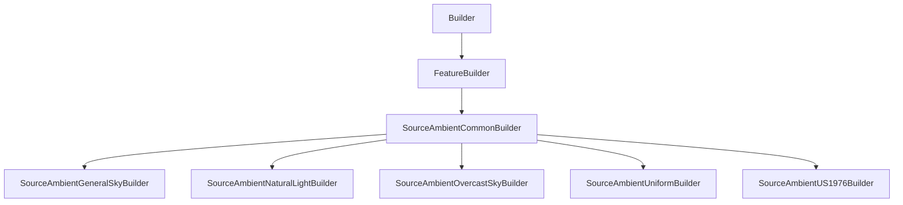

# SourceAmbientCommonBuilder

## Class Inheritance

**Classes:**

- [Builder](class-builder.md)
- [FeatureBuilder](class-featurebuilder.md)
- [SourceAmbientCommonBuilder](class-sourceambientcommonbuilder.md)
- [SourceAmbientGeneralSkyBuilder](class-sourceambientgeneralskybuilder.md)
- [SourceAmbientNaturalLightBuilder](class-sourceambientnaturallightbuilder.md)
- [SourceAmbientOvercastSkyBuilder](class-sourceambientovercastskybuilder.md)
- [SourceAmbientUniformBuilder](class-sourceambientuniformbuilder.md)
- [SourceAmbientUS1976Builder](class-sourceambientus1976builder.md)

## Description

A base class for all Ambient Source Builders.
