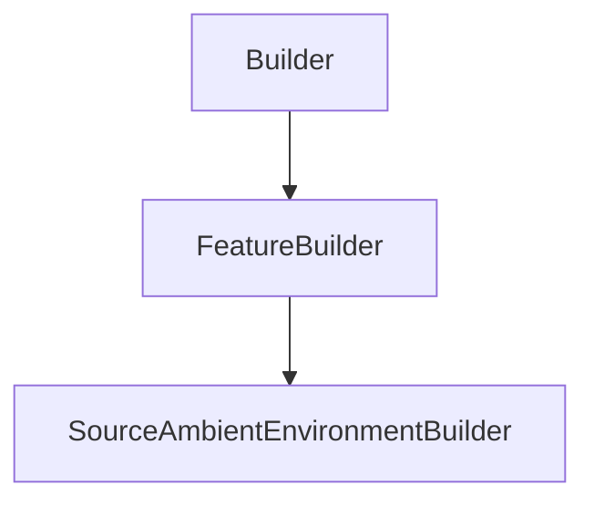

# SourceAmbientEnvironmentBuilder

## Class Inheritance

**Classes:**

- [Builder](class-builder.md)
- [FeatureBuilder](class-featurebuilder.md)
- [SourceAmbientEnvironmentBuilder](class-sourceambientenvironmentbuilder.md)

## Description

Represents the builder for an ambient environment source.

## Member Summary

| Member | Type |
| --- | --- |
| [Luminance](#luminance) | public |
| [ImageFilePath](#imagefilepath) | public |
| [GroundOrigin](#groundorigin) | public |
| [Height](#height) | public |
| [ColorSpace](#colorspace) | public |
| [WhitePointType](#whitepointtype) | public |
| [WhitePointX](#whitepointx) | public |
| [WhitePointY](#whitepointy) | public |
| [RedSpectrumFile](#redspectrumfile) | public |
| [GreenSpectrumFile](#greenspectrumfile) | public |
| [BlueSpectrumFile](#bluespectrumfile) | public |
| [PreviewSize](#previewsize) | public |

## Public Static Attributes

### Luminance

`float Luminance`

Gets or sets the luminance.

The luminance parameter is the source luminance for the white point in front direction of the source.  
**Value type**: Double (cd/m2).  
**Range**: The value must be superior to 0.0.  
  
The default value is 1000.0 cd/m2.

---

### ImageFilePath

`FilePath ImageFilePath`

Gets or sets the image file.

**Value type**: String.  
  
The default value is an empty string.

---

### GroundOrigin

`int GroundOrigin`

Gets or sets the ground origin.

The GroundOrigin property takes a feature tag.  
**Value type**: Integer.  
  
The default value is 0.

---

### Height

`float Height`

Gets or sets the height.

**Value type**: Double (in mm).  
  
The default value is 0.0 mm.

---

### ColorSpace

`int ColorSpace`

Gets or sets the color space model type.

The values are:  
0 - sRGB. Uses the standard and most commonly used RGB based model.  
1 - Adobe RGB. Uses a larger gamut.  
2 - User Defined RGB. Defines manually the white point of the standard illuminant.  
**Value type**: Integer.  
  
The default value is 0.

---

### WhitePointType

`Type WhitePointType`

Gets or sets the white point type of the standard illuminant.

**Prerequisite**: The ColorSpace property must be 2.  
  
The values are:  
0 - C. Uses an average daylight illuminant.  
1 - D50. Uses a natural, horizon light.  
2 - D65. Uses a standard daylight illuminant that provides accurate color perception and evaluation.  
3 - E. Uses an illuminant that gives equal weight to all wavelengths.  
4 - User defined. Allows to edit the Color Coordinates of the white point.  
**Value type**: Integer.  
  
The default value is 0.

---

### WhitePointX

`float WhitePointX`

Gets or sets the X coordinate of the white point.

**Prerequisite**: The WhitePoint property must be 4.  
**Value type**: Double.  
  
The default value is 0.31271.

---

### WhitePointY

`float WhitePointY`

Gets or sets the Y coordinate of the white point.

**Prerequisite**: The WhitePoint property must be 4.  
**Value type**: Double.  
  
The default value is 0.32902.

---

### RedSpectrumFile

`str RedSpectrumFile`

Gets or sets the red spectrum file.

**Prerequisite**: The WhitePoint property must be 4.  
**Value type**: String.  
  
The default value is an empty string.

---

### GreenSpectrumFile

`str GreenSpectrumFile`

Gets or sets the green spectrum file.

**Prerequisite**: The ColorSpace property must be 2.  
**Value type**: String.  
  
The default value is an empty string.

---

### BlueSpectrumFile

`str BlueSpectrumFile`

Gets or sets the blue spectrum file.

**Prerequisite**: The ColorSpace property must be 2.  
**Value type**: String.  
  
The default value is an empty string.

---

### PreviewSize

`Size PreviewSize`

Gets or sets the preview arrows size.

**Value type**: Double (in mm).  
  
The default value is 100.0 mm.
