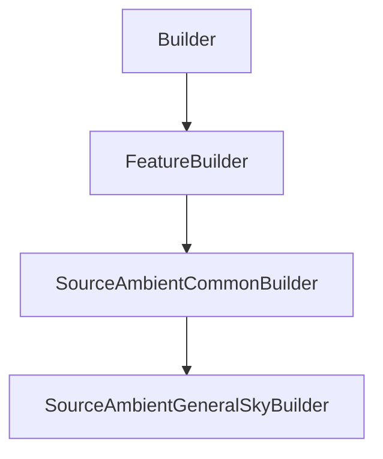

# SourceAmbientGeneralSkyBuilder

## Class Inheritance

**Classes:**

- [Builder](class-builder.md)
- [FeatureBuilder](class-featurebuilder.md)
- [SourceAmbientCommonBuilder](class-sourceambientcommonbuilder.md)
- [SourceAmbientGeneralSkyBuilder](class-sourceambientgeneralskybuilder.md)

## Description

Represents the builder for an Ambient Source with CIE Standard General Sky type.

## Member Summary

| Member | Type |
| --- | --- |
| [Luminance](#luminance) | public |
| [CIEType](#cietype) | public |
| [SunType](#suntype) | public |
| [SunDirectionReversed](#sundirectionreversed) | public |

## Public Static Attributes

### Luminance

`float Luminance`

Gets or sets the luminance

**Value type**: Double (in cd/m2).  
**Range**: The value must be superior to 0.  
  
The default value is 1000.0 cd/m2.

---

### CIEType

`int CIEType`

Gets or sets the CIE type.

The values are:  
0 - CIE standard overcast sky.  
1 - Overcast with steep luminance gradation and slight brightening towards the sun.  
2 - Overcast, moderately graded with azimuthal uniformity.  
3 - Overcast, moderately graded and slight brightening towards the sun.  
4 - Sky of uniform luminance.  
5 - Partly cloudy sky, no gradation towards zenith, slight brightnening.  
6 - Partly cloudy sky, no gradation towards zenith, brighter circumsolar region.  
7 - Partly cloudy sky, no gradation towards zenith, distinct solar corona.  
8 - Partly cloudy sky, with the obscured sun.  
9 - Partly cloudy sky, with brighter circumsolar region.  
10 - White blue sky with distinct solar corona.  
11 - CIE standard clear sky, low luminance turbidity.  
12 - CIE standard clear sky, polluted atmosphere.  
13 - Cloudless turbid sky with broad solar corona.  
14 - White blue turbid sky with broad solar corona.  
**Value type**: Integer.  
  
The default value is 5.

---

### SunType

`int SunType`

Gets or sets the Sun type.

The values are:  
0 - Automatic, you must set the values in the Timezone and Location object.  
1 - Direction, you must to set the sun direction property.  
**Value type**: Integer.  
  
The default value is 0.

---

### SunDirectionReversed

`bool SunDirectionReversed`

Gets or sets the reverse Sun direction.

**Prerequisite**: The SunType property must be 1.  
  
True: Reverses the Sun direction.  
False: Does not reverse the Sun direction.  
**Value type**: Boolean.  
  
The default value is False.
