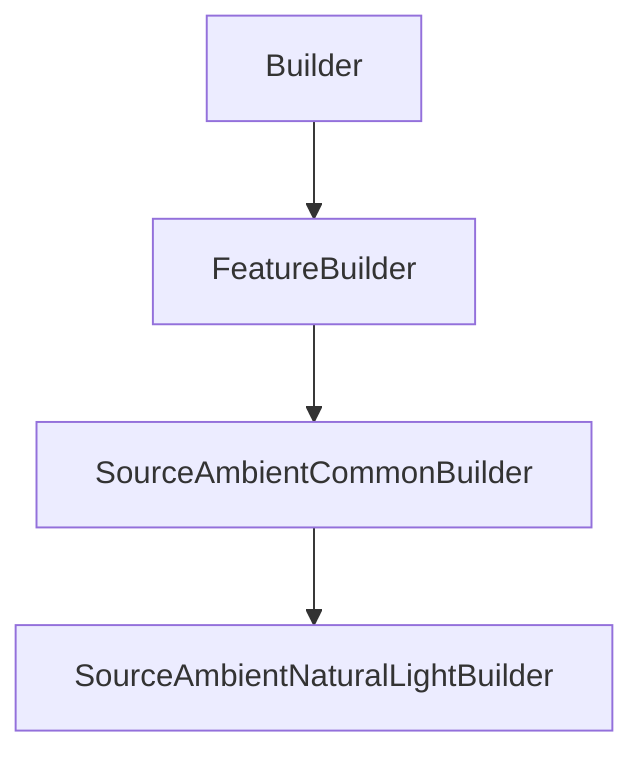

# SourceAmbientNaturalLightBuilder

## Class Inheritance

**Classes:**

- [Builder](class-builder.md)
- [FeatureBuilder](class-featurebuilder.md)
- [SourceAmbientCommonBuilder](class-sourceambientcommonbuilder.md)
- [SourceAmbientNaturalLightBuilder](class-sourceambientnaturallightbuilder.md)

## Description

Represents the builder for an Ambient Source with Natural Light type.

## Member Summary

| Member | Type |
| --- | --- |
| [SunType](#suntype) | public |
| [SunDirectionReversed](#sundirectionreversed) | public |
| [Turbidity](#turbidity) | public |
| [WithSky](#withsky) | public |

## Public Static Attributes

### SunType

`int SunType`

Gets or sets the Sun type.

The values are:  
0 - Automatic, you must set the values in the Timezone object.  
1 - Direction, you must to set the sun direction property.  
**Value type**: Integer.  
  
The default value is 0.

---

### SunDirectionReversed

`bool SunDirectionReversed`

Gets or sets the reverse Sun direction.

**Prerequisite**: The SunType property must be 1.  
  
True: Reverses the Sun direction.  
False: Does not reverse the Sun direction.  
**Value type**: Boolean.  
  
The default value is False.

---

### Turbidity

`float Turbidity`

Gets or sets the turbidity.

Turbidity is a measure of the fraction of scattering due to haze as opposed to molecules.  
**Value type**: Double.  
**Range**: [2.0, 9.0]  
  
The default value is 3.0.

---

### WithSky

`bool WithSky`

Gets or sets the property to enable the sky.

True: Uses the sun and Sky in simulations.  
False: Uses sun only in simulations.  
**Value type**: Boolean.  
  
The default value is True.
