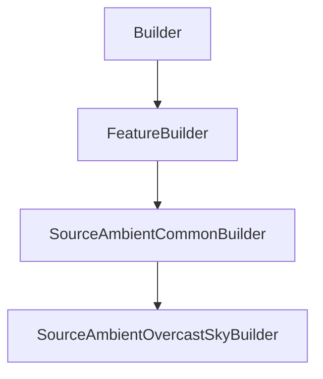

# SourceAmbientOvercastSkyBuilder

## Class Inheritance

**Classes:**

- [Builder](class-builder.md)
- [FeatureBuilder](class-featurebuilder.md)
- [SourceAmbientCommonBuilder](class-sourceambientcommonbuilder.md)
- [SourceAmbientOvercastSkyBuilder](class-sourceambientovercastskybuilder.md)

## Description

Represents the builder for an Ambient Source with CIE Standard Overcast Sky type.

## Member Summary

| Member | Type |
| --- | --- |
| [ZenithDirection](#zenithdirection) | public |
| [ZenithDirectionReversed](#zenithdirectionreversed) | public |
| [Luminance](#luminance) | public |
| [Spectrum](#spectrum) | public |
| [SpectrumFilePath](#spectrumfilepath) | public |
| [Temperature](#temperature) | public |

## Public Static Attributes

### ZenithDirection

`int ZenithDirection`

Gets or sets the zenith direction.

The zenith direction property takes a feature tag and returns a feature tag.  
**Value type**: Integer.  
  
The default value is 0.

---

### ZenithDirectionReversed

`bool ZenithDirectionReversed`

Gets or sets the reverse zenith direction.

True: Reverses the zenith direction.  
False: Not reverse the zenith direction  
**Value type**: Boolean.  
  
The default value is False.

---

### Luminance

`float Luminance`

Gets or sets the luminance

**Value type**: Double (cd/m2).  
**Range**: The value must be superior to 0.  
  
The default value is 1000.0 cd/m2.

---

### Spectrum

`int Spectrum`

Gets or sets the spectrum type.

The values are:  
0 - Blackbody, then in the Temperature property, set the blackbody temperature of the source spectrum in Kelvin.  
1 - Library, then in the File property, browse a .spectrum file.  
**Value type**: Integer.  
  
The default value is 0.

---

### SpectrumFilePath

`str SpectrumFilePath`

Gets or sets the spectrum file path.

**Prerequisite**: The SpectrumType property must be 1.  
**Value type**: String.  
  
The default value is an empty string.

---

### Temperature

`float Temperature`

Gets or sets the temperature.

**Prerequisite**: The SpectrumType property must be 0.  
**Value type**: Double (in Kelvin).  
**Range**: The value must be superior to 0.0.  
  
The default value is 8000.0 Kelvin.
