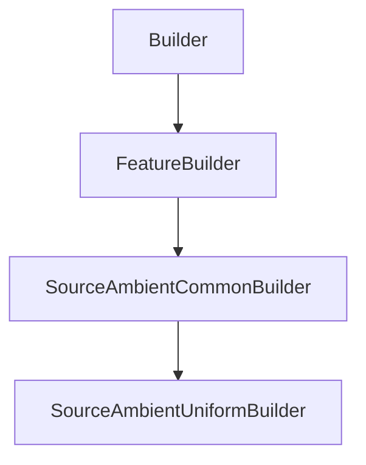

# SourceAmbientUniformBuilder

## Class Inheritance

**Classes:**

- [Builder](class-builder.md)
- [FeatureBuilder](class-featurebuilder.md)
- [SourceAmbientCommonBuilder](class-sourceambientcommonbuilder.md)
- [SourceAmbientUniformBuilder](class-sourceambientuniformbuilder.md)

## Description

Represents the builder for an Ambient Source with Uniform type.

## Member Summary

| Member | Type |
| --- | --- |
| [ZenithDirectionReversed](#zenithdirectionreversed) | public |
| [Luminance](#luminance) | public |
| [Spectrum](#spectrum) | public |
| [SpectrumFilePath](#spectrumfilepath) | public |
| [Temperature](#temperature) | public |
| [MirroredExtent](#mirroredextent) | public |
| [Sun](#sun) | public |
| [SunDirectionReverse](#sundirectionreverse) | public |

## Public Static Attributes

### ZenithDirectionReversed

`bool ZenithDirectionReversed`

Gets or sets the reverse zenith direction.

True: Reverses the zenith direction.  
False: Does not reverse the zenith direction  
**Value type**: Boolean.  
  
The default value is False.

---

### Luminance

`float Luminance`

Gets or sets the luminance

**Value type**: Double (in cd/m2).  
**Range**: The value must be superior to 0.  
  
The default value is 1000.0 cd/m2.

---

### Spectrum

`int Spectrum`

Gets or sets the spectrum type.

The values are:  
0: Blackbody, then in the Temperature property, set the blackbody temperature of the source spectrum in Kdeg.  
1: Library, then in the File property, browse a .spectrum file.  
**Value type**: Integer.  
  
The default value is 0.

---

### SpectrumFilePath

`FilePath SpectrumFilePath`

Gets or sets the spectrum file path.

**Prerequisite**: The SpectrumType property must be 1.  
**Value type**: String.  
  
The default value is an empty string.

---

### Temperature

`float Temperature`

Gets or sets the temperature.

**Prerequisite**: The SpectrumType property must be 0.  
**Value type**: String.  
**Range**: The value must be superior to 0.0.  
  
The default value is 8000.0 Kelvin.

---

### MirroredExtent

`bool MirroredExtent`

Gets or sets the property to enable mirrored extent.

True: Gets an ambient light from all the space.  
False: Gets an ambient light only in the upper half space.  
**Value type**: Boolean.  
  
The default value is False.

---

### Sun

`bool Sun`

Gets or sets the property to enable the Sun.

True : Uses the Sun.  
False : Does not use the Sun.  
**Value type**: Boolean.  
  
The default value is False.

---

### SunDirectionReverse

`bool SunDirectionReverse`

Gets or sets the reverse Sun direction.

**Prerequisite**: The UseSun property must be True.  
  
True: Reverses the Sun direction.  
False: Does not reverse the Sun directio.n  
**Value type**: Boolean.  
  
The default value is False.
