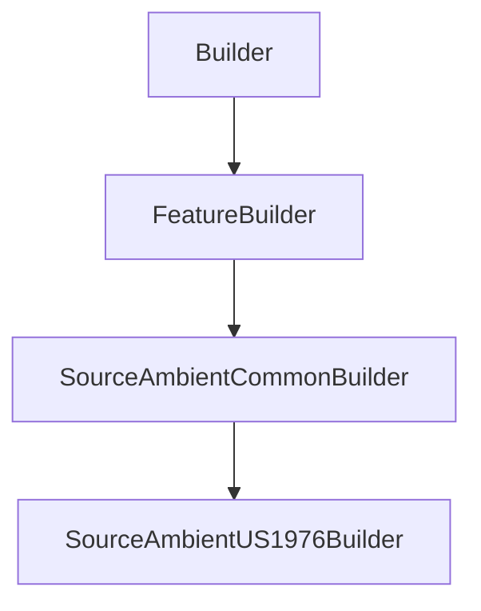

# SourceAmbientUS1976Builder

## Class Inheritance

**Classes:**

- [Builder](class-builder.md)
- [FeatureBuilder](class-featurebuilder.md)
- [SourceAmbientCommonBuilder](class-sourceambientcommonbuilder.md)
- [SourceAmbientUS1976Builder](class-sourceambientus1976builder.md)

## Description

Represents the builder for an U.S Standard Atmosphere 1976 Source.

## Member Summary

| Member | Type |
| --- | --- |
| [SunType](#suntype) | public |
| [SunDirectionReversed](#sundirectionreversed) | public |

## Public Static Attributes

### SunType

`int SunType`

Gets or sets the Sun type.

The values are:  
0 - Automatic, you must set the values in the Timezone object.  
1 - Direction, you must to set the sun direction property.  
  
**Value type**: Integer.  
  
The default value is 0.

---

### SunDirectionReversed

`bool SunDirectionReversed`

Gets or sets the reverse Sun direction.

**Prerequisite**: The SunType property must be 1.  
  
True: Reverses the Sun direction.  
False: Does not reverse the Sun direction.  
  
**Value type**: Boolean.  
  
The default value is False.
