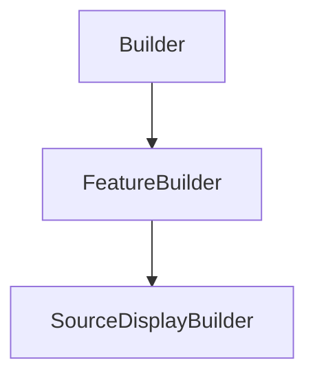

# SourceDisplayBuilder

## Class Inheritance

**Classes:**

- [Builder](class-builder.md)
- [FeatureBuilder](class-featurebuilder.md)
- [SourceDisplayBuilder](class-sourcedisplaybuilder.md)

## Description

Represents the builder for a display source.

## Member Summary

| Member | Type | Description |
| --- | --- | --- |
| [Luminance](#luminance) | public | Gets or sets the luminance. |
| [InfiniteContrast](#infinitecontrast) | public | Gets or sets the property to enable infinite contrast ratio. |
| [Contrast](#contrast) | public | Gets or sets the contrast ratio. |
| [ImageFilePath](#imagefilepath) | public | Gets or sets the image file. |
| [XStart](#xstart) | public | Gets or sets the sensor X start dimension value. |
| [XEnd](#xend) | public | Gets or sets the sensor X end dimension value. |
| [XMirroredExtent](#xmirroredextent) | public | Gets or sets the sensor X dimension mirrored value. |
| [YStart](#ystart) | public | Gets or sets the sensor Y start dimension value. |
| [YEnd](#yend) | public | Gets or sets the sensor Y start dimension value. |
| [YMirroredExtent](#ymirroredextent) | public | Gets or sets the sensor Y dimension mirrored value. |
| [IntensityType](#intensitytype) | public | Gets or sets the intensity diagram. |
| [LambertianMaximumAngle](#lambertianmaximumangle) | public | Gets or sets the theta value for Lambertian distribution. |
| [CosN](#cosn) | public | Gets or sets the N value for Cos distribution. |
| [GaussianFWHMAngle](#gaussianfwhmangle) | public | Gets or sets the FWHM angle value for Symmetric Gaussian distribution. |
| [GaussianFWHMAngleX](#gaussianfwhmanglex) | public | Gets or sets the FWHM X angle value for Asymmetric Gaussian distribution. |
| [GaussianFWHMAngleY](#gaussianfwhmangley) | public | Gets or sets the FWHM Y angle value for Asymmetric Gaussian distribution. |
| [IntensityFilePath](#intensityfilepath) | public | Gets or sets the intensity file for Library distribution. |
| [XDirectionReversed](#xdirectionreversed) | public | Gets or sets the property to reverse the X direction. |
| [YDirectionReversed](#ydirectionreversed) | public | Gets or sets the property to reverse the Y direction. |
| [ColorSpace](#colorspace) | public | Gets or sets the color space model type. |
| [WhitePointType](#whitepointtype) | public | Gets or sets the white point type of the standard illuminant. |
| [WhitePointX](#whitepointx) | public | Gets or sets the X coordinate of the white point. |
| [WhitePointY](#whitepointy) | public | Gets or sets the Y coordinate of the white point. |
| [RedSpectrumFilePath](#redspectrumfilepath) | public | Gets or sets the red spectrum file. |
| [GreenSpectrumFilePath](#greenspectrumfilepath) | public | Gets or sets the green spectrum file. |
| [BlueSpectrumFilePath](#bluespectrumfilepath) | public | Gets or sets the blue spectrum file. |
| [NumberOfRays](#numberofrays) | public | Gets or sets the number of rays. |
| [RayLength](#raylength) | public | Gets or sets the ray length. |
| [ShowIntensityDistribution](#showintensitydistribution) | public | Gets or sets the property to show the intensity distribution in the 3D view. |
| [ShowImage](#showimage) | public | Gets or sets the property to show the image. |

## Public Static Attributes

### Luminance

`float Luminance`

Gets or sets the luminance.

The luminance parameter is the source luminance for the white point in front direction of the source.  
  
**Value type**: Double (in cd/m2).  
**Range**: The value must be superior to 0.0.  
  
The default value is 50.0 cd/m2.

---

### InfiniteContrast

`bool InfiniteContrast`

Gets or sets the property to enable infinite contrast ratio.

True: Enable contrast ratio.  
False: Disable contrast ratio.  
  
**Value type**: Boolean.  
  
The default value is True.

---

### Contrast

`int Contrast`

Gets or sets the contrast ratio.

**Prerequisite**: The IsInfiniteContrast property must be False.  
  
Contrast Ratio = (Luminance of the brightest color-Luminance of the darkest color)/(Luminance of the darkest color).  
  
**Value type**: Integer.  
**Range**: The value must be superior to 0.  
  
The default value is 500.

---

### ImageFilePath

`FilePath ImageFilePath`

Gets or sets the image file.

Selects a .jpg or a .png file.  
  
**Value type**: String.  
  
The default value is an empty string.

---

### XStart

`float XStart`

Gets or sets the sensor X start dimension value.

**Value type**: Double (in mm).  
  
The default value is -50.0 mm.

---

### XEnd

`float XEnd`

Gets or sets the sensor X end dimension value.

**Value type**: Double (in mm).  
  
The default value is 50.0 mm.

---

### XMirroredExtent

`bool XMirroredExtent`

Gets or sets the sensor X dimension mirrored value.

True: XStart == -XEnd, you can only change the XEnd value.  
False: XStart and XEnd can have different value.  
  
**Value type**: Boolean.  
  
The default value is False.

---

### YStart

`float YStart`

Gets or sets the sensor Y start dimension value.

**Value type**: Double (in mm).  
  
The default value is -50.0 mm.

---

### YEnd

`float YEnd`

Gets or sets the sensor Y start dimension value.

**Value type**: Double (in mm).  
  
The default value is 50.0 mm.

---

### YMirroredExtent

`bool YMirroredExtent`

Gets or sets the sensor Y dimension mirrored value.

True: YStart == -YEnd, you can only change the YEnd value.  
False: YStart and YEnd can have different value.  
  
**Value type**: Boolean.  
  
The default value is False.

---

### IntensityType

`int IntensityType`

Gets or sets the intensity diagram.

The intensity diagram of a source describes in which directions is made the emission.  
  
The values are:  
0 - Lambertian.  
1 - Cos.  
2 - Symmetric Gaussian.  
3 - Asymmetric Gaussian.  
4 - Library.  
  
**Value type**: Integer.  
  
The default value is 0.

---

### LambertianMaximumAngle

`float LambertianMaximumAngle`

Gets or sets the theta value for Lambertian distribution.

**Prerequisite**: The IntensityType property must be 0.  
  
**Value type**: Double (in degrees).  
**Range**: [0.0, 180.0].  
  
The default value is 180.0 degrees.

---

### CosN

`float CosN`

Gets or sets the N value for Cos distribution.

**Prerequisite**: The IntensityType property must be 1.  
  
**Value type**: Double.  
  
The default value is 3.0.

---

### GaussianFWHMAngle

`float GaussianFWHMAngle`

Gets or sets the FWHM angle value for Symmetric Gaussian distribution.

**Prerequisite**: The IntensityType property must be 2.  
  
**Value type**: Double (in degrees).  
**Range**: [0.0, 180.0].  
  
The default value is 30.0 degrees.

---

### GaussianFWHMAngleX

`float GaussianFWHMAngleX`

Gets or sets the FWHM X angle value for Asymmetric Gaussian distribution.

**Prerequisite**: The IntensityType property must be 3.  
  
**Value type**: Double (in degrees).  
**Range**: [0.0, 180.0].  
  
The default value is 30.0 degrees.

---

### GaussianFWHMAngleY

`float GaussianFWHMAngleY`

Gets or sets the FWHM Y angle value for Asymmetric Gaussian distribution.

**Prerequisite**: The IntensityType property must be 3.  
  
**Value type**: Double (in degrees).  
**Range**: [0.0, 180.0].  
  
The default value is 30.0 degrees.

---

### IntensityFilePath

`FilePath IntensityFilePath`

Gets or sets the intensity file for Library distribution.

**Prerequisite**: The IntensityType property must be 4.  
  
**Value type**: String.  
  
The default value is an empty string.

---

### XDirectionReversed

`bool XDirectionReversed`

Gets or sets the property to reverse the X direction.

**Prerequisite**: The IntensityType property must be 3 or 4.  
  
True: Reverses the X direction.  
False: Does not reverse the X direction.  
  
**Value type**: Boolean.  
  
The default value is False.

---

### YDirectionReversed

`bool YDirectionReversed`

Gets or sets the property to reverse the Y direction.

**Prerequisite**: The IntensityType property must be 3 or 4.  
  
True: Reverses the Y direction.  
False: Does not reverse the Y direction.  
  
**Value type**: Boolean.  
  
The default value is False.

---

### ColorSpace

`int ColorSpace`

Gets or sets the color space model type.

The values are:  
0 - sRGB. Uses the standard and most commonly used RGB based model.  
1 - Adobe RGB. Uses a larger gamut.  
2 - User Defined RGB. Defines manually the white point of the standard illuminant.  
  
**Value type**: Integer.  
  
The default value is 0.

---

### WhitePointType

`int WhitePointType`

Gets or sets the white point type of the standard illuminant.

**Prerequisite**: The ColorSpace property must be 2.  
  
The values are:  
0 - C. Uses an average daylight illuminant.  
1 - D50. Uses a natural, horizon light.  
2 - D65. Uses a standard daylight illuminant that provides accurate color perception and evaluation.  
3 - E. Uses an illuminant that gives equal weight to all wavelengths.  
4 - User defined. Edits the Color Coordinates of the white point.  
  
**Value type**: Integer.  
  
The default value is 0.

---

### WhitePointX

`float WhitePointX`

Gets or sets the X coordinate of the white point.

**Prerequisite**: The WhitePoint property must be 4.  
  
**Value type**: Double.  
  
The default value is 0.31271.

---

### WhitePointY

`float WhitePointY`

Gets or sets the Y coordinate of the white point.

**Prerequisite**: The WhitePoint property must be 4.  
  
**Value type**: Double.  
  
The default value is 0.32902.

---

### RedSpectrumFilePath

`SpectrumFilePath RedSpectrumFilePath`

Gets or sets the red spectrum file.

**Prerequisite**: The ColorSpace property must be 2.  
  
**Value type**: String.  
  
The default value is an empty string.

---

### GreenSpectrumFilePath

`SpectrumFilePath GreenSpectrumFilePath`

Gets or sets the green spectrum file.

**Prerequisite**: The ColorSpace property must be 2.  
  
**Value type**: String.  
  
The default value is an empty string.

---

### BlueSpectrumFilePath

`SpectrumFilePath BlueSpectrumFilePath`

Gets or sets the blue spectrum file.

**Prerequisite**: The ColorSpace property must be 2.  
  
**Value type**: String.  
  
The default value is an empty string.

---

### NumberOfRays

`int NumberOfRays`

Gets or sets the number of rays.

**Value type**: Integer.  
**Range**: The value must be superior or equal to 0.  
  
The default value is 100.

---

### RayLength

`float RayLength`

Gets or sets the ray length.

**Value type**: Double (in mm).  
**Range**: The value must be superior to 0.0.  
  
The default value is 75.0 mm.

---

### ShowIntensityDistribution

`bool ShowIntensityDistribution`

Gets or sets the property to show the intensity distribution in the 3D view.

**Prerequisite**: The IntensityType property must be 4.  
  
True: Shows the intensity distribution in the 3D view.  
False: Does not show the intensity distribution in the 3D view.  
  
The default value is False.

---

### ShowImage

`bool ShowImage`

Gets or sets the property to show the image.

True: Shows the image.  
False: Does not show the image.  
  
The default value is True.
