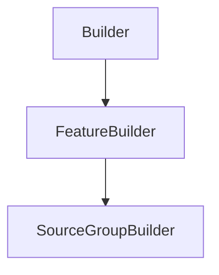

# SourceGroupBuilder

## Class Inheritance

**Classes:**

- [Builder](class-builder.md)
- [FeatureBuilder](class-featurebuilder.md)
- [SourceGroupBuilder](class-sourcegroupbuilder.md)

## Description

Represents a Source Group Builder.

## Member Summary

| Member | Type |
| --- | --- |
| [Sources](#sources) | public |
| [AddSources](#addsources) | public |
| [RemoveSources](#removesources) | public |

## Public Static Attributes

### Sources

`list[Feature] Sources`

Gets source features.

Gets the current source features that are in the simulation.  
**Value type**: List of Feature object.

## Public Member Functions

### AddSources

`void AddSources(self, sources)`

Adds sources into the simulation.

**Parameters**:

- `list[Feature] sources`: List of Feature object

---

### RemoveSources

`void RemoveSources(self, sources)`

Deletes sources from the simulation.

**Parameters**:

- `list[Feature] sources`: List of Feature object
