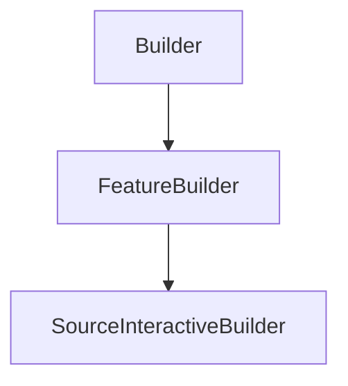

# SourceInteractiveBuilder

## Class Inheritance

**Classes:**

- [Builder](class-builder.md)
- [FeatureBuilder](class-featurebuilder.md)
- [SourceInteractiveBuilder](class-sourceinteractivebuilder.md)

## Description

Represents an interactive source builder.

## Member Summary

| Member | Type |
| --- | --- |
| [Type](#type) | public |
| [Wavelength](#wavelength) | public |
| [StartPoint](#startpoint) | public |
| [StartFirstSampling](#startfirstsampling) | public |
| [StartSecondSampling](#startsecondsampling) | public |
| [EndPoint](#endpoint) | public |
| [EndDirectionReversed](#enddirectionreversed) | public |
| [EndFirstSampling](#endfirstsampling) | public |
| [EndSecondSampling](#endsecondsampling) | public |
| [RayLength](#raylength) | public |

## Public Static Attributes

### Type

`int Type`

Gets or sets the interactive source type.

The values are:  
0 - POINT_POINT.  
1 - POINT_DIRECTION.  
2 - POINT_CURVE.  
3 - POINT_FACE.  
4 - CURVE_POINT.  
5 - CURVE_DIRECTION.  
6 - CURVE_CURVE.  
7 - CURVE_FACE.  
8 - FACE_POINT.  
9 - FACE_DIRECTION.  
10 - FACE_CURVE.  
11 - FACE_FACE.  
  
**Value type**: Integer.  
  
The default value is 2 - POINT_CURVE.

---

### Wavelength

`float Wavelength`

Gets or sets the wavelength.

**Prerequisite**: The SpectrumType property must be 0.  
  
**Value type**: Double (in nm).  
**Range**: The value must be superior to 0.0.  
  
The default value is 555.0 nm.

---

### StartPoint

`int StartPoint`

Gets or sets the start point.

The property takes a feature tag and returns a feature tag.  
  
**Value type**: Integer.  
  
The default value is 0.

---

### StartFirstSampling

`int StartFirstSampling`

Gets or sets the start first sampling.

**Value type**: Integer.  
**Range**: The value must be superior to 1.  
  
The default value is 5.

---

### StartSecondSampling

`int StartSecondSampling`

Gets or sets the start second sampling.

**Value type**: Integer.  
**Range**: The value must be superior to 1.  
  
The default value is 5.

---

### EndPoint

`int EndPoint`

Gets or sets the end point.

The property takes a feature tag and returns a feature tag.  
  
**Value type**: Integer.  
  
The default value is 0.

---

### EndDirectionReversed

`bool EndDirectionReversed`

Gets or sets the property to reverse the end direction.

True: Reverses the direction.  
False: Does not reverse the direction.  
  
**Value type**: Boolean.  
  
The default value is False.

---

### EndFirstSampling

`int EndFirstSampling`

Gets or sets the end first sampling.

**Value type**: Integer.  
**Range**: The value must be superior to 1.  
  
The default value is 5.

---

### EndSecondSampling

`int EndSecondSampling`

Gets or sets the end second sampling.

**Value type**: Integer.  
**Range**: The value must be superior to 1.  
  
The default value is 5.

---

### RayLength

`float RayLength`

Gets or sets the ray length.

**Value type**: Double (in mm).  
**Range**: The value must be superior to 0.0.  
  
The default value is 75.0 mm.
