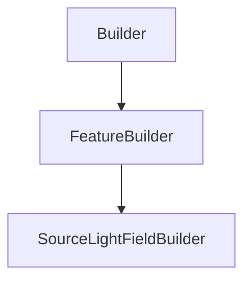

# SourceLightFieldBuilder

## Class Inheritance

**Classes:**

- [Builder](class-builder.md)
- [FeatureBuilder](class-featurebuilder.md)
- [SourceLightFieldBuilder](class-sourcelightfieldbuilder.md)

## Description

Represents a light field source builder.

## Member Summary

| Member | Type |
| --- | --- |
| [CustomAxisSystem](#customaxissystem) | public |
| [LightFieldFilePath](#lightfieldfilepath) | public |
| [SpectrumFilePath](#spectrumfilepath) | public |
| [NumberOfRays](#numberofrays) | public |
| [RayLength](#raylength) | public |
| [PreviewMode](#previewmode) | public |

## Public Static Attributes

### CustomAxisSystem

`AxisSystem CustomAxisSystem`

Gets or sets the custom axis system property.

True: Enables custom axis system.  
False: Disables custom axis system.  
**Value type**: Boolean.  
  
The default value is False.

---

### LightFieldFilePath

`FilePath LightFieldFilePath`

Gets or sets the light field file path.

**Value type**: String.  
  
The default value is an empty string.

---

### SpectrumFilePath

`FilePath SpectrumFilePath`

Gets or sets the spectrum file path.

**Prerequisite**: The Light Field file must contain radiometric or photometric data.  
**Value type**: String.  
  
The default value is an empty string.

---

### NumberOfRays

`int NumberOfRays`

Gets or sets the number of rays.

**Value type**: Integer.  
**Range**: The value must be superior or equal to 0.  
  
The default value is 100.

---

### RayLength

`float RayLength`

Gets or sets the ray length.

**Value type**: Double (in mm).  
**Range**: The value must be superior to 0.0.  
  
The default value is 75.0 mm.

---

### PreviewMode

`int PreviewMode`

Gets or sets the preview mode.

The values are:  
0 - Meshing.  
1 - BoundingBox.  
**Value type**: Integer.  
  
The default value is 0.
