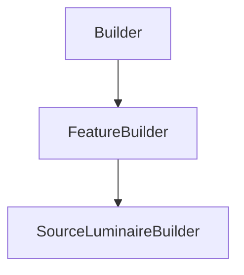

# SourceLuminaireBuilder

## Class Inheritance

**Classes:**

- [Builder](class-builder.md)
- [FeatureBuilder](class-featurebuilder.md)
- [SourceLuminaireBuilder](class-sourceluminairebuilder.md)

## Description

Represents the builder for a luminaire source.

## Member Summary

| Member | Type |
| --- | --- |
| [IntensityFilePath](#intensityfilepath) | public |
| [Flux](#flux) | public |
| [FluxUnit](#fluxunit) | public |
| [FluxFromFile](#fluxfromfile) | public |
| [Spectrum](#spectrum) | public |
| [Temperature](#temperature) | public |
| [SpectrumFilePath](#spectrumfilepath) | public |
| [NumberOfRays](#numberofrays) | public |
| [RayLength](#raylength) | public |
| [ShowIntensityDistribution](#showintensitydistribution) | public |

## Public Static Attributes

### IntensityFilePath

`str IntensityFilePath`

Gets or sets the intensity distribution file path.  
**Value type**: String.  
  
The default value is an empty string.

---

### Flux

`float Flux`

Gets or sets the flux.

**Prerequisite**: The IsFluxFromFile property must be False.  
**Value type**: Double (in lm or W).  
**Range**: The value must be superior to 0.0.  
  
The default value is 683.0.

---

### FluxUnit

`int FluxUnit`

Gets or sets the flux unit.

**Prerequisite**: The IsFluxFromFile property must be False or The IntensityFile property must be set.  
  
The values are:  
0 - Lumen.  
1 - Watt.  
**Value type**: Integer.  
  
The default value is 0.

---

### FluxFromFile

`bool FluxFromFile`

Gets or sets the property to enable or disable getting the flux from file.

True: Enables getting the flux from file.  
False: Disables getting the flux from file.  
**Value type**: Boolean.  
  
The default value is True.

---

### Spectrum

`int Spectrum`

Gets or sets the spectrum type.

The values are:  
0 - Blackbody, with this value the Temperature property is available.  
1 - Library, with this value the File property is available.  
2 - Incandescent.  
3 - Warmwhite fluorescent.  
4 - Daylight fluorescent.  
5 - White LED.  
6 - Halogen.  
7 - Metal halide.  
8 - High pressure sodium.  
**Value type**: Integer.  
  
The default value is 0.

---

### Temperature

`float Temperature`

Gets or sets the spectrum temperature.

**Prerequisite**: The spectrum type must be 0.  
**Value type**: Double (in Kelvin).  
**Range**: The value must be superior to 0.0.  
  
The default value is 2856.0 Kelvin.

---

### SpectrumFilePath

`str SpectrumFilePath`

Gets or sets the spectrum file path.

**Prerequisite**: The spectrum type must be 1.  
**Value type**: String.  
  
The default value is an empty string.

---

### NumberOfRays

`int NumberOfRays`

Gets or sets the number of rays.

**Value type**: Integer.  
**Range**: The value must be superior or equal to 0.  
  
The default value is 100.

---

### RayLength

`float RayLength`

Gets or sets the ray length.

**Value type**: Double (in mm).  
**Range**: The value must be superior to 0.0.  
  
The default value is 75.0 mm.

---

### ShowIntensityDistribution

`bool ShowIntensityDistribution`

Gets or sets the property to show the intensity distribution in the 3D view.

True: Shows the intensity distribution in the 3D view.  
False: Does not show the intensity distribution in the 3D view.  
  
The default value is False.
