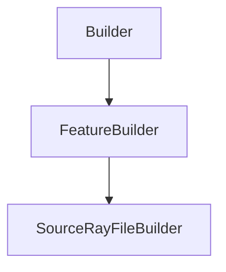

# SourceRayFileBuilder

## Class Inheritance

**Classes:**

- [Builder](class-builder.md)
- [FeatureBuilder](class-featurebuilder.md)
- [SourceRayFileBuilder](class-sourcerayfilebuilder.md)

## Description

Represents the builder for a ray file source.

## Member Summary

| Member | Type |
| --- | --- |
| [RayFilePath](#rayfilepath) | public |
| [Flux](#flux) | public |
| [FluxFromFile](#fluxfromfile) | public |
| [FluxUnit](#fluxunit) | public |
| [Spectrum](#spectrum) | public |
| [Wavelength](#wavelength) | public |
| [Temperature](#temperature) | public |
| [SpectrumFilePath](#spectrumfilepath) | public |
| [ExitGeometries](#exitgeometries) | public |
| [NumberOfRays](#numberofrays) | public |
| [RayLength](#raylength) | public |

## Public Static Attributes

### RayFilePath

`FilePath RayFilePath`

Gets or sets the ray file path.

**Value type**: String.  
  
The default value is an empty string.

---

### Flux

`float Flux`

Gets or sets the flux.

**Value type**: Double (in lumen or watt).  
**Range**: The value must be superior to 0.0.  
  
By default the value comes from the ray file, otherwise value is 683. lumen.

---

### FluxFromFile

`bool FluxFromFile`

Gets or sets the property to enable fetching the flux from file.

True: Enables fetching the flux from file.  
False: Disables fetching the flux from file.  
**Value type**: Boolean.  
  
The default value is True.

---

### FluxUnit

`int FluxUnit`

Gets or sets the flux unit.

The values are:  
0 - lumen (lm).  
1 - watt (W).  
**Value type**: Integer.  
  
The default value is 0.

---

### Spectrum

`int Spectrum`

Gets or sets the spectrum type.

The values are:  
0 - Monochromatic, with this value the wavelength property is available.  
1 - Blackbody, with this value the temperature property is available.  
2 - Library, with this value the spectrum file property is available.  
**Value type**: Integer.  
  
The default value is 0.

---

### Wavelength

`float Wavelength`

Gets or sets the wavelength.

**Value type**: Double (in nanometer).  
**Range**: The value must be superior to 0.0.  
  
The default value is 555.0 nm.

---

### Temperature

`float Temperature`

Gets or sets the temperature.

**Prerequisite**: The SpectrumType must be 0.  
**Value type**: double (in Kelvin).  
**Range**: The value must be superior to 0.0.  
  
The default value is 2856.0 K.

---

### SpectrumFilePath

`FilePath SpectrumFilePath`

Gets or sets the spectrum file path.

**Prerequisite**: The SpectrumType must be 1.  
**Value type**: String.  
  
The default value is an empty string.

---

### ExitGeometries

`list[int] ExitGeometries`

Gets or sets exit geometries.

The ExitGeometries property takes a list of feature tag and returns a list of feature tag.  
**Value type**: List of integer.  
  
The default value is an empty list.

---

### NumberOfRays

`int NumberOfRays`

Gets or sets the number of rays.

**Value type**: Integer.  
**Range**: The value must be superior or equal to 0.  
  
The default value is 100.

---

### RayLength

`float RayLength`

Gets or sets the ray length.

**Value type**: Double (in millimeter).  
**Range**: The value must be superior to 0.0.  
  
The default value is 75.0 mm.
