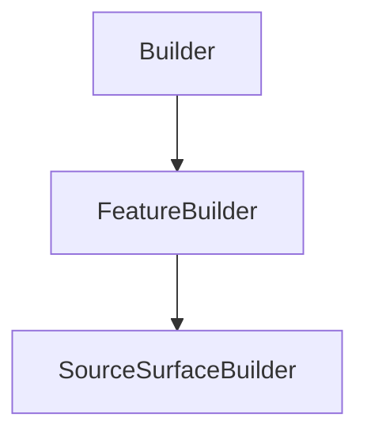

# SourceSurfaceBuilder

## Class Inheritance

**Classes:**

- [Builder](class-builder.md)
- [FeatureBuilder](class-featurebuilder.md)
- [SourceSurfaceBuilder](class-sourcesurfacebuilder.md)

## Description

Represents a Surface Source Builder.

## Member Summary

| Member | Type |
| --- | --- |
| [FluxUnit](#fluxunit) | public |
| [Flux](#flux) | public |
| [UseFluxFromFile](#usefluxfromfile) | public |
| [Spectrum](#spectrum) | public |
| [Wavelength](#wavelength) | public |
| [Temperature](#temperature) | public |
| [SpectrumFilePath](#spectrumfilepath) | public |
| [Exitance](#exitance) | public |
| [ExitanceDistributionFilePath](#exitancedistributionfilepath) | public |
| [EmissiveFaces](#emissivefaces) | public |
| [ExitanceDistributionDirectionReverse](#exitancedistributiondirectionreverse) | public |
| [ExitanceXDirectionReversed](#exitancexdirectionreversed) | public |
| [ExitanceYDirectionReversed](#exitanceydirectionreversed) | public |
| [IntensityType](#intensitytype) | public |
| [IntensityTotalAngle](#intensitytotalangle) | public |
| [IntensityN](#intensityn) | public |
| [IntensityFWHMAngle](#intensityfwhmangle) | public |
| [IntensityFWHMAngleX](#intensityfwhmanglex) | public |
| [IntensityFWHMAngleY](#intensityfwhmangley) | public |
| [IntensityDistributionFilePath](#intensitydistributionfilepath) | public |
| [IntensityOrientation](#intensityorientation) | public |
| [RayLength](#raylength) | public |
| [NumberOfRays](#numberofrays) | public |
| [ShowIntensityDistribution](#showintensitydistribution) | public |
| [AssociatedGeometries](#associatedgeometries) | public |
| [ExitGeometries](#exitgeometries) | public |
| [IntensityXDirectionReversed](#intensityxdirectionreversed) | public |
| [IntensityYDirectionReversed](#intensityydirectionreversed) | public |

## Public Static Attributes

### FluxUnit

`int FluxUnit`

Gets or sets the flux unit type.

The values are:  
0 - Lumen.  
1 - Watt.  
2 - Candela.  
**Value type**: Integer.  
  
The default value is 0.

---

### Flux

`float Flux`

Gets or sets the flux.

The unit depends on the FluxUnitType.  
**Value type**: Double (in lm, W or cd).  
**Range**: The value must be superior to 0.0.  
  
The default value is 683.0 lm for FluxUnitType = 0, 1.0 W for FluxUnitType = 1 and 5.0 cd for FluxUnitType = 2.

---

### UseFluxFromFile

`bool UseFluxFromFile`

Gets or sets the property to use the flux from file.

True: Uses the flux from a file.  
False: Does not use the flux from a file.  
**Value type**: Boolean.  
  
The default value is False.

---

### Spectrum

`int Spectrum`

Gets or sets the spectrum type.

The values are:  
0 - Monochromatic, you can edit the wavelength value.  
1 - Blackbody, you can edit the temperature value.  
2 - Library, you can browse a .spectrum file.  
**Value type**: Integer.  
  
The default value is 0.

---

### Wavelength

`float Wavelength`

Gets or sets the wavelength.

**Prerequisite**: The SpectrumType property must be 0.  
**Value type**: Double (in nm).  
**Range**: The value must be superior to 0.0.  
  
The default value is 555.0 nm.

---

### Temperature

`float Temperature`

Gets or sets the temperature.

**Prerequisite**: The SpectrumType property must be 1.  
**Value type**: Double (in Kelvin).  
**Range**: The value must be superior to 0.0.  
  
The default value is 2856.0 Kelvin.

---

### SpectrumFilePath

`FilePath SpectrumFilePath`

Gets or sets the spectrum file.

**Prerequisite**: The SpectrumType property must be 2.  
**Value type**: String.  
  
The default value is an empty string.

---

### Exitance

`int Exitance`

Gets or sets the exitance type.

Exitance of a source describes how each point of a surface emits rays.  
  
The values are:  
0 - Constant, ray energy is constant over surface source face.  
1 - Variable, ray energy depends on xmp energy distribution.  
**Value type**: Integer.  
  
The default value is 0.

---

### ExitanceDistributionFilePath

`FilePath ExitanceDistributionFilePath`

Gets or sets the exitance distribution file.

**Prerequisite**: The ExitanteType property must be 1.  
**Value type**: String.  
  
The default value is an empty string.

---

### EmissiveFaces

`SourceSurfaceEmissiveFaces EmissiveFaces`

Returns the interface to edit the emissive faces of the source.

**Prerequisite**: The ExitanteType property must be 0.  
**Value type**: SourceSurfaceEmissiveFaces object.

---

### ExitanceDistributionDirectionReverse

`bool ExitanceDistributionDirectionReverse`

Gets or sets the property to reverse the exitance distribution

**Prerequisite**: The ExitanteType property must be 0.  
  
True: Reverses the exitance distribution direction.  
False: Does not reverse the exitance distribution direction.  
**Value type**: Boolean.  
  
The default value is False.

---

### ExitanceXDirectionReversed

`bool ExitanceXDirectionReversed`

Gets or sets the property to reverse the exitance of X direction.

**Prerequisite**: The ExitanceType property must be 1.  
  
True: Reverses the exitance direction X.  
False: Does not reverse the exitance direction X.  
**Value type**: Boolean.  
  
The default value is False.

---

### ExitanceYDirectionReversed

`bool ExitanceYDirectionReversed`

Gets or sets the property to reverse the exitance of Y direction.

**Prerequisite**: The ExitanceType property must be 1.  
  
True: Reverses the exitance direction Y.  
False: Does not reverse the exitance direction Y.  
**Value type**: Boolean.  
  
The default value is False.

---

### IntensityType

`int IntensityType`

Gets or sets the intensity type of the light source.

The values are:  
0 - Lambertian.  
1 - Cos.  
2 - Symmetric Gaussian.  
3 - Asymmetric Gaussian.  
4 - Library.  
**Value type**: Integer.  
  
The default value is 0.

---

### IntensityTotalAngle

`float IntensityTotalAngle`

Gets or sets the intensity total angle.

**Prerequisite**: The EnumIntensityType property must be 0, 1, 2 or 3.  
**Value type**: Double (in degrees).  
**Range**: [0, 180].  
  
The default value is 180.0 degrees.

---

### IntensityN

`float IntensityN`

Gets or sets the N.

**Prerequisite**: The EnumIntensityType property must be 1.  
**Value type**: Double.  
**Range**: The value must be superior to -1.0.  
  
The default value is 3.0.

---

### IntensityFWHMAngle

`float IntensityFWHMAngle`

Gets or sets the Full Width At Half Maximum (FWHM) angle.

**Prerequisite**: The EnumIntensityType property must be 2.  
**Value type**: Double (in degrees).  
**Range**: [0, 180].  
  
The default value is 30.0 degrees.

---

### IntensityFWHMAngleX

`float IntensityFWHMAngleX`

Gets or sets the Full Width At Half Maximum (FWHM) X angle.

**Prerequisite**: The EnumIntensityType property must be 3.  
**Value type**: Double (in degrees).  
**Range**: [0, 180].  
  
The default value is 30.0 degrees.

---

### IntensityFWHMAngleY

`float IntensityFWHMAngleY`

Gets or sets the Full Width At Half Maximum (FWHM) Y angle.

**Prerequisite**: The EnumIntensityType property must be 3.  
**Value type**: Double (in degrees).  
**Range**: [0, 180].  
  
The default value is 30.0 degrees.

---

### IntensityDistributionFilePath

`FilePath IntensityDistributionFilePath`

Gets or sets the distribution file.

**Prerequisite**: The EnumIntensityType property must be 4.  
**Value type**: String.  
  
The default value is an empty string.

---

### IntensityOrientation

`int IntensityOrientation`

Gets or sets the orientation type.

The values are:  
0 - AxisSystem.  
1 - NormalToSurface.  
2 - NormalToUVMap.  
**Value type**: Integer.  
  
The default value is 0.

---

### RayLength

`float RayLength`

Gets or sets the ray length.

Edits the value to set the length of the rays preview in the 3D view.  
**Value type**: Double (in mm).  
**Range**: The value must be superior to 0.0.  
  
The default value is 75.0 mm.

---

### NumberOfRays

`int NumberOfRays`

Gets or sets the number of rays.

Edits the value to set the number of rays displayed in the preview.  
**Value type**: Integer.  
**Range**: The value must be superior to 0.  
  
The default value is 100.

---

### ShowIntensityDistribution

`bool ShowIntensityDistribution`

Gets or sets the property to show the intensity distribution.

True: Shows the intensity distribution in the preview.  
False: Does not show the intensity distribution in the preview.  
**Value type**: Boolean.  
  
The default value is False.

---

### AssociatedGeometries

`list[int] AssociatedGeometries`

Gets or sets associated geometries.

The AssociatedGeometries property takes a list of feature tag and returns a list of feature tag.  
**Value type**: List of integer.  
  
The default value is an empty list.

---

### ExitGeometries

`list[int] ExitGeometries`

Gets or sets the exit geometries.

The ExitGeometries property takes a list of feature tag and returns a list of feature tag.  
**Value type**: List of integer.  
  
The default value is an empty list.

---

### IntensityXDirectionReversed

`bool IntensityXDirectionReversed`

Gets or sets the property to reverse the intensity X direction.

**Prerequisite**: The EnumIntensityType property must be 3.  
  
True: Reverses the intensity X direction.  
False: Does not reverse the intensity X direction.  
**Value type**: Boolean.  
  
The default value is False.

---

### IntensityYDirectionReversed

`bool IntensityYDirectionReversed`

Gets or sets the property to reverse the intensity Y direction.

**Prerequisite**: The EnumIntensityType property must be 3 or The IntensityOrientationType must be 0.  
  
True: Reverses the intensity Y direction.  
False: Does not reverse the intensity Y direction.  
**Value type**: Boolean.  
  
The default value is False.
