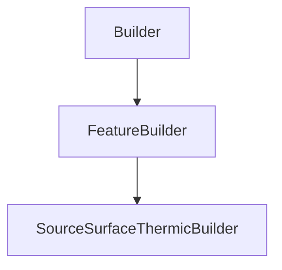

# SourceSurfaceThermicBuilder

## Class Inheritance

**Classes:**

- [Builder](class-builder.md)
- [FeatureBuilder](class-featurebuilder.md)
- [SourceSurfaceThermicBuilder](class-sourcesurfacethermicbuilder.md)

## Description

Represents a Thermic Surface Source Builder.

## Member Summary

| Member | Type | Description |
| --- | --- | --- |
| [Flux](#flux) | public | Gets the flux. |
| [FluxUnit](#fluxunit) | public | Gets or sets the flux unit. |
| [Temperature](#temperature) | public | Gets or sets the temperature. |
| [EmittanceType](#emittancetype) | public | Gets or sets the emittance type. |
| [TemperatureFieldFilePath](#temperaturefieldfilepath) | public | Gets or sets the temperature field file path. |
| [EmittanceXDirectionReversed](#emittancexdirectionreversed) | public | Gets or sets the property to reverse the emittance of X direction. |
| [EmittanceYDirectionReversed](#emittanceydirectionreversed) | public | Gets or sets the property to reverse the emittance of Y direction. |
| [IntensityType](#intensitytype) | public | Gets or sets the intensity diagram. |
| [CosN](#cosn) | public | Gets or sets the N value for Cos distribution. |
| [SOPType](#soptype) | public | Gets or sets the surface optical properties. |
| [SOPReflectance](#sopreflectance) | public | Gets or sets the surface optical properties reflectance. |
| [SOPLibraryFilePath](#soplibraryfilepath) | public | Gets or sets the surface optical properties library file. |
| [SOPPluginFilePath](#soppluginfilepath) | public | Gets or sets the surface optical properties plug-in file. |
| [SOPParametersFilePath](#sopparametersfilepath) | public | Gets or sets the surface optical properties parameters file. |
| [RayLength](#raylength) | public | Gets or sets the ray length. |
| [NumberOfRays](#numberofrays) | public | Gets or sets the number of rays. |
| [PreviewMode](#previewmode) | public | Gets or sets the preview mode. |
| [EnableAutomaticUpdate](#enableautomaticupdate) | public | Gets or sets the property to enable/disable the automatic update. |
| [EmissiveFaces](#emissivefaces) | public | Returns the interface to edit the emissive faces of the source. |

## Public Static Attributes

### Flux

`float Flux`

Gets the flux.

**Value type**: Double.  
  
The default value is 0.

---

### FluxUnit

`int FluxUnit`

Gets or sets the flux unit.

The values are:  
0 - lumen (lm).  
1 - watt (W).  
  
**Value type**: Integer.  
  
The default value is 0.

---

### Temperature

`float Temperature`

Gets or sets the temperature.

**Prerequisite**: The SpectrumType property must be 0.  
  
**Value type**: Double (in Kelvin).  
**Range**: The value must be superior to 0.0.  
  
The default value is 8000.0 Kelvin.

---

### EmittanceType

`int EmittanceType`

Gets or sets the emittance type.

The values are:  
0 - Temperature Field.  
1 - Emissive Faces.  
  
**Value type**: Integer.  
  
The default value is 1.

---

### TemperatureFieldFilePath

`FilePath TemperatureFieldFilePath`

Gets or sets the temperature field file path.

**Prerequisite**: The EmittanceType property must be 0.  
  
**Value type**: String.  
  
The default value is an empty string.

---

### EmittanceXDirectionReversed

`bool EmittanceXDirectionReversed`

Gets or sets the property to reverse the emittance of X direction.

**Prerequisite**: The EmittanceType property must be 0.  
  
True: Reverses the emittance direction X.  
False: Does not reverse the emittance direction X.  
  
**Value type**: Boolean.  
  
The default value is False.

---

### EmittanceYDirectionReversed

`bool EmittanceYDirectionReversed`

Gets or sets the property to reverse the emittance of Y direction.

**Prerequisite**: The EmittanceType property must be 0.  
  
True: Reverses the emittance direction Y.  
False: Does not reverse the emittance direction Y.  
  
**Value type**: Boolean.  
  
The default value is False.

---

### IntensityType

`int IntensityType`

Gets or sets the intensity diagram.

The intensity diagram of a source describes in which directions is made the emission.  
  
The values are:  
0 - Lambertian.  
1 - Cos.  
  
**Value type**: Integer.  
  
The default value is 0.

---

### CosN

`float CosN`

Gets or sets the N value for Cos distribution.

**Prerequisite**: The IntensityType property must be 1.  
  
**Value type**: Double.  
  
The default value is 3.0.

---

### SOPType

`int SOPType`

Gets or sets the surface optical properties.

**Prerequisite**: The EmittanceType property must be 0.  
  
The values are:  
1 - Mirror, uses a perfect specular surface and edits the Reflectance value if needed.  
2 - Library, with this value the SOPLibraryFile property is available and must be defined.  
3 - Plug-in, selects a custom made \*.sop plug-in as File and the Parameters file for the plug-in.  
  
**Value type**: Integer.  
  
The default value is 1.

---

### SOPReflectance

`float SOPReflectance`

Gets or sets the surface optical properties reflectance.

**Prerequisite**: The SOPType property must be 1.  
  
**Value type**: Double (in percentage).  
**Range**: [0.0, 100.0].  
  
The default value is 100.0 percent.

---

### SOPLibraryFilePath

`LibraryFilePath SOPLibraryFilePath`

Gets or sets the surface optical properties library file.

**Prerequisite**: The SOPType property must be 2.  
  
**Value type**: String.  
  
The default value is an empty string.

---

### SOPPluginFilePath

`FilePath SOPPluginFilePath`

Gets or sets the surface optical properties plug-in file.

**Prerequisite**: The SOPType property must be 3.  
  
**Value type**: String.  
  
The default value is an empty string.

---

### SOPParametersFilePath

`FilePath SOPParametersFilePath`

Gets or sets the surface optical properties parameters file.

**Prerequisite**: The SOPType property must be 3.  
  
**Value type**: String.  
  
The default value is an empty string.

---

### RayLength

`float RayLength`

Gets or sets the ray length.

**Value type**: Double (in mm).  
**Range**: The value must be superior to 0.0.  
  
The default value is 75.0 mm.

---

### NumberOfRays

`int NumberOfRays`

Gets or sets the number of rays.

**Value type**: Integer.  
**Range**: The value must be superior or equal to 0.  
  
The default value is 100.

---

### PreviewMode

`int PreviewMode`

Gets or sets the preview mode.

The values are:  
0 - Meshing.  
1 - BoundingBox.  
  
**Value type**: Integer.  
  
The default value is Meshing (0).

---

### EnableAutomaticUpdate

`bool EnableAutomaticUpdate`

Gets or sets the property to enable/disable the automatic update.

True: Enables the automatic update.  
False: Disables the automatic update.  
  
**Value type**: Boolean.  
  
The default value is False.

---

### EmissiveFaces

`SourceSurfaceEmissiveFaces EmissiveFaces`

Returns the interface to edit the emissive faces of the source.

**Prerequisite**: The ExitanteType property must be 0.  
  
**Value type**: EmissiveFaces object.
