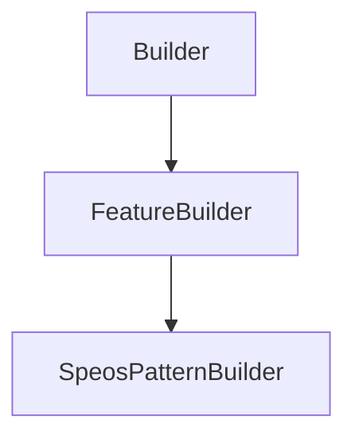

# SpeosPatternBuilder

## Class Inheritance

**Classes:**

- [Builder](class-builder.md)
- [FeatureBuilder](class-featurebuilder.md)
- [SpeosPatternBuilder](class-speospatternbuilder.md)

## Description

Represents a Speos pattern builder.

## Member Summary

| Member | Type |
| --- | --- |
| [PatternFilePath](#patternfilepath) | public |
| [OneLayerPerSource](#onelayerpersource) | public |
| [Origins](#origins) | public |
| [PreviewMode](#previewmode) | public |
| [OneLayerPerInstance](#onelayerperinstance) | public |
| [RayFileFlux](#rayfileflux) | public |
| [RayFileFluxUnit](#rayfilefluxunit) | public |
| [RayFileFluxFromFile](#rayfilefluxfromfile) | public |
| [RayFileSpectrumType](#rayfilespectrumtype) | public |
| [RayFileWavelength](#rayfilewavelength) | public |
| [RayFileTemperature](#rayfiletemperature) | public |
| [SpectrumFilePath](#spectrumfilepath) | public |
| [NumberOfRay](#numberofray) | public |
| [RayLength](#raylength) | public |

## Public Static Attributes

### PatternFilePath

`FilePath PatternFilePath`

Gets or sets the property pattern file path.

**Value type**: String.  
  
The default value is an empty file path (string).

---

### OneLayerPerSource

`bool OneLayerPerSource`

Gets or sets the property to enable/disable one layer per source.

True: Enables one layer per source.  
False: Disables one layer per source.  
  
**Value type**: Boolean.  
  
The default value is False.

---

### Origins

`list[int] Origins`

Gets or sets the origin coordinate systems.

This property takes/returns a list of NX Datum System feature tags.  
  
**Value type**: List of integer (NX Tags).  
  
The default value is an empty list.

---

### PreviewMode

`int PreviewMode`

Gets or sets the preview mode.

The values are:  
0 - Meshing.  
1 - BoundingBox.  
  
**Value type**: Integer.  
  
The default value is Meshing (0).

---

### OneLayerPerInstance

`bool OneLayerPerInstance`

Gets or sets the property to enable/disable one layer per instance.

True: Enables one layer per instance.  
False: Disables one layer per instance.  
  
**Prerequisite**: The Pattern file must be a Lightbox file.  
  
**Value type**: Boolean.  
  
The default value is True.

---

### RayFileFlux

`float RayFileFlux`

Gets or sets the flux of the ray file source.

**Prerequisite**: The Pattern file must be a ray file.  
  
**Value type**: Double (in lumen or watt).  
**Range**: The value must be superior to 0.0.  
  
By default the value comes from the ray file, otherwise value is 683. lumen.

---

### RayFileFluxUnit

`int RayFileFluxUnit`

Gets or sets the flux unit of the ray file source.

**Prerequisite**: The Pattern file must be a ray file.  
The values are:  
0 - lumen (lm).  
1 - watt (W).  
  
**Value type**: Integer.  
  
The default value is 0.

---

### RayFileFluxFromFile

`bool RayFileFluxFromFile`

Gets or sets the property to enable fetching the flux from file.

True: Enables fetching the flux from file.  
False: Disables fetching the flux from file.  
  
**Value type**: Boolean.  
  
The default value is True.

---

### RayFileSpectrumType

`int RayFileSpectrumType`

Gets or sets the spectrum type.

The values are:  
0 - Monochromatic, with this value the wavelength property is available.  
1 - Blackbody, with this value the temperature property is available.  
2 - Library, with this value the spectrum file property is available.  
  
**Value type**: Integer.  
  
The default value is 0.

---

### RayFileWavelength

`float RayFileWavelength`

Gets or sets the wavelength.

**Value type**: Double (in nanometer).  
**Range**: The value must be superior to 0.0.  
  
The default value is 555.0 nm.

---

### RayFileTemperature

`float RayFileTemperature`

Gets or sets the temperature.

**Prerequisite**: The SpectrumType must be 0.  
  
**Value type**: double (in Kelvin).  
**Range**: The value must be superior to 0.0.  
  
The default value is 2856.0 K.

---

### SpectrumFilePath

`FilePath SpectrumFilePath`

Gets or sets the spectrum file path.

**Prerequisite**: The SpectrumType must be 1.  
  
**Value type**: String.  
  
The default value is an empty string.

---

### NumberOfRay

`int NumberOfRay`

Gets or sets the number of rays.

**Value type**: Integer.  
**Range**: The value must be superior or equal to 0.  
  
The default value is 100.

---

### RayLength

`float RayLength`

Gets or sets the ray length.

**Value type**: Double (in millimeter).  
**Range**: The value must be superior to 0.0.  
  
The default value is 75.0 mm.
