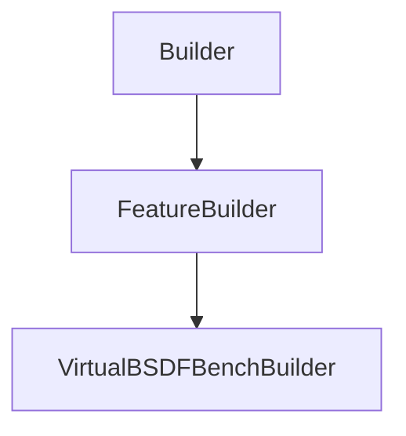

# VirtualBSDFBenchBuilder

## Class Inheritance

**Classes:**

- [Builder](class-builder.md)
- [FeatureBuilder](class-featurebuilder.md)
- [VirtualBSDFBenchBuilder](class-virtualbsdfbenchbuilder.md)

## Description

Builder class for creating and configuring Virtual BSDF Bench features.

## Member Summary

| Member | Type |
| --- | --- |
| [CVirtualBSDFBenchBuilder](#cvirtualbsdfbenchbuilder) | public |
| [FeatureSimulation](#featuresimulation) | public |
| [Geometries](#geometries) | public |
| [XRatio](#xratio) | public |
| [YRatio](#yratio) | public |
| [UseIdenticalRatios](#useidenticalratios) | public |
| [PresetSettings](#presetsettings) | public |
| [BSDFSensitivity](#bsdfsensitivity) | public |
| [ColorSensitivity](#colorsensitivity) | public |
| [Anisotropic](#anisotropic) | public |
| [BSDF180](#bsdf180) | public |
| [NumberOfRays](#numberofrays) | public |
| [NumberOfRaysMultiplier](#numberofraysmultiplier) | public |
| [WavelengthStart](#wavelengthstart) | public |
| [WavelengthEnd](#wavelengthend) | public |
| [WavelengthSampling](#wavelengthsampling) | public |
| [SourceSamplingMode](#sourcesamplingmode) | public |
| [SourceThetaSampling](#sourcethetasampling) | public |
| [SourcePhiSampling](#sourcephisampling) | public |
| [SourcePhiSymmetry](#sourcephisymmetry) | public |
| [SourceAdaptiveSamplingFile](#sourceadaptivesamplingfile) | public |
| [SensorType](#sensortype) | public |
| [IntegrationAngle](#integrationangle) | public |
| [SensorAutomaticSampling](#sensorautomaticsampling) | public |
| [SensorSamplingMode](#sensorsamplingmode) | public |
| [SensorThetaSampling](#sensorthetasampling) | public |
| [SensorPhiSampling](#sensorphisampling) | public |
| [SensorAdaptiveSamplingFile](#sensoradaptivesamplingfile) | public |
| [StringSpeosFile](#stringspeosfile) | public |
| [StringIsolatedFolder](#stringisolatedfolder) | public |

## Public Member Functions

### CVirtualBSDFBenchBuilder

`explicit CVirtualBSDFBenchBuilder(self, pImpl)`

Constructs a CVirtualBSDFBenchBuilder with the specified implementation.  
@param pImpl Pointer to the internal implementation object.

**Parameters**:

- `SNXVirtualBSDFBenchBuilder pImpl`

## Public Static Attributes

### FeatureSimulation

`FeatureSimulation FeatureSimulation`

---

### Geometries

`list[int] Geometries`

---

### XRatio

`float XRatio`

---

### YRatio

`float YRatio`

---

### UseIdenticalRatios

`bool UseIdenticalRatios`

---

### PresetSettings

`Settings PresetSettings`

---

### BSDFSensitivity

`int BSDFSensitivity`

---

### ColorSensitivity

`int ColorSensitivity`

---

### Anisotropic

`bool Anisotropic`

---

### BSDF180

`bool BSDF180`

---

### NumberOfRays

`list[NumberOfRay] NumberOfRays`

---

### NumberOfRaysMultiplier

`int NumberOfRaysMultiplier`

---

### WavelengthStart

`float WavelengthStart`

---

### WavelengthEnd

`float WavelengthEnd`

---

### WavelengthSampling

`Sampling WavelengthSampling`

---

### SourceSamplingMode

`int SourceSamplingMode`

---

### SourceThetaSampling

`Sampling SourceThetaSampling`

---

### SourcePhiSampling

`Sampling SourcePhiSampling`

---

### SourcePhiSymmetry

`int SourcePhiSymmetry`

---

### SourceAdaptiveSamplingFile

`str SourceAdaptiveSamplingFile`

---

### SensorType

`Type SensorType`

---

### IntegrationAngle

`float IntegrationAngle`

---

### SensorAutomaticSampling

`Sampling SensorAutomaticSampling`

---

### SensorSamplingMode

`int SensorSamplingMode`

---

### SensorThetaSampling

`Sampling SensorThetaSampling`

---

### SensorPhiSampling

`Sampling SensorPhiSampling`

---

### SensorAdaptiveSamplingFile

`str SensorAdaptiveSamplingFile`

---

### StringSpeosFile

`str StringSpeosFile`

---

### StringIsolatedFolder

`str StringIsolatedFolder`
