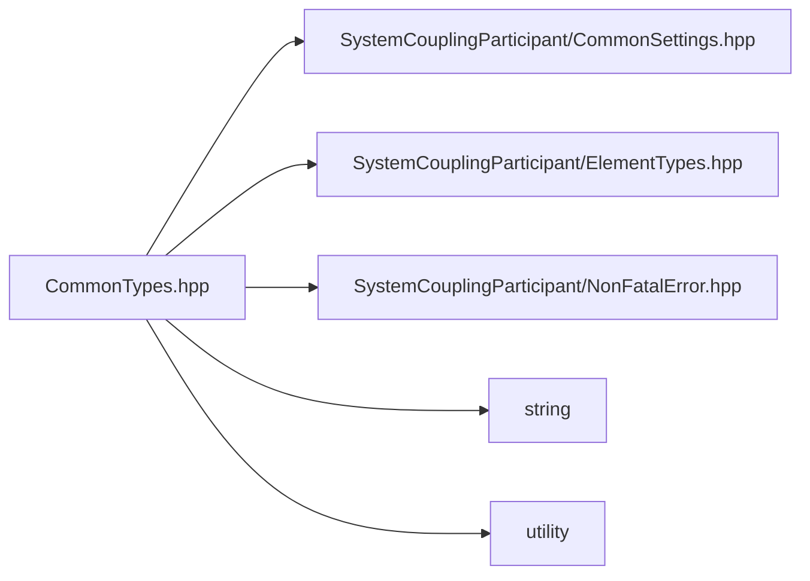

# File CommonTypes.hpp

![][C++]

**Location**: `CommonTypes.hpp`


## Classes

* [sysc::TimeStep](structsysc_1_1TimeStep.md#structsysc_1_1TimeStep)
* [sysc::SolutionControl](structsysc_1_1SolutionControl.md#structsysc_1_1SolutionControl)
* [sysc::SetupInfo](structsysc_1_1SetupInfo.md#structsysc_1_1SetupInfo)
* [sysc::SetupFileInfo](structsysc_1_1SetupFileInfo.md#structsysc_1_1SetupFileInfo)
* [sysc::ResultsInfo](structsysc_1_1ResultsInfo.md#structsysc_1_1ResultsInfo)
* [sysc::ValidityStatus](structsysc_1_1ValidityStatus.md#structsysc_1_1ValidityStatus)
* [sysc::MeshValidityStatus](structsysc_1_1MeshValidityStatus.md#structsysc_1_1MeshValidityStatus)
* [sysc::ParticipantInfo](structsysc_1_1ParticipantInfo.md#structsysc_1_1ParticipantInfo)

## Namespaces

* [sysc](namespacesysc.md#namespacesysc)

## Includes

* SystemCouplingParticipant/CommonSettings.hpp
* SystemCouplingParticipant/ElementTypes.hpp
* SystemCouplingParticipant/NonFatalError.hpp
* <string>
* <utility>



## Source

```cpp
/*
* Copyright ANSYS, Inc. Unauthorized use, distribution, or duplication is prohibited.
*/

#pragma once

#include "SystemCouplingParticipant/CommonSettings.hpp"
#include "SystemCouplingParticipant/ElementTypes.hpp"
#include "SystemCouplingParticipant/NonFatalError.hpp"

#include <string>
#include <utility>

namespace sysc {

enum ConvergenceStatus {
  Diverging = -1,
  NotYetConverged = 0,
  Converged = 1,
  Complete = 2,
  NotEvaluated = 3
};

enum class DataType {
  Real = 0,
  Complex = 1
};

struct TimeStep {
  int timeStepNumber{0};    
  double startTime{0.0};    
  double timeStepSize{0.0}; 
  TimeStep() = default;

  TimeStep(int timeStepNumber, double startTime, double timeStepSize) :
      timeStepNumber(timeStepNumber),
      startTime(startTime),
      timeStepSize(timeStepSize){};
};

struct SolutionControl {
  int minimumIterations{0}; 
  int maximumIterations{0}; 
};

struct SetupInfo {
  /* \brief Provide a constructor for SetupInfo. */
  SetupInfo() = default;

  SetupInfo(
    enum AnalysisType analysisType) :
      analysisType(analysisType){};

  SetupInfo(
    enum AnalysisType analysisType,
    bool restartsSupported) :
      analysisType(analysisType),
      restartsSupported(restartsSupported){};

  SetupInfo(
    enum AnalysisType analysisType,
    bool restartsSupported,
    enum Dimension dimension) :
      analysisType(analysisType),
      restartsSupported(restartsSupported),
      dimension(dimension){};

  SetupInfo(
    enum AnalysisType analysisType,
    bool restartsSupported,
    enum Dimension dimension,
    enum TimeIntegration timeIntegration) :
      analysisType(analysisType),
      restartsSupported(restartsSupported),
      dimension(dimension),
      timeIntegration(timeIntegration){};

  SetupInfo(
    enum AnalysisType analysisType,
    bool restartsSupported,
    enum Dimension dimension,
    enum TimeIntegration timeIntegration,
    enum ParticipantType participantType) :
      analysisType(analysisType),
      restartsSupported(restartsSupported),
      dimension(dimension),
      timeIntegration(timeIntegration),
      participantType(participantType){};

  AnalysisType analysisType{Steady}; 
  bool restartsSupported{false};
  Dimension dimension{Dimension::D3};                         
  TimeIntegration timeIntegration{TimeIntegration::Implicit}; 
  ParticipantType participantType{ParticipantType::DEFAULT};  
};

struct SetupFileInfo {
  std::string setupFileName; 
  bool restartsSupported;    
  SetupFileInfo() :
      restartsSupported(false){};

  SetupFileInfo(std::string setupFileName) :
      setupFileName(std::move(setupFileName)),
      restartsSupported(false){};

  SetupFileInfo(std::string setupFileName, bool restartsSupported) :
      setupFileName(std::move(setupFileName)),
      restartsSupported(restartsSupported){};
};

struct ResultsInfo {
  std::string baseFileName; 
  ResultsInfo(std::string baseFileName) :
      baseFileName(std::move(baseFileName)){};
};

enum Topology {
  Surface = 2,
  Volume = 3
};

struct ValidityStatus {
  bool isValid;        
  std::string message; 
  /* \brief Provide a default constructor for ValidityStatus */
  ValidityStatus() :
      isValid(true){};

  ValidityStatus(bool isValid, std::string message) :
      isValid(isValid),
      message(std::move(message)){};
};

struct MeshValidityStatus {
  bool isInvalid;      
  std::string message; 
  /* \brief Provide a default constructor for MeshValidityStatus */
  MeshValidityStatus() :
      isInvalid(false){};

  MeshValidityStatus(bool isInvalid, std::string message) :
      isInvalid(isInvalid),
      message(std::move(message)){};
};

enum PrimitiveType {
  Float = 0,         
  Double = 1,        
  Int32 = 2,         
  Int64 = 3,         
  UnsignedInt16 = 4, 
  UnsignedInt64 = 5  
};

using OpaqueDataAccess = void*; 
using RegionName = std::string;            
using VariableName = std::string;          
using CouplingInterfaceName = std::string; 
using RestartPoint = std::string;          
using TargetDataLocation = std::string;    
using DisplayName = std::string;           
using AttributeName = std::string;         
using ParameterName = std::string;         
using Port = unsigned short;               
using Host = std::string;                  
struct ParticipantInfo {
  Host scHost;
  Port scPort{0};
  std::string participantName;
  bool isCosimulation{false};
  std::string buildInformation;
  std::string transcriptFilename;

  std::size_t numApps{0};
  Host myHostName;

  ParticipantInfo() = default;

  ParticipantInfo(
    Host scHost,
    Port scPort,
    std::string participantName,
    bool isCosimulation,
    std::string buildInformation,
    std::string transcriptFilename,
    std::size_t numApps,
    Host myHostName) :
      scHost(std::move(scHost)),
      scPort(scPort),
      participantName(std::move(participantName)),
      buildInformation(std::move(buildInformation)),
      transcriptFilename(std::move(transcriptFilename)),
      numApps(numApps),
      myHostName(std::move(myHostName))
  {
  }

  ParticipantInfo(
    Host scHost,
    Port scPort,
    std::string participantName) :
      scHost(std::move(scHost)),
      scPort(scPort),
      participantName(std::move(participantName)),
      isCosimulation(true)
  {
  }

  ParticipantInfo(
    Host scHost,
    Port scPort,
    std::string participantName,
    std::string buildInformation) :
      scHost(std::move(scHost)),
      scPort(scPort),
      participantName(std::move(participantName)),
      isCosimulation(true),
      buildInformation(std::move(buildInformation))
  {
  }

  ParticipantInfo(
    Host scHost,
    Port scPort,
    std::string participantName,
    std::string buildInformation,
    std::string transcriptFilename) :
      scHost(std::move(scHost)),
      scPort(scPort),
      participantName(std::move(participantName)),
      isCosimulation(true),
      buildInformation(std::move(buildInformation)),
      transcriptFilename(std::move(transcriptFilename))
  {
  }
};

}  // namespace sysc
```

[public]: https://img.shields.io/badge/-public-brightgreen (public)
[C++]: https://img.shields.io/badge/language-C%2B%2B-blue (C++)
[private]: https://img.shields.io/badge/-private-red (private)
[const]: https://img.shields.io/badge/-const-lightblue (const)