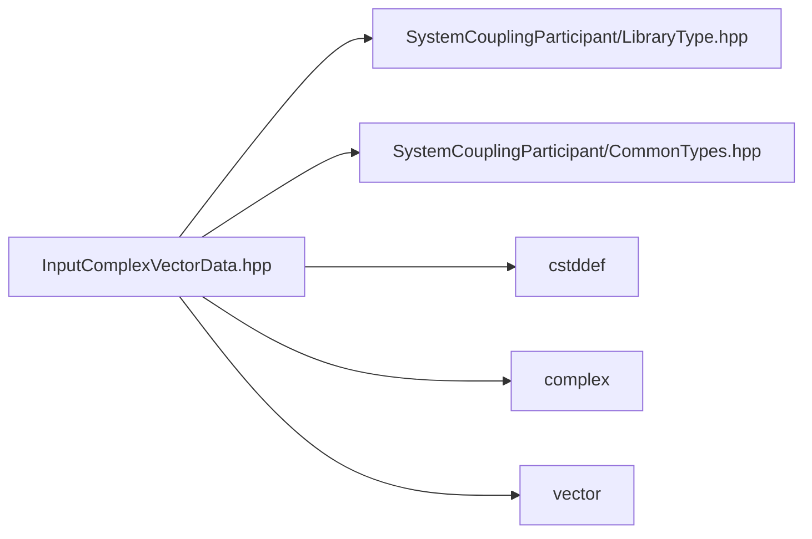

# File InputComplexVectorData.hpp

![][C++]

**Location**: `InputComplexVectorData.hpp`


## Classes

* [sysc::InputComplexVectorData](classsysc_1_1InputComplexVectorData.md#classsysc_1_1InputComplexVectorData)

## Namespaces

* [sysc](namespacesysc.md#namespacesysc)

## Includes

* SystemCouplingParticipant/LibraryType.hpp
* SystemCouplingParticipant/CommonTypes.hpp
* <cstddef>
* <complex>
* <vector>



## Source

```cpp
/*
* Copyright ANSYS, Inc. Unauthorized use, distribution, or duplication is prohibited.
*/

#pragma once

#include "SystemCouplingParticipant/LibraryType.hpp"

#include "SystemCouplingParticipant/CommonTypes.hpp"

#include <cstddef>
#include <complex>
#include <vector>

namespace sysc {

class SYSTEM_COUPLING_PARTICIPANT_DLL InputComplexVectorData {
public:
  InputComplexVectorData(std::vector<std::complex<double>>& dataComplex);

  InputComplexVectorData(std::vector<std::complex<double>>& dataComplex, Dimension dimension);

  InputComplexVectorData(double* dataComplex, std::size_t size);

  InputComplexVectorData(double* dataComplex, std::size_t size, Dimension dimension);

  InputComplexVectorData(std::complex<double>* dataComplex, std::size_t size);

  InputComplexVectorData(std::complex<double>* dataComplex, std::size_t size, Dimension dimension);

  InputComplexVectorData(
    std::vector<double>& dataReal,
    std::vector<double>& dataImaginary);

  InputComplexVectorData(
    double* dataReal,
    double* dataImaginary,
    std::size_t size);

  InputComplexVectorData(
    std::vector<std::complex<double>>& dataComplex1,
    std::vector<std::complex<double>>& dataComplex2,
    std::vector<std::complex<double>>& dataComplex3);

  InputComplexVectorData(
    std::complex<double>* dataComplex1,
    std::complex<double>* dataComplex2,
    std::complex<double>* dataComplex3,
    std::size_t size);

  InputComplexVectorData(
    double* dataComplex1,
    double* dataComplex2,
    double* dataComplex3,
    std::size_t size);

  InputComplexVectorData(
    std::vector<double>& dataReal1,
    std::vector<double>& dataImaginary1,
    std::vector<double>& dataReal2,
    std::vector<double>& dataImaginary2,
    std::vector<double>& dataReal3,
    std::vector<double>& dataImaginary3);

  InputComplexVectorData(
    double* dataReal1,
    double* dataImaginary1,
    double* dataReal2,
    double* dataImaginary2,
    double* dataReal3,
    double* dataImaginary3,
    std::size_t size);

  InputComplexVectorData(std::vector<std::complex<float>>& dataComplex);

  InputComplexVectorData(std::vector<std::complex<float>>& dataComplex, Dimension dimension);

  InputComplexVectorData(float* dataComplex, std::size_t size);

  InputComplexVectorData(float* dataComplex, std::size_t size, Dimension dimension);

  InputComplexVectorData(std::complex<float>* dataComplex, std::size_t size);

  InputComplexVectorData(std::complex<float>* dataComplex, std::size_t size, Dimension dimension);

  InputComplexVectorData(
    std::vector<float>& dataReal,
    std::vector<float>& dataImaginary);

  InputComplexVectorData(
    float* dataReal,
    float* dataImaginary,
    std::size_t size);

  InputComplexVectorData(
    std::vector<std::complex<float>>& dataComplex1,
    std::vector<std::complex<float>>& dataComplex2,
    std::vector<std::complex<float>>& dataComplex3);

  InputComplexVectorData(
    std::complex<float>* dataComplex1,
    std::complex<float>* dataComplex2,
    std::complex<float>* dataComplex3,
    std::size_t size);

  InputComplexVectorData(
    float* dataComplex1,
    float* dataComplex2,
    float* dataComplex3,
    std::size_t size);

  InputComplexVectorData(
    std::vector<float>& dataReal1,
    std::vector<float>& dataImaginary1,
    std::vector<float>& dataReal2,
    std::vector<float>& dataImaginary2,
    std::vector<float>& dataReal3,
    std::vector<float>& dataImaginary3);

  InputComplexVectorData(
    float* dataReal1,
    float* dataImaginary1,
    float* dataReal2,
    float* dataImaginary2,
    float* dataReal3,
    float* dataImaginary3,
    std::size_t size);

  InputComplexVectorData() = default;

  InputComplexVectorData(const InputComplexVectorData&) = default;

  InputComplexVectorData(InputComplexVectorData&&) = default;

  InputComplexVectorData& operator=(const InputComplexVectorData&) = default;

  InputComplexVectorData& operator=(InputComplexVectorData&&) = default;

  std::size_t size() const noexcept;

  bool empty() const noexcept;

  sysc::PrimitiveType getDataType() const noexcept;

  bool isSplitVector() const noexcept;

  bool isSplitComplex() const noexcept;

  void* getData1() const noexcept;

  void* getData2() const noexcept;

  void* getData3() const noexcept;

  void* getData4() const noexcept;

  void* getData5() const noexcept;

  void* getData6() const noexcept;

  Dimension getDimension() const noexcept;

private:
  sysc::PrimitiveType m_dataType{sysc::Double};
  bool m_isSplitVector{false};
  bool m_isSplitComplex{false};

  void* m_data1{nullptr};
  void* m_data2{nullptr};
  void* m_data3{nullptr};
  void* m_data4{nullptr};
  void* m_data5{nullptr};
  void* m_data6{nullptr};

  std::size_t m_size{0};
  Dimension m_dimension{Dimension::D3};
};
}  // namespace sysc
```

[public]: https://img.shields.io/badge/-public-brightgreen (public)
[C++]: https://img.shields.io/badge/language-C%2B%2B-blue (C++)
[private]: https://img.shields.io/badge/-private-red (private)
[const]: https://img.shields.io/badge/-const-lightblue (const)