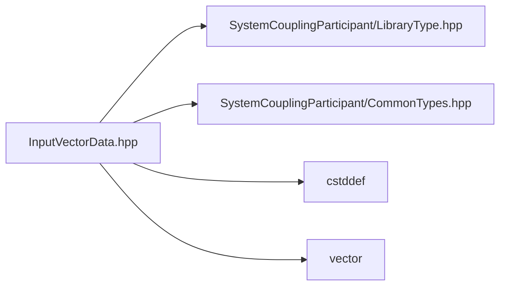

# File InputVectorData.hpp

![][C++]

**Location**: `InputVectorData.hpp`


## Classes

* [sysc::InputVectorData](classsysc_1_1InputVectorData.md#classsysc_1_1InputVectorData)

## Namespaces

* [sysc](namespacesysc.md#namespacesysc)

## Includes

* SystemCouplingParticipant/LibraryType.hpp
* SystemCouplingParticipant/CommonTypes.hpp
* <cstddef>
* <vector>



## Source

```cpp
/*
* Copyright ANSYS, Inc. Unauthorized use, distribution, or duplication is prohibited.
*/

#pragma once

#include "SystemCouplingParticipant/LibraryType.hpp"

#include "SystemCouplingParticipant/CommonTypes.hpp"

#include <cstddef>
#include <vector>

namespace sysc {

class SYSTEM_COUPLING_PARTICIPANT_DLL InputVectorData {
public:
  InputVectorData(double* data, std::size_t size);

  InputVectorData(double* data, std::size_t size, Dimension dimension);

  InputVectorData(float* data, std::size_t size);

  InputVectorData(float* data, std::size_t size, Dimension dimension);

  InputVectorData(std::vector<double>& data);

  InputVectorData(std::vector<double>& data, Dimension dimension);

  InputVectorData(std::vector<float>& data);

  InputVectorData(std::vector<float>& data, Dimension dimension);

  InputVectorData(
    double* data0,
    double* data1,
    double* data2,
    std::size_t size);

  InputVectorData(
    double* data0,
    double* data1,
    std::size_t size);

  InputVectorData(
    float* data0,
    float* data1,
    float* data2,
    std::size_t size);

  InputVectorData(
    float* data0,
    float* data1,
    std::size_t size);

  InputVectorData(
    std::vector<double>& data0,
    std::vector<double>& data1,
    std::vector<double>& data2);

  InputVectorData(
    std::vector<double>& data0,
    std::vector<double>& data1);

  InputVectorData(
    std::vector<float>& data0,
    std::vector<float>& data1,
    std::vector<float>& data2);

  InputVectorData(
    std::vector<float>& data0,
    std::vector<float>& data1);

  InputVectorData() = default;

  InputVectorData(const InputVectorData&) = default;

  InputVectorData(InputVectorData&&) = default;

  InputVectorData& operator=(const InputVectorData&) = default;

  InputVectorData& operator=(InputVectorData&&) = default;

  std::size_t size() const noexcept;

  bool empty() const noexcept;

  sysc::PrimitiveType getDataType() const noexcept;

  bool isSplitVector() const noexcept;

  void* getData0() const noexcept;

  void* getData1() const noexcept;

  void* getData2() const noexcept;

  Dimension getDimension() const noexcept;

private:
  sysc::PrimitiveType m_dataType{sysc::Double};
  bool m_isSplitVector{false};
  void* m_data0{nullptr};
  void* m_data1{nullptr};
  void* m_data2{nullptr};
  std::size_t m_size{0};
  Dimension m_dimension{Dimension::D3};
};

}  // namespace sysc
```

[public]: https://img.shields.io/badge/-public-brightgreen (public)
[C++]: https://img.shields.io/badge/language-C%2B%2B-blue (C++)
[private]: https://img.shields.io/badge/-private-red (private)
[const]: https://img.shields.io/badge/-const-lightblue (const)