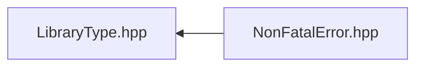

# File LibraryType.hpp

![][C++]

**Location**: `LibraryType.hpp`


## Included by

* [NonFatalError.hpp](NonFatalError_8hpp.md#NonFatalError_8hpp)



## Macros

<a id="LibraryType_8hpp_1adcaab8c9599842b51afc1b87ca4ed37f"></a>
### Macro SYSTEM\_COUPLING\_PARTICIPANT\_DLL

![][public]

```cpp
#define SYSTEM_COUPLING_PARTICIPANT_DLL __attribute__((visibility("default")))
```


## Source

```cpp
/*
 * Copyright ANSYS, Inc. Unauthorized use, distribution, or duplication is prohibited.
 */

#pragma once

#if defined(SYSTEM_COUPLING_PARTICIPANT_PROXY)
#undef SYSTEM_COUPLING_PARTICIPANT_DLL
#define SYSTEM_COUPLING_PARTICIPANT_DLL
#else

#if defined(_WIN32)
#if defined(SYSTEM_COUPLING_PARTICIPANT_DLL_EXPORT)
#define SYSTEM_COUPLING_PARTICIPANT_DLL __declspec(dllexport)
#else
#define SYSTEM_COUPLING_PARTICIPANT_DLL __declspec(dllimport)
#endif
#else
#undef SYSTEM_COUPLING_PARTICIPANT_DLL
#define SYSTEM_COUPLING_PARTICIPANT_DLL __attribute__((visibility("default")))
#endif

#endif
```

[public]: https://img.shields.io/badge/-public-brightgreen (public)
[C++]: https://img.shields.io/badge/language-C%2B%2B-blue (C++)
[private]: https://img.shields.io/badge/-private-red (private)
[const]: https://img.shields.io/badge/-const-lightblue (const)