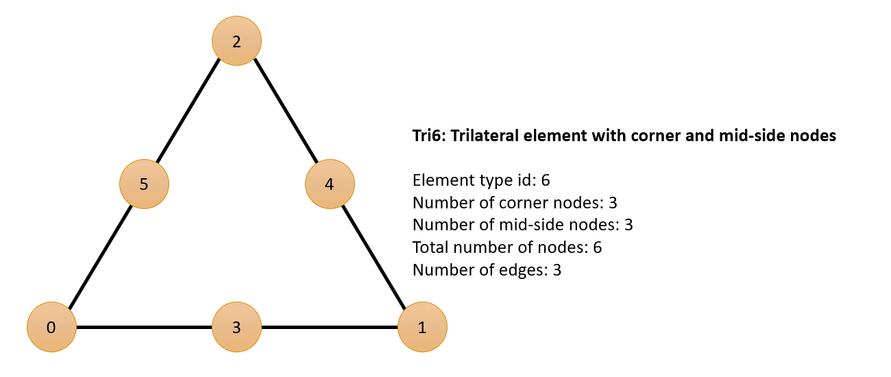
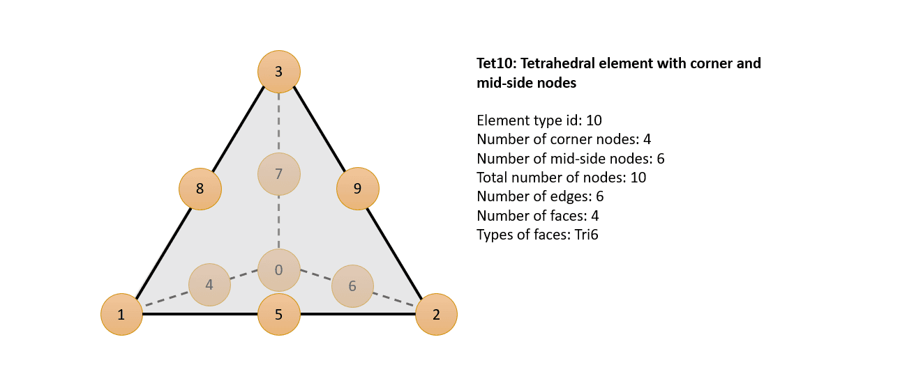
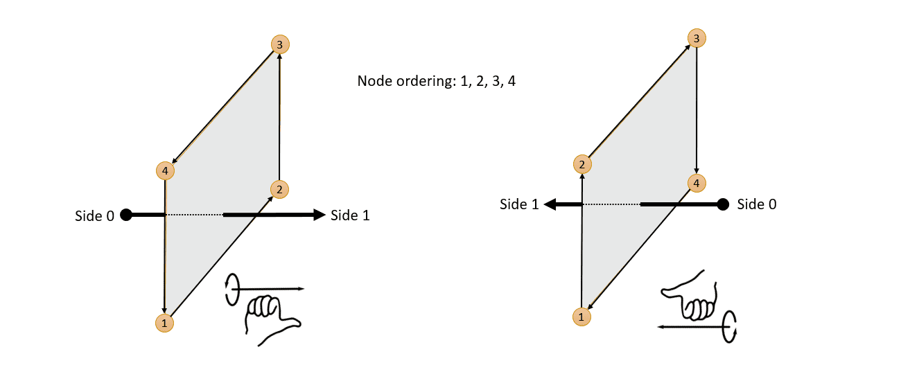
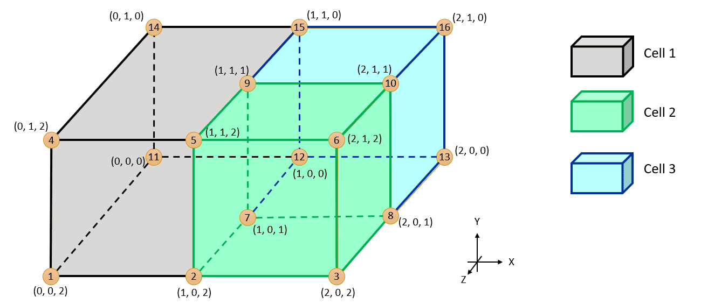

# Mesh and point cloud data access

This section pre-supposes familiarity with the concepts introduced in [Access to heavyweight data](heavyweight-data-access.md) section.
Heavyweight array data access structures described in that section can be
combined into higher-level structures to provide access to mesh and point cloud data.
This section describes these higher-level structures as well as requirements of mesh and point cloud structures.

[Mesh](#mesh)

[Point Cloud](#point-cloud)

## Mesh

The mesh formats can be broken down into two categories: element-based mesh and
face-based mesh.

Element-based mesh defines the mesh primarily through mesh elements along with
element-to-node connectivity. Elements are faces in the context of surface
meshes and cells in the context of volume meshes.

Face-based mesh defines the mesh primarily through mesh faces along with
face-to-node connectivity and, if it's a volume mesh, face-to-cell connectivity.

The advantage of element-based mesh format is that it provides a way to define
high-order elements (that is, elements with mid-side nodes along the edges),
while the advantage of the face-based mesh format is that
it provides a way to define arbitrary polygons and polyhedra.

It is possible to define the mesh using both formats at the same time. However,
in most cases it would require providing redundant information, so most
participant solvers can be expected to choose one of the two mesh formats.

[Intermediate structures](#intermediate-structures)

[Mesh model information](#mesh-model-information)

[Element-based surface mesh example](#element-based-surface-mesh-example)

[Face-based surface mesh example](#face-based-surface-mesh-example)

[Element-based volume mesh example](#element-based-volume-mesh-example)

[Face-based volume mesh example](#face-based-volume-mesh-example)

### Intermediate structures

The intermediate structures are used to define the mesh. These structures
are node data, element type data, element node count data, element-to-node connectivity data,
face-to-cell connectivity data, and cell id data. They are
described in more detail below.

Element-based mesh format requires:

  1. Node data
  2. Element type data (elements are faces if surface mesh)
  3. Element-to-node connectivity data (elements are faces if volume mesh)

Face-based mesh format requires:

  1. Node data
  2. Element node count data (elements are faces)
  3. Element-to-node connectivity data (elements are faces)
  4. Face-to-cell connectivity data (if volume mesh)
  5. Cell id data (if volume mesh)

#### Node data

This structure provides information about the mesh nodes. There are two relevant
pieces of information when providing node data: node ids and node coordinates.

Node ids provides access to the array of integers representing node ids. The ids
are considered to be global across all parallel MPI processes and all of a
participant's regions that are registered with System Coupling. For example, if
region A refers to node id N, and region B refers to node id N, then both
regions must refer to the exact same node, that is node with id N is _shared_
between regions A and B. Similarly, if running in parallel, and process with
rank X refers to node with ids N, and process with rank Y refers to node id N,
then both processes must refer to the exact same node, that is node id with id N is
_duplicated_ in both processes X and Y. The ids do not have to be contiguous.
The ids must be non-negative.

Node ids are optional. If node ids are provided, then the node coordinates must
be provided in the same order as node ids, that is n-th entry in the node ids array
corresponds to the n-th entry in the node coordinates array(s). If node ids are
not not provided, then node coordinates must be provided in the ascending node
ids order. In this case, the actual node ids are implicitly provided elsewhere,
for example via element-to-node connectivity data (see below).

#### Element type data

This structure provides information about the element types. Supported element
types are defined in the `ElementTypes.hpp` (C++), `syscElementTypes.h` (C),
`syscElementTypesF.fi` (Fortran) header files and are shown in Figures 1 to 12 below.


_Figure 1: Tri3 Element Type_


_Figure 2: Tri6 Element Type_


_Figure 3: Quad4 Element Type_


_Figure 4: Quad8 Element Type_


_Figure 5: Tet4 Element Type_


_Figure 6: Tet10 Element Type_


_Figure 7: Hex8 Element Type_


_Figure 8: Hex20 Element Type_


_Figure 9: Wedge6 Element Type_


_Figure 10: Wedge15 Element Type_


_Figure 11: Pyramid5 Element Type_


_Figure 12: Pyramid13 Element Type_

#### Element node count data

This structure provides information about the element node counts. It contains
the number of elements as well as the number of nodes within each element.

#### Element-to-node connectivity data

This structure provides information about the element-to-node connectivity. That
is, for each element, the ids of nodes connected to that element are provided.

#### Cell id data

The cell id data structure provides information about the cell ids.

Like node ids, the cell ids are considered to be global across all parallel MPI
processes and all regions that are registered with System Coupling and do not
have to be contiguous. However, cell ids must be positive. Zero is reserved to
mean the absence of a cell when defining face-to-cell connectivity (see below),
therefore 0 is not a valid id for a mesh cell.

#### Face-to-cell connectivity data

This structure provides information about the face-to-cell connectivity data.

Each face has two sides, side 0 and side 1. The sides are defined such that if
one looks through the face from side 0 to side 1, then the face nodes are
provided in clock-wise order. Another way to define it is the face normal
(defined using the right-hand rule) must point from side 0 to side 1. Figure 13
illustrates the convention for defining side 0 and side 1.


_Figure 13: Face Side 0 and Side 1 Convention_

The face may be connected to mesh cells on either side. If a face is connected
to a cell on side 0, then it will contain the id of that cell in its "cell 0"
entry. Likewise, if a face is connected to a cell on side 1, then it will
contain the id of that cell in its "cell 1" entry.

If the face is not connected to any cell on either side, then its corresponding
cell 0 or cell 1 entry must contain zero.

### Mesh model information

Surface and volume regions can be topologically connected and the underlying
mesh can be shared. A volume mesh can have bounding surfaces.
Moreover, two volume meshes can share a surface.
This kind of connectivity is called the **mesh model** and System Coupling
participant library provides a way to communicate this information.

The way to specify that the volume and surface meshes are connected
is to provide the side 0 and side 1 region names in the surface mesh structure.
Side 0 and side 1 region names must refer to a valid volume region (with a valid volume mesh).
It is important to maintain the convention for side 0 and side 1 as shown in Figure 13.
The region names must refer to valid volume regions.

### Element-based surface mesh example

Figure 14 shows a sample surface mesh, with each node and face labelled. Note that
in this example, there are high-order quadrilateral and trilateral with midside nodes.
Also note that node ids are not contiguous.


_Figure 14: Surface Mesh Element-Based Format Example_

Due to the presence of the high-order elements, the element-based mesh format is more suitable for this example.

#### Node data

If providing node ids, node coordinates must be provided in the same order as node ids:

```text
Node ids: 

{1, 12, 2, 23, 3, 14, 25, 26, 36, 4, 45, 5, 56, 6}

Node coords: 

{0.0,  0.0, 0.0, // node 1
 1.0,  0.0, 0.0, // node 12
 2.0,  0.0, 0.0, // node 2
 3.0,  0.0, 0.0, // node 23
 4.0,  0.0, 0.0, // node 3
 0.0,  1.0, 0.0, // node 14
 2.0,  1.0, 0.0, // node 25
 3.0,  1.0, 0.0, // node 26
 4.0,  1.0, 0.0, // node 36
 0.0,  2.0, 0.0, // node 4
 1.0,  2.0, 0.0, // node 45
 2.0,  2.0, 0.0, // node 5
 3.0,  2.0, 0.0, // node 56
 4.0,  2.0, 0.0} // node 6

```

If node ids are omitted, then the node coordinates must be provided in ascending node id order.
Note that the actual node ids are going to be provided via the element-to-node connectivity data (see below).

```text
Node coords:

{0.0,  0.0, 0.0, // node 1
 2.0,  0.0, 0.0, // node 2
 4.0,  0.0, 0.0, // node 3
 0.0,  2.0, 0.0, // node 4
 2.0,  2.0, 0.0, // node 5
 4.0,  2.0, 0.0} // node 6
 1.0,  0.0, 0.0, // node 12
 0.0,  1.0, 0.0, // node 14
 3.0,  0.0, 0.0, // node 23
 2.0,  1.0, 0.0, // node 25
 3.0,  1.0, 0.0, // node 26
 4.0,  1.0, 0.0, // node 36
 1.0,  2.0, 0.0, // node 45
 3.0,  2.0, 0.0} // node 56
```

When providing solution data on nodes, the ordering of the solution data must be consistent with the
ordering of the node coordinates.

#### Element type data

Relevant element types are shown in Figure 2 and Figure 4 above.
High-order trilateral element types are assigned the value of 6,
while high-order quadrilateral element types are assigned the value of 8.

Note that when providing solution data on elements (faces), the ordering of the solution data must be consistent with the
ordering of the elements in this element node count data structure.

```text
Element types:

{8, // Element I
 6, // Element II
 6} // Element III
```

#### Element-to-node connectivity data

Note that element-to-node connectivity contains the same node ids that are
defined in the node data structure. If the node ids are omitted from the node
data structure, then they are deduced from this element-to-node connectivity
data structure.

The proper ordering of nodes within the element
is also provided in Figure 2 and Figure 4. Corner nodes are listed first, followed by the mid-side nodes.

```text
Element-to-node connectivity:

{1, 2, 5, 4, 12, 25, 45, 14, // Element I
 2, 3, 6, 23, 36, 26,        // Element II
 2, 6, 5, 26, 56, 25}        // Element III
```

#### C++

The data is stored in STL vector structures. Then, basic data structures (`sysc::OutputIntegerData` and `sysc::OutputVectorData`) are created
to pass these arrays to System Coupling. The basic structures are then used to create the
intermediate structures (`sysc::NodeData`, `sysc::ElementTypeData`, and `sysc::ElementNodeConnectivityData`).
Finally, the intermediate structures are used to create the `sysc::SurfaceMesh` object.

```cpp
// heavyweight data arrays
std::vector<int> nodeIds = ...
std::vector<double> x = ...
std::vector<double> y = ...
std::vector<double> z = ...
std::vector<int> elemTypes = ...
std::vector<int> elemNodeIds = ...

// basic data access structures
sysc::OutputIntegerData nodeIdData(nodeIds);
sysc::OutputVectorData nodeCoordData(x, y, z);
sysc::OutputIntegerData elemTypeArrayData(elemTypes);
sysc::OutputIntegerData elemNodeIdData(elemNodeIds);

// intermediate structures
sysc::NodeData nodeData(nodeIdData, nodeCoordData);
sysc::ElementTypeData elemTypeData(elemTypeArrayData);
sysc::ElementNodeConnectivityData elemNodeConnectivityData(elemNodeIdData);

// surface mesh object
sysc::SurfaceMesh mesh(nodeData, elemTypeData, elemNodeConnectivityData);
```

#### C

The data is stored in C arrays. Then, basic data structures (`SyscOutputIntegerData` and `SyscOutputVectorData`) are created
to pass these arrays to System Coupling. The basic structures are then used to create the
intermediate structures (`SyscNodeData`, `SyscElementTypeData`, and `SyscElementNodeConnectivityData`).
Finally, the intermediate structures are used to create the `SyscSurfaceMesh` object.

Note the helper functions `syscGetNodeDataIC`, `syscGetElementTypeData`, `syscGetElementNodeConnectivityData`, and
`syscGetSurfaceMeshNTI` used to create the corresponding data structures.

```c
/* heavyweight data arrays */
int nodeIds[] = ...
double x[] = ...
double y[] = ...
double z[] = ...
int elemTypes[] = ...
int elemNodeIds[] = ...

size_t numNodes = 14;
size_t numElems = 3;
size_t numElemNodeIds = 20;

/* basic data access structures */
SyscOutputIntegerData nodeIdData = syscGetOutputIntegerDataInt32(nodeIds, numNodes);
SyscOutputVectorData nodeCoordData = syscGetOutputVectorDataSplitDouble(x, y, z, numNodes);
SyscOutputIntegerData elemTypeArrayData = syscGetOutputIntegerDataInt32(elemTypes, numElems);
SyscOutputIntegerData elemNodeIdData = syscGetOutputIntegerDataInt32(elemNodeIds, numElemNodeIds);

/* intermediate structures */
SyscNodeData nodeData = syscGetNodeDataIC(nodeIdData, nodeCoordData);
SyscElementTypeData elemTypeData = syscGetElementNodeCountData(elemTypeArrayData);
SyscElementNodeConnectivityData elemNodeConnectivityData = syscGetElementNodeConnectivityData(elemNodeIdData);

/* surface mesh structure */
SyscSurfaceMesh mesh = syscGetSurfaceMeshNTI(nodeData, elemTypeData, elemNodeConnectivityData);
```

#### Fortran

The data is stored in Fortran arrays. Then, basic data structures
(`SyscOutputIntegerDataF` and `SyscOutputVectorDataF`) are created to pass these
arrays to System Coupling. The basic structures are then used to create the
intermediate structures (`SyscNodeDataF`, `SyscElementTypeDataF`, and
`SyscElementNodeConnectivityDataF`). Finally, the intermediate structures are
used to create the `SyscSurfaceMeshF` object.

Note the helper functions `syscGetNodeDataF`, `syscGetElementTypeDataF`, `syscGetElementNodeConnectivityDataF`, and
`syscGetSurfaceMeshF` used to create the corresponding data structures.

```fortran
! heavyweight data arrays
integer(kind=4), target :: nodeIds(14) = ...
real(kind=8), target :: x(14) = ...
real(kind=8), target :: y(14) = ...
real(kind=8), target :: z(14) = ...
integer(kind=4), target :: elemTypes(3) = ...
integer(kind=4), target :: elemNodeIds(20) = ...

! basic data access structures
type(SyscOutputIntegerDataF) :: nodeIdData
type(SyscOutputVectorDataF) :: nodeCoordData
type(SyscOutputIntegerDataF) :: elemTypeArrayData
type(SyscOutputIntegerDataF) :: elemNodeIdData

nodeIdData = syscGetOutputIntegerDataF(nodeIds, size(nodeIds, kind=8))
nodeCoordData = syscGetOutputVectorDataSplitF(x, y, z, size(x, kind=8))
elemTypeArrayData = syscGetOutputIntegerDataF(elemTypes, size(elemTypes, kind=8))
elemNodeIdData = syscGetOutputIntegerDataF(elemNodeIds, size(elemNodeIds, kind=8))

! intermediate structures
type(SyscNodeDataF) :: nodeData
type(SyscElementTypeDataF) :: elemTypeData
type(SyscElementNodeConnectivityDataF) :: elemNodeConnectivityData

nodeData = syscGetNodeDataF(nodeIdData, nodeCoordData)
elemTypeData = syscGetElementTypeDataF(elemTypeArrayData)
elemNodeConnectivityData = syscGetElementNodeConnectivityDataF(elemNodeIdData)

! surface mesh structure
type(SyscSurfaceMeshF) :: mesh

mesh = syscGetSurfaceMeshF(nodeData, elemTypeData, elemNodeConnectivityData)
```

#### Python

The data is stored in Numpy arrays. Then, basic data structures (`sysc.OutputIntegerData` and `sysc.OutputVectorData`) are created
to pass these arrays to System Coupling. The basic structures are then used to create the
intermediate structures (`sysc.NodeData`, `sysc.ElementTypeData`, and `sysc.ElementNodeConnectivityData`).
Finally, the intermediate structures are used to create the `sysc.SurfaceMesh` object.

```python
import numpy as np
import pyExt.SystemCouplingParticipant as sysc

# heavyweight data arrays
nodeIds = np.array([...], dtype = np.int32)
x = np.array([...], dtype = np.float64)
y = np.array([...], dtype = np.float64)
z = np.array([...], dtype = np.float64)
elemTypes = np.array([...], dtype = np.int32)
elemNodeIds = np.array([...], dtype = np.int32)

# basic data access structures
nodeIdData = sysc.OutputIntegerData(nodeIds)
nodeCoordData = sysc.OutputVectorData(x, y, z)
elemTypeArrayData = sysc.OutputIntegerData(elemTypes)
elemNodeIdData = sysc.OutputIntegerData(elemNodeIds)

# intermediate structures
nodeData = sysc.NodeData(nodeIdData, nodeCoordData)
elemTypeData = sysc.ElementTypeData(elemTypeArrayData)
elemNodeConnectivityData = sysc.ElementNodeConnectivityData(elemNodeIdData)

# surface mesh object
mesh = sysc.SurfaceMesh(nodeData, elemTypeData, elemNodeConnectivityData)
```

### Face-based surface mesh example

Figure 15 shows a sample surface mesh, with each node and face labelled. Note that
in this example, there are quadrilateral, trilateral, and polygon faces. Also note
that node ids are not contiguous.


_Figure 15: Surface Mesh Face-Based Format Example_

Due to the presence of the polygon faces, the face-based mesh format is more suitable for this example.
To describe the mesh in this example, the following structures are required:

- Node data
- Element node count data
- Element-to-node connectivity data

#### Node data

If providing node ids, node coordinates must be provided in the same order as node ids:

```text
Node ids: 

{6, 8, 7, 2, 1, 3, 12, 18}

Node coords: 

{0.0,  0.0, 0.0, // node 6
 8.0,  0.0, 0.0, // node 8
 4.0,  0.0, 0.0, // node 7
 4.0,  4.0, 0.0, // node 2
 0.0,  4.0, 0.0, // node 1
 8.0,  4.0, 0.0, // node 3
 2.0, -4.0, 0.0, // node 12
 6.0, -4.0, 0.0} // node 18
```

If node ids are omitted, then the node coordinates must be provided in
ascending node id order. Note that the actual node ids would be provided via the
element-to-node connectivity data (see below).

```text
Node coords:

{0.0,  4.0, 0.0, // node 1
 4.0,  4.0, 0.0, // node 2
 8.0,  4.0, 0.0, // node 3
 0.0,  0.0, 0.0, // node 6
 4.0,  0.0, 0.0, // node 7
 8.0,  0.0, 0.0, // node 8
 2.0, -4.0, 0.0, // node 12
 6.0, -4.0, 0.0} // node 18
```

When providing solution data on nodes, the ordering of the solution data must be
consistent with the ordering of the node coordinates.

#### Element node count data

Note that when providing solution data on elements (faces), the ordering of the
solution data must be consistent with the ordering of the elements in this
element node count data structure.

```text
Element node counts:

{4, // Face I
 3, // Face II
 3, // Face III
 5} // Face IV
```

#### Element-to-node connectivity data

Note that the element-to-node connectivity contains the same node ids that are
defined in the node data structure. If the node ids are omitted from the node
data structure, then they are deduced from this element-to-node connectivity
data structure.

```text
Element-to-node connectivity:

{1, 2, 7, 6,      // Face I 
 2, 3, 7,         // Face II
 3, 8, 7,         // Face III
 6, 7, 8, 18, 12} // Face IV
```

#### C++

The data is stored in STL vector structures. Then, basic data
structures (`sysc::OutputIntegerData` and `sysc::OutputVectorData`) are created
to pass these arrays to System Coupling. The basic structures are then used to
create the intermediate structures (`sysc::NodeData`,
`sysc::ElementNodeCountData`, and `sysc::ElementNodeConnectivityData`). Finally,
the intermediate structures are used to create the `sysc::SurfaceMesh` object.

```cpp
// heavyweight data arrays
std::vector<int> nodeIds = ...
std::vector<double> x = ...
std::vector<double> y = ...
std::vector<double> z = ...
std::vector<int> faceNodeCounts = ...
std::vector<int> faceNodeIds = ...

// basic data access structures
sysc::OutputIntegerData nodeIdData(nodeIds);
sysc::OutputVectorData nodeCoordData(x, y, z);
sysc::OutputIntegerData faceNodeCountData(faceNodeCounts);
sysc::OutputIntegerData faceNodeIdData(faceNodeIds);

// intermediate structures
sysc::NodeData nodeData(nodeIdData, nodeCoordData);
sysc::ElementNodeCountData elemNodeCountData(faceNodeCountData);
sysc::ElementNodeConnectivityData elemNodeConnectivityData(faceNodeIdData);

// surface mesh object
sysc::SurfaceMesh mesh(nodeData, elemNodeCountData, elemNodeConnectivityData);
```

#### C

The data is stored in C arrays. Then, basic data structures (`SyscOutputIntegerData` and `SyscOutputVectorData`) are created
to pass these arrays to System Coupling. The basic structures are then used to create the
intermediate structures (`SyscNodeData`, `SyscElementNodeCountData`, and `SyscElementNodeConnectivityData`).
Finally, the intermediate structures are used to create the `SyscSurfaceMesh` object.

Note the helper functions `syscGetNodeDataIC`, `syscGetElementNodeCountData`, `syscGetElementNodeConnectivityData`, and
`syscGetSurfaceMeshNCI` used to create the corresponding data structures.

```c
/* heavyweight data arrays */
int nodeIds[] = ...
double x[] = ...
double y[] = ...
double z[] = ...
int faceNodeCounts[] = ...
int faceNodeIds[] = ...

size_t numNodes = 8;
size_t numFaces = 4;
size_t numFaceNodeIds = 15;

/* basic data access structures */
SyscOutputIntegerData nodeIdData = syscGetOutputIntegerDataInt32(nodeIds, numNodes);
SyscOutputVectorData nodeCoordData = syscGetOutputVectorDataSplitDouble(x, y, z, numNodes);
SyscOutputIntegerData faceNodeCountData = syscGetOutputIntegerDataInt32(faceNodeCounts, numFaces);
SyscOutputIntegerData faceNodeIdData = syscGetOutputIntegerDataInt32(faceNodeIds, numFaceNodeIds);

/* intermediate structures */
SyscNodeData nodeData = syscGetNodeDataIC(nodeIdData, nodeCoordData);
SyscElementNodeCountData elemNodeCountData = syscGetElementNodeCountData(faceNodeCountData);
SyscElementNodeConnectivityData elemNodeConnectivityData = syscGetElementNodeConnectivityData(faceNodeIdData);

/* surface mesh structure */
SyscSurfaceMesh mesh = syscGetSurfaceMeshNCI(nodeData, elemNodeCountData, elemNodeConnectivityData);
```

#### Fortran

The data is stored in Fortran arrays. Then, basic data structures (`SyscOutputIntegerDataF` and `SyscOutputVectorDataF`) are created
to pass these arrays to System Coupling. The basic structures are then used to create the
intermediate structures (`SyscNodeDataF`, `SyscElementNodeCountDataF`, and `SyscElementNodeConnectivityDataF`).
Finally, the intermediate structures are used to create the `SyscSurfaceMeshF` object.

Note the helper functions `syscGetNodeDataF`, `syscGetElementNodeCountDataF`, `syscGetElementNodeConnectivityDataF`, and
`syscGetSurfaceMeshF` used to create the corresponding data structures.

```fortran
! heavyweight data arrays
integer(kind=4), target :: nodeIds(8) = ...
real(kind=8), target :: x(8) = ...
real(kind=8), target :: y(8) = ...
real(kind=8), target :: z(8) = ...
integer(kind=4), target :: faceNodeCounts(4) = ...
integer(kind=4), target :: faceNodeIds(15) = ...

! basic data access structures
type(SyscOutputIntegerDataF) :: nodeIdData
type(SyscOutputVectorDataF) :: nodeCoordData
type(SyscOutputIntegerDataF) :: faceNodeCountData
type(SyscOutputIntegerDataF) :: faceNodeIdData

nodeIdData = syscGetOutputIntegerDataF(nodeIds, size(nodeIds, kind=8))
nodeCoordData = syscGetOutputVectorDataSplitF(x, y, z, size(x, kind=8))
faceNodeCountData = syscGetOutputIntegerDataF(faceNodeCounts, size(faceNodeCounts, kind=8))
faceNodeIdData = syscGetOutputIntegerDataF(faceNodeIds, size(faceNodeIds, kind=8))

! intermediate structures
type(SyscNodeDataF) :: nodeData
type(SyscElementNodeCountDataF) :: elemNodeCountData
type(SyscElementNodeConnectivityDataF) :: elemNodeConnectivityData

nodeData = syscGetNodeDataF(nodeIdData, nodeCoordData)
elemNodeCountData = syscGetElementNodeCountDataF(faceNodeCountData)
elemNodeConnectivityData = syscGetElementNodeConnectivityDataF(faceNodeIdData)

! surface mesh structure
type(SyscSurfaceMeshF) :: mesh

mesh = syscGetSurfaceMeshF(nodeData, elemNodeCountData, elemNodeConnectivityData)
```

#### Python

The data is stored in Numpy arrays. Then, basic data structures (`sysc.OutputIntegerData` and `sysc.OutputVectorData`) are created
to pass these arrays to System Coupling. The basic structures are then used to create the
intermediate structures (`sysc.NodeData`, `sysc.ElementNodeCountData`, and `sysc.ElementNodeConnectivityData`).
Finally, the intermediate structures are used to create the `sysc.SurfaceMesh` object.

```python
import numpy as np
import pyExt.SystemCouplingParticipant as sysc

# heavyweight data arrays
nodeIds = np.array([...], dtype = np.int32)
x = np.array([...], dtype = np.float64)
y = np.array([...], dtype = np.float64)
z = np.array([...], dtype = np.float64)
faceNodeCounts = np.array([...], dtype = np.int32)
faceNodeIds = np.array([...], dtype = np.int32)

# basic data access structures
nodeIdData = sysc.OutputIntegerData(nodeIds)
nodeCoordData = sysc.OutputVectorData(x, y, z)
faceNodeCountData = sysc.OutputIntegerData(faceNodeCounts)
faceNodeIdData = sysc.OutputIntegerData(faceNodeIds)

# intermediate structures
nodeData = sysc.NodeData(nodeIdData, nodeCoordData)
elemNodeCountData = sysc.ElementNodeCountData(faceNodeCountData)
elemNodeConnectivityData = sysc.ElementNodeConnectivityData(faceNodeIdData)

# surface mesh object
mesh = sysc.SurfaceMesh(nodeData, elemNodeCountData, elemNodeConnectivityData)
```

### Element-based volume mesh example

Figure 16 shows a sample volume mesh, with each node and element labelled. The
coordinates are also shown for each node.

In the example, there are 12 nodes and 3 elements.

Elements 2 and 3 are wedge elements (they each have 6 nodes),
while element 1 is a hexahedral element (it has 8 nodes).


_Figure 16: Volume Mesh Element-Based Format Example_

Since there are no polyhedral elements, the element-based mesh format is suitable for this example.

#### Node data

If providing node ids, node coordinates must be provided in the same order as
node ids. If node ids are omitted, then the node coordinates must be provided
in ascending node id order. Note that the actual node ids are going to be
provided via the element-to-node connectivity data (see below).

When providing solution data on nodes, the ordering of the solution data must be
consistent with the ordering of the node coordinates.

```text
Node coords: 

{0.0, 0.0, 2.0, // node 1
 1.0, 0.0, 2.0, // node 2
 2.0, 0.0, 2.0, // node 3
 0.0, 1.0, 2.0, // node 4
 1.0, 1.0, 2.0, // node 5
 2.0, 1.0, 2.0, // node 6
 0.0, 0.0, 0.0, // node 7
 1.0, 0.0, 0.0, // node 8
 2.0, 0.0, 0.0, // node 9
 0.0, 1.0, 0.0, // node 10
 1.0, 1.0, 0.0, // node 11
 2.0, 1.0, 0.0} // node 12
```

#### Element type data

Element Type data structure is used to specify the type of each element.

Relevant element types are shown in Figure 7 and Figure 9 above.
Hexahedral element types are assigned the value of 11,
while wedge element types are assigned the value of 13.

Note that when providing solution data on elements, the ordering of the solution data must be consistent with the
ordering of the elements in this element node count data structure.

```text
Element types:

{11, // Element 1
 13, // Element 2
 13} // Element 3
```

#### Element-to-node connectivity data

Element-to-Node Connectivity data structure is used to specify element-to-node connectivity.
Note that the node ordering must be consistent with what is shown in Figures 7 and 9.

```text
Element-to-node connectivity:

{1, 2, 8, 7, 4, 5, 11, 10, // element 1
 5, 11, 12, 2, 8, 9, // element 2
 5, 12, 6, 2, 9, 3 } // element 3
```

#### C++

The data is stored in STL vector structures. Then, basic data structures
(`sysc::OutputIntegerData` and `sysc::OutputVectorData`) are created to pass
these arrays to System Coupling. The basic structures are then used to create
the intermediate structures (`sysc::NodeData`, `sysc::ElementTypeData`, and
`sysc::ElementNodeConnectivityData`. Finally, the intermediate structures are used to create the
`sysc::VolumeMesh` object.

```cpp
// heavyweight data arrays
std::vector<double> nodeCoords = ...
std::vector<int> elemTypes = ...
std::vector<int> elemNodeIds = ...

// basic data access structures
sysc::OutputVectorData nodeCoordData(nodeCoords);
sysc::OutputIntegerData elemTypeDataArray(elemTypes);
sysc::OutputIntegerData elemNodeIdData(elemNodeIds);

// intermediate structures
sysc::NodeData nodeData(nodeCoordData);
sysc::ElementTypeData elemTypeData(elemTypeDataArray);
sysc::ElementNodeConnectivityData elemNodeConnectivityData(elemNodeIdData);

// volume mesh object
sysc::VolumeMesh mesh(
    nodeData, 
    elemTypeData, 
    elemNodeConnectivityData);
```

#### C

The data is stored in C arrays. Then, basic data structures (`SyscOutputIntegerData` and `SyscOutputVectorData`) are created
to pass these arrays to System Coupling. The basic structures are then used to create the
intermediate structures (`SyscNodeData`, `SyscElementTypeData`, and `SyscElementNodeConnectivityData`.
Finally, the intermediate structures are used to create the `SyscVolumeMesh` structure.

Note the helper functions `syscGetNodeDataC`, `syscGetElementTypeData`, `syscGetElementNodeConnectivityData`,
and `syscGetVolumeMeshElementBased` used to create the corresponding data structures.

```c
/* heavyweight data arrays */
double nodeCoords[] = ...
int elemTypes[] = ...
int elemNodeIds[] = ...

size_t numNodes = 12;
size_t numElems = 3;
size_t numElemNodeIds = 20;

/* basic data access structures */
SyscOutputVectorData nodeCoordDataArray = syscGetOutputVectorDataCompactDouble(nodeCoords, numNodes);
SyscOutputIntegerData elemTypeDataArray = syscGetOutputIntegerDataInt32(elemTypes, numElems);
SyscOutputIntegerData elemNodeIdDataArray = syscGetOutputIntegerDataInt32(elemNodeIds, numElemNodeIds);

/* intermediate structures */
SyscNodeData nodeData = syscGetNodeDataC(nodeCoordDataArray);
SyscElementTypeData elemTypeData = syscGetElementTypeData(elemTypeDataArray);
SyscElementNodeConnectivityData elemNodeConnectivityData = syscGetElementNodeConnectivityData(elemNodeIdDataArray);

/* volume mesh structure */
SyscVolumeMesh mesh = syscGetVolumeMeshElementBased(
    nodeData, 
    elemTypeData, 
    elemNodeConnectivityData);
```

#### Fortran

The data is stored in Fortran arrays. Then, basic data structures (`SyscOutputIntegerDataF` and `SyscOutputVectorDataF`) are created
to pass these arrays to System Coupling. The basic structures are then used to create the
intermediate structures (`SyscNodeDataF`, `SyscElementTypeDataF`, and `SyscElementNodeConnectivityDataF`).
Finally, the intermediate structures are used to create the `SyscVolumeMeshF` object.

Note the helper functions `syscGetNodeDataF`, `syscGetElementTypeDataF`, `syscGetElementNodeConnectivityDataF`,
and `syscGetVolumeMeshF` used to create the corresponding data structures.

```fortran
! heavyweight data arrays
real(kind=8), target :: nodeCoords(36) = ...
integer(kind=4), target :: elemTypes(3) = ...
integer(kind=4), target :: elemNodeIds(20) = ...

! basic data access structures
type(SyscOutputVectorDataF) :: nodeCoordDataArray
type(SyscOutputIntegerDataF) :: elemTypeDataArray
type(SyscOutputIntegerDataF) :: elemNodeIdDataArray

nodeCoordDataArray = syscGetOutputVectorDataCompactF(nodeCoords, size(nodeCoords, kind=8) / 3)
elemTypeDataArray = syscGetOutputIntegerDataF(elemTypes, size(elemTypes, kind=8))
elemNodeIdDataArray = syscGetOutputIntegerDataF(elemNodeIds, size(elemNodeIds, kind=8))

! intermediate structures
type(SyscNodeDataF) :: nodeData
type(SyscElementTypeDataF) :: elemTypeData
type(SyscElementNodeConnectivityDataF) :: elemNodeConnectivityData

nodeData = syscGetNodeDataF(nodeCoordDataArray)
elemTypeData = syscGetElementTypeDataF(elemTypeDataArray)
elemNodeConnectivityData = syscGetElementNodeConnectivityDataF(elemNodeIdDataArray)

! volume mesh structure
type(SyscVolumeMeshF) :: mesh

mesh = syscGetVolumeMeshF(&
    nodeData, &
    elemTypeData, &
    elemNodeConnectivityData)
```

#### Python

The data is stored in Numpy arrays. Then, basic data structures (`sysc.OutputIntegerData` and `sysc.OutputVectorData`) are created
to pass these arrays to System Coupling. The basic structures are then used to create the
intermediate structures (`sysc.NodeData`, `sysc.ElementTypeData`, and `sysc.ElementNodeConnectivityData`).
Finally, the intermediate structures are used to create the `sysc.VolumeMesh` object.

```python
import numpy as np
import pyExt.SystemCouplingParticipant as sysc

# heavyweight data arrays
nodeCoords = np.array([...], dtype = np.float64)
elemTypes = np.array([...], dtype = np.int32)
elemNodeIds = np.array([...], dtype = np.int32)

# basic data access structures
nodeCoordData = sysc.OutputVectorData(nodeCoords)
elemTypeDataArray = sysc.OutputIntegerData(elemTypes)
elemNodeIdData = sysc.OutputIntegerData(elemNodeIds)

# intermediate structures
nodeData = sysc.NodeData(nodeCoordData)
elemTypeData = sysc.ElementTypeData(elemTypeDataArray)
elemNodeConnectivityData = sysc.ElementNodeConnectivityData(elemNodeIdData)

# volume mesh object
mesh = sysc.VolumeMesh(
    nodeData, 
    elemNodeCountData, 
    elemNodeConnectivityData)
```

### Face-based volume mesh example

Figure 17 shows a sample volume mesh, with each node and cell labelled. The
coordinates are also shown for each node.

In the example, there are 16 nodes, 16 faces, and 3 cells.

Cells 2 and 3 are hexahedral elements (they each have 6 faces and 8 nodes),
while cell 1 is a polyhedral element (it has 7 faces and 10 nodes).

13 out of the 16 faces are external, that is they are connected to a cell
only on one side. The remaining 3 faces are internal - they are shared
between two cells: one face is shared between cells 2 & 3, one face is shared
between cells 1 & 2, and one face is shared between cells 2 & 3.


_Figure 17: Volume Mesh Face-Based Format Example_

Due to the presence of the polyhedral cell, the face-based mesh format is more suitable for this example.

#### Node data

If providing node ids, node coordinates must be provided in the same order as
node ids. If node ids are omitted, then the node coordinates must be provided
in ascending node id order. Note that the actual node ids are going to be
provided via the face-to-node connectivity data (see below).

When providing solution data on nodes, the ordering of the solution data must be
consistent with the ordering of the node coordinates.

```text
Node coords: 

{0.0,  0.0, 2.0, // node 1
 1.0,  0.0, 2.0, // node 2
 2.0,  0.0, 2.0, // node 3
 0.0,  1.0, 2.0, // node 4
 1.0,  1.0, 2.0, // node 5
 2.0,  1.0, 2.0, // node 6
 1.0,  0.0, 1.0, // node 7
 2.0,  0.0, 1.0, // node 8
 1.0,  1.0, 1.0, // node 9
 2.0,  1.0, 1.0, // node 10
 0.0,  0.0, 0.0, // node 11
 1.0,  0.0, 0.0, // node 12
 2.0,  0.0, 0.0, // node 13
 0.0,  1.0, 0.0, // node 14
 1.0,  1.0, 0.0, // node 15
 2.0,  1.0, 0.0} // node 16
```

#### Element node count data

Element Node Count data structure is used to specify node counts for each **face**.

```text
Face node counts:

{4, // front face on cell 1
 4, // left face on cell 1
 4, // back face on cell 1
 5, // bottom face on cell 1
 5, // top face on cell 1
 4, // front face on cell 2
 4, // left face on cell 2 (shared between cells 1 & 2)
 4, // back face on cell 2 (shared between cells 2 & 3)
 4, // right face on cell 2
 4, // bottom face on cell 2
 4, // top face on cell 2
 4, // left face on cell 3 (shared between cells 1 & 3)
 4, // back face on cell 3
 4, // right face on cell 3
 4, // bottom face on cell 3
 4} // top face on cell 3
```

#### Element-to-node connectivity data

Element-to-Node Connectivity data structure is used to specify **face-to-node** connectivity.
Note that for the 13 boundary faces (faces that are not shared between two cells), the orientation is such that
side 0 is on the inside of the mesh and side 1 is on the outside.

```text
Face-to-node connectivity:

{1, 2, 5, 4, // front face on cell 1
 1, 4, 14, 11, // left face on cell 1
 11, 14, 15, 12, // back face on cell 1
 1, 11, 12, 7, 2, // bottom face on cell 1
 4, 5, 9, 15, 14, // top face on cell 1
 2, 3, 6, 5, // front face on cell 2
 2, 5, 9, 7, // left face on cell 2 (shared between cells 1 & 2)
 7, 8, 10, 9, // back face on cell 2 (shared between cells 2 & 3)
 3, 8, 10, 6, // right face on cell 2
 2, 7, 8, 3, // bottom face on cell 2
 5, 6, 10, 9, // top face on cell 2
 7, 9, 15, 12, // left face on cell 3 (shared between cells 1 & 3)
 12, 15, 16, 13, // back face on cell 3
 8, 13, 16, 10, // right face on cell 3
 7, 12, 13, 8, // bottom face on cell 3
 9, 10, 16, 15} // top face on cell 3
```

#### Face-to-cell connectivity data

Face-to-cell connectivity data specifies which cells are connected to each face.
Note that if there is no cell connected to the face on a side, then the corresponding
entry in the array is 0.

```text
Face-to-cell connectivity:

cell0:

{1, // front face on cell 1
 1, // left face on cell 1
 1, // back face on cell 1
 1, // bottom face on cell 1
 1, // top face on cell 1
 2, // front face on cell 2
 2, // left face on cell 2 (shared between cells 1 & 2)
 3, // back face on cell 2 (shared between cells 2 & 3)
 2, // right face on cell 2
 2, // bottom face on cell 2
 2, // top face on cell 2
 3, // left face on cell 3 (shared between cells 1 & 3)
 3, // back face on cell 3
 3, // right face on cell 3
 3, // bottom face on cell 3
 3} // top face on cell 3

cell1:

{0, // front face on cell 1
 0, // left face on cell 1
 0, // back face on cell 1
 0, // bottom face on cell 1
 0, // top face on cell 1
 0, // front face on cell 2
 1, // left face on cell 2 (shared between cells 1 & 2)
 2, // back face on cell 2 (shared between cells 2 & 3)
 0, // right face on cell 2
 0, // bottom face on cell 2
 0, // top face on cell 2
 1, // left face on cell 3 (shared between cells 1 & 3)
 0, // back face on cell 3
 0, // right face on cell 3
 0, // bottom face on cell 3
 0} // top face on cell 3
```

#### Cell id data

Cell ids must be explicitly provided via the Cell Id data structure.
Note that when providing solution data on elements (cells), the solution data
ordering must be consistent with the cell id data.

```text
Cell ids

{1, 2, 3}
```

#### C++

The data is stored in STL vector structures. Then, basic data structures
(`sysc::OutputIntegerData` and `sysc::OutputVectorData`) are created to pass
these arrays to System Coupling. The basic structures are then used to create
the intermediate structures (`sysc::NodeData`, `sysc::ElementNodeCountData`,
`sysc::ElementNodeConnectivityData`, `sysc::FaceCellConnectivityData`, and
`sysc::CellIdData`). Finally, the intermediate structures are used to create the
`sysc::VolumeMesh` object.

```cpp
// heavyweight data arrays
std::vector<double> nodeCoords = ...
std::vector<int> faceNodeCounts = ...
std::vector<int> faceNodeIds = ...
std::vector<int> cell0Ids = ...
std::vector<int> cell1Ids = ...
std::vector<int> cellIds = ...

// basic data access structures
sysc::OutputVectorData nodeCoordData(nodeCoords);
sysc::OutputIntegerData faceNodeCountDataArray(faceNodeCounts);
sysc::OutputIntegerData faceNodeIdData(faceNodeIds);
sysc::OutputIntegerData cell0IdData(cell0Ids);
sysc::OutputIntegerData cell1IdData(cell1Ids);
sysc::OutputIntegerData cellIdDataArray(cellIds);

// intermediate structures
sysc::NodeData nodeData(nodeCoordData);
sysc::ElementNodeCountData faceNodeCountData(faceNodeCountDataArray);
sysc::ElementNodeConnectivityData faceNodeConnectivityData(faceNodeIdData);
sysc::FaceCellConnectivityData faceCellConnectivityData(cell0IdData, cell1IdData);
sysc::CellIdData cellIdData(cellIdDataArray);

// volume mesh object
sysc::VolumeMesh mesh(
    nodeData, 
    faceNodeCountData, 
    faceNodeConnectivityData, 
    faceCellConnectivityData, 
    cellIdData);
```

#### C

The data is stored in C arrays. Then, basic data structures (`SyscOutputIntegerData` and `SyscOutputVectorData`) are created
to pass these arrays to System Coupling. The basic structures are then used to create the
intermediate structures (`SyscNodeData`, `SyscElementNodeCountData`, `SyscElementNodeConnectivityData`,
`SyscFaceCellConnectivityData`, and `SyscCellIdData`).
Finally, the intermediate structures are used to create the `SyscVolumeMesh` structure.

Note the helper functions `syscGetNodeDataC`, `syscGetElementNodeCountData`, `syscGetElementNodeConnectivityData`,
`syscGetFaceCellConnectivityData`, `syscGetCellIdData`, and `syscGetVolumeMeshFaceBased`
used to create the corresponding data structures.

```c
/* heavyweight data arrays */
double nodeCoords[] = ...
int faceNodeCounts[] = ...
int faceNodeIds[] = ...
int cell0Ids[] = ...
int cell1Ids[] = ...
int cellIds[] = ...

size_t numNodes = 16;
size_t numFaces = 16;
size_t numFaceNodeIds = 66;
size_t numCells = 3;

/* basic data access structures */
SyscOutputVectorData nodeCoordData = syscGetOutputVectorDataSplitDouble(x, y, z, numNodes);
SyscOutputIntegerData faceNodeCountDataArray = syscGetOutputIntegerDataInt32(faceNodeCounts, numFaces);
SyscOutputIntegerData faceNodeIdData = syscGetOutputIntegerDataInt32(faceNodeIds, numFaceNodeIds);
SyscOutputIntegerData cell0IdData = syscGetOutputIntegerDataInt32(cell0Ids, numFaces);
SyscOutputIntegerData cell1IdData = syscGetOutputIntegerDataInt32(cell1Ids, numFaces);
SyscOutputIntegerData cellIdDataArray = syscGetOutputIntegerDataInt32(cellIds, numCells);

/* intermediate structures */
SyscNodeData nodeData = syscGetNodeDataC(nodeCoordData);
SyscElementNodeCountData faceNodeCountData = syscGetElementNodeCountData(faceNodeCountDataArray);
SyscElementNodeConnectivityData faceNodeConnectivityData = syscGetElementNodeConnectivityData(faceNodeIdData);
SyscFaceCellConnectivityData faceCellConnectivityData = syscGetFaceCellConnectivityData(cell0IdData, cell1IdData);
SyscCellIdData cellIdData = syscGetCellIdData(cellIdDataArray);

/* volume mesh structure */
SyscVolumeMesh mesh = syscGetVolumeMeshFaceBased(
    nodeData, 
    faceNodeCountData, 
    faceNodeConnectivityData,
    faceCellConnectivityData,
    cellIdData);
```

#### Fortran

The data is stored in Fortran arrays. Then, basic data structures (`SyscOutputIntegerDataF` and `SyscOutputVectorDataF`) are created
to pass these arrays to System Coupling. The basic structures are then used to create the
intermediate structures (`SyscNodeDataF`, `SyscElementTypeDataF`, `SyscElementNodeConnectivityDataF`,
`SyscFaceCellConnectivityDataF`, and `SyscCellIdDataF`).
Finally, the intermediate structures are used to create the `SyscVolumeMeshF` object.

Note the helper functions `syscGetNodeDataF`, `syscGetElementNodeCountDataF`, `syscGetElementNodeConnectivityDataF`,
, `syscGetFaceCellConnectivityDataF`, `syscGetCellIdDataF`, and `syscGetVolumeMeshF` used to create the corresponding data structures.

```fortran
! heavyweight data arrays
real(kind=8), target :: nodeCoords(48) = ...
integer(kind=4), target :: faceNodeCounts(16) = ...
integer(kind=4), target :: faceNodeIds(66) = ...
integer(kind=4), target :: cell0Ids(16) = ...
integer(kind=4), target :: cellIds(16) = ...
integer(kind=4), target :: cellIds(3) = ...

! basic data access structures
type(SyscOutputVectorDataF) :: nodeCoordData
type(SyscOutputIntegerDataF) :: faceNodeCountDataArray
type(SyscOutputIntegerDataF) :: faceNodeIdData
type(SyscOutputIntegerDataF) :: cell0IdData
type(SyscOutputIntegerDataF) :: cell1IdData
type(SyscOutputIntegerDataF) :: cellIdDataArray

nodeCoordData = syscGetOutputVectorDataCompactF(nodeCoords, size(nodeCoords, kind=8) / 3)
faceNodeCountDataArray = syscGetOutputIntegerDataF(faceNodeCounts, size(faceNodeCounts, kind=8))
faceNodeIdData = syscGetOutputIntegerDataF(faceNodeIds, size(faceNodeIds, kind=8))
cell0IdData = syscGetOutputIntegerDataF(cell0Ids, size(cell0Ids, kind=8))
cell1IdData = syscGetOutputIntegerDataF(cell1Ids, size(cell1Ids, kind=8))
cellIdDataArray = syscGetOutputIntegerDataF(cellIds, size(cellIds, kind=8))

! intermediate structures
type(SyscNodeDataF) :: nodeData
type(SyscElementTypeDataF) :: faceNodeCountData
type(SyscElementNodeConnectivityDataF) :: faceNodeConnectivityData
type(SyscFaceCellConnectivityDataF) :: faceCellConnectivityData
type(SyscCellIdDataF) :: cellIdData

nodeData = syscGetNodeDataF(nodeCoordData)
faceNodeCountData = syscGetElementNodeCountDataF(faceNodeCountDataArray)
faceNodeConnectivityData = syscGetElementNodeConnectivityDataF(faceNodeIdData)
faceCellConnectivityData = syscGetFaceCellConnectivityDataF(cell0IdData, cell1IdData)
cellIdData = syscGetCellIdDataF(cellIdDataArray)

! volume mesh structure
type(SyscVolumeMeshF) :: mesh

mesh = syscGetVolumeMeshF(&
    nodeData, &
    faceNodeCountData, &
    faceNodeConnectivityData, &
    faceCellConnectivityData, &
    cellIdData)
```

#### Python

The data is stored in Numpy arrays. Then, basic data structures (`sysc.OutputIntegerData` and `sysc.OutputVectorData`) are created
to pass these arrays to System Coupling. The basic structures are then used to create the
intermediate structures (`sysc.NodeData`, `sysc.ElementNodeCountData`, `sysc.ElementNodeConnectivityData`,
`sysc.FaceCellConnectivityData`, and `sysc.CellIdData`).
Finally, the intermediate structures are used to create the `sysc.VolumeMesh` object.

```python
import numpy as np
import pyExt.SystemCouplingParticipant as sysc

# heavyweight data arrays
nodeCoords = np.array([...], dtype = np.float64)
faceNodeCounts = np.array([...], dtype = np.int32)
faceNodeIds = np.array([...], dtype = np.int32)
cell0Ids = np.array([...], dtype = np.int32)
cell1Ids = np.array([...], dtype = np.int32)
cellIds = np.array([...], dtype = np.int32)

# basic data access structures
nodeCoordData = sysc.OutputVectorData(nodeCoords)
faceNodeCountDataArray = sysc.OutputIntegerData(faceNodeCounts)
faceNodeIdData = sysc.OutputIntegerData(faceNodeIds)
cell0IdData = sysc.OutputIntegerData(cell0Ids)
cell1IdData = sysc.OutputIntegerData(cell1Ids)
cellIdDataArray = sysc.OutputIntegerData(cellIds)

# intermediate structures
nodeData = sysc.NodeData(nodeCoordData)
faceNodeCountData = sysc.ElementNodeCountData(faceNodeCountDataArray)
faceNodeConnectivityData = sysc.ElementNodeConnectivityData(faceNodeIdData)
faceCellConnectivityData = sysc.FaceCellConnectivityData(cell0IdData, cell1IdData)
cellIdData = sysc.CellIdData(cellIdDataArray)

# volume mesh object
mesh = sysc.VolumeMesh(
    nodeData, 
    faceNodeCountData, 
    faceNodeConnectivityData,
    faceCellConnectivityData,
    cellIdData)
```

## Point cloud

Point cloud regions are collections of points (or nodes) with unspecified
connectivities. To define a point cloud, node ids and node coordinates must be
provided.

### Point cloud example

This example shows how to create a point cloud that contains two nodes -
one at the origin of the coordinate system (0, 0, 0) and another one at coordinates (1, 1, 1).

#### C++

The data is stored in STL vector structures. Then, basic data structures (`sysc::OutputIntegerData`
and `sysc::OutputVectorData`) are created
to pass these arrays to System Coupling.
The basic structures are then used to create the `sysc::PointCloud` object.

```cpp
// heavyweight array(s)
std::vector<int> nodeIds = {1, 2};
std::vector<double> nodeCoords = {0.0, 0.0, 0.0, 1.0, 1.0, 1.0};

// basic data access structures
sysc::OutputIntegerData nodeIdData(nodeIds);
sysc::OutputVectorData nodeCoordData(nodeCoords);

// point cloud object
sysc::PointCloud pointCloud(nodeIdData, nodeCoordData);
```

#### C

The data is stored in C arrays. Then, basic data structures
(`SyscOutputIntegerData` and `SyscOutputVectorData`) are created to pass these
arrays to System Coupling. The basic structures are then used to create the
`SyscPointCloud` object.

Note the helper function `syscGetPointCloud` used to create the point cloud structure.

```c
/* heavyweight data arrays */
int nodeIds[] = {1, 2};
double nodeCoords[] = {0.0, 0.0, 0.0, 1.0, 1.0, 1.0};

size_t numNodes = 2;

/* basic data access structures */
SyscOutputIntegerData nodeIdData = syscGetOutputIntegerDataInt32(nodeIds, numNodes);
SyscOutputVectorData nodeCoordData = syscGetOutputVectorDataCompactDouble(nodeCoords, numNodes);

/* point cloud structure */
SyscPointCloud pointCloud = syscGetPointCloud(nodeIdData, nodeCoordData);
```

#### Fortran

The data is stored in Fortran arrays. Then, basic data structures
(`SyscOutputIntegerDataF` and `SyscOutputVectorDataF`) are created to pass these
arrays to System Coupling. The basic structures are then used to create the
`SyscPointCloudF` object.

Note the helper function `syscGetPointCloudF` used to create the point cloud structure.

```fortran
! heavyweight data arrays
integer(kind=4), target :: nodeIds(2) = (/ 1, 2 /)
real(kind=8), target :: nodeCoords(6) = (/ 0.0D0, 0.0D0, 0.0D0, 1.0D0, 1.0D0, 1.0D0 /)

! basic data access structures
type(SyscOutputIntegerDataF) :: nodeIdData
type(SyscOutputVectorDataF) :: nodeCoordData

nodeIdData = syscGetOutputIntegerDataF(nodeIds, size(nodeIds, kind=8))
nodeCoordData = syscGetOutputVectorDataCompactF(nodeCoords, size(nodeIds, kind=8))

! point cloud structure
type(SyscPointCloudF) :: pointCloud

pointCloud = syscGetPointCloudF(nodeIdData, nodeCoordData)
```

#### Python

The data is stored in Numpy arrays. Then, basic data structures (`sysc.OutputIntegerData`
and `sysc.OutputVectorData`) are created to pass these arrays to System Coupling.
The basic structures are then used to create the  `sysc.PointCloud` object.

```python
import numpy as np
import pyExt.SystemCouplingParticipant as sysc

# heavyweight data arrays
nodeIds = np.array([1, 2], dtype = np.int32)
nodeCoords = np.array([0.0, 0.0, 0.0, 1.0, 1.0, 1.0], dtype = np.float64)

# basic data access structures
nodeIdData = sysc.OutputIntegerData(nodeIds)
nodeCoordData = sysc.OutputVectorData(nodeCoords)

# volume mesh object
mesh = sysc.PointCloud(nodeIdData, nodeCoordData)
```
