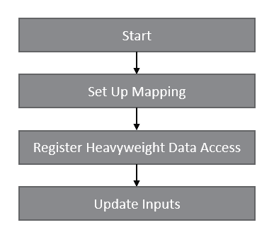

# Standalone mapping

## Steps to perform mapping

This section describes the mapping workflow. It also provides
simple APIs implementation examples.
The details of the mapping algorithms can be found in the System Coupling User's Guide.

The steps involved in setting up and executing mapping of data are shown in
Figure 1 and described in more details below.

  
_Figure 1: Sequence of steps to execute mapping_

The steps are described in more detail below. A couple of code examples for each target
language is provided at the end of this section.

### Step 1: Start

Start by initializing the participant library in standalone mode.

If using C++ or Python languages, this step involves instantiating
the `SystemCoupling` class (there can only be a single instance
of this class at a time) after providing the `ParticipantInfo`
structure with appropriate value set correctly.

If using C or Fortran languages, in
most cases nothing needs to be done for this step.
However, if distributed parallel capabilities of the SCP are required,
then `syscStartStandaloneParallel` function
in C or `syscStartStandaloneF` function in Fortran must be called
and appropriate arguments (for example, the MPI communicator) should be provided to those functions.

See [Execution in a Parallel Environment](09_ParallelExecution.md) for more details.

#### Mapping across multiple applications

See [Steps to perform data transfers](participant-steps-for-data-transfers.md) for details on
how to establish communication between multiple applications using SCP library.

### Step 2: Set up mapping

Create and register variables, regions and coupling interfaces.

### Step 3: Register heavyweight data access

In this step, the callback functions to access the participant's mesh
and solution data must be registered.
See [Access to heavyweight data](heavyweight-data-access.md) for more details.

### Step 4: Update inputs

During this step, mapping will be performed, and inputs (target values) will
be brought up-to-date.
The latest output (source) values on the source side of the interface will be
used to fill the inputs.

Inputs update can be performed multiple times. If the source values change, this will
be reflected in the target values.

## Mapping examples

Sample code is provided, demonstrating the use of the participant
library APIs to perform mapping.

- [Surface mapping example](#surface-mapping-example)
- [Volume mapping example](#volume-mapping-example)

For information on how to compile the code in these examples,
see [Compiling, linking, and executing applications that use the Participant library](compiling-linking-executing.md).

### Surface mapping example

In this example, the solution data is mapped between two surface regions.
The mesh in each region consists of a single (unit square) quadrilateral element.
The variable to be transferred from source to target is a scalar defined on
elements. The variable is set to be extensive, although the choice of whether
the variable is extensive or intensive is insignificant here, since the meshes are conformal.

The value on the source element is set to `33.3`. Since the meshes are identical
on source and target, the expected result of mapping is that the target value
also becomes `33.3`.

Figure 2 illustrates the problem setup.

  
_Figure 2: Simple surface mapping example_

#### C++

```cpp
#include "SystemCouplingParticipant/SystemCoupling.hpp"
#include <vector>
#include <iostream>

// Mesh and solution data arrays.
std::vector<double> nodeCoordsSrc = {0, 0, 0, 1, 0, 0, 1, 1, 0, 0, 1, 0};
std::vector<int> elemNodeCountsSrc = {4};
std::vector<int> elemNodeIdsSrc = {1, 2, 3, 4};

std::vector<double> nodeCoordsTrg = {0, 0, 0, 1, 0, 0, 1, 1, 0, 0, 1, 0};
std::vector<int> elemNodeCountsTrg = {4};
std::vector<int> elemNodeIdsTrg = {5, 6, 7, 8};

std::vector<double> elemDataSrc = {33.3};
std::vector<double> elemDataTrg = {0};

// Data access function to get mesh.
sysc::SurfaceMesh getSurfaceMesh(const std::string& regionName)
{
  if (regionName == "source") {
    return sysc::SurfaceMesh(
      sysc::NodeData(nodeCoordsSrc),
      sysc::ElementNodeCountData(elemNodeCountsSrc),
      sysc::ElementNodeConnectivityData(elemNodeIdsSrc));
  }
  else {
    return sysc::SurfaceMesh(
      sysc::NodeData(nodeCoordsTrg),
      sysc::ElementNodeCountData(elemNodeCountsTrg),
      sysc::ElementNodeConnectivityData(elemNodeIdsTrg));
  }
}

// Data access function to get input scalar data.
sysc::InputScalarData getInputScalar(
  const std::string& regionName, const std::string& variableName)
{
  return sysc::InputScalarData(elemDataTrg);
}

// Data access function to get output scalar data.
sysc::OutputScalarData getOutputScalar(
  const std::string& regionName, const std::string& variableName)
{
  return sysc::OutputScalarData(elemDataSrc);
}

// Main function.
int main(int argc, char* argv[])
{
  // Start.
  sysc::SystemCoupling sc;

  // Setup mapping.
  sysc::Variable variable("variable", sysc::Scalar, true, sysc::Element);
  sysc::Region sourceRegion("source", sysc::Surface);
  sysc::Region targetRegion("target", sysc::Surface);
  sysc::CouplingInterface couplingInterface("interface");

  sourceRegion.addOutputVariable(variable);
  targetRegion.addInputVariable(variable);
  couplingInterface.addSideOneRegion(sourceRegion);
  couplingInterface.addSideTwoRegion(targetRegion);
  sc.addCouplingInterface(couplingInterface);

  // Heavyweight data access registration.
  sc.registerSurfaceMeshAccess(&getSurfaceMesh);
  sc.registerInputScalarDataAccess(&getInputScalar);
  sc.registerOutputScalarDataAccess(&getOutputScalar);

  std::cout << "Target value before mapping: " << elemDataTrg[0] << '\n';

  // Inputs update.
  sc.updateInputs();

  std::cout << "Target value after mapping: " << elemDataTrg[0] << '\n';

  return 0;
}
```

If the participant is 2D, the surface mesh is defined on a two-dimensional plane.
Thus, 2D vector data can be used to express nodal coordinates.
The above code can be modified as follows:

```cpp
// third component with value of 0 can be remove from nodeCoord vector
std::vector<double> nodeCoordsSrc = {0, 0, 1, 0, 1, 1, 0, 1};
std::vector<double> nodeCoordsTrg = {0, 0, 1, 0, 1, 1, 0, 1};

sysc::SurfaceMesh getSurfaceMesh(const std::string& regionName)
{
  if (regionName == "source") {
    return sysc::SurfaceMesh(
      //dimension must be supplied with Dimension::D2 value
      sysc::NodeData(nodeCoordsSrc,sysc::Dimension::D2),
      sysc::ElementNodeCountData(elemNodeCountsSrc),
      sysc::ElementNodeConnectivityData(elemNodeIdsSrc));
  }
  else {
    return sysc::SurfaceMesh(
      sysc::NodeData(nodeCoordsTrg,sysc::Dimension::D2),
      sysc::ElementNodeCountData(elemNodeCountsTrg),
      sysc::ElementNodeConnectivityData(elemNodeIdsTrg));
  }
}
//the rest of the code stays unchanged
```

#### C

```c
#include "SystemCouplingParticipant/syscSystemCoupling.h"

#include <stdio.h>
#include <stdlib.h>
#include <string.h>

/* Mesh and solution data arrays. */
double nodeCoordsSrc[] = {0, 0, 0, 1, 0, 0, 1, 1, 0, 0, 1, 0};
int elemNodeCountsSrc[] = {4};
int elemNodeIdsSrc[] = {1, 2, 3, 4};

double nodeCoordsTrg[] = {0, 0, 0, 1, 0, 0, 1, 1, 0, 0, 1, 0};
int elemNodeCountsTrg[] = {4};
int elemNodeIdsTrg[] = {5, 6, 7, 8};

size_t numNodes = 4;
size_t numElems = 1;
size_t numElemNodeIds = 4;

double elemDataSrc[] = {33.3};
double elemDataTrg[] = {0};

/* Data access function to get mesh. */
SyscSurfaceMesh getSurfaceMesh(const char* regionName)
{
  if (strcmp(regionName, "source") == 0) {
    SyscOutputVectorData nodeCoordsData = syscGetOutputVectorDataCompactDouble(
      &nodeCoordsSrc[0], numNodes);
    SyscOutputIntegerData elemNodeCountsData = syscGetOutputIntegerDataInt32(
      &elemNodeCountsSrc[0], numElems);
    SyscOutputIntegerData elemNodeIdsData = syscGetOutputIntegerDataInt32(
      &elemNodeIdsSrc[0], numElemNodeIds);
    return syscGetSurfaceMeshNCI(
        syscGetNodeDataC(nodeCoordsData),
        syscGetElementNodeCountData(elemNodeCountsData),
        syscGetElementNodeConnectivityData(elemNodeIdsData));
  }
  else {
    SyscOutputVectorData nodeCoordsData = syscGetOutputVectorDataCompactDouble(
      &nodeCoordsTrg[0], numNodes);
    SyscOutputIntegerData elemNodeCountsData = syscGetOutputIntegerDataInt32(
      &elemNodeCountsTrg[0], numElems);
    SyscOutputIntegerData elemNodeIdsData = syscGetOutputIntegerDataInt32(
      &elemNodeIdsTrg[0], numElemNodeIds);
    return syscGetSurfaceMeshNCI(
        syscGetNodeDataC(nodeCoordsData),
        syscGetElementNodeCountData(elemNodeCountsData),
        syscGetElementNodeConnectivityData(elemNodeIdsData));
  }
}

/* Data access function to get input scalar data. */
SyscInputScalarData getInputScalar(
  const char* regionName, const char* variableName)
{
  return syscGetInputScalarDataDouble(&elemDataTrg[0], numElems);
}

/* Data access function to get input scalar data. */
SyscOutputScalarData getOutputScalar(
  const char* regionName, const char* variableName)
{
  return syscGetOutputScalarDataDouble(&elemDataSrc[0], numElems);
}

/* Main function. */
int main(int argc, char* argv[])
{
  /* Setup mapping. */
  SyscVariable variable = syscGetVariableTE("variable", SyscScalar, 1, SyscElement);
  SyscRegion sourceRegion = syscGetRegionT("source", SyscSurface);
  SyscRegion targetRegion = syscGetRegionT("target", SyscSurface);
  SyscCouplingInterface couplingInterface = syscGetCouplingInterface("interface");

  syscAddOutputVariable(sourceRegion, variable);
  syscAddInputVariable(targetRegion, variable);

  syscAddSideOneRegion(couplingInterface, sourceRegion);
  syscAddSideTwoRegion(couplingInterface, targetRegion);

  syscAddCouplingInterface(couplingInterface);

  /* Heavyweight data access registration. */
  syscRegisterSurfMeshAccess(&getSurfaceMesh);
  syscRegisterInputScalarDataAccess(&getInputScalar);
  syscRegisterOutputScalarDataAccess(&getOutputScalar);
  
  printf("Target value before mapping: %f\n", elemDataTrg[0]);
  
  /* Inputs update. */
  syscUpdateInputs();

  printf("Target value after mapping: %f\n", elemDataTrg[0]);

  return 0;
}
```

If the participant is 2D, the surface mesh is defined on a two-dimensional plane.
Thus, 2D vector data can be used to express nodal coordinates.
The above code can be modified as follows:

```c
// third component with value of 0 can be remove from nodeCoord vector
double nodeCoordsSrc[] = {0, 0, 1, 0, 1, 1, 0, 1};
double nodeCoordsTrg[] = {0, 0, 1, 0, 1, 1, 0, 1};

SyscSurfaceMesh getSurfaceMesh(const char* regionName)
{
  if (strcmp(regionName, "source") == 0) {
     //dimension must be supplied with SyscD2 value
    SyscOutputVectorData nodeCoordsData = syscGetOutputVectorDataCompactDoubleDim(
      &nodeCoordsSrc[0], numNodes, SyscD2);
    SyscOutputIntegerData elemNodeCountsData = syscGetOutputIntegerDataInt32(
      &elemNodeCountsSrc[0], numElems);
    SyscOutputIntegerData elemNodeIdsData = syscGetOutputIntegerDataInt32(
      &elemNodeIdsSrc[0], numElemNodeIds);
    return syscGetSurfaceMeshNCI(
        syscGetNodeDataC(nodeCoordsData),
        syscGetElementNodeCountData(elemNodeCountsData),
        syscGetElementNodeConnectivityData(elemNodeIdsData));
  }
  else {
    SyscOutputVectorData nodeCoordsData = syscGetOutputVectorDataCompactDoubleDim(
      &nodeCoordsTrg[0], numNodes, SyscD2);
    SyscOutputIntegerData elemNodeCountsData = syscGetOutputIntegerDataInt32(
      &elemNodeCountsTrg[0], numElems);
    SyscOutputIntegerData elemNodeIdsData = syscGetOutputIntegerDataInt32(
      &elemNodeIdsTrg[0], numElemNodeIds);
    return syscGetSurfaceMeshNCI(
        syscGetNodeDataC(nodeCoordsData),
        syscGetElementNodeCountData(elemNodeCountsData),
        syscGetElementNodeConnectivityData(elemNodeIdsData));
  }
}
//the rest of the code stays unchanged
```

#### Fortran

```fortran
program simpleMapping

implicit none
include 'syscSystemCouplingF.fi'

! Mesh and solution data arrays.
real(kind=8), target :: nodeCoordsSrc(12) = &
  (/ 0D0, 0D0, 0D0, 1D0, 0D0, 0D0, 1D0, 1D0, 0D0, 0D0, 1D0, 0D0 /)
integer(kind=4), target :: elemNodeCountsSrc(1) = 4
integer(kind=4), target :: elemNodeIdsSrc(4) = (/ 1, 2, 3, 4 /)

real(kind=8), target :: nodeCoordsTrg(12) = &
  (/ 0D0, 0D0, 0D0, 1D0, 0D0, 0D0, 1D0, 1D0, 0D0, 0D0, 1D0, 0D0 /)
integer(kind=4), target :: elemNodeCountsTrg(1) = 4
integer(kind=4), target :: elemNodeIdsTrg(4) = (/ 5, 6, 7, 8 /)

real(kind=8), target :: elemDataSrc(1) = 33.3D0
real(kind=8), target :: elemDataTrg(1) = 0D0

integer(kind=8) :: numNodes = 4
integer(kind=8) :: numElems = 1
integer(kind=8) :: numElemNodeIds = 4

type(SyscErrorF) :: ret
type(SyscVariableF) :: variable
type(SyscRegionF) :: sourceRegion
type(SyscRegionF) :: targetRegion
type(SyscCouplingInterfaceF) :: couplingInterface

! Setup mapping.
variable = syscGetVariableF(&
  "variable", SyscScalar, .TRUE., SyscElement)
sourceRegion = syscGetRegionF("source", SyscSurface)
targetRegion = syscGetRegionF("target", SyscSurface)
couplingInterface = syscGetCouplingInterfaceF("interface")

ret = syscAddOutputVariableF(sourceRegion, variable)
ret = syscAddInputVariableF(targetRegion, variable)
ret = syscAddSideOneRegionF(couplingInterface, sourceRegion)
ret = syscAddSideTwoRegionF(couplingInterface, targetRegion)
ret = syscAddCouplingInterfaceF(couplingInterface)

! Heavyweight data access registration.
ret = syscRegisterSurfMeshAccessF(getSurfaceMesh)
ret = syscRegisterInputScalarDataAccessF(getInputScalar)
ret = syscRegisterOutputScalarDataAccessF(getOutputScalar)

write(*, *) "Target value before mapping: ", elemDataTrg(1)

! Inputs update.
ret = syscUpdateInputsF()

write(*, *) "Target value after mapping: ", elemDataTrg(1)

contains

  ! Data access function to get mesh.
  function getSurfaceMesh(regionName) result(ret)
    character(len=SyscStrLen), intent(in) :: regionName
    type(SyscOutputVectorDataF) :: nodeCoords
    type(SyscOutputIntegerDataF) :: elemNodeCounts
    type(SyscOutputIntegerDataF) :: elemNodeIds
    type(SyscSurfaceMeshF) :: ret
    if (regionName .eq. "source") then
      nodeCoords = syscGetOutputVectorDataCompactF(&
        nodeCoordsSrc, numNodes)
      elemNodeCounts = syscGetOutputIntegerDataF(&
        elemNodeCountsSrc, numElems)
      elemNodeIds = syscGetOutputIntegerDataF(&
        elemNodeIdsSrc, numElemNodeIds)
    else
      nodeCoords = syscGetOutputVectorDataCompactF(&
        nodeCoordsTrg, numNodes)
      elemNodeCounts = syscGetOutputIntegerDataF(&
        elemNodeCountsTrg, numElems)
      elemNodeIds = syscGetOutputIntegerDataF(&
        elemNodeIdsTrg, numElemNodeIds)
    endif
    ret = syscGetSurfaceMeshF(&
      syscGetNodeDataF(nodeCoords),&
      syscGetElementNodeCountDataF(elemNodeCounts),&
      syscGetElementNodeConnectivityDataF(elemNodeIds))
  end function getSurfaceMesh

  ! Data access function to get input scalar data.
  function getInputScalar(regionName, variableName) result(ret)
    character(len=SyscStrLen), intent(in) :: regionName
    character(len=SyscStrLen), intent(in) :: variableName
    type(SyscInputScalarDataF) :: ret
    ret = syscGetInputScalarDataF(elemDataTrg, numElems)
  end function getInputScalar

  ! Data access function to get output scalar data.
  function getOutputScalar(regionName, variableName) result(ret)
    character(len=SyscStrLen), intent(in) :: regionName
    character(len=SyscStrLen), intent(in) :: variableName
    type(SyscOutputScalarDataF) :: ret
    ret = syscGetOutputScalarDataF(elemDataSrc, numElems)
  end function getOutputScalar

end program simpleMapping
```

If the participant is 2D, the surface mesh is defined on a two-dimensional plane.
Thus, 2D vector data can be used to express nodal coordinates.
The above code can be modified as follows:

```fortran
  !third component with value of 0 can be remove from nodeCoord vector
  real(kind=8), target :: nodeCoordsSrc(12) = &
    (/ 0D0, 0D0, 1D0, 0D0, 1D0, 1D0, 0D0, 1D0 /)
  real(kind=8), target :: nodeCoordsTrg(12) = &
    (/ 0D0, 0D0, 1D0, 0D0, 1D0, 1D0, 0D0, 1D0 /)

  function getSurfaceMesh(regionName) result(ret)
    character(len=SyscStrLen), intent(in) :: regionName
    type(SyscOutputVectorDataF) :: nodeCoords
    type(SyscOutputIntegerDataF) :: elemNodeCounts
    type(SyscOutputIntegerDataF) :: elemNodeIds
    type(SyscSurfaceMeshF) :: ret
    if (regionName .eq. "source") then
     !dimension must be supplied with SyscD2 value
      nodeCoords = syscGetOutputVectorDataCompactDimF(&
        nodeCoordsSrc, numNodes. SyscD2)
      elemNodeCounts = syscGetOutputIntegerDataF(&
        elemNodeCountsSrc, numElems)
      elemNodeIds = syscGetOutputIntegerDataF(&
        elemNodeIdsSrc, numElemNodeIds)
    else
      nodeCoords = syscGetOutputVectorDataCompactDimF(&
        nodeCoordsTrg, numNodes, SyscD2)
      elemNodeCounts = syscGetOutputIntegerDataF(&
        elemNodeCountsTrg, numElems)
      elemNodeIds = syscGetOutputIntegerDataF(&
        elemNodeIdsTrg, numElemNodeIds)
    endif
    ret = syscGetSurfaceMeshF(&
      syscGetNodeDataF(nodeCoords),&
      syscGetElementNodeCountDataF(elemNodeCounts),&
      syscGetElementNodeConnectivityDataF(elemNodeIds))
  end function getSurfaceMesh
  !the rest of the code stays unchanged
```

#### Python

```python
from pyExt import SystemCouplingParticipant as sysc
import numpy as np

# Mesh and solution data arrays.
nodeCoordsSrc = np.array(
    [0, 0, 0, 1, 0, 0, 1, 1, 0, 0, 1, 0], dtype = np.float64)
elemNodeCountsSrc = np.array([4], dtype = np.int32)
elemNodeIdsSrc = np.array([1, 2, 3, 4], dtype = np.int32)

nodeCoordsTrg = np.array(
    [0, 0, 0, 1, 0, 0, 1, 1, 0, 0, 1, 0], dtype = np.float64)
elemNodeCountsTrg = np.array([4], dtype = np.int32)
elemNodeIdsTrg = np.array([5, 6, 7, 8], dtype = np.int32)

elemDataSrc = np.array([33.3], dtype = np.float64)
elemDataTrg = np.array([0], dtype = np.float64)

# Data access function to get mesh.
def getSurfaceMesh(regionName):
    if regionName == "source":
        ncs = sysc.OutputVectorData(nodeCoordsSrc)
        encs= sysc.OutputScalarData(elemNodeCountsSrc)
        enis= sysc.OutputScalarData(elemNodeIdsSrc)
        return sysc.SurfaceMesh(ncs, encs, enis)
    else:
        ncs = sysc.OutputVectorData(nodeCoordsTrg)
        encs= sysc.OutputScalarData(elemNodeCountsTrg)
        enis= sysc.OutputScalarData(elemNodeIdsTrg)
        return sysc.SurfaceMesh(ncs, encs, enis)

# Data access function to get input scalar data.
def getInputScalar(regionName, variableName):
    return sysc.InputScalarData(elemDataTrg)

# Data access function to get output scalar data.
def getOutputScalar(regionName, variableName):
    return sysc.OutputScalarData(elemDataSrc)

# Start.
sc = sysc.SystemCoupling()

# Setup mapping.
variable = sysc.Variable("variable", sysc.Scalar, True, sysc.Element)
sourceRegion = sysc.Region("source", sysc.Surface)
targetRegion = sysc.Region("target", sysc.Surface)
couplingInterface = sysc.CouplingInterface("interface")

sourceRegion.addOutputVariable(variable)
targetRegion.addInputVariable(variable)
couplingInterface.addSideOneRegion(sourceRegion)
couplingInterface.addSideTwoRegion(targetRegion)
sc.addCouplingInterface(couplingInterface)

# Heavyweight data access registration.
sc.registerSurfaceMeshAccess(getSurfaceMesh)
sc.registerInputScalarDataAccess(getInputScalar)
sc.registerOutputScalarDataAccess(getOutputScalar)

print(f"Target value before mapping: {elemDataTrg[0]}\n")

# Inputs update.
sc.updateInputs()

print(f"Target value after mapping: {elemDataTrg[0]}\n")
```

If the participant is 2D, the surface mesh is defined on a two-dimensional plane.
Thus, 2D vector data can be used to express nodal coordinates.
The above code can be modified as follows:

```python
#third component with value of 0 can be remove from nodeCoord vector
nodeCoordsSrc = np.array(
    [0, 0, 1, 0, 1, 1, 0, 1], dtype = np.float64)
nodeCoordsTrg = np.array(
    [0, 0, 1, 0, 1, 1, 0, 1], dtype = np.float64)

def getSurfaceMesh(regionName):
    if regionName == "source":
     #when using vector data constructor involving dimension, keyword parameter must be supplied
     #keyword parameter data and dimension must be supplied with nodeCoordsSrc and sysc.Dimension_D2 value
        ncs = sysc.OutputVectorData(data=nodeCoordsSrc,dimension=sysc.Dimension_D2)
        encs= sysc.OutputScalarData(elemNodeCountsSrc)
        enis= sysc.OutputScalarData(elemNodeIdsSrc)
        return sysc.SurfaceMesh(ncs, encs, enis)
    else:
        ncs = sysc.OutputVectorData(data=nodeCoordsTrg,dimension=sysc.Dimension_D2)
        encs= sysc.OutputScalarData(elemNodeCountsTrg)
        enis= sysc.OutputScalarData(elemNodeIdsTrg)
        return sysc.SurfaceMesh(ncs, encs, enis)
#the rest of the code stays unchanged
```

### Volume mapping example

In this example, the solution data is mapped between two volume regions.
The mesh in each region consists of a single (unit cube) hexahedral element.
The variable to be transferred from source to target is a scalar defined on
nodes. The variable is set to be intensive.

The values on the source element are set to `33.3`. Since the meshes are identical
on source and target, the expected result of mapping is that the target values
also become `33.3`.

Figure 3 illustrates the problem setup.

  
_Figure 3: Simple volume mapping example_

#### C++

```cpp
#include "SystemCouplingParticipant/SystemCoupling.hpp"
#include <vector>
#include <iostream>

// Mesh and solution data arrays.
std::vector<double> nodeCoordsSrc = {
  0, 0, 0,
  1, 0, 0,
  0, 1, 0,
  1, 1, 0,
  0, 0, 1,
  1, 0, 1,
  0, 1, 1,
  1, 1, 1};

std::vector<int> cellTypesSrc = {static_cast<int>(sysc::ElementTypes::Hex8)};

std::vector<int> cellNodeIdsSrc = {5, 6, 2, 1, 7, 8, 4, 3};

std::vector<double> nodeCoordsTrg = {
  0, 0, 0,
  1, 0, 0,
  0, 1, 0,
  1, 1, 0,
  0, 0, 1,
  1, 0, 1,
  0, 1, 1,
  1, 1, 1};

std::vector<int> cellTypesTrg = {static_cast<int>(sysc::ElementTypes::Hex8)};

std::vector<int> cellNodeIdsTrg = {13, 14, 10, 9, 15, 16, 12, 11};

std::vector<double> nodalDataSrc(8, 33.3);
std::vector<double> nodalDataTrg(8, 0.0);

// Data access function to get mesh.
sysc::VolumeMesh getVolumeMesh(const std::string& regionName)
{
  if (regionName == "source") {
    return sysc::VolumeMesh(
      sysc::NodeData(nodeCoordsSrc),
      sysc::ElementTypeData(cellTypesSrc),
      sysc::ElementNodeConnectivityData(cellNodeIdsSrc));
  }
  else {
    return sysc::VolumeMesh(
      sysc::NodeData(nodeCoordsTrg),
      sysc::ElementTypeData(cellTypesTrg),
      sysc::ElementNodeConnectivityData(cellNodeIdsTrg));
  }
}

// Data access function to get input scalar data.
sysc::InputScalarData getInputScalar(
  const std::string& regionName, const std::string& variableName)
{
  return sysc::InputScalarData(nodalDataTrg);
}

// Data access function to get output scalar data.
sysc::OutputScalarData getOutputScalar(
  const std::string& regionName, const std::string& variableName)
{
  return sysc::OutputScalarData(nodalDataSrc);
}

// Main function.
int main(int argc, char* argv[])
{
  // Start.
  sysc::SystemCoupling sc;

  // Setup mapping.
  sysc::Variable variable("variable", sysc::Scalar, false, sysc::Node);
  sysc::Region sourceRegion("source", sysc::Volume);
  sysc::Region targetRegion("target", sysc::Volume);
  sysc::CouplingInterface couplingInterface("interface");

  sourceRegion.addOutputVariable(variable);
  targetRegion.addInputVariable(variable);
  couplingInterface.addSideOneRegion(sourceRegion);
  couplingInterface.addSideTwoRegion(targetRegion);
  sc.addCouplingInterface(couplingInterface);

  // Heavyweight data access registration.
  sc.registerVolumeMeshAccess(&getVolumeMesh);
  sc.registerInputScalarDataAccess(&getInputScalar);
  sc.registerOutputScalarDataAccess(&getOutputScalar);

  std::cout << "First target value before mapping: " << nodalDataTrg[0] << '\n';

  // Inputs update.
  sc.updateInputs();

  std::cout << "First target value after mapping: " << nodalDataTrg[0] << '\n';

  return EXIT_SUCCESS;
}
```

#### C

```c
#include "SystemCouplingParticipant/syscSystemCoupling.h"

#include <stdio.h>
#include <stdlib.h>
#include <string.h>

/* Mesh and solution data arrays. */
double nodeCoordsSrc[] = {
  0, 0, 0,
  1, 0, 0,
  0, 1, 0,
  1, 1, 0,
  0, 0, 1,
  1, 0, 1,
  0, 1, 1,
  1, 1, 1};

int cellTypesSrc[] = {SyscHex8};

int cellNodeIdsSrc[] = {5, 6, 2, 1, 7, 8, 4, 3};

double nodeCoordsTrg[] = {
  0, 0, 0,
  1, 0, 0,
  0, 1, 0,
  1, 1, 0,
  0, 0, 1,
  1, 0, 1,
  0, 1, 1,
  1, 1, 1};

int cellTypesTrg[] = {SyscHex8};

int cellNodeIdsTrg[] = {13, 14, 10, 9, 15, 16, 12, 11};

size_t numNodes = 8;
size_t numCellNodeIds = 8;
size_t numCells = 1;

double nodeDataSrc[] = {33.3, 33.3, 33.3, 33.3, 33.3, 33.3, 33.3, 33.3};
double nodeDataTrg[] = {0, 0, 0, 0, 0, 0, 0, 0};

/* Data access function to get mesh. */
SyscVolumeMesh getVolumeMesh(const char* regionName)
{
  if (strcmp(regionName, "source") == 0) {
    SyscOutputVectorData nodeCoordsData = syscGetOutputVectorDataCompactDouble(
      &nodeCoordsSrc[0], numNodes);
    SyscOutputIntegerData cellTypesData = syscGetOutputIntegerDataInt32(
      &cellTypesSrc[0], numCells);
    SyscOutputIntegerData cellNodeIdsData = syscGetOutputIntegerDataInt32(
      &cellNodeIdsSrc[0], numCellNodeIds);
    return syscGetVolumeMeshElementBased(
        syscGetNodeDataC(nodeCoordsData),
        syscGetElementTypeData(cellTypesData),
        syscGetElementNodeConnectivityData(cellNodeIdsData));
  }
  else {
    SyscOutputVectorData nodeCoordsData = syscGetOutputVectorDataCompactDouble(
      &nodeCoordsTrg[0], numNodes);
    SyscOutputIntegerData cellTypesData = syscGetOutputIntegerDataInt32(
      &cellTypesTrg[0], numCells);
    SyscOutputIntegerData cellNodeIdsData = syscGetOutputIntegerDataInt32(
      &cellNodeIdsTrg[0], numCellNodeIds);
    return syscGetVolumeMeshElementBased(
        syscGetNodeDataC(nodeCoordsData),
        syscGetElementTypeData(cellTypesData),
        syscGetElementNodeConnectivityData(cellNodeIdsData));
  }
}

/* Data access function to get input scalar data. */
SyscInputScalarData getInputScalar(
  const char* regionName, const char* variableName)
{
  return syscGetInputScalarDataDouble(&nodeDataTrg[0], numNodes);
}

/* Data access function to get input scalar data. */
SyscOutputScalarData getOutputScalar(
  const char* regionName, const char* variableName)
{
  return syscGetOutputScalarDataDouble(&nodeDataSrc[0], numNodes);
}

/* Main function. */
int main(int argc, char* argv[])
{
  /* Setup mapping. */
  SyscVariable variable = syscGetVariableTE("variable", SyscScalar, 0, SyscNode);
  SyscRegion sourceRegion = syscGetRegionT("source", SyscVolume);
  SyscRegion targetRegion = syscGetRegionT("target", SyscVolume);
  SyscCouplingInterface couplingInterface = syscGetCouplingInterface("interface");

  syscAddOutputVariable(sourceRegion, variable);
  syscAddInputVariable(targetRegion, variable);

  syscAddSideOneRegion(couplingInterface, sourceRegion);
  syscAddSideTwoRegion(couplingInterface, targetRegion);

  syscAddCouplingInterface(couplingInterface);

  /* Heavyweight data access registration. */
  syscRegisterVolumeMeshAccess(&getVolumeMesh);
  syscRegisterInputScalarDataAccess(&getInputScalar);
  syscRegisterOutputScalarDataAccess(&getOutputScalar);
  
  printf("First target value before mapping: %f\n", nodeDataTrg[0]);
  
  /* Inputs update. */
  syscUpdateInputs();

  printf("First target value after mapping: %f\n", nodeDataTrg[0]);

  return EXIT_SUCCESS;
}
```

#### Fortran

```fortran
program simpleVolumeMapping

implicit none
include 'syscSystemCouplingF.fi'

! Mesh and solution data arrays.
real(kind=8), target :: nodeCoordsSrc(24) = (/ &
  0D0, 0D0, 0D0, &
  1D0, 0D0, 0D0, &
  0D0, 1D0, 0D0, &
  1D0, 1D0, 0D0, &
  0D0, 0D0, 1D0, &
  1D0, 0D0, 1D0, &
  0D0, 1D0, 1D0, &
  1D0, 1D0, 1D0 /)
integer(kind=4), target :: cellTypesSrc(1) = SyscHex8
integer(kind=4), target :: cellNodeIdsSrc(8) = (/ &
  5, 6, 2, 1, 7, 8, 4, 3 /)

real(kind=8), target :: nodeCoordsTrg(24) = (/ &
  0D0, 0D0, 0D0, &
  1D0, 0D0, 0D0, &
  0D0, 1D0, 0D0, &
  1D0, 1D0, 0D0, &
  0D0, 0D0, 1D0, &
  1D0, 0D0, 1D0, &
  0D0, 1D0, 1D0, &
  1D0, 1D0, 1D0 /)

integer(kind=4), target :: cellTypesTrg(1) = SyscHex8
integer(kind=4), target :: cellNodeIdsTrg(8) = (/ &
  13, 14, 10, 9, 15, 16, 12, 11 /)

real(kind=8), target :: nodeDataSrc(8) = 33.3D0
real(kind=8), target :: nodeDataTrg(8) = 0D0

integer(kind=8) :: numNodes = 8
integer(kind=8) :: numCellNodeIds = 8
integer(kind=8) :: numCells = 1

type(SyscErrorF) :: ret
type(SyscVariableF) :: variable
type(SyscRegionF) :: sourceRegion
type(SyscRegionF) :: targetRegion
type(SyscCouplingInterfaceF) :: couplingInterface

! Setup mapping.
variable = syscGetVariableF("variable", SyscScalar, .FALSE., SyscNode)
sourceRegion = syscGetRegionF("source", SyscVolume)
targetRegion = syscGetRegionF("target", SyscVolume)
couplingInterface = syscGetCouplingInterfaceF("interface")

ret = syscAddOutputVariableF(sourceRegion, variable)
ret = syscAddInputVariableF(targetRegion, variable)
ret = syscAddSideOneRegionF(couplingInterface, sourceRegion)
ret = syscAddSideTwoRegionF(couplingInterface, targetRegion)
ret = syscAddCouplingInterfaceF(couplingInterface)

! Heavyweight data access registration.
ret = syscRegisterVolumeMeshAccessF(getVolumeMesh)
ret = syscRegisterInputScalarDataAccessF(getInputScalar)
ret = syscRegisterOutputScalarDataAccessF(getOutputScalar)

write(*, *) "First target value before mapping: ", nodeDataTrg(1)

! Inputs update.
ret = syscUpdateInputsF()

write(*, *) "First target value after mapping: ", nodeDataTrg(1)

contains

  ! Data access function to get mesh.
  function getVolumeMesh(regionName) result(ret)
    character(len=SyscStrLen), intent(in) :: regionName
    type(SyscOutputVectorDataF) :: nodeCoordsData
    type(SyscOutputIntegerDataF) :: cellTypesData
    type(SyscOutputIntegerDataF) :: cellNodeIdsData
    type(SyscVolumeMeshF) :: ret
    if (regionName .eq. "source") then
      nodeCoordsData = syscGetOutputVectorDataCompactF(&
        nodeCoordsSrc, numNodes)
        cellTypesData = syscGetOutputIntegerDataF(&
        cellTypesSrc, numCells)
      cellNodeIdsData = syscGetOutputIntegerDataF(&
        cellNodeIdsSrc, numCellNodeIds)
    else
      nodeCoordsData = syscGetOutputVectorDataCompactF(&
        nodeCoordsTrg, numNodes)
        cellTypesData = syscGetOutputIntegerDataF(&
        cellTypesTrg, numCells)
      cellNodeIdsData = syscGetOutputIntegerDataF(&
        cellNodeIdsTrg, numCellNodeIds)
    endif
    ret = syscGetVolumeMeshF(&
      syscGetNodeDataF(nodeCoordsData),&
      syscGetElementTypeDataF(cellTypesData),&
      syscGetElementNodeConnectivityDataF(cellNodeIdsData))
  end function getVolumeMesh

  ! Data access function to get input scalar data.
  function getInputScalar(regionName, variableName) result(ret)
    character(len=SyscStrLen), intent(in) :: regionName
    character(len=SyscStrLen), intent(in) :: variableName
    type(SyscInputScalarDataF) :: ret
    ret = syscGetInputScalarDataF(nodeDataTrg, numNodes)
  end function getInputScalar

  ! Data access function to get output scalar data.
  function getOutputScalar(regionName, variableName) result(ret)
    character(len=SyscStrLen), intent(in) :: regionName
    character(len=SyscStrLen), intent(in) :: variableName
    type(SyscOutputScalarDataF) :: ret
    ret = syscGetOutputScalarDataF(nodeDataSrc, numNodes)
  end function getOutputScalar

end program simpleVolumeMapping
```

#### Python

```python
from pyExt import SystemCouplingParticipant as sysc
import numpy as np

# Mesh and solution data arrays.

nodeCoordsSrc = np.array([
    0, 0, 0,
    1, 0, 0,
    0, 1, 0,
    1, 1, 0,
    0, 0, 1,
    1, 0, 1,
    0, 1, 1,
    1, 1, 1], dtype = np.float64)

cellTypesSrc = np.array([sysc.ElementTypes.Hex8], dtype = np.int32)

cellNodeIdsSrc = np.array([5, 6, 2, 1, 7, 8, 4, 3], dtype = np.int32)

nodeCoordsTrg = np.array([
    0, 0, 0,
    1, 0, 0,
    0, 1, 0,
    1, 1, 0,
    0, 0, 1,
    1, 0, 1,
    0, 1, 1,
    1, 1, 1], dtype = np.float64)

cellTypesTrg = np.array([sysc.ElementTypes.Hex8], dtype = np.int32)

cellNodeIdsTrg = np.array([
    13, 14, 10, 9, 15, 16, 12, 11], dtype = np.int32)

nodalDataSrc = np.array([33.3] * 8, dtype = np.float64)
nodalDataTrg = np.array([0.0] * 8, dtype = np.float64)

# Data access function to get mesh.
def getVolumeMesh(regionName):
    if regionName == "source":
        ncs = sysc.OutputVectorData(nodeCoordsSrc)
        cts = sysc.OutputIntegerData(cellTypesSrc)
        cnis= sysc.OutputIntegerData(cellNodeIdsSrc)
        return sysc.VolumeMesh(
          sysc.NodeData(ncs),
          sysc.ElementTypeData(cts),
          sysc.ElementNodeConnectivityData(cnis))
    else:
        ncs = sysc.OutputVectorData(nodeCoordsTrg)
        cts = sysc.OutputIntegerData(cellTypesTrg)
        cnis= sysc.OutputIntegerData(cellNodeIdsTrg)
        return sysc.VolumeMesh(
          sysc.NodeData(ncs),
          sysc.ElementTypeData(cts),
          sysc.ElementNodeConnectivityData(cnis))

# Data access function to get input scalar data.
def getInputScalar(regionName, variableName):
    return sysc.InputScalarData(nodalDataTrg)

# Data access function to get output scalar data.
def getOutputScalar(regionName, variableName):
    return sysc.OutputScalarData(nodalDataSrc)

# Start.
sc = sysc.SystemCoupling()

# Setup mapping.
variable = sysc.Variable("variable", sysc.Scalar, False, sysc.Node)
sourceRegion = sysc.Region("source", sysc.Volume)
targetRegion = sysc.Region("target", sysc.Volume)
couplingInterface = sysc.CouplingInterface("interface")

sourceRegion.addOutputVariable(variable)
targetRegion.addInputVariable(variable)
couplingInterface.addSideOneRegion(sourceRegion)
couplingInterface.addSideTwoRegion(targetRegion)
sc.addCouplingInterface(couplingInterface)

# Heavyweight data access registration.
sc.registerVolumeMeshAccess(getVolumeMesh)
sc.registerInputScalarDataAccess(getInputScalar)
sc.registerOutputScalarDataAccess(getOutputScalar)

print(f"First target value before mapping: {nodalDataTrg[0]}")

# Inputs update.
sc.updateInputs()

print(f"First target value after mapping: {nodalDataTrg[0]}")
```
