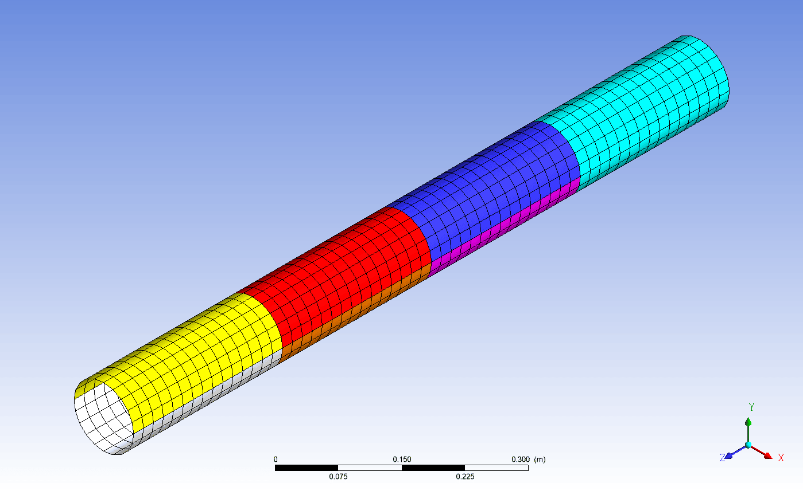
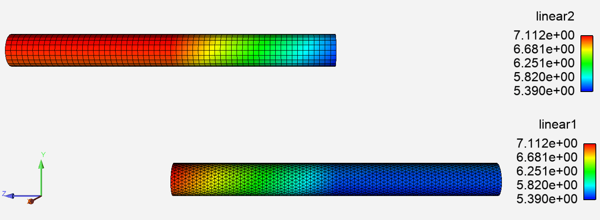

# Pipe mapping tutorial

This tutorial gives instructions on using System Coupling Participant Library
APIs to transfer data between a non-conformal mesh interface, thereby using the
participant library mapping capabilities.

The tutorial also demonstrates how to use parallel processing capabilities
within the Participant Library using an MPI environment.

## Topics covered

- Standalone mapping
- Parallel execution

## Verify prerequisites

Ensure that the following prerequisites are met. You've installed:

- A compiler for one of the [supported languages](compiling-linking-executing.md)

- Ansys installation, including System Coupling and EnSight.

## Problem description and participant setup

In this example, we transfer the data between two regions representing a
simple pipe geometry.

Each of the two regions is meshed using a different method, so that we generate
the non-conformal mesh interface. The first region, **quad**, is meshed using an
algorithm that generates mesh with quadrilateral elements. The second region,
**tri**, is meshed using an algorithm that generates mesh with trilateral
elements. The meshes with default settings are shown in _Figure 1_.

  
_Figure 1: Default pipe meshes_

On each side, we initialize the nodal
solution data with a simple linear profile $f(x,y,z) = 1x + 2y + 3z + 4$. On the **quad** region, we initialize
**linear1** variable, and on the **tri** region, we initialize the **linear2** variable.

We then use the mapping capabilities within the Participant Library to transfer
**linear1** data from **quad** to **tri** region, and also to transfer **linear2** data
from **tri** to **quad** region.

Finally, we make use of the `writeResults` API function to write the results
for further post-processing. These results can be visualized in Ansys EnSight.

## Overview of the pipe mapping program and accompanying scripts

We provide the source code to generate a simple program that:

- Generates the meshes
- Initializes the solution data
- Implements the Participant Library APIs to set up and execute the mapping
- Exports the resulting data for further post-processing

The source code for each of the supported languages is provided
with the tutorial package. A serial implementation is provided in Python,
while parallel implementations are provided in C++, C, and Fortran.

The code to generate the mesh and to initialize the solution data
is implemented in the separate file(s) and is called `PipeMeshGenerator` module.
The implementation details of how the meshes are generated can be skipped
(`initializeMesh()` and associated functions/subroutines).
Most of the System Coupling Participant Library APIs are contained
inside the main source code file (`PipeMapping.cpp`, `PipeMapping.c`,
`PipeMapping.f90`, or `PipeMapping.py`).

Several command-line arguments can be used to customize the problem.
Mesh refinement for the **quad** region can be controlled as follows:

`--quad N` (default N = 20)

where `N` is the refinement number. The pipe mesh will have `N` edges in
circumferential direction and `3*N` edges in the axial direction. An analogous
command-line argument can be used to control the refinement of the **tri**
region:

`--tri N` (default N = 30)

The quad region can be offset in the axial direction using the following
command-line argument:

`--offset Z` (default Z = 0.0)

The pipe radius for quad and tri regions can be controlled by the following
command-line arguments, respectively:

`--qradius R` (default R = 0.05)
`--tradius R` (default R = 0.05)

For the parallel implementation, the mesh is partitioned using a recursive
binary space partitioning algorithm. The pipe is recursively sub-divided in
either axial or circumferential directions, depending on which direction is longer.
_Figure 2_ demonstrates how the **quad** region is divided when 7 partitions are used.

  
_Figure 2: Sample partitioning_

After mapping, the mesh and resulting solution data can be written to the
EnSight results files for visualization. To control whether the results files
are written, use the following command-line argument:

`--write W` (W = 1 means write, W = 0 means do not write, default W = 1)

The Pipe Mapping program uses a wrapper script (`PipeMapping.bat` for Windows,
`PipeMapping.sh` for Linux), that sets up the required environment variables and
controls parallel execution. Th Pipe Mapping program that is written in Python
has different execution requirements than those written in C++, C, or Fortran,
so for Python a separate set of wrapper scripts is provided
(`PipeMappingPython.bat` for Windows, `PipeMappingPython.sh` for Linux).

More examples of how to execute the Pipe Mapping program and the accompanying
Python post-processing script are shown in subsequent sections of this tutorial.

## Get the necessary files

Download the
[SCP library tutorial package](https://github.com/ansys/DevRelPublic/raw/main/Downloads/SystemCoupling/syc_ParticipantLibrary_r2_25.zip)
and
extract it to a local directory. Inside the resulting directory, you will find a subdirectory called **PipeMapping**. This directory contains all the files needed for this tutorial. The contents of this subdirectory are:

- **src_c**:
Directory containing the C source code files:
  - `PipeMapping.c`: C Pipe Mapping program code and explanatory comments.
  - `PipeMeshGenerator.c`: The C implementation file for the Pipe Mesh Generator module.
  - `PipeMeshGenerator.h`: The C header file for the Pipe Mesh Generator module.

- **src_cpp**:
Directory containing the C++ source code files:
  - `PipeMapping.cpp`: The Pipe Mapping program C++ source code file.
  - `PipeMeshGenerator.cpp`: The C++ implementation file for the Pipe Mesh Generator module.
  - `PipeMeshGenerator.hpp`: The C++ header file for the Pipe Mesh Generator module.

- **src_fortran**:
Directory containing the Fortran source code files:
  - `PipeMapping.f90`: The Pipe Mapping program Fortran source code file.
  - `PipeMeshGenerator.f90`: The Fortran source code file for the Pipe Mesh Generator module.

- `PipeMapping`: Linux binary executable for the Pipe Mapping program.
- `PipeMapping.bat`: Windows batch script for executing the Pipe Mapping program and writing the output files.
- `PipeMapping.exe`: Windows binary executable for the Pipe Mapping program.
- `PipeMapping.py`: Python Pipe Mapping program code and explanatory comments.
- `PipeMapping.sh`: Linux shell script for executing the Pipe Mapping program and writing the output files.
- `PipeMappingPython.bat`: Windows batch script for executing the Python Pipe Mapping program and writing the output files.
- `PipeMappingPython.sh`: Linux shell script for executing the Python Pipe Mapping program and writing the output files.
- `PipeMeshGenerator.py`: The Python source code file for the Pipe Mesh Generator module.

## Build the pipe mapping program

Build the Pipe Mapping program using a compiler for one of the [supported languages](compiling-linking-executing.md).

> **Note:** _Pre-built executables are provided along with the source code, so this step is optional._
>
> **Note:** _For Python, the Pipe Mapping script does not need to be compiled, so this step can be skipped._

In the following examples, Pipe Mapping programs are built with different
configurations. The actual build steps depend on your system configuration,
compilers, and other details. For additional information, see [Compiling,
Linking, and Executing Applications That Use the Participant
Library](17_CompilingLinkingExecuting.md) in the Participant Library
_Developer's Guide_.

The following compilers were used in these examples:

- **Linux**
  - GNU (g++, gcc, and gfortran) 8.2.0
- **Windows**
  - Microsoft (R) C/C++ Optimizing Compiler Version 19.16.27040 for x64
  - Intel(R) Visual Fortran Intel(R) 64 Compiler Version 19.0.4.245

In the following examples, replace:

- `<ANSYSInstallationPath>` with the correct Ansys installation path
- `<MultiportVersion>` with the correct version of the Fluent Multiport library
- `<IntelMPIPath>` with the correct path to the Intel MPI library

### Linux

#### C++ parallel version using Intel MPI

```bash
g++ -std=c++11 -I<ANSYSInstallationPath>/SystemCoupling/runTime/linx64/include -I<IntelMPIPath>/intel64/include -L<ANSYSInstallationPath>/SystemCoupling/runTime/linx64/bin  -L<IntelMPIPath>/intel64/lib/release -L<ANSYSInstallationPath>/SystemCoupling/runTime/linx64/bin -L<ANSYSInstallationPath>/SystemCoupling/runTime/linx64/cnlauncher/fluent/fluent<MultiportVersion>/multiport/mpi_wrapper/lnamd64/stub -o PipeMapping src_cpp/PipeMeshGenerator.cpp src_cpp/PipeMapping.cpp -lSysC.SystemCouplingParticipant -lmpi -lmpi_wrapper
```

#### C parallel version using Intel MPI

```bash
gcc -I<ANSYSInstallationPath>/SystemCoupling/runTime/linx64/include -I<IntelMPIPath>/intel64/include -L<ANSYSInstallationPath>/SystemCoupling/runTime/linx64/bin  -L<IntelMPIPath>/intel64/lib/release -L<ANSYSInstallationPath>/SystemCoupling/runTime/linx64/bin -L<ANSYSInstallationPath>/SystemCoupling/runTime/linx64/cnlauncher/fluent/fluent<MultiportVersion>/multiport/mpi_wrapper/lnamd64/stub -o PipeMapping src_c/PipeMeshGenerator.c src_c/PipeMapping.c -lSysC.SystemCouplingParticipant -lmpi -lmpi_wrapper -lm
```

#### Fortran parallel version using Intel MPI

```bash
gfortran -I<ANSYSInstallationPath>/SystemCoupling/runTime/linx64/include/SystemCouplingParticipant/FortranFreeForm -I<IntelMPIPath>/intel64/include -L<ANSYSInstallationPath>/SystemCoupling/runTime/linx64/bin  -L<IntelMPIPath>/intel64/lib -L<IntelMPIPath>/intel64/lib/release -L<ANSYSInstallationPath>/SystemCoupling/runTime/linx64/cnlauncher/fluent/fluent<MultiportVersion>/multiport/mpi_wrapper/lnamd64/stub -o PipeMapping src_fortran/PipeMeshGenerator.f90 src_fortran/PipeMapping.f90 -lSysC.SystemCouplingParticipant.Fortran -lmpifort -lmpi -lmpi_wrapper
```

### Windows

#### C++ parallel version using Intel MPI

```bat
cl /EHsc /I"<ANSYSInstallationPath>\SystemCoupling\runTime\winx64\include" /I"<IntelMPIPath>\intel64\include" src_cpp\PipeMeshGenerator.cpp src_cpp\PipeMapping.cpp /FePipeMapping.exe /link /subsystem:console /LIBPATH:"<ANSYSInstallationPath>\SystemCoupling\runTime\winx64\lib" SysC.SystemCouplingParticipant.lib /LIBPATH:"<IntelMPIPath>\intel64\lib" impi.lib
```

#### C parallel version using Intel MPI

```bat
cl /EHsc /I"<ANSYSInstallationPath>\SystemCoupling\runTime\winx64\include" /I"<IntelMPIPath>\intel64\include" src_c\PipeMeshGenerator.c src_c\PipeMapping.c /FePipeMapping.exe /link /subsystem:console /LIBPATH:"<ANSYSInstallationPath>\SystemCoupling\runTime\winx64\lib" SysC.SystemCouplingParticipant.lib /LIBPATH:"<IntelMPIPath>\intel64\lib" impi.lib
```

#### Fortran parallel version using Intel MPI

```bat
ifort -I"<ANSYSInstallationPath>\SystemCoupling\runTime\winx64\include\SystemCouplingParticipant\FortranFreeForm" -I"<IntelMPIPath>\intel64\include" /FePipeMapping.exe src_fortran\PipeMeshGenerator.f90 src_fortran\PipeMapping.f90 /link /subsystem:console /LIBPATH:"<ANSYSInstallationPath>\SystemCoupling\runTime\winx64\lib" SysC.SystemCouplingParticipant.Fortran.lib /LIBPATH:"<IntelMPIPath>\intel64\lib" impi.lib
```

## Execute the pipe mapping program using the default settings

The Pipe Mapping application can be executed from the command console, as shown below, depending on the
platform and the implementation language.

### Windows

Execute from the Command Prompt.

#### Pipe mapping program (non-Python)

```bat
PipeMapping.bat
```

#### Python pipe mapping program

```bat
PipeMappingPython.bat
```

### Linux

Execute from the shell.

#### Pipe mapping program (non-Python)

```bat
./PipeMapping.sh
```

#### Python pipe mapping program

```bat
./PipeMappingPython.sh
```

> **Note:** For the sake of brevity, the rest of this tutorial
> assumes the use of the Linux platform and non-Python implementation.

This will execute the Pipe Mapping program, generate the `.dat` files, read them into the
provided Python script, generate the `.axdt` files, and then delete the `.dat` files.

The program will also print some diagnostics information (such as
timing information for various functions) to the console and report
the maximum error on each region. Example expected output:

```text
Setup:
Quad refinement: 20
Tri refinement: 30
Pipe offset: 0
Quad radius: 0.05
Tri radius: 0.05
Write: 1
Overlap layers: 0
Processes: 1
==========
Time to generate mesh: 1.5522e-03 [s]
Time to update inputs: 1.1918e-01 [s]
Time to write results: 6.3139e-03 [s]
Maximum error on quad: 6.2552e-04
Maximum error on tri: 1.2232e-03
```

> **Note:** The batch and the shell scripts use the environment variable `AWP_ROOT<version>` to set up
> the participant solver environment. Make sure this environment variable is set to the Ansys installation path
> (for example `C:\Program Files\ANSYS Inc\v<version>`). Alternatively, you can modify the scripts to use a different environment variable.***

## Visualize the results in Ansys EnSight

Use Ansys EnSight to view the results produced by the Pipe Mapping program.
You'll be able to visualize the pipe mesh and nodal profile of the **linear1** and **linear2**
variables.

1. **Open Ansys EnSight.**

2. **Load the pipe mapping results.**

    a. In the EnSight menu toolbar, select **File > Open**.

    b. In the **Open...** dialog, select **Multiple file interface**.

    c. Select the results files that were generated when the Pipe Mapping program was
       executed: `pipe.case` if running in serial, or `pipe_*.case` if running in parallel
       (hold the `Ctrl` key when selecting multiple files). Click **Add to list** button.

    d. Select **Load all parts**.

    The pipe mapping results files are loaded and the geometry is displayed on the EnSight's viewer.

    e. Click **View > Hidden line** and check the **Specify the line overlay color** checkbox.

    The mesh lines are shown in EnSight's viewer.

3. **Plot the _linear2_ variable profile on the quad region**.

    a. In the **Parts** pane, de-select the **Show** check-box for `tri` and select the check-box for `quad`.

    b. In the **Variables** pane, activate the **linear2** variable (enable the **Activate** checkbox).

    c. In the **Variables** pane, right-click the **linear2** variable and select **Color parts > Selected**.

    The profile of the mapped **linear2** variable on the **quad** region is shown in the viewer.

4. **Plot linear1 variable profile on the tri region**.

    a. In the **Parts** pane, de-select the **Show** checkbox for `quad` and select the checkbox for `tri`.

    b. In the **Variables** pane, activate the **linear1** variable (enable the **Activate** checkbox).

    c. In the **Variables** pane, right-click on the **linear1** variable and select **Color parts > Selected**.

    The profile of the mapped **linear1** variable on the **tri** region is shown in the viewer.

_Figure 3_ shows the resulting plots. Note that the contours of the linear
profiles are virtually identical in both regions.

  
_Figure 3: Nodal solution data profiles for the mapped variables_

## Run and post-process the results using the provided customization settings

Various customization settings can be used. In each case, the post-processing
step to visualize the .axdt files is the same.

### Mesh refinement

To refine the mesh on both **quad** and **tri** regions, re-run the pipe mapping as follows:

```bash
./PipeMapping.sh --quad 100 --tri 150
```

**Figure 4** shows the resulting mesh and solution profiles in EnSight.

  
_Figure 4: Solution profiles on refined meshes_

### Axial fffsetting of the pipes

To offset the pipe by 0.5 [m] in the axial (Z-axis) direction,
re-run the pipe mapping as follows:

```bash
./PipeMapping.sh --offset 0.5
```

Figure 5 shows the resulting mesh and solution profiles in EnSight. Note
that the solution profile in non-overlap section of the pipe is extrapolated
from the nearby mapped sections, thus avoiding large discontinuities in the
solution profile.

  
_Figure 5: Solution profiles for axially offset regions_

### Parallel execution

> **Note:** _Parallel execution using Python is not supported, so
> this section only applies to Pipe Mapping programs compiled from C++, C, or Fortran._

In this step, the Pipe Mapping program will be run using local parallel
execution. The Intel MPI distribution that comes with System Coupling will be
used to execute the Pipe Mapping program. In this example, the program will be
executed using 4 processes:

```bash
./PipeMapping.sh -np 4
```

Parallel overlap layer can be inserted using `--overlap` command line argument. For instance,
to create an overlap of two elements on each partition bundary:

```bash
./PipeMapping.sh -np 4 --overlap 2
```

The final results will be identical, regardless of the number of parallel
processes used, and of the number of elements in the overlap layer.

The Pipe Mapping program can also be executed in a distributed parallel environment, including
execution on a High-Performance Computing (HPC) cluster.
The details of how to set up the environment for distributed parallel execution are beyond
the scope of this tutorial. Assuming that the environment is set up appropriately,
suppose we want to execute the program on 2 hosts (for example, **hostA** and **hostB**),
with each having 4 cores available. In this case, the Pipe Mapping program can be executed as
follows:

```bash
./PipeMapping.sh -hostlist hostA:4,hostB:4
```
