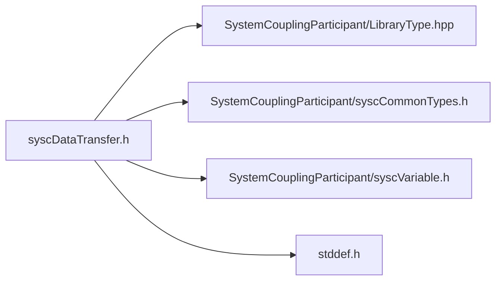

![][C]

**Location**: `syscDataTransfer.h`


## Classes

* [SyscDataTransfer](/docs/system-coupling/system-coupling-api/versions/2026.R1.SP00/c-reference/structSyscDataTransfer)

## Includes

* SystemCouplingParticipant/LibraryType.hpp
* SystemCouplingParticipant/syscCommonTypes.h
* SystemCouplingParticipant/syscVariable.h
* &lt;stddef.h&gt;



## Typedefs

<a id="group__SyscParticipantLibraryCAPI_1ga8e23d76b7478495ca52b0e1f719607fc"></a>
### Typedef SyscDataTransfer

![][public]

**Definition**: `syscDataTransfer.h` (line 33)

```
typedef struct SyscDataTransfer SyscDataTransfer
```

Provide a struct for a data transfer.

Data transfer specifies the source and target variables for mapping.


**Return type**: struct [SyscDataTransfer](/docs/system-coupling/system-coupling-api/versions/2026.R1.SP00/c-reference/structSyscDataTransfer)

## Functions

<a id="group__SyscParticipantLibraryCAPI_1ga10c3562aba2bdcef468fbde205008112"></a>
### Function syscGetDataTransfer

![][public]

```
SyscDataTransfer syscGetDataTransfer(SyscVariable sideOneVariable, SyscVariable sideTwoVariable, enum SyscInterfaceSide targetSide)
```

Create a data transfer using side&#123;One|Two&#125;Variable.

**Parameters**:

* **sideOneVariable**: - side one variable.
* **sideTwoVariable**: - side two variable.
* **targetSide**: - target side.


**Parameters**:

* [SyscVariable](/docs/system-coupling/system-coupling-api/versions/2026.R1.SP00/c-reference/structSyscVariable) **sideOneVariable**
* [SyscVariable](/docs/system-coupling/system-coupling-api/versions/2026.R1.SP00/c-reference/structSyscVariable) **sideTwoVariable**
* enum [SyscInterfaceSide](/docs/system-coupling/system-coupling-api/versions/2026.R1.SP00/c-reference/syscCommonTypes_8h) **targetSide**

**Return type**: [SyscDataTransfer](/docs/system-coupling/system-coupling-api/versions/2026.R1.SP00/c-reference/structSyscDataTransfer)

<a id="group__SyscParticipantLibraryCAPI_1gadb07659695562864d8bc0df67bec847e"></a>
### Function syscGetDataTransferST

![][public]

```
SyscDataTransfer syscGetDataTransferST(SyscVariable sourceVariable, SyscVariable targetVariable, enum SyscInterfaceSide targetSide)
```

Create a data transfer using &#123;source|target&#125;Variable.

**Parameters**:

* **sourceVariable**: - source variable.
* **targetVariable**: - target variable.
* **targetSide**: - target side.


**Parameters**:

* [SyscVariable](/docs/system-coupling/system-coupling-api/versions/2026.R1.SP00/c-reference/structSyscVariable) **sourceVariable**
* [SyscVariable](/docs/system-coupling/system-coupling-api/versions/2026.R1.SP00/c-reference/structSyscVariable) **targetVariable**
* enum [SyscInterfaceSide](/docs/system-coupling/system-coupling-api/versions/2026.R1.SP00/c-reference/syscCommonTypes_8h) **targetSide**

**Return type**: [SyscDataTransfer](/docs/system-coupling/system-coupling-api/versions/2026.R1.SP00/c-reference/structSyscDataTransfer)

## Source

```
/*
* Copyright ANSYS, Inc. Unauthorized use, distribution, or duplication is prohibited.
*/

#pragma once

#include "SystemCouplingParticipant/LibraryType.hpp"

#include "SystemCouplingParticipant/syscCommonTypes.h"
#include "SystemCouplingParticipant/syscVariable.h"

#include <stddef.h>

#ifdef __cplusplus
extern "C" {
#endif

typedef struct SyscDataTransfer {
  SyscVariable sourceVariable;
  SyscVariable targetVariable;
  enum SyscInterfaceSide targetSide;
} SyscDataTransfer;

SyscDataTransfer syscGetDataTransfer(
  SyscVariable sideOneVariable,
  SyscVariable sideTwoVariable,
  enum SyscInterfaceSide targetSide);

SyscDataTransfer syscGetDataTransferST(
  SyscVariable sourceVariable,
  SyscVariable targetVariable,
  enum SyscInterfaceSide targetSide);

#ifdef __cplusplus
}
#endif
```

[public]: https://img.shields.io/badge/-public-brightgreen (public)
[C]: https://img.shields.io/badge/language-C-blue (C)