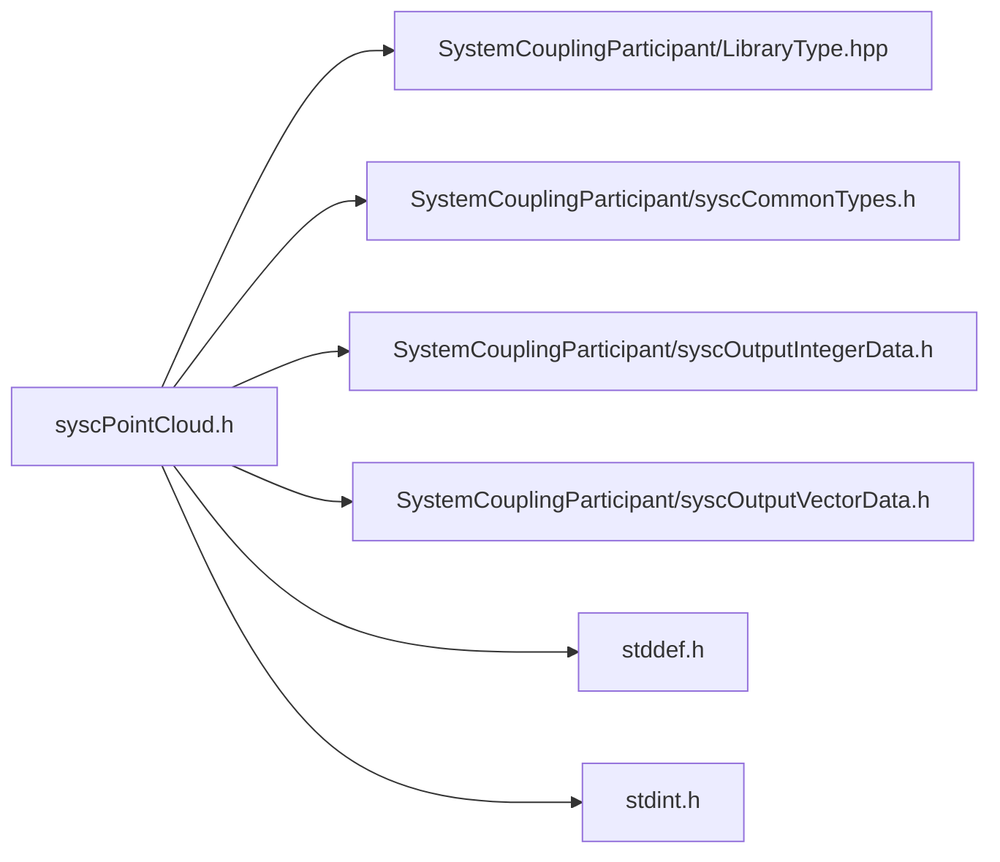

# File syscPointCloud.h

![][C]

**Location**: `syscPointCloud.h`


## Classes

* [SyscPointCloud](structSyscPointCloud.md#structSyscPointCloud)

## Includes

* SystemCouplingParticipant/LibraryType.hpp
* SystemCouplingParticipant/syscCommonTypes.h
* SystemCouplingParticipant/syscOutputIntegerData.h
* SystemCouplingParticipant/syscOutputVectorData.h
* <stddef.h>
* <stdint.h>



## Functions

<a id="group__SyscParticipantLibraryCAPI_1ga256e2f74a04a52d19232bd163921131c"></a>
### Function syscGetPointCloudEmpty

![][public]

```
SyscPointCloud syscGetPointCloudEmpty()
```

Create a point cloud access struct.

Returns a struct representing empty point cloud. All member will be assigned default values.


**Return type**: [SyscPointCloud](structSyscPointCloud.md#structSyscPointCloud)

<a id="group__SyscParticipantLibraryCAPI_1ga0a8b0fe8c0c57374a3ef69d1f678fdab"></a>
### Function syscGetPointCloud

![][public]

```
SyscPointCloud syscGetPointCloud(SyscOutputIntegerData nodeIds, SyscOutputVectorData nodeCoords)
```

Create a point cloud access struct.

**Parameters**:

* **nodeIds**: - output integer data access for node ids
* **nodeCoords**: - output vector data access for node coordinates, provided in the same order as node ids


**Parameters**:

* [SyscOutputIntegerData](structSyscOutputIntegerData.md#structSyscOutputIntegerData) **nodeIds**
* [SyscOutputVectorData](structSyscOutputVectorData.md#structSyscOutputVectorData) **nodeCoords**

**Return type**: [SyscPointCloud](structSyscPointCloud.md#structSyscPointCloud)

## Source

```
/*
* Copyright ANSYS, Inc. Unauthorized use, distribution, or duplication is prohibited.
*/

#pragma once

#include "SystemCouplingParticipant/LibraryType.hpp"

#include "SystemCouplingParticipant/syscCommonTypes.h"
#include "SystemCouplingParticipant/syscOutputIntegerData.h"
#include "SystemCouplingParticipant/syscOutputVectorData.h"

#include <stddef.h>
#include <stdint.h>

#ifdef __cplusplus
extern "C" {
#endif

/* *********** Point cloud ************************************************ */

typedef struct {
  SyscOutputIntegerData nodeIds;   
  SyscOutputVectorData nodeCoords; 
  int64_t connectivityStamp;

  int64_t coordinatesStamp;

  int64_t partitioningStamp;

} SyscPointCloud;

SyscPointCloud syscGetPointCloudEmpty();

SyscPointCloud syscGetPointCloud(
  SyscOutputIntegerData nodeIds,
  SyscOutputVectorData nodeCoords);

#ifdef __cplusplus
}
#endif
```

[public]: https://img.shields.io/badge/-public-brightgreen (public)
[C]: https://img.shields.io/badge/language-C-blue (C)