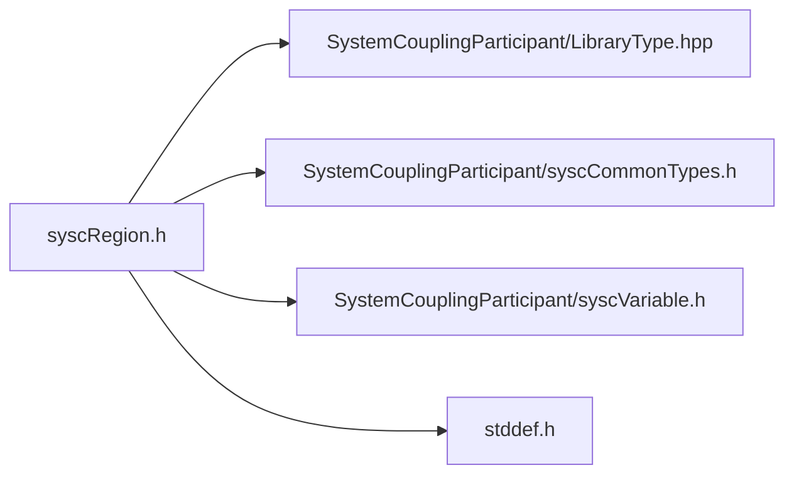

# File syscRegion.h

![][C]

**Location**: `syscRegion.h`


## Classes

* [SyscRegion](structSyscRegion.md#structSyscRegion)

## Includes

* SystemCouplingParticipant/LibraryType.hpp
* SystemCouplingParticipant/syscCommonTypes.h
* SystemCouplingParticipant/syscVariable.h
* <stddef.h>



## Typedefs

<a id="group__SyscParticipantLibraryCAPI_1gac5687e76cd2c5d1249d8b3ac43ff29b4"></a>
### Typedef SyscRegion

![][public]

**Definition**: `syscRegion.h` (line 47)

```
typedef struct SyscRegion SyscRegion
```

Provide a struct for a System Coupling region.

Participant can declare which regions can be used in the coupled analysis. Each region can declare its input variables and output variables. Input variables represent physical quantities whose values the participant expects System Coupling to provide. Output variables represent physical quantities whose values System Coupling expects the participant to provide.


To create and/or initialize the [SyscRegion](structSyscRegion.md#structSyscRegion) struct, it is highly recommended to use one of the functions with names starting with <code>syscGetRegion</code>. These functions will initialize all members to the correct values and will help to avoid back-compatibility issues in the future. For example:


```
SyscRegion reg = syscGetRegionT("Wall", SyscSurface);
```


**Return type**: struct [SyscRegion](structSyscRegion.md#structSyscRegion)

## Functions

<a id="group__SyscParticipantLibraryCAPI_1gaf8dee311cddc012ce6b54998fde8e29f"></a>
### Function syscGetRegion

![][public]

```
SyscRegion syscGetRegion(const char *name)
```

Create region to be used in a coupled analysis.

**Parameters**:

* **name**: - Unique name for this region. String length should not exceed SYSC_STRING_LENGTH.

Display name will default to the same as name.


Topology will default to surface.


Region mesh type will default to mesh.


**Parameters**:

* const char * **name**

**Return type**: [SyscRegion](structSyscRegion.md#structSyscRegion)

<a id="group__SyscParticipantLibraryCAPI_1ga26c8d2435b5cd3c525d5221298ad3aaa"></a>
### Function syscGetRegionT

![][public]

```
SyscRegion syscGetRegionT(const char *name, enum SyscTopology topology)
```

Create region to be used in a coupled analysis.

**Parameters**:

* **name**: - Unique name for this region. String length should not exceed SYSC_STRING_LENGTH.
* **topology**: - region topology.

Display name will default to the same as name.


Region mesh type will default to mesh.


**Parameters**:

* const char * **name**
* enum [SyscTopology](syscCommonTypes_8h.md#group__SyscParticipantLibraryCAPI_1gabf36499a0f333dc9b856c4bcbb25385a) **topology**

**Return type**: [SyscRegion](structSyscRegion.md#structSyscRegion)

<a id="group__SyscParticipantLibraryCAPI_1ga88d428a1852eeec9b7b7156e33b57822"></a>
### Function syscGetRegionDT

![][public]

```
SyscRegion syscGetRegionDT(const char *name, const char *displayName, enum SyscTopology topology)
```

Create region to be used in a coupled analysis.

**Parameters**:

* **name**: - Unique name for this region. String length should not exceed SYSC_STRING_LENGTH.
* **displayName**: - region display name. String length should not exceed SYSC_STRING_LENGTH.
* **topology**: - region topology.

Region mesh type will default to mesh.


**Parameters**:

* const char * **name**
* const char * **displayName**
* enum [SyscTopology](syscCommonTypes_8h.md#group__SyscParticipantLibraryCAPI_1gabf36499a0f333dc9b856c4bcbb25385a) **topology**

**Return type**: [SyscRegion](structSyscRegion.md#structSyscRegion)

<a id="group__SyscParticipantLibraryCAPI_1ga9e0af352921275419da93341f7186f46"></a>
### Function syscGetRegionTM

![][public]

```
SyscRegion syscGetRegionTM(const char *name, enum SyscTopology topology, enum SyscRegionDiscretizationType regionDiscretizationType)
```

Create region to be used in a coupled analysis.

**Parameters**:

* **name**: - Unique name for this region. String length should not exceed SYSC_STRING_LENGTH.
* **topology**: - region topology.
* **regionDiscretizationType**: - region mesh type.

Display names will be same as name.


**Parameters**:

* const char * **name**
* enum [SyscTopology](syscCommonTypes_8h.md#group__SyscParticipantLibraryCAPI_1gabf36499a0f333dc9b856c4bcbb25385a) **topology**
* enum [SyscRegionDiscretizationType](syscCommonTypes_8h.md#group__SyscParticipantLibraryCAPI_1ga83942e23c7ff51ec76e4632612a34d45) **regionDiscretizationType**

**Return type**: [SyscRegion](structSyscRegion.md#structSyscRegion)

<a id="group__SyscParticipantLibraryCAPI_1gaaae89f288494cc67e8f05cab0f5d1b8b"></a>
### Function syscGetRegionDTM

![][public]

```
SyscRegion syscGetRegionDTM(const char *name, const char *displayName, enum SyscTopology topology, enum SyscRegionDiscretizationType regionDiscretizationType)
```

Create region to be used in a coupled analysis.

**Parameters**:

* **name**: - Unique name for this region. String length should not exceed SYSC_STRING_LENGTH.
* **displayName**: - region display name. String length should not exceed SYSC_STRING_LENGTH.
* **topology**: - region topology.
* **regionDiscretizationType**: - region mesh type.


**Parameters**:

* const char * **name**
* const char * **displayName**
* enum [SyscTopology](syscCommonTypes_8h.md#group__SyscParticipantLibraryCAPI_1gabf36499a0f333dc9b856c4bcbb25385a) **topology**
* enum [SyscRegionDiscretizationType](syscCommonTypes_8h.md#group__SyscParticipantLibraryCAPI_1ga83942e23c7ff51ec76e4632612a34d45) **regionDiscretizationType**

**Return type**: [SyscRegion](structSyscRegion.md#structSyscRegion)

<a id="group__SyscParticipantLibraryCAPI_1ga9ae6fafcce6987fa18ba762a1ee7a7be"></a>
### Function syscAddInputVariable

![][public]

```
SyscError syscAddInputVariable(const SyscRegion region, const SyscVariable variable)
```

Provide a function to add an input variable to the region.

If this variable has already been added to the region as an input variable, then this call will have no effect.


If a different variable with the same name has already been added to the region as an input variable, then an error will be returned.


If a variable with the same name has already been added to the region as an output variable, then an error will be returned.


If the variable name contains invalid characters, then an error will be returned.


If the region discretization type is point cloud, then the location of the variable added to this region is insignificant.


**Parameters**:

* **region**: Region to which the input variable is to be added.
* **variable**: Variable whose values are provided by System Coupling and consumed by the participant.


**Parameters**:

* const [SyscRegion](structSyscRegion.md#structSyscRegion) **region**
* const [SyscVariable](structSyscVariable.md#structSyscVariable) **variable**

**Return type**: [SyscError](structSyscError.md#structSyscError)

<a id="group__SyscParticipantLibraryCAPI_1ga9615f371d829935af745eb63a1ea99bc"></a>
### Function syscAddOutputVariable

![][public]

```
SyscError syscAddOutputVariable(const SyscRegion region, const SyscVariable variable)
```

Provide a function to add an output variable to the region.

If this variable has already been added to the region as an output variable, then this call will have no effect.


If a different variable with the same name has already been added to the region as an output variable, then an error will be returned.


If a variable with the same name has already been added to the region as an input variable, then an error will be returned.


If the variable name contains invalid characters, then an error will be returned.


If the region discretization type is point cloud, then the location of the variable added to this region is insignificant.


**Parameters**:

* **region**: Region to which the output variable is to be added.
* **variable**: Variable whose values are consumed by System Coupling and provided by the participant.


**Parameters**:

* const [SyscRegion](structSyscRegion.md#structSyscRegion) **region**
* const [SyscVariable](structSyscVariable.md#structSyscVariable) **variable**

**Return type**: [SyscError](structSyscError.md#structSyscError)

<a id="group__SyscParticipantLibraryCAPI_1gabec39110fe9da4d54a32653e6bf43196"></a>
### Function syscGetNumInputVariables

![][public]

```
size_t syscGetNumInputVariables(const SyscRegion region)
```

Provide a function to return the number of input variables.

**Parameters**:

* **region**: - region


**Returns**:

Number of input variables for the region.


**Parameters**:

* const [SyscRegion](structSyscRegion.md#structSyscRegion) **region**

**Return type**: size_t

<a id="group__SyscParticipantLibraryCAPI_1gaef15224138a4f29e892a63e5e8db2feb"></a>
### Function syscGetInputVariable

![][public]

```
SyscVariable syscGetInputVariable(const SyscRegion region, size_t index)
```

Return an input variable.

**Parameters**:

* **region**: - region
* **index**: - region index


**Returns**:

Variable at specified index.


**Parameters**:

* const [SyscRegion](structSyscRegion.md#structSyscRegion) **region**
* size_t **index**

**Return type**: [SyscVariable](structSyscVariable.md#structSyscVariable)

<a id="group__SyscParticipantLibraryCAPI_1ga99fda03ac99e590196d180ea23214217"></a>
### Function syscGetNumOutputVariables

![][public]

```
size_t syscGetNumOutputVariables(const SyscRegion region)
```

Provide a function to return the number of output variables.

**Parameters**:

* **region**: - region


**Returns**:

Number of output variables for the region.


**Parameters**:

* const [SyscRegion](structSyscRegion.md#structSyscRegion) **region**

**Return type**: size_t

<a id="group__SyscParticipantLibraryCAPI_1ga55a99079e5dc9d025f3816d5e7bdd163"></a>
### Function syscGetOutputVariable

![][public]

```
SyscVariable syscGetOutputVariable(const SyscRegion region, size_t index)
```

Return an output variable.

**Parameters**:

* **region**: - region
* **index**: - region index


**Returns**:

Variable at specified index.


**Parameters**:

* const [SyscRegion](structSyscRegion.md#structSyscRegion) **region**
* size_t **index**

**Return type**: [SyscVariable](structSyscVariable.md#structSyscVariable)

## Source

```
/*
* Copyright ANSYS, Inc. Unauthorized use, distribution, or duplication is prohibited.
*/

#pragma once

#include "SystemCouplingParticipant/LibraryType.hpp"

#include "SystemCouplingParticipant/syscCommonTypes.h"
#include "SystemCouplingParticipant/syscVariable.h"

#include <stddef.h>

#ifdef __cplusplus
extern "C" {
#endif

typedef struct SyscRegion {
  char name[SYSC_STRING_LENGTH];                              
  enum SyscTopology topology;                                 
  enum SyscRegionDiscretizationType regionDiscretizationType; 
  char displayName[SYSC_STRING_LENGTH];                       
} SyscRegion;

SyscRegion syscGetRegion(const char* name);

SyscRegion syscGetRegionT(const char* name, enum SyscTopology topology);

SyscRegion syscGetRegionDT(
  const char* name,
  const char* displayName,
  enum SyscTopology topology);

SyscRegion syscGetRegionTM(
  const char* name,
  enum SyscTopology topology,
  enum SyscRegionDiscretizationType regionDiscretizationType);

SyscRegion syscGetRegionDTM(
  const char* name,
  const char* displayName,
  enum SyscTopology topology,
  enum SyscRegionDiscretizationType regionDiscretizationType);

SyscError syscAddInputVariable(
  const SyscRegion region,
  const SyscVariable variable);

SyscError syscAddOutputVariable(
  const SyscRegion region,
  const SyscVariable variable);

size_t syscGetNumInputVariables(const SyscRegion region);

SyscVariable syscGetInputVariable(const SyscRegion region, size_t index);

size_t syscGetNumOutputVariables(const SyscRegion region);

SyscVariable syscGetOutputVariable(const SyscRegion region, size_t index);

#ifdef __cplusplus
}
#endif
```

[public]: https://img.shields.io/badge/-public-brightgreen (public)
[C]: https://img.shields.io/badge/language-C-blue (C)