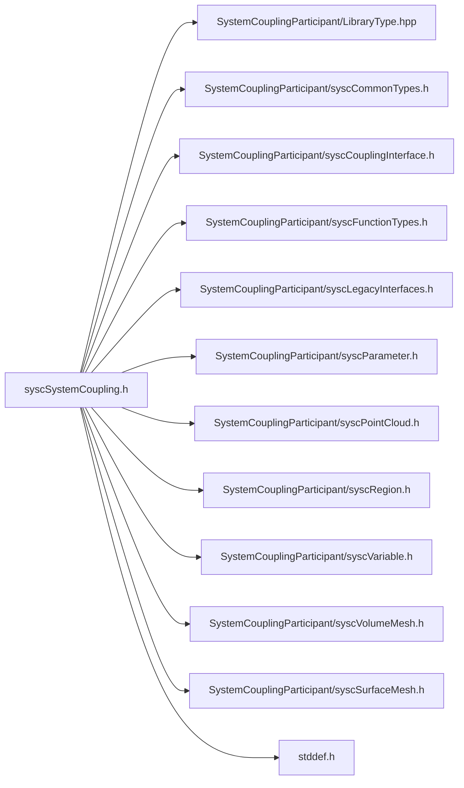

# File syscSystemCoupling.h

![][C]

**Location**: `syscSystemCoupling.h`


## Includes

* SystemCouplingParticipant/LibraryType.hpp
* SystemCouplingParticipant/syscCommonTypes.h
* SystemCouplingParticipant/syscCouplingInterface.h
* SystemCouplingParticipant/syscFunctionTypes.h
* SystemCouplingParticipant/syscLegacyInterfaces.h
* SystemCouplingParticipant/syscParameter.h
* SystemCouplingParticipant/syscPointCloud.h
* SystemCouplingParticipant/syscRegion.h
* SystemCouplingParticipant/syscVariable.h
* SystemCouplingParticipant/syscVolumeMesh.h
* SystemCouplingParticipant/syscSurfaceMesh.h
* <stddef.h>



## Functions

<a id="group__SyscParticipantLibraryCAPI_1ga862e7375111dcee847bc05463c72b329"></a>
### Function syscStartStandaloneParallel

![][public]

```
SyscError syscStartStandaloneParallel(const size_t mpiCommunicator)
```

Provide a function to start standalone mode in parallel.

**Parameters**:

* **mpiCommunicator**: MPI communicator cast to size_t.

This will initialize the participant library in standalone mode and will use the provided MPI communicator for all parallel communication.


Note that if the MPI communicator is MPI_COMM_WORLD, then it is not necessary to call this function.


**Parameters**:

* const size_t **mpiCommunicator**

**Return type**: [SyscError](structSyscError.md#structSyscError)

<a id="group__SyscParticipantLibraryCAPI_1ga1404ad75fb1f5b1515dae967b71b1725"></a>
### Function syscConnect

![][public]

```
SyscError syscConnect(const char *scHost, const unsigned short scPort, const char *participantName, const char *buildInformation)
```

Provide a function to establish connection to System Coupling.

A participant must have obtained the host and port information from System Coupling prior to calling this function (e.g. via an input argument when participant application was started).


**Parameters**:

* **scHost**: Name of the host on which System Coupling is running.
* **scPort**: Port number on which System Coupling is listening for participant connections.
* **participantName**: Name of this participant (e.g. "MAPDL-1").
* **buildInformation**: Information about the build of this participant solver.


**Returns**:

[SyscError](structSyscError.md#structSyscError) Can be checked for any errors.


**Parameters**:

* const char * **scHost**
* const unsigned short **scPort**
* const char * **participantName**
* const char * **buildInformation**

**Return type**: [SyscError](structSyscError.md#structSyscError)

<a id="group__SyscParticipantLibraryCAPI_1ga68a9b5b64715ad6ffde1c7b145bb4d0f"></a>
### Function syscConnectParallel

![][public]

```
SyscError syscConnectParallel(const char *scHost, const unsigned short scPort, const char *participantName, const size_t communicator, const char *buildInformation)
```

Provide a function to establish connection to System Coupling in parallel.

This function is an alternative to syscConnect function. It works the same way as syscConnect, but it takes in one additional argument, which is the MPI communicator, cast as size_t.


Note that if the MPI communicator is MPI_COMM_WORLD, then it is not necessary to call this function and [syscConnect()](syscSystemCoupling_8h.md#group__SyscParticipantLibraryCAPI_1ga1404ad75fb1f5b1515dae967b71b1725) can be used instead.


**Parameters**:

* const char * **scHost**
* const unsigned short **scPort**
* const char * **participantName**
* const size_t **communicator**
* const char * **buildInformation**

**Return type**: [SyscError](structSyscError.md#structSyscError)

<a id="group__SyscParticipantLibraryCAPI_1ga8d84278ef4d48a739948f0a952cb2a00"></a>
### Function syscConnectUseStruct

![][public]

```
SyscError syscConnectUseStruct(SyscParticipantInfo participantInfo)
```

Provide a function to establish connection to System Coupling in serial using a C structure.

**Parameters**:

* **participantInfo**: A C structure containing the participant attributes


**Returns**:

[SyscError](structSyscError.md#structSyscError)


**Parameters**:

* [SyscParticipantInfo](structSyscParticipantInfo.md#structSyscParticipantInfo) **participantInfo**

**Return type**: [SyscError](structSyscError.md#structSyscError)

<a id="group__SyscParticipantLibraryCAPI_1gac695e9f06d272958b8fc81bff07708fb"></a>
### Function syscConnectParallelUseStruct

![][public]

```
SyscError syscConnectParallelUseStruct(SyscParticipantInfo participantInfo, const size_t communicator)
```

Provide a function to establish connection to System Coupling in parallel using a C structure.

**Parameters**:

* **participantInfo**: A C structure containing the participant attributes
* **communicator**: A size_t flag signifying what mode to run in parallel with.


**Returns**:

[SyscError](structSyscError.md#structSyscError)


**Parameters**:

* [SyscParticipantInfo](structSyscParticipantInfo.md#structSyscParticipantInfo) **participantInfo**
* const size_t **communicator**

**Return type**: [SyscError](structSyscError.md#structSyscError)

<a id="group__SyscParticipantLibraryCAPI_1ga3c895512d255076ce0b7dcc0b527991b"></a>
### Function syscAddRegion

![][public]

```
SyscError syscAddRegion(const SyscRegion region)
```

Provide a function to add a region that could be used in a coupled analysis.

If this region has already been added, then this call will have no effect.


If a different region with the same has already been added, then an error will be returned.


If the region name contains invalid characters, then a runtime error will be thrown.


**Parameters**:

* const [SyscRegion](structSyscRegion.md#structSyscRegion) **region**

**Return type**: [SyscError](structSyscError.md#structSyscError)

<a id="group__SyscParticipantLibraryCAPI_1ga360d447bbaffa2035ddd9675457027cc"></a>
### Function syscAddInputParameter

![][public]

```
SyscError syscAddInputParameter(const SyscParameter parameter)
```

Provide a method to add an input parameter that could be used in a coupled analysis.

If this parameter has already been added as an input solver parameter, then this call will have no effect.


If a different parameter with the same name has already been added as an input parameter, then a runtime error will be thrown.


If a parameter with the same name has already been added as an output parameter, then a runtime error will be thrown.


If the parameter name contains invalid characters, a runtime error will be thrown.


**Parameters**:

* **parameter**: Parameter whose values are provided by System Coupling and consumed by the participant.


**Parameters**:

* const [SyscParameter](structSyscParameter.md#structSyscParameter) **parameter**

**Return type**: [SyscError](structSyscError.md#structSyscError)

<a id="group__SyscParticipantLibraryCAPI_1gaf25cfa8761182ab33ee1a58171ba8aff"></a>
### Function syscAddOutputParameter

![][public]

```
SyscError syscAddOutputParameter(const SyscParameter parameter)
```

Provide a method to add an output parameter that could be used in a coupled analysis.

If this parameter has already been added as an output solver parameter, then this call will have no effect.


If a different parameter with the same name has already been added as an output parameter, then a runtime error will be thrown.


If a parameter with the same name has already been added as an input parameter, then a runtime error will be thrown.


If the parameter name contains invalid characters, a runtime error will be thrown.


**Parameters**:

* **parameter**: Parameter whose values are provided by System Coupling and consumed by the participant.


**Parameters**:

* const [SyscParameter](structSyscParameter.md#structSyscParameter) **parameter**

**Return type**: [SyscError](structSyscError.md#structSyscError)

<a id="group__SyscParticipantLibraryCAPI_1ga0c8432c9735a99af8f502a0d399fcb53"></a>
### Function syscGetNumInputParameters

![][public]

```
size_t syscGetNumInputParameters()
```

Provide a method to get the number of input parameters.

**Returns**:

Number of input parameters.


**Return type**: size_t

<a id="group__SyscParticipantLibraryCAPI_1gaa589afb854fc7ccbc1aadd35148748c4"></a>
### Function syscGetNumOutputParameters

![][public]

```
size_t syscGetNumOutputParameters()
```

Provide a method to get the number of output parameters.

**Returns**:

Number of output parameters.


**Return type**: size_t

<a id="group__SyscParticipantLibraryCAPI_1ga0a1c350da5591ae0ece58abaa8dfd9d2"></a>
### Function syscGetAddedInputParameter

![][public]

```
SyscParameter syscGetAddedInputParameter(size_t index)
```

Provide a function to return input parameter information.

**Parameters**:

* **index**: - input parameter index


**Returns**:

Input parameter information at specified index.


**Parameters**:

* size_t **index**

**Return type**: [SyscParameter](structSyscParameter.md#structSyscParameter)

<a id="group__SyscParticipantLibraryCAPI_1gaa7fff9647ad264d5f2d6231472667e0d"></a>
### Function syscGetAddedOutputParameter

![][public]

```
SyscParameter syscGetAddedOutputParameter(size_t index)
```

Provide a function to return input parameter information.

**Parameters**:

* **index**: - input parameter index


**Returns**:

Output parameter information at specified index.


**Parameters**:

* size_t **index**

**Return type**: [SyscParameter](structSyscParameter.md#structSyscParameter)

<a id="group__SyscParticipantLibraryCAPI_1gac60dbcde01c9373bfd367aaaa956cba5"></a>
### Function syscGetNumRealAttributes

![][public]

```
size_t syscGetNumRealAttributes()
```

Provide a function to get the number of real attributes.

**Returns**:

Number of real attributes.


**Return type**: size_t

<a id="group__SyscParticipantLibraryCAPI_1gaf49b872e961009e614ed67759e1a60d4"></a>
### Function syscGetNumIntegerAttributes

![][public]

```
size_t syscGetNumIntegerAttributes()
```

Provide a function to get the number of integer attributes.

**Returns**:

Number of integer attributes.


**Return type**: size_t

<a id="group__SyscParticipantLibraryCAPI_1gaefc1d756871febf4805c2df08334e7b8"></a>
### Function syscGetAddedRealAttribute

![][public]

```
SyscRealAttribute syscGetAddedRealAttribute(size_t index)
```

Provide a function to return real attribute information.

**Parameters**:

* **index**: - real attribute index.


**Returns**:

Real attribute information at specified index.


**Parameters**:

* size_t **index**

**Return type**: [SyscRealAttribute](structSyscRealAttribute.md#structSyscRealAttribute)

<a id="group__SyscParticipantLibraryCAPI_1ga700bc8178a51d4eeaa596eb6d4737fcb"></a>
### Function syscGetAddedIntegerAttribute

![][public]

```
SyscIntegerAttribute syscGetAddedIntegerAttribute(size_t index)
```

Provide a function to return integer attribute information.

**Parameters**:

* **index**: - integer attribute index.


**Returns**:

Integer attribute information at specified index.


**Parameters**:

* size_t **index**

**Return type**: [SyscIntegerAttribute](structSyscIntegerAttribute.md#structSyscIntegerAttribute)

<a id="group__SyscParticipantLibraryCAPI_1gad0272110e6eaf4c7f16bf96d3556106e"></a>
### Function syscAddRealAttribute

![][public]

```
SyscError syscAddRealAttribute(const SyscRealAttribute attribute)
```

Provide a method to add a real attribute that could be used in a coupled analysis.

If this attribute has already been added as a real attribute, then this call will have no effect.


If a different real attribute with the same name has already been added, then a runtime error will be thrown.


If a an attribute with the same name has already been added as an integer attribute, then a runtime error will be thrown.


If the attribute name contains invalid characters, a runtime error will be thrown.


**Parameters**:

* **attribute**: Real attribute.


**Parameters**:

* const [SyscRealAttribute](structSyscRealAttribute.md#structSyscRealAttribute) **attribute**

**Return type**: [SyscError](structSyscError.md#structSyscError)

<a id="group__SyscParticipantLibraryCAPI_1ga7ef7712e40081015520c18ae54509930"></a>
### Function syscAddIntegerAttribute

![][public]

```
SyscError syscAddIntegerAttribute(const SyscIntegerAttribute attribute)
```

Provide a method to add an integer attribute that could be used in a coupled analysis.

If this attribute has already been added as an integer attribute, then this call will have no effect.


If a different integer attribute with the same name has already been added, then a runtime error will be thrown.


If a an attribute with the same name has already been added as a real attribute, then a runtime error will be thrown.


If the attribute name contains invalid characters, a runtime error will be thrown.


**Parameters**:

* **attribute**: Integer attribute.


**Parameters**:

* const [SyscIntegerAttribute](structSyscIntegerAttribute.md#structSyscIntegerAttribute) **attribute**

**Return type**: [SyscError](structSyscError.md#structSyscError)

<a id="group__SyscParticipantLibraryCAPI_1ga534e802afae31ae7134e23a00d2872f9"></a>
### Function syscGetParameterValue

![][public]

```
double syscGetParameterValue(const char *parameterName, SyscError *errorCode)
```

Provide a function to get a Parameter value.

**Parameters**:

* **parameterName**: - name of the parameter.
* **errorCode**: - error status for the fuction.


**Parameters**:

* const char * **parameterName**
* [SyscError](structSyscError.md#structSyscError) * **errorCode**

**Return type**: double

<a id="group__SyscParticipantLibraryCAPI_1ga67c13bf8cd7fedeb86ac32b6d919eeb0"></a>
### Function syscSetParameterValue

![][public]

```
SyscError syscSetParameterValue(const char *parameterName, double value)
```

Provide a function to set a Parameter value.

**Parameters**:

* **parameterName**: - name of the parameter.
* **value**: - value of the parameter.


**Parameters**:

* const char * **parameterName**
* double **value**

**Return type**: [SyscError](structSyscError.md#structSyscError)

<a id="group__SyscParticipantLibraryCAPI_1gaf5625adaeb366d18725d1e9560d5910d"></a>
### Function syscGetRealAttributeValue

![][public]

```
double syscGetRealAttributeValue(const char *attributeName, SyscError *errorCode)
```

Provide a function to get a RealAttribute value.

**Parameters**:

* **attributeName**: - name of the attribute.
* **errorCode**: - error status for the function.


**Parameters**:

* const char * **attributeName**
* [SyscError](structSyscError.md#structSyscError) * **errorCode**

**Return type**: double

<a id="group__SyscParticipantLibraryCAPI_1ga126dcce7d793eb854bdccd42e6a62e10"></a>
### Function syscGetIntegerAttributeValue

![][public]

```
int64_t syscGetIntegerAttributeValue(const char *attributeName, SyscError *errorCode)
```

Provide a function to get an IntegerAttribute value.

**Parameters**:

* **attributeName**: - name of the attribute.
* **errorCode**: - error status for the function.


**Parameters**:

* const char * **attributeName**
* [SyscError](structSyscError.md#structSyscError) * **errorCode**

**Return type**: int64_t

<a id="group__SyscParticipantLibraryCAPI_1ga5330416d093678fc96231257a88ea337"></a>
### Function syscAddCouplingInterface

![][public]

```
SyscError syscAddCouplingInterface(const SyscCouplingInterface couplingInterface)
```

Provide a function to add a coupling interface.

If this coupling interface has already been added, then this call will have no effect.


If a different coupling interface with the same has already been added, then an error status will be returned.


If the coupling interface name contains invalid characters, then an error status will be returned.


See [SyscCouplingInterface](structSyscCouplingInterface.md#structSyscCouplingInterface) for more details.


**Parameters**:

* const [SyscCouplingInterface](structSyscCouplingInterface.md#structSyscCouplingInterface) **couplingInterface**

**Return type**: [SyscError](structSyscError.md#structSyscError)

<a id="group__SyscParticipantLibraryCAPI_1gadec9e44f001d4ec2b8139e096ab93ac7"></a>
### Function syscAddCouplingInterfaceA

![][public]

```
SyscError syscAddCouplingInterfaceA(const SyscCouplingInterface couplingInterface, int autoGenerateDataTransfers)
```

Provide a function to add a coupling interface.

If this coupling interface has already been added, then this call will have no effect.


If a different coupling interface with the same has already been added, then an error status will be returned.


If the coupling interface name contains invalid characters, then an error status will be returned.


See [SyscCouplingInterface](structSyscCouplingInterface.md#structSyscCouplingInterface) for more details.


**Parameters**:

* const [SyscCouplingInterface](structSyscCouplingInterface.md#structSyscCouplingInterface) **couplingInterface**
* int **autoGenerateDataTransfers**

**Return type**: [SyscError](structSyscError.md#structSyscError)

<a id="group__SyscParticipantLibraryCAPI_1ga831884747873b947fcdc57ef31adce27"></a>
### Function syscCompleteSetup

![][public]

```
SyscError syscCompleteSetup(const SyscSetupInfo setupInfo)
```

Provide a function to notify System Coupling that setup can be completed.

After this function is called, coupled analysis setup can no longer be updated, i.e. regions and variables cannot be changed.


Once the setup is complete, any subsequent call to complete the setup will have no effect.


**Parameters**:

* **setupInfo**: - setup information.


**Parameters**:

* const [SyscSetupInfo](structSyscSetupInfo.md#structSyscSetupInfo) **setupInfo**

**Return type**: [SyscError](structSyscError.md#structSyscError)

<a id="group__SyscParticipantLibraryCAPI_1ga06c366cb935ade55b7b90de9691d3f38"></a>
### Function syscRegisterInputScalarDataAccess

![][public]

```
SyscError syscRegisterInputScalarDataAccess(SyscInputScalarDataAccess dataAccess)
```

Provide a function to register input scalar data access.

**Parameters**:

* **dataAccess**: - a pointer to the function that conforms to SyscInputScalarDataAccess prototype.


**Parameters**:

* [SyscInputScalarDataAccess](syscFunctionTypes_8h.md#group__SyscParticipantLibraryCAPI_1gaaf3788ac706a730edbf6093c7e543681) **dataAccess**

**Return type**: [SyscError](structSyscError.md#structSyscError)

<a id="group__SyscParticipantLibraryCAPI_1ga04bbb44826997f602707b9e01d07d78e"></a>
### Function syscRegisterInputScalarDataAccessWithPointer

![][public]

```
SyscError syscRegisterInputScalarDataAccessWithPointer(SyscOpaqueDataAccess opaqueDataAccess, SyscInputScalarDataAccessWithPointer dataAccess)
```

Provide a function to register input scalar data access.

**Parameters**:

* **opaqueDataAccess**: - a pointer to an address in memory. This pointer will be passed into the callback function.
* **dataAccess**: - a pointer to the function that conforms to SyscInputScalarDataAccessWithPointer prototype.


**Parameters**:

* [SyscOpaqueDataAccess](syscCommonTypes_8h.md#group__SyscParticipantLibraryCAPI_1ga17ef60969b3c919163ba2471eb95a28b) **opaqueDataAccess**
* [SyscInputScalarDataAccessWithPointer](syscFunctionTypes_8h.md#group__SyscParticipantLibraryCAPI_1gad41922f1a4f5abb891d5a913ba5fcccf) **dataAccess**

**Return type**: [SyscError](structSyscError.md#structSyscError)

<a id="group__SyscParticipantLibraryCAPI_1ga6b2aee555f07109357958edc9898b8b5"></a>
### Function syscRegisterInputScalarDataMultiZoneAccess

![][public]

```
SyscError syscRegisterInputScalarDataMultiZoneAccess(SyscOpaqueDataAccess opaqueDataAccess, SyscInputScalarDataMultiZoneAccess dataAccess)
```

Provide a function to register input scalar data multi-zone access.

**Parameters**:

* **dataAccess**: - a pointer to the function that conforms to SyscInputScalarDataMultiZoneAccess prototype.


**Parameters**:

* [SyscOpaqueDataAccess](syscCommonTypes_8h.md#group__SyscParticipantLibraryCAPI_1ga17ef60969b3c919163ba2471eb95a28b) **opaqueDataAccess**
* [SyscInputScalarDataMultiZoneAccess](syscFunctionTypes_8h.md#group__SyscParticipantLibraryCAPI_1ga844dc6322bd6e4eabc2d3d2d9e69bdb1) **dataAccess**

**Return type**: [SyscError](structSyscError.md#structSyscError)

<a id="group__SyscParticipantLibraryCAPI_1ga36e9fe53c70f9c15cbcfc3957f80852b"></a>
### Function syscRegisterInputVectorDataAccess

![][public]

```
SyscError syscRegisterInputVectorDataAccess(SyscInputVectorDataAccess dataAccess)
```

Provide a function to register input vector data access.

**Parameters**:

* **dataAccess**: - a pointer to the function that conforms to SyscInputVectorDataAccess prototype.


**Parameters**:

* [SyscInputVectorDataAccess](syscFunctionTypes_8h.md#group__SyscParticipantLibraryCAPI_1ga8d5f53de4e65a4bacef0f25ba8b46483) **dataAccess**

**Return type**: [SyscError](structSyscError.md#structSyscError)

<a id="group__SyscParticipantLibraryCAPI_1ga46b386f0c3ed52071dd851b55763b1c8"></a>
### Function syscRegisterInputVectorDataAccessWithPointer

![][public]

```
SyscError syscRegisterInputVectorDataAccessWithPointer(SyscOpaqueDataAccess opaqueDataAccess, SyscInputVectorDataAccessWithPointer dataAccess)
```

Provide a function to register input vector data access.

**Parameters**:

* **opaqueDataAccess**: - a pointer to an address in memory. This pointer will be passed into the callback function.
* **dataAccess**: - a pointer to the function that conforms to SyscInputVectorDataAccessWithPointer prototype.


**Parameters**:

* [SyscOpaqueDataAccess](syscCommonTypes_8h.md#group__SyscParticipantLibraryCAPI_1ga17ef60969b3c919163ba2471eb95a28b) **opaqueDataAccess**
* [SyscInputVectorDataAccessWithPointer](syscFunctionTypes_8h.md#group__SyscParticipantLibraryCAPI_1gae7c6372393f3ec720b8d6d1535fcf9b3) **dataAccess**

**Return type**: [SyscError](structSyscError.md#structSyscError)

<a id="group__SyscParticipantLibraryCAPI_1gad7774418be78b8b39c9b45b7fcade1d3"></a>
### Function syscRegisterInputVectorDataMultiZoneAccess

![][public]

```
SyscError syscRegisterInputVectorDataMultiZoneAccess(SyscOpaqueDataAccess opaqueDataAccess, SyscInputVectorDataMultiZoneAccess dataAccess)
```

Provide a function to register input vector data multi-zone access.

**Parameters**:

* **dataAccess**: - a pointer to the function that conforms to SyscInputVectorDataMultiZoneAccess prototype.


**Parameters**:

* [SyscOpaqueDataAccess](syscCommonTypes_8h.md#group__SyscParticipantLibraryCAPI_1ga17ef60969b3c919163ba2471eb95a28b) **opaqueDataAccess**
* [SyscInputVectorDataMultiZoneAccess](syscFunctionTypes_8h.md#group__SyscParticipantLibraryCAPI_1gae2e92f1b7ae911c36bf3606c60a01511) **dataAccess**

**Return type**: [SyscError](structSyscError.md#structSyscError)

<a id="group__SyscParticipantLibraryCAPI_1ga6e187589ca426402ee045ccecfec21d3"></a>
### Function syscRegisterOutputScalarDataAccess

![][public]

```
SyscError syscRegisterOutputScalarDataAccess(SyscOutputScalarDataAccess dataAccess)
```

Provide a function to register output scalar data access.

**Parameters**:

* **dataAccess**: - a pointer to the function that conforms to SyscOutputScalarDataAccess prototype.


**Parameters**:

* [SyscOutputScalarDataAccess](syscFunctionTypes_8h.md#group__SyscParticipantLibraryCAPI_1gabd35283796cae3d3dbc851ac66b8564f) **dataAccess**

**Return type**: [SyscError](structSyscError.md#structSyscError)

<a id="group__SyscParticipantLibraryCAPI_1ga2c90e2ea571de3b7ce5e1ca65a996d8a"></a>
### Function syscRegisterOutputScalarDataAccessWithPointer

![][public]

```
SyscError syscRegisterOutputScalarDataAccessWithPointer(SyscOpaqueDataAccess opaqueDataAccess, SyscOutputScalarDataAccessWithPointer dataAccess)
```

Provide a function to register output scalar data access.

**Parameters**:

* **opaqueDataAccess**: - a pointer to an address in memory. This pointer will be passed into the callback function.
* **dataAccess**: - a pointer to the function that conforms to SyscOutputScalarDataAccessWithPointer prototype.


**Parameters**:

* [SyscOpaqueDataAccess](syscCommonTypes_8h.md#group__SyscParticipantLibraryCAPI_1ga17ef60969b3c919163ba2471eb95a28b) **opaqueDataAccess**
* [SyscOutputScalarDataAccessWithPointer](syscFunctionTypes_8h.md#group__SyscParticipantLibraryCAPI_1gab378ed75ffd9b081ad7eccf8107a5542) **dataAccess**

**Return type**: [SyscError](structSyscError.md#structSyscError)

<a id="group__SyscParticipantLibraryCAPI_1ga7880daf983c8bac7db920281fdc937c1"></a>
### Function syscRegisterOutputScalarDataMultiZoneAccess

![][public]

```
SyscError syscRegisterOutputScalarDataMultiZoneAccess(SyscOpaqueDataAccess opaqueDataAccess, SyscOutputScalarDataMultiZoneAccess dataAccess)
```

Provide a function to register output scalar data multi-zone access.

**Parameters**:

* **dataAccess**: - a pointer to the function that conforms to SyscOutputScalarDataMultiZoneAccess prototype.


**Parameters**:

* [SyscOpaqueDataAccess](syscCommonTypes_8h.md#group__SyscParticipantLibraryCAPI_1ga17ef60969b3c919163ba2471eb95a28b) **opaqueDataAccess**
* [SyscOutputScalarDataMultiZoneAccess](syscFunctionTypes_8h.md#group__SyscParticipantLibraryCAPI_1ga7767f728d880014dfbd853bbb8e0eb07) **dataAccess**

**Return type**: [SyscError](structSyscError.md#structSyscError)

<a id="group__SyscParticipantLibraryCAPI_1gaa3956909f65a425bec64c86ec5d5515b"></a>
### Function syscRegisterOutputVectorDataAccess

![][public]

```
SyscError syscRegisterOutputVectorDataAccess(SyscOutputVectorDataAccess dataAccess)
```

Provide a function to register output vector data access.

**Parameters**:

* **dataAccess**: - a pointer to the function that conforms to SyscOutputVectorDataAccess prototype.


**Parameters**:

* [SyscOutputVectorDataAccess](syscFunctionTypes_8h.md#group__SyscParticipantLibraryCAPI_1gae99c8cb78199403b9e74217557be206a) **dataAccess**

**Return type**: [SyscError](structSyscError.md#structSyscError)

<a id="group__SyscParticipantLibraryCAPI_1ga9793fb31fe905768b175842ceab722e5"></a>
### Function syscRegisterOutputVectorDataAccessWithPointer

![][public]

```
SyscError syscRegisterOutputVectorDataAccessWithPointer(SyscOpaqueDataAccess opaqueDataAccess, SyscOutputVectorDataAccessWithPointer dataAccess)
```

Provide a function to register output vector data access.

**Parameters**:

* **opaqueDataAccess**: - a pointer to an address in memory. This pointer will be passed into the callback function.
* **dataAccess**: - a pointer to the function that conforms to SyscOutputVectorDataAccessWithPointer prototype.


**Parameters**:

* [SyscOpaqueDataAccess](syscCommonTypes_8h.md#group__SyscParticipantLibraryCAPI_1ga17ef60969b3c919163ba2471eb95a28b) **opaqueDataAccess**
* [SyscOutputVectorDataAccessWithPointer](syscFunctionTypes_8h.md#group__SyscParticipantLibraryCAPI_1gab30cbe5478bf769c81f5c0a07e885afd) **dataAccess**

**Return type**: [SyscError](structSyscError.md#structSyscError)

<a id="group__SyscParticipantLibraryCAPI_1gad5c33007c0067ab6edf8a72ab422ff7d"></a>
### Function syscRegisterOutputVectorDataMultiZoneAccess

![][public]

```
SyscError syscRegisterOutputVectorDataMultiZoneAccess(SyscOpaqueDataAccess opaqueDataAccess, SyscOutputVectorDataMultiZoneAccess dataAccess)
```

Provide a function to register output vector data multi-zone access.

**Parameters**:

* **dataAccess**: - a pointer to the function that conforms to SyscOutputVectorDataMultiZoneAccess prototype.


**Parameters**:

* [SyscOpaqueDataAccess](syscCommonTypes_8h.md#group__SyscParticipantLibraryCAPI_1ga17ef60969b3c919163ba2471eb95a28b) **opaqueDataAccess**
* [SyscOutputVectorDataMultiZoneAccess](syscFunctionTypes_8h.md#group__SyscParticipantLibraryCAPI_1ga1d6d5d9fa806ac5820d9a6ed85811804) **dataAccess**

**Return type**: [SyscError](structSyscError.md#structSyscError)

<a id="group__SyscParticipantLibraryCAPI_1ga1f4ab3d781755660f64b5a2cb691abe9"></a>
### Function syscRegisterInputComplexScalarDataAccess

![][public]

```
SyscError syscRegisterInputComplexScalarDataAccess(SyscInputComplexScalarDataAccess dataAccess)
```

Provide a function to register input complex scalar data access.

**Parameters**:

* **dataAccess**: - a pointer to the function that conforms to SyscInputComplexScalarDataAccess prototype.


**Parameters**:

* [SyscInputComplexScalarDataAccess](syscFunctionTypes_8h.md#group__SyscParticipantLibraryCAPI_1gab388f936f3a73b9b480a792c401a95a1) **dataAccess**

**Return type**: [SyscError](structSyscError.md#structSyscError)

<a id="group__SyscParticipantLibraryCAPI_1ga55a307bf13f2d002f05660d781fef50e"></a>
### Function syscRegisterInputComplexScalarDataAccessWithPointer

![][public]

```
SyscError syscRegisterInputComplexScalarDataAccessWithPointer(SyscOpaqueDataAccess opaqueDataAccess, SyscInputComplexScalarDataAccessWithPointer dataAccess)
```

Provide a function to register input complex scalar data access.

**Parameters**:

* **opaqueDataAccess**: - a pointer to an address in memory. This pointer will be passed into the callback function.
* **dataAccess**: - a pointer to the function that conforms to SyscInputComplexScalarDataAccessWithPointer prototype.


**Parameters**:

* [SyscOpaqueDataAccess](syscCommonTypes_8h.md#group__SyscParticipantLibraryCAPI_1ga17ef60969b3c919163ba2471eb95a28b) **opaqueDataAccess**
* [SyscInputComplexScalarDataAccessWithPointer](syscFunctionTypes_8h.md#group__SyscParticipantLibraryCAPI_1ga7a0c5889de7b17b59d44595d7636747e) **dataAccess**

**Return type**: [SyscError](structSyscError.md#structSyscError)

<a id="group__SyscParticipantLibraryCAPI_1gaf281613584c91fb460de5e4557f16767"></a>
### Function syscRegisterInputComplexVectorDataAccess

![][public]

```
SyscError syscRegisterInputComplexVectorDataAccess(SyscInputComplexVectorDataAccess dataAccess)
```

Provide a function to register input complex vector data access.

**Parameters**:

* **dataAccess**: - a pointer to the function that conforms to SyscInputComplexVectorDataAccess prototype.


**Parameters**:

* [SyscInputComplexVectorDataAccess](syscFunctionTypes_8h.md#group__SyscParticipantLibraryCAPI_1gace54794852b48d8725b930f1aed89c4d) **dataAccess**

**Return type**: [SyscError](structSyscError.md#structSyscError)

<a id="group__SyscParticipantLibraryCAPI_1gadfee511d3a3021907ee187716fff0944"></a>
### Function syscRegisterInputComplexVectorDataAccessWithPointer

![][public]

```
SyscError syscRegisterInputComplexVectorDataAccessWithPointer(SyscOpaqueDataAccess opaqueDataAccess, SyscInputComplexVectorDataAccessWithPointer dataAccess)
```

Provide a function to register input complex vector data access.

**Parameters**:

* **opaqueDataAccess**: - a pointer to an address in memory. This pointer will be passed into the callback function.
* **dataAccess**: - a pointer to the function that conforms to SyscInputComplexVectorDataAccessWithPointer prototype.


**Parameters**:

* [SyscOpaqueDataAccess](syscCommonTypes_8h.md#group__SyscParticipantLibraryCAPI_1ga17ef60969b3c919163ba2471eb95a28b) **opaqueDataAccess**
* [SyscInputComplexVectorDataAccessWithPointer](syscFunctionTypes_8h.md#group__SyscParticipantLibraryCAPI_1ga68dcce877e8cc69f13bee845c76f1b4d) **dataAccess**

**Return type**: [SyscError](structSyscError.md#structSyscError)

<a id="group__SyscParticipantLibraryCAPI_1ga1c0e074f2239faf10594e3139d32efe1"></a>
### Function syscRegisterOutputComplexScalarDataAccess

![][public]

```
SyscError syscRegisterOutputComplexScalarDataAccess(SyscOutputComplexScalarDataAccess dataAccess)
```

Provide a function to register output complex scalar data access.

**Parameters**:

* **dataAccess**: - a pointer to the function that conforms to SyscOutputComplexScalarDataAccess prototype.


**Parameters**:

* [SyscOutputComplexScalarDataAccess](syscFunctionTypes_8h.md#group__SyscParticipantLibraryCAPI_1ga17d96c2c29a44374309efafdfb8fef62) **dataAccess**

**Return type**: [SyscError](structSyscError.md#structSyscError)

<a id="group__SyscParticipantLibraryCAPI_1ga5a7faf0c3fe80ffc7925da217ecce202"></a>
### Function syscRegisterOutputComplexScalarDataAccessWithPointer

![][public]

```
SyscError syscRegisterOutputComplexScalarDataAccessWithPointer(SyscOpaqueDataAccess opaqueDataAccess, SyscOutputComplexScalarDataAccessWithPointer dataAccess)
```

Provide a function to register output complex scalar data access.

**Parameters**:

* **opaqueDataAccess**: - a pointer to an address in memory. This pointer will be passed into the callback function.
* **dataAccess**: - a pointer to the function that conforms to SyscOutputComplexScalarDataAccessWithPointer prototype.


**Parameters**:

* [SyscOpaqueDataAccess](syscCommonTypes_8h.md#group__SyscParticipantLibraryCAPI_1ga17ef60969b3c919163ba2471eb95a28b) **opaqueDataAccess**
* [SyscOutputComplexScalarDataAccessWithPointer](syscFunctionTypes_8h.md#group__SyscParticipantLibraryCAPI_1ga71ac4910edd87d8d62e871001258c698) **dataAccess**

**Return type**: [SyscError](structSyscError.md#structSyscError)

<a id="group__SyscParticipantLibraryCAPI_1ga1cb92c5ccc643abce68fba25f61e3d41"></a>
### Function syscRegisterOutputComplexVectorDataAccess

![][public]

```
SyscError syscRegisterOutputComplexVectorDataAccess(SyscOutputComplexVectorDataAccess dataAccess)
```

Provide a function to register output complex vector data access.

**Parameters**:

* **dataAccess**: - a pointer to the function that conforms to SyscOutputComplexVectorDataAccess prototype.


**Parameters**:

* [SyscOutputComplexVectorDataAccess](syscFunctionTypes_8h.md#group__SyscParticipantLibraryCAPI_1ga65a0f3a119f2cec715ac89798f16a97c) **dataAccess**

**Return type**: [SyscError](structSyscError.md#structSyscError)

<a id="group__SyscParticipantLibraryCAPI_1ga859961191e2943afd73b8e31cbd010c9"></a>
### Function syscRegisterOutputComplexVectorDataAccessWithPointer

![][public]

```
SyscError syscRegisterOutputComplexVectorDataAccessWithPointer(SyscOpaqueDataAccess opaqueDataAccess, SyscOutputComplexVectorDataAccessWithPointer dataAccess)
```

Provide a function to register output complex vector data access.

**Parameters**:

* **opaqueDataAccess**: - a pointer to an address in memory. This pointer will be passed into the callback function.
* **dataAccess**: - a pointer to the function that conforms to SyscOutputComplexVectorDataAccessWithPointer prototype.


**Parameters**:

* [SyscOpaqueDataAccess](syscCommonTypes_8h.md#group__SyscParticipantLibraryCAPI_1ga17ef60969b3c919163ba2471eb95a28b) **opaqueDataAccess**
* [SyscOutputComplexVectorDataAccessWithPointer](syscFunctionTypes_8h.md#group__SyscParticipantLibraryCAPI_1ga18e31a00d833843895c731e69ca006b0) **dataAccess**

**Return type**: [SyscError](structSyscError.md#structSyscError)

<a id="group__SyscParticipantLibraryCAPI_1ga044974d4f159fd35669b77e5111fe7e0"></a>
### Function syscRegisterSurfMeshAccess

![][public]

```
SyscError syscRegisterSurfMeshAccess(SyscSurfMeshAccess meshAccess)
```

Provide a function to register surface mesh access.

**Parameters**:

* **meshAccess**: - a pointer to the function that conforms to SyscSurfMeshAccess prototype.


**Parameters**:

* [SyscSurfMeshAccess](syscFunctionTypes_8h.md#group__SyscParticipantLibraryCAPI_1ga71e4eb102d00dd0a211f6dc2f4d24222) **meshAccess**

**Return type**: [SyscError](structSyscError.md#structSyscError)

<a id="group__SyscParticipantLibraryCAPI_1gadddd0903fcab2450b14f54157e283302"></a>
### Function syscRegisterSurfaceMeshAccessWithPointer

![][public]

```
SyscError syscRegisterSurfaceMeshAccessWithPointer(SyscOpaqueDataAccess opaqueDataAccess, SyscSurfaceMeshAccessWithPointer meshAccess)
```

Provide a function to register surface mesh access.

**Parameters**:

* **opaqueDataAccess**: - a pointer to an address in memory. This pointer will be passed into the callback function.
* **meshAccess**: - a pointer to the function that conforms to SyscSurfaceMeshAccessWithPointer prototype.


**Parameters**:

* [SyscOpaqueDataAccess](syscCommonTypes_8h.md#group__SyscParticipantLibraryCAPI_1ga17ef60969b3c919163ba2471eb95a28b) **opaqueDataAccess**
* [SyscSurfaceMeshAccessWithPointer](syscFunctionTypes_8h.md#group__SyscParticipantLibraryCAPI_1gafbfb299099d65e3f232bb67a04d1a8e9) **meshAccess**

**Return type**: [SyscError](structSyscError.md#structSyscError)

<a id="group__SyscParticipantLibraryCAPI_1ga3261b0b3eb6278c380a5b59894a7b533"></a>
### Function syscRegisterSurfaceMeshMultiZoneAccess

![][public]

```
SyscError syscRegisterSurfaceMeshMultiZoneAccess(SyscOpaqueDataAccess opaqueDataAccess, SyscSurfaceMeshMultiZoneAccess meshAccess)
```

Provide a function to register surface mesh multi-zone access.

**Parameters**:

* **opaqueDataAccess**: - a pointer to an address in memory. This pointer will be passed into the callback function.
* **meshAccess**: - a pointer to the function that conforms to SyscSurfaceMeshMultiZoneAccess prototype.


**Parameters**:

* [SyscOpaqueDataAccess](syscCommonTypes_8h.md#group__SyscParticipantLibraryCAPI_1ga17ef60969b3c919163ba2471eb95a28b) **opaqueDataAccess**
* [SyscSurfaceMeshMultiZoneAccess](syscFunctionTypes_8h.md#group__SyscParticipantLibraryCAPI_1ga9ffe052c4c28ff40b4a14b32cd9f227c) **meshAccess**

**Return type**: [SyscError](structSyscError.md#structSyscError)

<a id="group__SyscParticipantLibraryCAPI_1ga27ba2e330c4d2c20b692a7ab66852721"></a>
### Function syscRegisterVolumeMeshAccess

![][public]

```
SyscError syscRegisterVolumeMeshAccess(SyscVolumeMeshAccess meshAccess)
```

Provide a function to register volume mesh access.

**Parameters**:

* **meshAccess**: - a pointer to the function that conforms to SyscVolumeMeshAccess prototype.


**Parameters**:

* [SyscVolumeMeshAccess](syscFunctionTypes_8h.md#group__SyscParticipantLibraryCAPI_1gad0ff77c2af045d3294b149219123a084) **meshAccess**

**Return type**: [SyscError](structSyscError.md#structSyscError)

<a id="group__SyscParticipantLibraryCAPI_1ga3b90426f24a434668b5270930192fec6"></a>
### Function syscRegisterVolumeMeshAccessWithPointer

![][public]

```
SyscError syscRegisterVolumeMeshAccessWithPointer(SyscOpaqueDataAccess opaqueDataAccess, SyscVolumeMeshAccessWithPointer meshAccess)
```

Provide a function to register volume mesh access.

**Parameters**:

* **opaqueDataAccess**: - a pointer to an address in memory. This pointer will be passed into the callback function.
* **meshAccess**: - a pointer to the function that conforms to SyscVolumeMeshAccessWithPointer prototype.


**Parameters**:

* [SyscOpaqueDataAccess](syscCommonTypes_8h.md#group__SyscParticipantLibraryCAPI_1ga17ef60969b3c919163ba2471eb95a28b) **opaqueDataAccess**
* [SyscVolumeMeshAccessWithPointer](syscFunctionTypes_8h.md#group__SyscParticipantLibraryCAPI_1gadcb6262e27485836632696e52cf80fb9) **meshAccess**

**Return type**: [SyscError](structSyscError.md#structSyscError)

<a id="group__SyscParticipantLibraryCAPI_1gab71a3bc5775e830b2dac81dd6828cb13"></a>
### Function syscRegisterVolumeMeshMultiZoneAccess

![][public]

```
SyscError syscRegisterVolumeMeshMultiZoneAccess(SyscOpaqueDataAccess opaqueDataAccess, SyscVolumeMeshMultiZoneAccess meshAccess)
```

Provide a function to register volume mesh multi-zone access.

**Parameters**:

* **opaqueDataAccess**: - a pointer to an address in memory. This pointer will be passed into the callback function.
* **meshAccess**: - a pointer to the function that conforms to SyscVolumeMeshMultiZoneAccess prototype.


**Parameters**:

* [SyscOpaqueDataAccess](syscCommonTypes_8h.md#group__SyscParticipantLibraryCAPI_1ga17ef60969b3c919163ba2471eb95a28b) **opaqueDataAccess**
* [SyscVolumeMeshMultiZoneAccess](syscFunctionTypes_8h.md#group__SyscParticipantLibraryCAPI_1gaf381b799bec1baf9f3ab727b61458b59) **meshAccess**

**Return type**: [SyscError](structSyscError.md#structSyscError)

<a id="group__SyscParticipantLibraryCAPI_1gade30d8ccbbad0236ace57edfe55181d5"></a>
### Function syscRegisterPointCloudAccess

![][public]

```
SyscError syscRegisterPointCloudAccess(SyscPointCloudAccess pointCloudAccess)
```

Provide a function to register point cloud access.

**Parameters**:

* **pointCloudAccess**: - a pointer to the function that conforms to SyscPointCloudAccess prototype.


**Parameters**:

* [SyscPointCloudAccess](syscFunctionTypes_8h.md#group__SyscParticipantLibraryCAPI_1gae999907f608779e525e34f60d2803038) **pointCloudAccess**

**Return type**: [SyscError](structSyscError.md#structSyscError)

<a id="group__SyscParticipantLibraryCAPI_1gaedae298744b65c453c7dac3e8dc1d68a"></a>
### Function syscRegisterPointCloudAccessWithPointer

![][public]

```
SyscError syscRegisterPointCloudAccessWithPointer(SyscOpaqueDataAccess opaqueDataAccess, SyscPointCloudAccessWithPointer pointCloudAccess)
```

Provide a function to register point cloud access.

**Parameters**:

* **opaqueDataAccess**: - a pointer to an address in memory. This pointer will be passed into the callback function.
* **pointCloudAccess**: - a pointer to the function that conforms to SyscPointCloudAccessWithPointer prototype.


**Parameters**:

* [SyscOpaqueDataAccess](syscCommonTypes_8h.md#group__SyscParticipantLibraryCAPI_1ga17ef60969b3c919163ba2471eb95a28b) **opaqueDataAccess**
* [SyscPointCloudAccessWithPointer](syscFunctionTypes_8h.md#group__SyscParticipantLibraryCAPI_1gafa62fd6d86905625ae071dea4749a8df) **pointCloudAccess**

**Return type**: [SyscError](structSyscError.md#structSyscError)

<a id="group__SyscParticipantLibraryCAPI_1ga77d6e90a118be65eeb86ce08a3a3dea5"></a>
### Function syscRegisterPointCloudMultiZoneAccess

![][public]

```
SyscError syscRegisterPointCloudMultiZoneAccess(SyscOpaqueDataAccess opaqueDataAccess, SyscPointCloudMultiZoneAccess pointCloudAccess)
```

Provide a function to register point cloud multi-zone access.

**Parameters**:

* **opaqueDataAccess**: - a pointer to an address in memory. This pointer will be passed into the callback function.
* **meshAccess**: - a pointer to the function that conforms to SyscPointCloudMultiZoneAccess prototype.


**Parameters**:

* [SyscOpaqueDataAccess](syscCommonTypes_8h.md#group__SyscParticipantLibraryCAPI_1ga17ef60969b3c919163ba2471eb95a28b) **opaqueDataAccess**
* [SyscPointCloudMultiZoneAccess](syscFunctionTypes_8h.md#group__SyscParticipantLibraryCAPI_1gac4a0788f14f0d473372f07638e9dceaa) **pointCloudAccess**

**Return type**: [SyscError](structSyscError.md#structSyscError)

<a id="group__SyscParticipantLibraryCAPI_1gad49e03082ae93fdd7f96a3b7601ca9a8"></a>
### Function syscRegisterZoneCountAccess

![][public]

```
SyscError syscRegisterZoneCountAccess(SyscOpaqueDataAccess opaqueDataAccess, SyscZoneCountAccess zoneCountAccess)
```

Provide a function to register zone count access.


**Parameters**:

* [SyscOpaqueDataAccess](syscCommonTypes_8h.md#group__SyscParticipantLibraryCAPI_1ga17ef60969b3c919163ba2471eb95a28b) **opaqueDataAccess**
* [SyscZoneCountAccess](syscFunctionTypes_8h.md#group__SyscParticipantLibraryCAPI_1gaabc0678095ad5a5efb8be4d666ce2677) **zoneCountAccess**

**Return type**: [SyscError](structSyscError.md#structSyscError)

<a id="group__SyscParticipantLibraryCAPI_1ga30880d98428a08962ab027267c66c2ae"></a>
### Function syscRegisterRestartPointCreation

![][public]

```
SyscError syscRegisterRestartPointCreation(SyscRestartPointCreation restartPointCreation)
```

Provide a function to register restart point creation callback.

**Parameters**:

* **restartPointCreation**: - a pointer to the function that conforms to SyscRestartPointCreation function prototype. See SyscRestartPointCreation for details.


**Parameters**:

* [SyscRestartPointCreation](syscFunctionTypes_8h.md#group__SyscParticipantLibraryCAPI_1ga6d3934571a8dcc03e2ecbe724a808c1b) **restartPointCreation**

**Return type**: [SyscError](structSyscError.md#structSyscError)

<a id="group__SyscParticipantLibraryCAPI_1gaa26049072c61f17c4e1296490c00abc5"></a>
### Function syscInitializeAnalysis

![][public]

```
SyscError syscInitializeAnalysis()
```

Provide a function to notify System Coupling that analysis initialization can be completed.

This function must be called after registering mesh and variable data access and prior to entering the coupled analysis loop.


If this function is called before the coupled analysis is complete, it will automatically complete the coupled analysis and assume steady analysis type.


**Return type**: [SyscError](structSyscError.md#structSyscError)

<a id="group__SyscParticipantLibraryCAPI_1gaea2bf4afeff9dd606125e00bb6c475a0"></a>
### Function syscDoIteration

![][public]

```
int syscDoIteration()
```

Provide a function to check whether to do a coupling iteration.

This function returns 1 (true) if another coupling iteration is required, otherwise it returns 0 (false).


**Return type**: int

<a id="group__SyscParticipantLibraryCAPI_1gaf701624f0add6b5d7a5fd2d9dcf8e298"></a>
### Function syscDoTimeStep

![][public]

```
int syscDoTimeStep()
```

Provide a function to check whether to do a coupling time step.

This function returns 1 (true) if another coupling time step is required, otherwise it returns 0 (false).


This function should be called to check if another coupling time step should be done. If the previous coupling time step is finished and another time step should be performed, then calling this function will tell System Coupling that the coupling participant is going to advance to the next time step (i.e. calling [syscDoTimeStep()](syscSystemCoupling_8h.md#group__SyscParticipantLibraryCAPI_1gaf701624f0add6b5d7a5fd2d9dcf8e298) will cause [syscDoIteration()](syscSystemCoupling_8h.md#group__SyscParticipantLibraryCAPI_1gaea2bf4afeff9dd606125e00bb6c475a0) to change from returning false to returning true, under the conditions described above).


This function only makes sense for transient analysis. It will always return false for steady analysis.


**Return type**: int

<a id="group__SyscParticipantLibraryCAPI_1gace1009120d02713ffe0b625d1cadd33d"></a>
### Function syscGetCurrentTimeStep

![][public]

```
SyscTimeStep syscGetCurrentTimeStep()
```

Provide a function to get current time step.

This function returns a time step struct, which contains time step number, start time, and time step size for the current coupling time step.


A default value (time step number 0, start time 0.0, time step size 0.0) is returned if this function is called outside the coupled analysis loop or if the analysis is steady.


**Return type**: [SyscTimeStep](structSyscTimeStep.md#structSyscTimeStep)

<a id="group__SyscParticipantLibraryCAPI_1ga8445069f0234978743203e1d5c0cb62c"></a>
### Function syscUpdateInputs

![][public]

```
SyscError syscUpdateInputs()
```

Provide a function to update the participants input variables.

Solution data for all input variables will be updated. Depending on the defined interfaces, data will be transferred from another coupling participant solver, or from the opposite side of the same-participant coupling interface.


When doing cosimulation, this function must be called from inside the coupled analysis loop. It tells System Coupling that the participant is about to begin its solver iterations. All input variable data will be up-to-date after returning from this function. If any local coupling interfaces are defined, all corresponding input variable data will also be updated.


When doing same-participant mapping only (without cosimulation), this function should be called whenever input data needs to be brought up-to-date.


**Return type**: [SyscError](structSyscError.md#structSyscError)

<a id="group__SyscParticipantLibraryCAPI_1ga3b5e8e0315bbbe48526324439c422733"></a>
### Function syscUpdateOutputs

![][public]

```
SyscError syscUpdateOutputs(const enum SyscConvergenceStatus convStatus)
```

Provide a function to update the participants output variables.

This function must be called from inside the coupled analysis loop. It tells System Coupling that the participant has finished performing its solver iterations.


**Parameters**:

* const enum [SyscConvergenceStatus](syscCommonTypes_8h.md#group__SyscParticipantLibraryCAPI_1ga10ce3774353dfbc811147a9ad211b3cd) **convStatus**

**Return type**: [SyscError](structSyscError.md#structSyscError)

<a id="group__SyscParticipantLibraryCAPI_1ga09a7259037537f2d3d0403788d80e2e1"></a>
### Function syscDisconnect

![][public]

```
SyscError syscDisconnect()
```

Provide a function to end the analysis and disconnect from System Coupling.


**Return type**: [SyscError](structSyscError.md#structSyscError)

<a id="group__SyscParticipantLibraryCAPI_1ga009687c58ccf588d2c94d879a2769541"></a>
### Function syscFatalError

![][public]

```
void syscFatalError(const char *errorMessage)
```

Provide a function to notify System Coupling about a fatal error.


**Parameters**:

* const char * **errorMessage**

**Return type**: void

<a id="group__SyscParticipantLibraryCAPI_1gafc80abbd0874c5da3d80ec2d8258eb02"></a>
### Function syscNonFatalError

![][public]

```
void syscNonFatalError(const char *errorMessage)
```

Provide a function to notify System Coupling about a non fatal error.


**Parameters**:

* const char * **errorMessage**

**Return type**: void

<a id="group__SyscParticipantLibraryCAPI_1ga456487cb20f8a9b6c392eec4d0eaceb7"></a>
### Function syscCheckSurfaceMeshValidity

![][public]

```
SyscError syscCheckSurfaceMeshValidity(SyscSurfaceMesh mesh)
```

Provide a function to perform simple mesh validity checks.

This function is provided as a testing and debugging tool and is not meant to be used in production workflows. System Coupling itself will not call this function for performance reasons.


The function will check the surface mesh for detectable problems. For example, it will check if array sizes are consistent, that elemNodeIds array only contains ids that are found in nodeIds array, etc. It is not an exhaustive validity check - the mesh can still have problems even if all checks passed.


**Returns**:

Return value is [SyscError](structSyscError.md#structSyscError) struct. If mesh checks passed, then retcode will be 0. If mesh checks failed, then retcode will be not 0 and message that contains information about about the particular issue.


**Parameters**:

* [SyscSurfaceMesh](structSyscSurfaceMesh.md#structSyscSurfaceMesh) **mesh**

**Return type**: [SyscError](structSyscError.md#structSyscError)

<a id="group__SyscParticipantLibraryCAPI_1gad55adabb4ed5bdb44833c06671541921"></a>
### Function syscWriteSetupFile

![][public]

```
int syscWriteSetupFile(const SyscSetupFileInfo setupFileInfo)
```

Provide a function to write the setup file.

This function can be used to generate a System Coupling setup file, which contains participant's setup information. It should be called after calling syscCompleteCouplingSetup.


It takes [SyscSetupFileInfo](structSyscSetupFileInfo.md#structSyscSetupFileInfo) struct as input parameter.


It will return true (1) if the setup file was successfully written, and false (0) otherwise.


**Parameters**:

* const [SyscSetupFileInfo](structSyscSetupFileInfo.md#structSyscSetupFileInfo) **setupFileInfo**

**Return type**: int

<a id="group__SyscParticipantLibraryCAPI_1gafb6abc910fc014d46cb46dc86cf48c60"></a>
### Function syscWriteResults

![][public]

```
SyscError syscWriteResults(const SyscResultsInfo resultsInfo)
```

Write results to a file.


**Parameters**:

* const [SyscResultsInfo](structSyscResultsInfo.md#structSyscResultsInfo) **resultsInfo**

**Return type**: [SyscError](structSyscError.md#structSyscError)

<a id="group__SyscParticipantLibraryCAPI_1ga5783653d3a5994b0bccb7471843e72eb"></a>
### Function syscGetNumRegions

![][public]

```
size_t syscGetNumRegions()
```

Provide a function to return the number of added regions.

**Returns**:

Number of regions.


**Return type**: size_t

<a id="group__SyscParticipantLibraryCAPI_1ga73a2e2125fd1a583b152012a8d7f9ce9"></a>
### Function syscGetAddedRegion

![][public]

```
SyscRegion syscGetAddedRegion(size_t index)
```

Provide a function to return added region given the region index.

**Parameters**:

* **index**: - region index. Use [syscGetNumRegions()](syscSystemCoupling_8h.md#group__SyscParticipantLibraryCAPI_1ga5783653d3a5994b0bccb7471843e72eb) to get the number of regions.


**Returns**:

Region at specified index.


**Parameters**:

* size_t **index**

**Return type**: [SyscRegion](structSyscRegion.md#structSyscRegion)

<a id="group__SyscParticipantLibraryCAPI_1ga47273dac1bc54d406c085bee823c5131"></a>
### Function syscGetSolutionControl

![][public]

```
SyscSolutionControl syscGetSolutionControl()
```

Get solution control.


**Return type**: [SyscSolutionControl](structSyscSolutionControl.md#structSyscSolutionControl)

<a id="group__SyscParticipantLibraryCAPI_1ga8987dbe52eb06c7d089663d4c29c17ed"></a>
### Function syscGetNumCouplingInterfaces

![][public]

```
size_t syscGetNumCouplingInterfaces()
```

Provide a function to return the number of added coupling interfaces.

**Returns**:

Number of coupling interfaces.


**Return type**: size_t

<a id="group__SyscParticipantLibraryCAPI_1ga13a0798c28a54535f42c8cf240ed7d40"></a>
### Function syscGetAddedCouplingInterface

![][public]

```
SyscCouplingInterface syscGetAddedCouplingInterface(size_t index)
```


**Parameters**:

* size_t **index**

**Return type**: [SyscCouplingInterface](structSyscCouplingInterface.md#structSyscCouplingInterface)

## Source

```
/*
* Copyright ANSYS, Inc. Unauthorized use, distribution, or duplication is prohibited.
*/

#pragma once

#include "SystemCouplingParticipant/LibraryType.hpp"

#include "SystemCouplingParticipant/syscCommonTypes.h"
#include "SystemCouplingParticipant/syscCouplingInterface.h"
#include "SystemCouplingParticipant/syscFunctionTypes.h"
#include "SystemCouplingParticipant/syscLegacyInterfaces.h"
#include "SystemCouplingParticipant/syscParameter.h"
#include "SystemCouplingParticipant/syscPointCloud.h"
#include "SystemCouplingParticipant/syscRegion.h"
#include "SystemCouplingParticipant/syscVariable.h"
#include "SystemCouplingParticipant/syscVolumeMesh.h"
#include "SystemCouplingParticipant/syscSurfaceMesh.h"

#include <stddef.h>

#ifdef __cplusplus
extern "C" {
#endif

SyscError syscStartStandaloneParallel(const size_t mpiCommunicator);

SyscError syscConnect(
  const char* scHost,
  const unsigned short scPort,
  const char* participantName,
  const char* buildInformation);

SyscError syscConnectParallel(
  const char* scHost,
  const unsigned short scPort,
  const char* participantName,
  const size_t communicator,
  const char* buildInformation);

SyscError syscConnectUseStruct(
  SyscParticipantInfo participantInfo);

SyscError syscConnectParallelUseStruct(
  SyscParticipantInfo participantInfo,
  const size_t communicator);

SyscError syscAddRegion(
  const SyscRegion region);

SyscError syscAddInputParameter(
  const SyscParameter parameter);

SyscError syscAddOutputParameter(
  const SyscParameter parameter);

size_t syscGetNumInputParameters();

size_t syscGetNumOutputParameters();

SyscParameter syscGetAddedInputParameter(size_t index);

SyscParameter syscGetAddedOutputParameter(size_t index);

size_t syscGetNumRealAttributes();

size_t syscGetNumIntegerAttributes();

SyscRealAttribute syscGetAddedRealAttribute(size_t index);

SyscIntegerAttribute syscGetAddedIntegerAttribute(size_t index);

SyscError syscAddRealAttribute(
  const SyscRealAttribute attribute);

SyscError syscAddIntegerAttribute(
  const SyscIntegerAttribute attribute);

double syscGetParameterValue(const char* parameterName, SyscError* errorCode);

SyscError syscSetParameterValue(
  const char* parameterName,
  double value);

double syscGetRealAttributeValue(
  const char* attributeName,
  SyscError* errorCode);

int64_t syscGetIntegerAttributeValue(
  const char* attributeName,
  SyscError* errorCode);

SyscError syscAddCouplingInterface(
  const SyscCouplingInterface couplingInterface);

SyscError syscAddCouplingInterfaceA(
  const SyscCouplingInterface couplingInterface,
  int autoGenerateDataTransfers);

SyscError syscCompleteSetup(const SyscSetupInfo setupInfo);

SyscError syscRegisterInputScalarDataAccess(
  SyscInputScalarDataAccess dataAccess);

SyscError syscRegisterInputScalarDataAccessWithPointer(
  SyscOpaqueDataAccess opaqueDataAccess,
  SyscInputScalarDataAccessWithPointer dataAccess);

SyscError syscRegisterInputScalarDataMultiZoneAccess(
  SyscOpaqueDataAccess opaqueDataAccess,
  SyscInputScalarDataMultiZoneAccess dataAccess);

SyscError syscRegisterInputVectorDataAccess(
  SyscInputVectorDataAccess dataAccess);

SyscError syscRegisterInputVectorDataAccessWithPointer(
  SyscOpaqueDataAccess opaqueDataAccess,
  SyscInputVectorDataAccessWithPointer dataAccess);

SyscError syscRegisterInputVectorDataMultiZoneAccess(
  SyscOpaqueDataAccess opaqueDataAccess,
  SyscInputVectorDataMultiZoneAccess dataAccess);

SyscError syscRegisterOutputScalarDataAccess(
  SyscOutputScalarDataAccess dataAccess);

SyscError syscRegisterOutputScalarDataAccessWithPointer(
  SyscOpaqueDataAccess opaqueDataAccess,
  SyscOutputScalarDataAccessWithPointer dataAccess);

SyscError syscRegisterOutputScalarDataMultiZoneAccess(
  SyscOpaqueDataAccess opaqueDataAccess,
  SyscOutputScalarDataMultiZoneAccess dataAccess);

SyscError syscRegisterOutputVectorDataAccess(
  SyscOutputVectorDataAccess dataAccess);

SyscError syscRegisterOutputVectorDataAccessWithPointer(
  SyscOpaqueDataAccess opaqueDataAccess,
  SyscOutputVectorDataAccessWithPointer dataAccess);

SyscError syscRegisterOutputVectorDataMultiZoneAccess(
  SyscOpaqueDataAccess opaqueDataAccess,
  SyscOutputVectorDataMultiZoneAccess dataAccess);

SyscError syscRegisterInputComplexScalarDataAccess(
  SyscInputComplexScalarDataAccess dataAccess);

SyscError syscRegisterInputComplexScalarDataAccessWithPointer(
  SyscOpaqueDataAccess opaqueDataAccess,
  SyscInputComplexScalarDataAccessWithPointer dataAccess);

SyscError syscRegisterInputComplexVectorDataAccess(
  SyscInputComplexVectorDataAccess dataAccess);

SyscError syscRegisterInputComplexVectorDataAccessWithPointer(
  SyscOpaqueDataAccess opaqueDataAccess,
  SyscInputComplexVectorDataAccessWithPointer dataAccess);

SyscError syscRegisterOutputComplexScalarDataAccess(
  SyscOutputComplexScalarDataAccess dataAccess);

SyscError syscRegisterOutputComplexScalarDataAccessWithPointer(
  SyscOpaqueDataAccess opaqueDataAccess,
  SyscOutputComplexScalarDataAccessWithPointer dataAccess);

SyscError syscRegisterOutputComplexVectorDataAccess(
  SyscOutputComplexVectorDataAccess dataAccess);

SyscError syscRegisterOutputComplexVectorDataAccessWithPointer(
  SyscOpaqueDataAccess opaqueDataAccess,
  SyscOutputComplexVectorDataAccessWithPointer dataAccess);

SyscError syscRegisterSurfMeshAccess(SyscSurfMeshAccess meshAccess);

SyscError syscRegisterSurfaceMeshAccessWithPointer(
  SyscOpaqueDataAccess opaqueDataAccess,
  SyscSurfaceMeshAccessWithPointer meshAccess);

SyscError syscRegisterSurfaceMeshMultiZoneAccess(
  SyscOpaqueDataAccess opaqueDataAccess,
  SyscSurfaceMeshMultiZoneAccess meshAccess);

SyscError syscRegisterVolumeMeshAccess(SyscVolumeMeshAccess meshAccess);

SyscError syscRegisterVolumeMeshAccessWithPointer(
  SyscOpaqueDataAccess opaqueDataAccess,
  SyscVolumeMeshAccessWithPointer meshAccess);

SyscError syscRegisterVolumeMeshMultiZoneAccess(
  SyscOpaqueDataAccess opaqueDataAccess,
  SyscVolumeMeshMultiZoneAccess meshAccess);

SyscError syscRegisterPointCloudAccess(SyscPointCloudAccess pointCloudAccess);

SyscError syscRegisterPointCloudAccessWithPointer(
  SyscOpaqueDataAccess opaqueDataAccess,
  SyscPointCloudAccessWithPointer pointCloudAccess);

SyscError syscRegisterPointCloudMultiZoneAccess(
  SyscOpaqueDataAccess opaqueDataAccess,
  SyscPointCloudMultiZoneAccess pointCloudAccess);

SyscError syscRegisterZoneCountAccess(
  SyscOpaqueDataAccess opaqueDataAccess,
  SyscZoneCountAccess zoneCountAccess);

SyscError syscRegisterRestartPointCreation(
  SyscRestartPointCreation restartPointCreation);

SyscError syscInitializeAnalysis();

int syscDoIteration();

int syscDoTimeStep();

SyscTimeStep syscGetCurrentTimeStep();

SyscError syscUpdateInputs();

SyscError syscUpdateOutputs(const enum SyscConvergenceStatus convStatus);

SyscError syscDisconnect();

void syscFatalError(const char* errorMessage);

void syscNonFatalError(const char* errorMessage);

SyscError syscCheckSurfaceMeshValidity(SyscSurfaceMesh mesh);

int syscWriteSetupFile(const SyscSetupFileInfo setupFileInfo);

SyscError syscWriteResults(const SyscResultsInfo resultsInfo);

size_t syscGetNumRegions();

SyscRegion syscGetAddedRegion(size_t index);

SyscSolutionControl syscGetSolutionControl();

size_t syscGetNumCouplingInterfaces();


SyscCouplingInterface syscGetAddedCouplingInterface(size_t index);

#ifdef __cplusplus
}
#endif
```

[public]: https://img.shields.io/badge/-public-brightgreen (public)
[C]: https://img.shields.io/badge/language-C-blue (C)