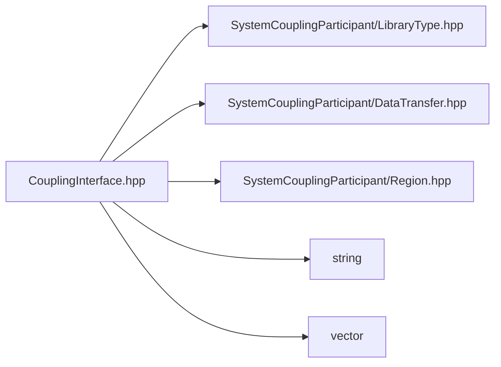

# File CouplingInterface.hpp

![][C++]

**Location**: `CouplingInterface.hpp`


## Classes

* [sysc::CouplingInterface](classsysc_1_1CouplingInterface.md#classsysc_1_1CouplingInterface)

## Namespaces

* [sysc](namespacesysc.md#namespacesysc)

## Includes

* SystemCouplingParticipant/LibraryType.hpp
* SystemCouplingParticipant/DataTransfer.hpp
* SystemCouplingParticipant/Region.hpp
* <string>
* <vector>



## Source

```cpp
/*
 * Copyright ANSYS, Inc. Unauthorized use, distribution, or duplication is prohibited.
 */

#pragma once

#include "SystemCouplingParticipant/LibraryType.hpp"

#include "SystemCouplingParticipant/DataTransfer.hpp"
#include "SystemCouplingParticipant/Region.hpp"

#include <string>
#include <vector>

namespace sysc {

class SYSTEM_COUPLING_PARTICIPANT_DLL CouplingInterface {
public:
  CouplingInterface(CouplingInterfaceName interfaceName);

  void addSideOneRegion(const Region& region);

  void addSideTwoRegion(const Region& region);

  const CouplingInterfaceName& getName() const;

  std::size_t getNumSideOneRegions() const;

  std::size_t getNumSideTwoRegions() const;

  const Region& getSideOneRegion(std::size_t index) const;

  const Region& getSideTwoRegion(std::size_t index) const;

  void addDataTransfer(const DataTransfer& dataTransfer);

  std::size_t getNumDataTransfers() const noexcept;

  const DataTransfer& getDataTransfer(std::size_t index) const;

private:
  CouplingInterfaceName m_name;

  std::vector<Region> m_sideOneRegions;
  std::map<RegionName, std::size_t> m_sideOneRegionsNameToIndex;

  std::vector<Region> m_sideTwoRegions;
  std::map<RegionName, std::size_t> m_sideTwoRegionsNameToIndex;

  std::vector<DataTransfer> m_dataTransfers;
};

}  // namespace sysc
```

[public]: https://img.shields.io/badge/-public-brightgreen (public)
[C++]: https://img.shields.io/badge/language-C%2B%2B-blue (C++)
[private]: https://img.shields.io/badge/-private-red (private)
[const]: https://img.shields.io/badge/-const-lightblue (const)