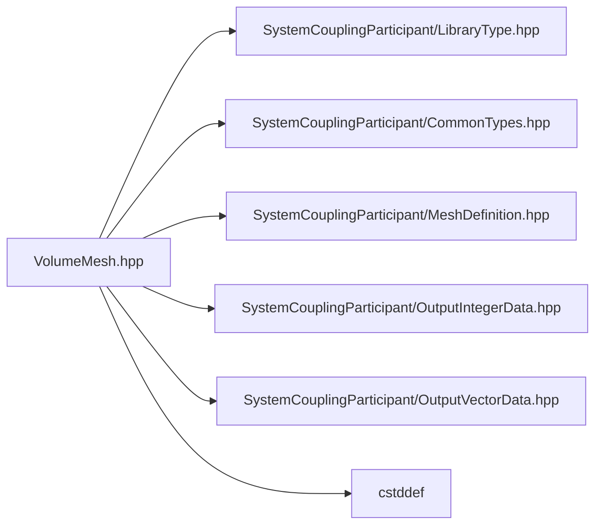

# File VolumeMesh.hpp

![][C++]

**Location**: `VolumeMesh.hpp`


## Classes

* [sysc::VolumeMesh](classsysc_1_1VolumeMesh.md#classsysc_1_1VolumeMesh)

## Namespaces

* [sysc](namespacesysc.md#namespacesysc)

## Includes

* SystemCouplingParticipant/LibraryType.hpp
* SystemCouplingParticipant/CommonTypes.hpp
* SystemCouplingParticipant/MeshDefinition.hpp
* SystemCouplingParticipant/OutputIntegerData.hpp
* SystemCouplingParticipant/OutputVectorData.hpp
* <cstddef>



## Source

```cpp
/*
 * Copyright ANSYS, Inc. Unauthorized use, distribution, or duplication is prohibited.
 */

#pragma once

#include "SystemCouplingParticipant/LibraryType.hpp"

#include "SystemCouplingParticipant/CommonTypes.hpp"
#include "SystemCouplingParticipant/MeshDefinition.hpp"
#include "SystemCouplingParticipant/OutputIntegerData.hpp"
#include "SystemCouplingParticipant/OutputVectorData.hpp"

#include <cstddef>

namespace sysc {

class SYSTEM_COUPLING_PARTICIPANT_DLL VolumeMesh {
public:
  std::int64_t connectivityStamp{0};

  std::int64_t coordinatesStamp{0};

  std::int64_t partitioningStamp{0};

  VolumeMesh(
    NodeData nodeData,
    CellData cellData);

  VolumeMesh(
    NodeData nodeData,
    FaceData faceData,
    CellData cellData);

  VolumeMesh() = default;

  VolumeMesh(const VolumeMesh&) = default;

  VolumeMesh(VolumeMesh&&) = default;

  VolumeMesh& operator=(const VolumeMesh&) = default;

  VolumeMesh& operator=(VolumeMesh&&) = default;

  const NodeData& getNodeData() const noexcept;

  const FaceData& getFaceData() const noexcept;

  const CellData& getCellData() const noexcept;

  ValidityStatus checkValidity() const;

  VolumeMesh(
    NodeData nodeData,
    ElementTypeData faceTypeData,
    ElementNodeCountData faceNodeCountData,
    ElementNodeConnectivityData faceNodeConnectivityData,
    FaceCellConnectivityData faceCellConnectivityData,
    CellIdData cellIdData,
    ElementTypeData cellTypeData,
    ElementNodeConnectivityData cellNodeConnectivityData);

  std::size_t getNumNodes() const noexcept;

  std::size_t getNumCells() const noexcept;

  OutputIntegerData getNodeIds() const noexcept;

  OutputVectorData getNodeCoords() const noexcept;

  ElementTypeData getFaceTypes() const noexcept;

  OutputIntegerData getFaceNodeCounts() const noexcept;

  OutputIntegerData getFaceNodeIds() const noexcept;

  OutputIntegerData getCell0Ids() const noexcept;

  OutputIntegerData getCell1Ids() const noexcept;

  CellIdData getCellIds() const noexcept;

  ElementTypeData getCellTypes() const noexcept;

  ElementNodeConnectivityData getCellNodeConnectivity() const noexcept;

  VolumeMesh(
    NodeData nodeData,
    ElementTypeData cellTypes,
    ElementNodeConnectivityData cellNodeIds);

  VolumeMesh(
    NodeData nodeData,
    ElementNodeCountData faceNodeCounts,
    ElementNodeConnectivityData faceNodeIds,
    FaceCellConnectivityData faceToCellConnectivity,
    CellIdData cellIds);

  MeshValidityStatus checkMeshValidity() const;

private:
  NodeData m_nodes;
  FaceData m_faces;
  CellData m_cells;
};

}  // namespace sysc
```

[public]: https://img.shields.io/badge/-public-brightgreen (public)
[C++]: https://img.shields.io/badge/language-C%2B%2B-blue (C++)
[private]: https://img.shields.io/badge/-private-red (private)
[const]: https://img.shields.io/badge/-const-lightblue (const)