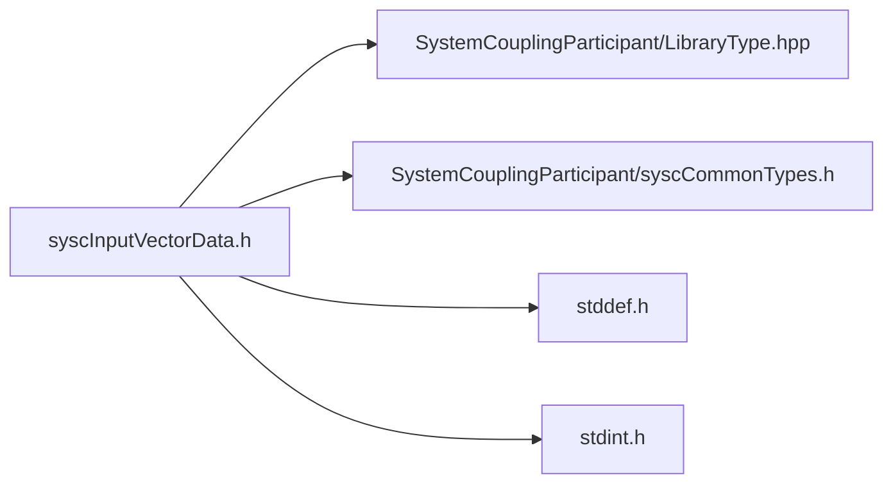

# File syscInputVectorData.h

![][C]

**Location**: `syscInputVectorData.h`


## Classes

* [SyscInputVectorData](structSyscInputVectorData.md#structSyscInputVectorData)

## Includes

* SystemCouplingParticipant/LibraryType.hpp
* SystemCouplingParticipant/syscCommonTypes.h
* <stddef.h>
* <stdint.h>



## Functions

<a id="group__SyscParticipantLibraryCAPI_1ga8609363d94eccb5ac5113332b5bd0d77"></a>
### Function syscGetInputVectorData

![][public]

```
SyscInputVectorData syscGetInputVectorData()
```

Create an input vector data access struct.

Primitive type will default to double-precision. Data size will be set to zero. Data pointers will be set to null.


**Return type**: [SyscInputVectorData](structSyscInputVectorData.md#structSyscInputVectorData)

<a id="group__SyscParticipantLibraryCAPI_1ga21f7b8327230f78d41e61bdac3f073c0"></a>
### Function syscGetInputVectorDataCompactDouble

![][public]

```
SyscInputVectorData syscGetInputVectorDataCompactDouble(double *const data, size_t dataSize)
```

Create an 3D input vector data access struct with compact storage.

**Parameters**:

* **data**: - pointer to the array of double-precision data
* **dataSize**: - number of vectors.


**Parameters**:

* double *const **data**
* size_t **dataSize**

**Return type**: [SyscInputVectorData](structSyscInputVectorData.md#structSyscInputVectorData)

<a id="group__SyscParticipantLibraryCAPI_1ga1dab4c326c88b20cb402ca06c84d39c2"></a>
### Function syscGetInputVectorDataCompactFloat

![][public]

```
SyscInputVectorData syscGetInputVectorDataCompactFloat(float *const data, size_t dataSize)
```

Create an 3D input vector data access struct with compact storage.

**Parameters**:

* **data**: - pointer to the array of single-precision data
* **dataSize**: - number of vectors.


**Parameters**:

* float *const **data**
* size_t **dataSize**

**Return type**: [SyscInputVectorData](structSyscInputVectorData.md#structSyscInputVectorData)

<a id="group__SyscParticipantLibraryCAPI_1ga5432989ff9b68845634e551c6246e42e"></a>
### Function syscGetInputVectorDataSplitDouble

![][public]

```
SyscInputVectorData syscGetInputVectorDataSplitDouble(double *const data0, double *const data1, double *const data2, size_t dataSize)
```

Create an 3D input vector data access struct with split storage.

**Parameters**:

* **data0**: - pointer to the first array of double-precision data
* **data1**: - pointer to the second array of double-precision data
* **data2**: - pointer to the third array of double-precision data
* **dataSize**: - number of vectors.


**Parameters**:

* double *const **data0**
* double *const **data1**
* double *const **data2**
* size_t **dataSize**

**Return type**: [SyscInputVectorData](structSyscInputVectorData.md#structSyscInputVectorData)

<a id="group__SyscParticipantLibraryCAPI_1ga774cdf0f3bb11efe50a587e6a11e7539"></a>
### Function syscGetInputVectorDataSplitFloat

![][public]

```
SyscInputVectorData syscGetInputVectorDataSplitFloat(float *const data0, float *const data1, float *const data2, size_t dataSize)
```

Create an 3D input vector data access struct with split storage.

**Parameters**:

* **data0**: - pointer to the first array of single-precision data
* **data1**: - pointer to the second array of single-precision data
* **data2**: - pointer to the third array of single-precision data
* **dataSize**: - number of vectors.


**Parameters**:

* float *const **data0**
* float *const **data1**
* float *const **data2**
* size_t **dataSize**

**Return type**: [SyscInputVectorData](structSyscInputVectorData.md#structSyscInputVectorData)

<a id="group__SyscParticipantLibraryCAPI_1gadc1d6ed1a05cf21b0b38af4ea8247eb3"></a>
### Function syscGetInputVectorDataCompactDoubleDim

![][public]

```
SyscInputVectorData syscGetInputVectorDataCompactDoubleDim(double *const data, size_t dataSize, enum SyscDimension dimension)
```

Create an input vector data access struct with compact storage based on dimension.

**Parameters**:

* **data**: - pointer to the array of double-precision data
* **dataSize**: - number of vectors.
* **dimension**: - dimension of complex vector data.


**Parameters**:

* double *const **data**
* size_t **dataSize**
* enum [SyscDimension](syscCommonTypes_8h.md#group__SyscParticipantLibraryCAPI_1gac5a5f66ee72fd8015eab632a642cf26d) **dimension**

**Return type**: [SyscInputVectorData](structSyscInputVectorData.md#structSyscInputVectorData)

<a id="group__SyscParticipantLibraryCAPI_1ga0e5591d56881dec17e9ebaa087a7a198"></a>
### Function syscGetInputVectorDataCompactFloatDim

![][public]

```
SyscInputVectorData syscGetInputVectorDataCompactFloatDim(float *const data, size_t dataSize, enum SyscDimension dimension)
```

Create an input vector data access struct with compact storage based on dimension.

**Parameters**:

* **data**: - pointer to the array of single-precision data
* **dataSize**: - number of vectors.
* **dimension**: - dimension of complex vector data.


**Parameters**:

* float *const **data**
* size_t **dataSize**
* enum [SyscDimension](syscCommonTypes_8h.md#group__SyscParticipantLibraryCAPI_1gac5a5f66ee72fd8015eab632a642cf26d) **dimension**

**Return type**: [SyscInputVectorData](structSyscInputVectorData.md#structSyscInputVectorData)

<a id="group__SyscParticipantLibraryCAPI_1gab707ea57d70a474cfdab07c35dc7dcf7"></a>
### Function syscGetInput2DVectorDataSplitDouble

![][public]

```
SyscInputVectorData syscGetInput2DVectorDataSplitDouble(double *const data0, double *const data1, size_t dataSize)
```

Create an 2D input vector data access struct with split storage.

**Parameters**:

* **data0**: - pointer to the first array of double-precision data
* **data1**: - pointer to the second array of double-precision data
* **dataSize**: - number of vectors.


**Parameters**:

* double *const **data0**
* double *const **data1**
* size_t **dataSize**

**Return type**: [SyscInputVectorData](structSyscInputVectorData.md#structSyscInputVectorData)

<a id="group__SyscParticipantLibraryCAPI_1gad39531d8943485fe6a586ce4dbdc5107"></a>
### Function syscGetInput2DVectorDataSplitFloat

![][public]

```
SyscInputVectorData syscGetInput2DVectorDataSplitFloat(float *const data0, float *const data1, size_t dataSize)
```

Create an 2D input vector data access struct with split storage.

**Parameters**:

* **data0**: - pointer to the first array of single-precision data
* **data1**: - pointer to the second array of single-precision data
* **dataSize**: - number of vectors.


**Parameters**:

* float *const **data0**
* float *const **data1**
* size_t **dataSize**

**Return type**: [SyscInputVectorData](structSyscInputVectorData.md#structSyscInputVectorData)

## Source

```
/*
* Copyright ANSYS, Inc. Unauthorized use, distribution, or duplication is prohibited.
*/

#pragma once

#include "SystemCouplingParticipant/LibraryType.hpp"

#include "SystemCouplingParticipant/syscCommonTypes.h"

#include <stddef.h>
#include <stdint.h>

#ifdef __cplusplus
extern "C" {
#endif

typedef struct {
  enum SyscPrimitiveType primitiveType; 
  void* data0;                          
  void* data1;                          
  void* data2;                          
  size_t size;                          
  enum SyscDimension dimension;         
} SyscInputVectorData;

SyscInputVectorData syscGetInputVectorData();

SyscInputVectorData syscGetInputVectorDataCompactDouble(
  double* const data,
  size_t dataSize);

SyscInputVectorData syscGetInputVectorDataCompactFloat(
  float* const data,
  size_t dataSize);

SyscInputVectorData syscGetInputVectorDataSplitDouble(
  double* const data0,
  double* const data1,
  double* const data2,
  size_t dataSize);

SyscInputVectorData syscGetInputVectorDataSplitFloat(
  float* const data0,
  float* const data1,
  float* const data2,
  size_t dataSize);

SyscInputVectorData syscGetInputVectorDataCompactDoubleDim(
  double* const data,
  size_t dataSize,
  enum SyscDimension dimension);

SyscInputVectorData syscGetInputVectorDataCompactFloatDim(
  float* const data,
  size_t dataSize,
  enum SyscDimension dimension);

SyscInputVectorData syscGetInput2DVectorDataSplitDouble(
  double* const data0,
  double* const data1,
  size_t dataSize);

SyscInputVectorData syscGetInput2DVectorDataSplitFloat(
  float* const data0,
  float* const data1,
  size_t dataSize);

#ifdef __cplusplus
}
#endif
```

[public]: https://img.shields.io/badge/-public-brightgreen (public)
[C]: https://img.shields.io/badge/language-C-blue (C)