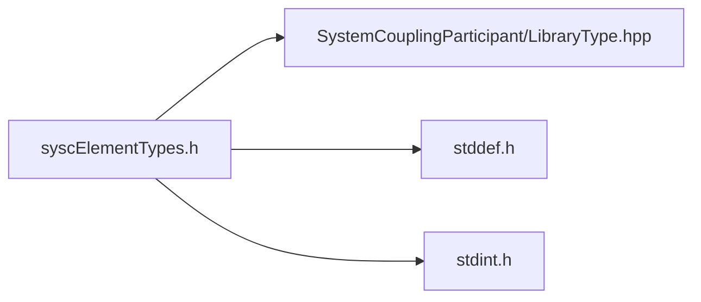

# File syscElementTypes.h

![][C]

**Location**: `syscElementTypes.h`


## Includes

* SystemCouplingParticipant/LibraryType.hpp
* <stddef.h>
* <stdint.h>



## Enumeration types

<a id="group__SyscParticipantLibraryCAPI_1gab18060c2493ddba0678016696642f005"></a>
### Enumeration type SyscElementTypes

![][public]

**Definition**: `syscElementTypes.h` (line 238)

```
enum SyscElementTypes {
  SyscTri3 = 5,
  SyscTri6 = 6,
  SyscQuad4 = 7,
  SyscQuad8 = 8,
  SyscTet4 = 9,
  SyscTet10 = 10,
  SyscHex8 = 11,
  SyscHex20 = 12,
  SyscWedge6 = 13,
  SyscWedge15 = 14,
  SyscPyramid5 = 15,
  SyscPyramid13 = 16,
  SyscPolygon = 18,
  SyscPolyhedron = 19
}
```

Provide an enum for element types.


<a id="group__SyscParticipantLibraryCAPI_1ggab18060c2493ddba0678016696642f005a77470006c9f90e0699d34cb4529977bd"></a>
#### Enumerator SyscTri3


Trilateral element with corner nodes only.

<a id="group__SyscParticipantLibraryCAPI_1ggab18060c2493ddba0678016696642f005ad973b33a8c615a7088218bb68c95cef1"></a>
#### Enumerator SyscTri6


Trilateral element with corner and mid-side nodes.

<a id="group__SyscParticipantLibraryCAPI_1ggab18060c2493ddba0678016696642f005ac829eb996aacda6977a2633d3d4b6ae0"></a>
#### Enumerator SyscQuad4


Quadrilateral element with corner nodes only.

<a id="group__SyscParticipantLibraryCAPI_1ggab18060c2493ddba0678016696642f005aefd1fe32f0987d59a023071a8d6729a9"></a>
#### Enumerator SyscQuad8


Quadrilateral element with corner and mid-side nodes.

<a id="group__SyscParticipantLibraryCAPI_1ggab18060c2493ddba0678016696642f005afb767ddc846b275cc9f06f4c552ef8ea"></a>
#### Enumerator SyscTet4


Tetrahedral element with corner nodes only.

<a id="group__SyscParticipantLibraryCAPI_1ggab18060c2493ddba0678016696642f005a706ca034c9b7e05f8f2a87301b72a6be"></a>
#### Enumerator SyscTet10


Tetrahedral element with corner and mid-side nodes.

<a id="group__SyscParticipantLibraryCAPI_1ggab18060c2493ddba0678016696642f005a15bbc3ed5ebf288d89e4e9af7ce9e0ae"></a>
#### Enumerator SyscHex8


Hexahedral element with corner nodes only.

<a id="group__SyscParticipantLibraryCAPI_1ggab18060c2493ddba0678016696642f005a4eaa66437832a76bdcbc92a727dfedd1"></a>
#### Enumerator SyscHex20


Hexahedral element with corner and mid-side nodes.

<a id="group__SyscParticipantLibraryCAPI_1ggab18060c2493ddba0678016696642f005a05727b1e9b0ab410f1d5f9c31337b508"></a>
#### Enumerator SyscWedge6


Wedge element with corner nodes only.

<a id="group__SyscParticipantLibraryCAPI_1ggab18060c2493ddba0678016696642f005a53a4340e11f6e1a6b75f084f2518649a"></a>
#### Enumerator SyscWedge15


Wedge element with corner and mid-side nodes.

<a id="group__SyscParticipantLibraryCAPI_1ggab18060c2493ddba0678016696642f005a6389c588d45313437139bcea52d94866"></a>
#### Enumerator SyscPyramid5


Pyramid element with corner nodes only.

<a id="group__SyscParticipantLibraryCAPI_1ggab18060c2493ddba0678016696642f005a366c507804e6022a52b6f38852861b1b"></a>
#### Enumerator SyscPyramid13


Pyramid element with corner and mid-side nodes.

<a id="group__SyscParticipantLibraryCAPI_1ggab18060c2493ddba0678016696642f005ac46af723ae879263d8c74a0cd91dfb9e"></a>
#### Enumerator SyscPolygon


Arbitrary polygon.

<a id="group__SyscParticipantLibraryCAPI_1ggab18060c2493ddba0678016696642f005aa1667251e6eb0b96ab2b003591a8983f"></a>
#### Enumerator SyscPolyhedron


Arbitrary polyhedron.

## Source

```
/*
* Copyright ANSYS, Inc. Unauthorized use, distribution, or duplication is prohibited.
*/

#pragma once

#include "SystemCouplingParticipant/LibraryType.hpp"

#include <stddef.h>
#include <stdint.h>

#ifdef __cplusplus
extern "C" {
#endif

enum SyscElementTypes {
  SyscTri3 = 5,       
  SyscTri6 = 6,       
  SyscQuad4 = 7,      
  SyscQuad8 = 8,      
  SyscTet4 = 9,       
  SyscTet10 = 10,     
  SyscHex8 = 11,      
  SyscHex20 = 12,     
  SyscWedge6 = 13,    
  SyscWedge15 = 14,   
  SyscPyramid5 = 15,  
  SyscPyramid13 = 16, 
  SyscPolygon = 18,   
  SyscPolyhedron = 19 
};

#ifdef __cplusplus
}
#endif
```

[public]: https://img.shields.io/badge/-public-brightgreen (public)
[C]: https://img.shields.io/badge/language-C-blue (C)