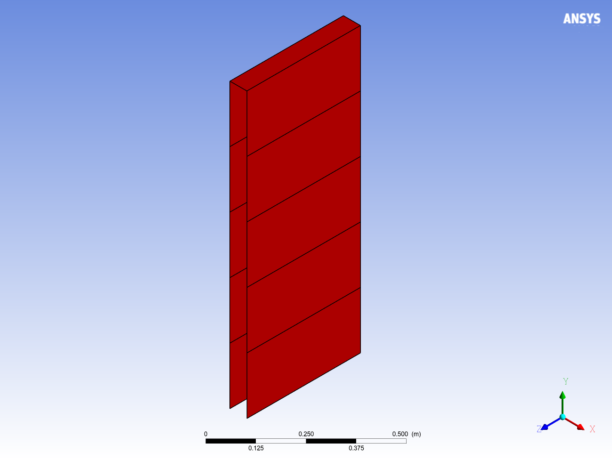
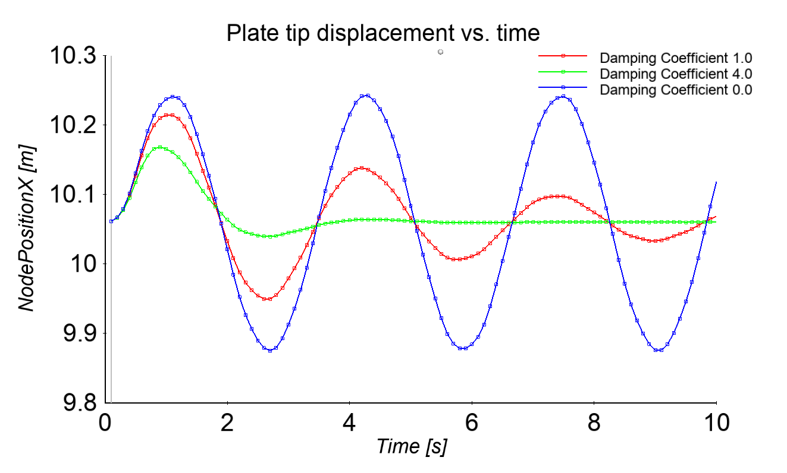

# Oscillating plate damping tutorial

This tutorial demonstrates the implementation of System Coupling Participant
Library APIs in a transient coupled analysis.

This example shows how to set up and perform a transient coupled analysis using
a simple test solver and the Ansys Mechanical solver as participants.

It also shows how to implement the restart interfaces in the participant solver,
create restart points at specified intervals, and restart the coupled analysis
from a previously generated restart point.

## Topics covered

- Transient analysis
- Force and nodal displacements transfer
- Coupling to Ansys Mechanical
- Restarts
- Setup via the direct setup approach

## Verify prerequisites

Ensure that the following prerequisites are met. You've installed:

- A compiler for one of the [supported languages](compiling-linking-executing.md)
- Ansys installation, including System Coupling and Mechanical

## Problem description and participant setup

This example is a modification of System Coupling's _Oscillating Plate Fluid-Structure Interaction_ tutorial.

The setup of the Mechanical participant is identical to the oscillating plate
tutorial. A thin flexible plate, made of a linear elastic material, (Young's
modulus = 2.5E6 [Pa], Poisson's ratio = 0.35, density = 2550 [kg m^-3]) has a
fixed support along its bottom face. A pressure load of 100 [Pa] is applied on
one side of the plate for the first 0.5 [s] of the simulation, which starts the
oscillation. The setup is illustrated in _Figure 1_.

  
_Figure 1: Structural solver geometry_

Since the purpose of this example is to demonstrate the use of Participant
Library APIs for a transient analysis, a simple damping force solver will be
used to couple with Mechanical via System Coupling. This solver receives nodal
displacements $\vec{X}$ from Mechanical and calculates the damping force
$\vec{F}$ using the following formula:

$$
\vec{F} = - c \frac{d\vec{X}}{dt}
$$

where $c$ is the damping coefficient and $\frac{d\vec{X}}{dt}$ is the rate of change
of nodal positions with respect to time (nodal velocities).
The damping solver will then provide the calculated
forces to Mechanical via System Coupling, and these damping forces will cause the
oscillations to diminish in amplitude. The higher the damping coefficient value is,
the faster the oscillations will diminish. The damping coefficient value of 1.0
will be provided to the damping solver via a command line argument `--dampcoeff 1.0`.

The surface mesh for the damping solver consists of 11 quadrilateral elements
that overlap the plate surface in Mechanical. The surface mesh is shown in _Figure 2_.

  
_Figure 2: Surface mesh in the damping solver_

## Get the necessary files

Download the [SCP library tutorial package](https://github.com/ansys/DevRelPublic/raw/main/Downloads/SystemCoupling/syc_ParticipantLibrary_r2_25.zip)
and extract it to a local directory. Inside the resulting directory, you will
find a subdirectory called **OscillatingPlateDamping**. This will serve as the
simulation working directory and contains all the files needed for this
tutorial. The contents of this subdirectory are:

- **dampingsolver**:
Directory containing the following files:
  - `OscillatingPlateDamping`: Linux binary executable
  - `OscillatingPlateDamping.bat`: Windows batch script wrapper around the Windows executable
  - `OscillatingPlateDamping.c`: Sample C damping solver code and explanatory comments
  - `OscillatingPlateDamping.cpp`: Sample C++ damping solver code and explanatory comments
  - `OscillatingPlateDamping.exe`: Windows binary executable
  - `OscillatingPlateDamping.f`: Sample Fortran (fixed-form) damping solver code and explanatory comments
  - `OscillatingPlateDamping.py`: Sample Python damping solver code and explanatory comments
  - `OscillatingPlateDamping.sh`: Linux shell script wrapper around the Linux executable
  - `OscillatingPlateDampingPython.bat`: Windows batch script wrapper around the Python damping solver script
  - `OscillatingPlateDampingPython.sh`: Linux shell script wrapper around the Python damping solver script

- **mapdl**: Directory containing the Mechanical case file, `ds.dat`

- `mapdl.scp`: Participant Setup file containing the Mechanical solver setup
  information to be consumed by System Coupling.

- `run.py`: System Coupling script file that sets up and executes the coupled
  analysis.

- `runRestart.py`: System Coupling script file that restarts the coupled
  analysis from a previously created intermediate restart point.

## Build the damping solver

Build the damping solver program using a compiler for one of
the supported languages.

> **NOTE:** _Pre-built solver executables are provided along with
> the source code, so this step is optional._

The source code is provided in the **dampingsolver** subdirectory.
In the following examples, damping solver applications are built with different configurations.
The actual build steps depend on your system configuration, compilers, and other details.
See
[Compiling, linking, and executing applications that use the Participant library](compiling-linking-executing.md)
for additional information.

The following compilers were used in these examples:

- **Linux**
  - GNU (g++, gcc, and gfortran) 6.3.0
- **Windows**
  - Microsoft (R) C/C++ Optimizing Compiler Version 19.10.25027 for x64
  - Intel(R) Visual Fortran Intel(R) 64 Compiler Version 19.0.4.245

In the following examples, replace

- `<ANSYSInstallationPath>` with the correct Ansys installation path.
- `<MultiportVersion>` with the correct version of the Fluent Multiport library.

### Linux

#### C++

```bash
g++ -std=c++11 -I<ANSYSInstallationPath>/SystemCoupling/runTime/linx64/include -L<ANSYSInstallationPath>/SystemCoupling/runTime/linx64/bin -L<ANSYSInstallationPath>/SystemCoupling/runTime/linx64/cnlauncher/fluent/fluent<MultiportVersion>/multiport/mpi_wrapper/lnamd64/stub -o OscillatingPlateDamping OscillatingPlateDamping.cpp -lSysC.SystemCouplingParticipant -lmpi_wrapper
```

#### C

```bash
gcc -I<ANSYSInstallationPath>/SystemCoupling/runTime/linx64/include -L<ANSYSInstallationPath>/SystemCoupling/runTime/linx64/bin -L<ANSYSInstallationPath>/SystemCoupling/runTime/linx64/cnlauncher/fluent/fluent<MultiportVersion>/multiport/mpi_wrapper/lnamd64/stub -o OscillatingPlateDamping OscillatingPlateDamping.c -lSysC.SystemCouplingParticipant -lmpi_wrapper
```

#### Fortran

```bash
gfortran -I<ANSYSInstallationPath>/SystemCoupling/runTime/linx64/include/SystemCouplingParticipant/FortranFixedForm -L<ANSYSInstallationPath>/SystemCoupling/runTime/linx64/bin -L<ANSYSInstallationPath>/SystemCoupling/runTime/linx64/cnlauncher/fluent/fluent<MultiportVersion>/multiport/mpi_wrapper/lnamd64/stub -o OscillatingPlateDamping OscillatingPlateDamping.f -lSysC.SystemCouplingParticipant.Fortran -lmpi_wrapper
```

### Windows

#### C++

```bat
cl /EHsc /I"<ANSYSInstallationPath>\SystemCoupling\runTime\winx64\include" OscillatingPlateDamping.cpp /FeOscillatingPlateDamping.exe /link /subsystem:console /LIBPATH:"<ANSYSInstallationPath>\SystemCoupling\runTime\winx64\lib" SysC.SystemCouplingParticipant.lib
```

#### C

```bat
cl /EHsc /I"<ANSYSInstallationPath>\SystemCoupling\runTime\winx64\include" OscillatingPlateDamping.c /FeOscillatingPlateDamping.exe /link /subsystem:console /LIBPATH:"<ANSYSInstallationPath>\SystemCoupling\runTime\winx64\lib" SysC.SystemCouplingParticipant.lib
```

#### Fortran

```bat
ifort -I"<ANSYSInstallationPath>\SystemCoupling\runTime\winx64\include\SystemCouplingParticipant\FortranFixedForm" /FeOscillatingPlateDamping.exe OscillatingPlateDamping.f /link /subsystem:console /LIBPATH:"<ANSYSInstallationPath>\SystemCoupling\runTime\winx64\lib" SysC.SystemCouplingParticipant.Fortran.lib
```

## Run the coupled analysis

Once you have created the damping solver program, run the coupled analysis using System Coupling.
To do so, execute the `run.py` script to run System Coupling in batch mode:

```bash
<Ansys Installation Directory>/SystemCoupling/bin/systemcoupling -R run.py
```

Note that in order to use a Python solver, you should replace `OscillatingPlateDamping.bat` with `OscillatingPlateDampingPython.bat` and `OscillatingPlateDamping.sh` with `OscillatingPlateDampingPython.sh` inside the `run.py` script.

If the case runs without issue, you've successfully created a simple damping solver and
run a co-simulation between Mechanical and this damping solver.

## Visualize the results in Ansys EnSight

Use Ansys EnSight to view the Mechanical solver results after the co-simulation run is complete.
You'll be able to plot the plate deformation over time.
One point at the top of the plate will be used to track the displacement
in the chart, which is a useful way to verify that the damping occurs
due to the force calculated in the damping solver.

1. **Open Ansys EnSight.**

2. **Load the Mechanical solver results file.**

    a. In the EnSight menu toolbar, select **File > Open**.

    b. In the **Open...** dialog, select the Mechanical results file
       that was generated during the co-simulation, `file.rst`.

    c. Select **Load all parts**.
      - The Mechanical results file is loaded and the geometry is displayed in EnSight's viewer.

    d. In the **Parts** pane, de-select the **Show** check-box for `Part 2`.

3. **Enable deformation.**

    To enable the deformation of the plate, perform the following steps:

    a. In the **Parts** pane, double-click the `Part 0`.
      - The **Edit attributes for tagged Model part** dialog opens.

    b. In the dialog, set the following attributes:
      - Select the **Advanced** check box.
      - Under **Displacement**, set **Displace** by to `(N) Displacement`.
      - Verify that **Factor** is set to `1.0`.

    c. Click **Close** to exit the dialog.

    Deformation has been enabled for the solid body.

4. **Visualize the nodal displacement.**

    Visualize the total nodal displacement as a function of time.
    Begin by creating a function that includes both the nodal coordinate and
    the nodal displacement values and then create a graph that plots this function.
    To do so, perform the following steps:

    a. In the **Parts** pane, select `Part 0`.

    b. Create a function to express the nodal coordinate vs. time.
      - In the **Feature Icon bar** at the top of the window, click the **Calculator** icon.
        - The **Calculator Tool Box** dialog opens.
      - Click the **Build your own functions** icon.
      - For **Variable name**, type in `NodePositionX`.
      - Create an expression `Coordinates[X]+Displacement[X]`:
        - Under **Variable**, click **Coordinates**.
        - In the **calculator**, click the **[X]** button and then the **+** (addition) button.
        - Under **Variable**, click **Displacement**.
        - In the **calculator**, click the **[X]** button.
      - Click the **Evaluate for selected parts** button. The `NodePositionX` quantity is created.
      - Click **Close** to exit the dialog.

    c. Create the chart.
      - In the **Feature Icon bar** at the top of the window, click the **Query** icon.
      - The **Create/Edit Query/plot** dialog opens.
      - Under **Query Creation**, make the following selections:
        - For **Sample**, select `At node over time`.
        - For **Variable 1**, select the vector quantity created in the previous step, `(N) NodePositionX`.
        - For **Node ID**, type in `77`. This point is at the top corner of the solid body and will be used to track the deformation of the plate.
      - Click the **Create query** button. The chart is added to the graphics window.
      - Click **Close** to exit the dialog.

5. **Animate the chart.**

    In the **Time** pane, click the **Play forward** button. An animation of the
    graph, the geometry, and the time annotation is played, showing the total
    nodal displacement of the plate over time. Note that the damping that is
    visible in the plate's motion.

  
_Figure 3: Plot of plate tip x-displacements over time_

**Figure 4** shows the chart of plate tip position over time for different
damping coefficients. As expected, the higher the damping coefficient is, the faster the
plate oscillations diminish in amplitude.

  
_Figure 4: Plot of plate tip x-displacements over time for different damping coefficients_

## Restarting the coupled analysis from an intermediate point

In the initial coupled analysis, the restart point was generated at every 10th
coupling time step.

The damping solver source code shows how to implement
the restart APIs for this problem.

- The `createRestartPoint` function was implemented and registered
- When the above function is called, it will create a text file and
  write current nodal coordinates and force values. This is the only information
  that is required to cleanly restart the damping solver at a given time step.
  The name of the restart file is returned from that function.
- When System Coupling restarts from a given coupling step, it will
  pass the restart file name as a command line argument to the
  damping solver.
- The damping solver will read in the nodal coordinates and forces from
  the restart file prior to entering the coupled analysis loop.

The coupled analysis will now be restarted from
the 50th step (simulation time 5.0 [s]) and solved through the 100th step
(simulation time 10.0 [s]).

The restart script `runRestart.py` is provided with this tutorial.
To run the coupled analysis, execute the restart script in batch mode:

```bash
<Ansys Installation Directory>/SystemCoupling/bin/systemcoupling -R runRestart.py
```

The coupled analysis should restart and solve until the end. The Ansys
Mechanical results can be post-processed the same way as for the initial run.
_Figure 5_ shows the chart of the plate tip position over time for the
continuous and restarted analysis. The results show that nearly identical
displacements are achieved from the restarted run. The very slight differences
can be attributed to the limitations within System Coupling and Ansys
Mechanical. For a more detailed description of these limitation, see "Restarting
a Coupled Analysis" in the _System Coupling User's Guide_.


_Figure 5: Comparison of results between the continuous and restarted runs_
