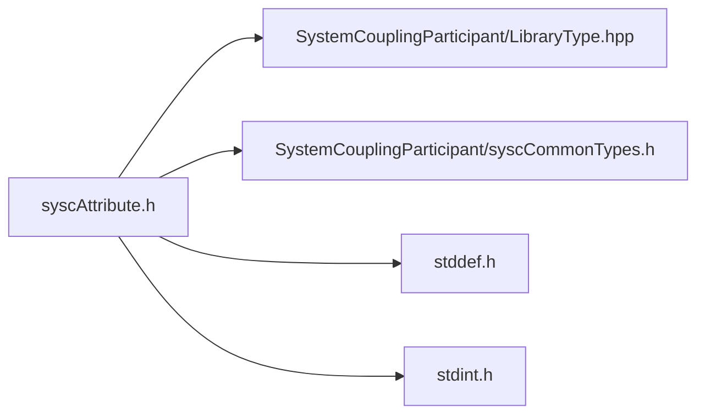

# File syscAttribute.h

![][C]

**Location**: `syscAttribute.h`


## Classes

* [SyscRealAttribute](structSyscRealAttribute.md#structSyscRealAttribute)
* [SyscIntegerAttribute](structSyscIntegerAttribute.md#structSyscIntegerAttribute)

## Includes

* SystemCouplingParticipant/LibraryType.hpp
* SystemCouplingParticipant/syscCommonTypes.h
* <stddef.h>
* <stdint.h>



## Functions

<a id="group__SyscParticipantLibraryCAPI_1ga7025ebcdef40667b4c2df0d2b087f600"></a>
### Function syscGetRealAttribute

![][public]

```
SyscRealAttribute syscGetRealAttribute(const char *name, double value, SyscDimensionality dimensionality)
```

Create a real-valued attribute.

**Parameters**:

* **name**: - attribute name.
* **value**: - attribute value.
* **dimensionality**: - attribute dimensionality.


**Parameters**:

* const char * **name**
* double **value**
* [SyscDimensionality](structSyscDimensionality.md#structSyscDimensionality) **dimensionality**

**Return type**: [SyscRealAttribute](structSyscRealAttribute.md#structSyscRealAttribute)

<a id="group__SyscParticipantLibraryCAPI_1ga65737d6497a88298c80afab5d62f7687"></a>
### Function syscGetRealAttributeVDM

![][public]

```
SyscRealAttribute syscGetRealAttributeVDM(const char *name, double value, SyscDimensionality dimensionality, int modifiable)
```

Create a real-valued attribute.

**Parameters**:

* **name**: - attribute name.
* **value**: - attribute value.
* **dimensionality**: - attribute dimensionality.
* **modifiable**: - attribute is modifiable.


**Parameters**:

* const char * **name**
* double **value**
* [SyscDimensionality](structSyscDimensionality.md#structSyscDimensionality) **dimensionality**
* int **modifiable**

**Return type**: [SyscRealAttribute](structSyscRealAttribute.md#structSyscRealAttribute)

<a id="group__SyscParticipantLibraryCAPI_1gaf6d02a55f607a7af07039957b21ab511"></a>
### Function syscGetIntegerAttribute

![][public]

```
SyscIntegerAttribute syscGetIntegerAttribute(const char *name, long long int value)
```

Create an integer-valued attribute.

**Parameters**:

* **name**: - attribute name.
* **value**: - attribute value.


**Parameters**:

* const char * **name**
* long long int **value**

**Return type**: [SyscIntegerAttribute](structSyscIntegerAttribute.md#structSyscIntegerAttribute)

<a id="group__SyscParticipantLibraryCAPI_1gac3ae9103fa3cad3c60b1f794ecb27752"></a>
### Function syscGetIntegerAttributeVM

![][public]

```
SyscIntegerAttribute syscGetIntegerAttributeVM(const char *name, long long int value, int modifiable)
```

Create an integer-valued attribute.

**Parameters**:

* **name**: - attribute name.
* **value**: - attribute value.
* **modifiable**: - attribute is modifiable.


**Parameters**:

* const char * **name**
* long long int **value**
* int **modifiable**

**Return type**: [SyscIntegerAttribute](structSyscIntegerAttribute.md#structSyscIntegerAttribute)

## Source

```
/*
* Copyright ANSYS, Inc. Unauthorized use, distribution, or duplication is prohibited.
*/

#pragma once

#include "SystemCouplingParticipant/LibraryType.hpp"

#include "SystemCouplingParticipant/syscCommonTypes.h"

#include <stddef.h>
#include <stdint.h>

#ifdef __cplusplus
extern "C" {
#endif

typedef struct {
  char name[SYSC_STRING_LENGTH];     
  double value;                      
  SyscDimensionality dimensionality; 
  int modifiable;                    
} SyscRealAttribute;

SyscRealAttribute syscGetRealAttribute(
  const char* name,
  double value,
  SyscDimensionality dimensionality);

SyscRealAttribute syscGetRealAttributeVDM(
  const char* name,
  double value,
  SyscDimensionality dimensionality,
  int modifiable);

typedef struct {
  char name[SYSC_STRING_LENGTH]; 
  long long int value;           
  int modifiable;                
} SyscIntegerAttribute;

SyscIntegerAttribute syscGetIntegerAttribute(
  const char* name,
  long long int value);

SyscIntegerAttribute syscGetIntegerAttributeVM(
  const char* name,
  long long int value,
  int modifiable);

#ifdef __cplusplus
}
#endif
```

[public]: https://img.shields.io/badge/-public-brightgreen (public)
[C]: https://img.shields.io/badge/language-C-blue (C)