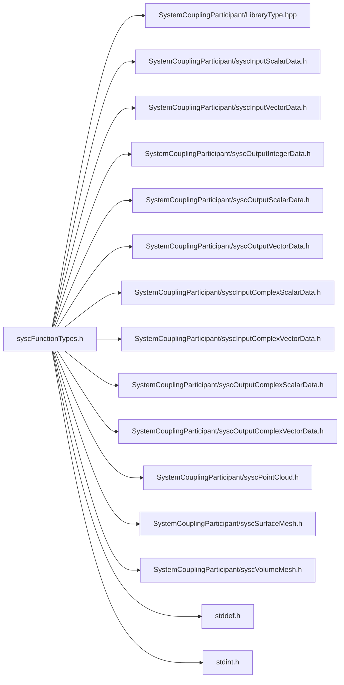

# File syscFunctionTypes.h

![][C]

**Location**: `syscFunctionTypes.h`


## Includes

* SystemCouplingParticipant/LibraryType.hpp
* SystemCouplingParticipant/syscInputScalarData.h
* SystemCouplingParticipant/syscInputVectorData.h
* SystemCouplingParticipant/syscOutputIntegerData.h
* SystemCouplingParticipant/syscOutputScalarData.h
* SystemCouplingParticipant/syscOutputVectorData.h
* SystemCouplingParticipant/syscInputComplexScalarData.h
* SystemCouplingParticipant/syscInputComplexVectorData.h
* SystemCouplingParticipant/syscOutputComplexScalarData.h
* SystemCouplingParticipant/syscOutputComplexVectorData.h
* SystemCouplingParticipant/syscPointCloud.h
* SystemCouplingParticipant/syscSurfaceMesh.h
* SystemCouplingParticipant/syscVolumeMesh.h
* <stddef.h>
* <stdint.h>



## Typedefs

<a id="group__SyscParticipantLibraryCAPI_1gaaf3788ac706a730edbf6093c7e543681"></a>
### Typedef SyscInputScalarDataAccess

![][public]

**Definition**: `syscFunctionTypes.h` (line 39)

```
typedef SyscInputScalarData(* SyscInputScalarDataAccess) (const char *regionName, const char *variableName)
```

Provide function prototype for access to input scalar data.


**Return type**: [SyscInputScalarData](structSyscInputScalarData.md#structSyscInputScalarData)(*

<a id="group__SyscParticipantLibraryCAPI_1gad41922f1a4f5abb891d5a913ba5fcccf"></a>
### Typedef SyscInputScalarDataAccessWithPointer

![][public]

**Definition**: `syscFunctionTypes.h` (line 46)

```
typedef SyscInputScalarData(* SyscInputScalarDataAccessWithPointer) (SyscOpaqueDataAccess opaqueDataAccess, const char *regionName, const char *variableName)
```

Provide function prototype for access to input scalar data with opaque pointer.


**Return type**: [SyscInputScalarData](structSyscInputScalarData.md#structSyscInputScalarData)(*

<a id="group__SyscParticipantLibraryCAPI_1ga844dc6322bd6e4eabc2d3d2d9e69bdb1"></a>
### Typedef SyscInputScalarDataMultiZoneAccess

![][public]

**Definition**: `syscFunctionTypes.h` (line 54)

```
typedef SyscInputScalarData(* SyscInputScalarDataMultiZoneAccess) (SyscOpaqueDataAccess opaqueDataAccess, const char *regionName, const char *variableName, uint16_t zoneIndex)
```

Provide function prototype for access to multi-zone input scalar data.


**Return type**: [SyscInputScalarData](structSyscInputScalarData.md#structSyscInputScalarData)(*

<a id="group__SyscParticipantLibraryCAPI_1ga8d5f53de4e65a4bacef0f25ba8b46483"></a>
### Typedef SyscInputVectorDataAccess

![][public]

**Definition**: `syscFunctionTypes.h` (line 63)

```
typedef SyscInputVectorData(* SyscInputVectorDataAccess) (const char *regionName, const char *variableName)
```

Provide function prototype for access to input vector data.


**Return type**: [SyscInputVectorData](structSyscInputVectorData.md#structSyscInputVectorData)(*

<a id="group__SyscParticipantLibraryCAPI_1gae7c6372393f3ec720b8d6d1535fcf9b3"></a>
### Typedef SyscInputVectorDataAccessWithPointer

![][public]

**Definition**: `syscFunctionTypes.h` (line 70)

```
typedef SyscInputVectorData(* SyscInputVectorDataAccessWithPointer) (SyscOpaqueDataAccess opaqueDataAccess, const char *regionName, const char *variableName)
```

Provide function prototype for access to input vector data with opaque pointer.


**Return type**: [SyscInputVectorData](structSyscInputVectorData.md#structSyscInputVectorData)(*

<a id="group__SyscParticipantLibraryCAPI_1gae2e92f1b7ae911c36bf3606c60a01511"></a>
### Typedef SyscInputVectorDataMultiZoneAccess

![][public]

**Definition**: `syscFunctionTypes.h` (line 78)

```
typedef SyscInputVectorData(* SyscInputVectorDataMultiZoneAccess) (SyscOpaqueDataAccess opaqueDataAccess, const char *regionName, const char *variableName, uint16_t zoneIndex)
```

Provide function prototype for access to multi-zone input vector data.


**Return type**: [SyscInputVectorData](structSyscInputVectorData.md#structSyscInputVectorData)(*

<a id="group__SyscParticipantLibraryCAPI_1gabd35283796cae3d3dbc851ac66b8564f"></a>
### Typedef SyscOutputScalarDataAccess

![][public]

**Definition**: `syscFunctionTypes.h` (line 87)

```
typedef SyscOutputScalarData(* SyscOutputScalarDataAccess) (const char *regionName, const char *variableName)
```

Provide function prototype for access to output scalar data.


**Return type**: [SyscOutputScalarData](structSyscOutputScalarData.md#structSyscOutputScalarData)(*

<a id="group__SyscParticipantLibraryCAPI_1gab378ed75ffd9b081ad7eccf8107a5542"></a>
### Typedef SyscOutputScalarDataAccessWithPointer

![][public]

**Definition**: `syscFunctionTypes.h` (line 94)

```
typedef SyscOutputScalarData(* SyscOutputScalarDataAccessWithPointer) (SyscOpaqueDataAccess opaqueDataAccess, const char *regionName, const char *variableName)
```

Provide function prototype for access to output scalar data with opaque pointer.


**Return type**: [SyscOutputScalarData](structSyscOutputScalarData.md#structSyscOutputScalarData)(*

<a id="group__SyscParticipantLibraryCAPI_1ga7767f728d880014dfbd853bbb8e0eb07"></a>
### Typedef SyscOutputScalarDataMultiZoneAccess

![][public]

**Definition**: `syscFunctionTypes.h` (line 102)

```
typedef SyscOutputScalarData(* SyscOutputScalarDataMultiZoneAccess) (SyscOpaqueDataAccess opaqueDataAccess, const char *regionName, const char *variableName, uint16_t zoneIndex)
```

Provide function prototype for access to multi-zone output scalar data.


**Return type**: [SyscOutputScalarData](structSyscOutputScalarData.md#structSyscOutputScalarData)(*

<a id="group__SyscParticipantLibraryCAPI_1gae99c8cb78199403b9e74217557be206a"></a>
### Typedef SyscOutputVectorDataAccess

![][public]

**Definition**: `syscFunctionTypes.h` (line 111)

```
typedef SyscOutputVectorData(* SyscOutputVectorDataAccess) (const char *regionName, const char *variableName)
```

Provide function prototype for access to output vector data.


**Return type**: [SyscOutputVectorData](structSyscOutputVectorData.md#structSyscOutputVectorData)(*

<a id="group__SyscParticipantLibraryCAPI_1gab30cbe5478bf769c81f5c0a07e885afd"></a>
### Typedef SyscOutputVectorDataAccessWithPointer

![][public]

**Definition**: `syscFunctionTypes.h` (line 118)

```
typedef SyscOutputVectorData(* SyscOutputVectorDataAccessWithPointer) (SyscOpaqueDataAccess opaqueDataAccess, const char *regionName, const char *variableName)
```

Provide function prototype for access to output vector data with opaque pointer.


**Return type**: [SyscOutputVectorData](structSyscOutputVectorData.md#structSyscOutputVectorData)(*

<a id="group__SyscParticipantLibraryCAPI_1ga1d6d5d9fa806ac5820d9a6ed85811804"></a>
### Typedef SyscOutputVectorDataMultiZoneAccess

![][public]

**Definition**: `syscFunctionTypes.h` (line 126)

```
typedef SyscOutputVectorData(* SyscOutputVectorDataMultiZoneAccess) (SyscOpaqueDataAccess opaqueDataAccess, const char *regionName, const char *variableName, uint16_t zoneIndex)
```

Provide function prototype for access to multi-zone output vector data.


**Return type**: [SyscOutputVectorData](structSyscOutputVectorData.md#structSyscOutputVectorData)(*

<a id="group__SyscParticipantLibraryCAPI_1gab388f936f3a73b9b480a792c401a95a1"></a>
### Typedef SyscInputComplexScalarDataAccess

![][public]

**Definition**: `syscFunctionTypes.h` (line 135)

```
typedef SyscInputComplexScalarData(* SyscInputComplexScalarDataAccess) (const char *regionName, const char *variableName)
```

Provide function prototype for access to input complex scalar data.


**Return type**: [SyscInputComplexScalarData](structSyscInputComplexScalarData.md#structSyscInputComplexScalarData)(*

<a id="group__SyscParticipantLibraryCAPI_1ga7a0c5889de7b17b59d44595d7636747e"></a>
### Typedef SyscInputComplexScalarDataAccessWithPointer

![][public]

**Definition**: `syscFunctionTypes.h` (line 142)

```
typedef SyscInputComplexScalarData(* SyscInputComplexScalarDataAccessWithPointer) (SyscOpaqueDataAccess opaqueDataAccess, const char *regionName, const char *variableName)
```

Provide function prototype for access to input complex scalar data with opaque pointer.


**Return type**: [SyscInputComplexScalarData](structSyscInputComplexScalarData.md#structSyscInputComplexScalarData)(*

<a id="group__SyscParticipantLibraryCAPI_1gace54794852b48d8725b930f1aed89c4d"></a>
### Typedef SyscInputComplexVectorDataAccess

![][public]

**Definition**: `syscFunctionTypes.h` (line 150)

```
typedef SyscInputComplexVectorData(* SyscInputComplexVectorDataAccess) (const char *regionName, const char *variableName)
```

Provide function prototype for access to input complex vector data.


**Return type**: [SyscInputComplexVectorData](structSyscInputComplexVectorData.md#structSyscInputComplexVectorData)(*

<a id="group__SyscParticipantLibraryCAPI_1ga68dcce877e8cc69f13bee845c76f1b4d"></a>
### Typedef SyscInputComplexVectorDataAccessWithPointer

![][public]

**Definition**: `syscFunctionTypes.h` (line 157)

```
typedef SyscInputComplexVectorData(* SyscInputComplexVectorDataAccessWithPointer) (SyscOpaqueDataAccess opaqueDataAccess, const char *regionName, const char *variableName)
```

Provide function prototype for access to input complex vector data with opaque pointer.


**Return type**: [SyscInputComplexVectorData](structSyscInputComplexVectorData.md#structSyscInputComplexVectorData)(*

<a id="group__SyscParticipantLibraryCAPI_1ga17d96c2c29a44374309efafdfb8fef62"></a>
### Typedef SyscOutputComplexScalarDataAccess

![][public]

**Definition**: `syscFunctionTypes.h` (line 165)

```
typedef SyscOutputComplexScalarData(* SyscOutputComplexScalarDataAccess) (const char *regionName, const char *variableName)
```

Provide function prototype for access to output complex scalar data.


**Return type**: [SyscOutputComplexScalarData](structSyscOutputComplexScalarData.md#structSyscOutputComplexScalarData)(*

<a id="group__SyscParticipantLibraryCAPI_1ga71ac4910edd87d8d62e871001258c698"></a>
### Typedef SyscOutputComplexScalarDataAccessWithPointer

![][public]

**Definition**: `syscFunctionTypes.h` (line 172)

```
typedef SyscOutputComplexScalarData(* SyscOutputComplexScalarDataAccessWithPointer) (SyscOpaqueDataAccess opaqueDataAccess, const char *regionName, const char *variableName)
```

Provide function prototype for access to output complex scalar data with opaque pointer.


**Return type**: [SyscOutputComplexScalarData](structSyscOutputComplexScalarData.md#structSyscOutputComplexScalarData)(*

<a id="group__SyscParticipantLibraryCAPI_1ga65a0f3a119f2cec715ac89798f16a97c"></a>
### Typedef SyscOutputComplexVectorDataAccess

![][public]

**Definition**: `syscFunctionTypes.h` (line 180)

```
typedef SyscOutputComplexVectorData(* SyscOutputComplexVectorDataAccess) (const char *regionName, const char *variableName)
```

Provide function prototype for access to output complex vector data.


**Return type**: [SyscOutputComplexVectorData](structSyscOutputComplexVectorData.md#structSyscOutputComplexVectorData)(*

<a id="group__SyscParticipantLibraryCAPI_1ga18e31a00d833843895c731e69ca006b0"></a>
### Typedef SyscOutputComplexVectorDataAccessWithPointer

![][public]

**Definition**: `syscFunctionTypes.h` (line 187)

```
typedef SyscOutputComplexVectorData(* SyscOutputComplexVectorDataAccessWithPointer) (SyscOpaqueDataAccess opaqueDataAccess, const char *regionName, const char *variableName)
```

Provide function prototype for access to output complex vector data with opaque pointer.


**Return type**: [SyscOutputComplexVectorData](structSyscOutputComplexVectorData.md#structSyscOutputComplexVectorData)(*

<a id="group__SyscParticipantLibraryCAPI_1ga71e4eb102d00dd0a211f6dc2f4d24222"></a>
### Typedef SyscSurfMeshAccess

![][public]

**Definition**: `syscFunctionTypes.h` (line 195)

```
typedef SyscSurfaceMesh(* SyscSurfMeshAccess) (const char *regionName)
```

Provide function prototype for access to surface mesh.


**Return type**: [SyscSurfaceMesh](structSyscSurfaceMesh.md#structSyscSurfaceMesh)(*

<a id="group__SyscParticipantLibraryCAPI_1gafbfb299099d65e3f232bb67a04d1a8e9"></a>
### Typedef SyscSurfaceMeshAccessWithPointer

![][public]

**Definition**: `syscFunctionTypes.h` (line 201)

```
typedef SyscSurfaceMesh(* SyscSurfaceMeshAccessWithPointer) (SyscOpaqueDataAccess opaqueDataAccess, const char *regionName)
```

Provide function prototype for access to surface mesh with opaque pointer.


**Return type**: [SyscSurfaceMesh](structSyscSurfaceMesh.md#structSyscSurfaceMesh)(*

<a id="group__SyscParticipantLibraryCAPI_1ga9ffe052c4c28ff40b4a14b32cd9f227c"></a>
### Typedef SyscSurfaceMeshMultiZoneAccess

![][public]

**Definition**: `syscFunctionTypes.h` (line 206)

```
typedef SyscSurfaceMesh(* SyscSurfaceMeshMultiZoneAccess) (SyscOpaqueDataAccess opaqueDataAccess, const char *regionName, uint16_t zoneIndex)
```

Provide function prototype for access to multi-zone surface mesh.


**Return type**: [SyscSurfaceMesh](structSyscSurfaceMesh.md#structSyscSurfaceMesh)(*

<a id="group__SyscParticipantLibraryCAPI_1gad0ff77c2af045d3294b149219123a084"></a>
### Typedef SyscVolumeMeshAccess

![][public]

**Definition**: `syscFunctionTypes.h` (line 214)

```
typedef SyscVolumeMesh(* SyscVolumeMeshAccess) (const char *regionName)
```

Provide function prototype for access to volume mesh.


**Return type**: [SyscVolumeMesh](structSyscVolumeMesh.md#structSyscVolumeMesh)(*

<a id="group__SyscParticipantLibraryCAPI_1gadcb6262e27485836632696e52cf80fb9"></a>
### Typedef SyscVolumeMeshAccessWithPointer

![][public]

**Definition**: `syscFunctionTypes.h` (line 220)

```
typedef SyscVolumeMesh(* SyscVolumeMeshAccessWithPointer) (SyscOpaqueDataAccess opaqueDataAccess, const char *regionName)
```

Provide function prototype for access to volume mesh with opaque pointer.


**Return type**: [SyscVolumeMesh](structSyscVolumeMesh.md#structSyscVolumeMesh)(*

<a id="group__SyscParticipantLibraryCAPI_1gaf381b799bec1baf9f3ab727b61458b59"></a>
### Typedef SyscVolumeMeshMultiZoneAccess

![][public]

**Definition**: `syscFunctionTypes.h` (line 225)

```
typedef SyscVolumeMesh(* SyscVolumeMeshMultiZoneAccess) (SyscOpaqueDataAccess opaqueDataAccess, const char *regionName, uint16_t zoneIndex)
```

Provide function prototype for access to multi-zone volume mesh.


**Return type**: [SyscVolumeMesh](structSyscVolumeMesh.md#structSyscVolumeMesh)(*

<a id="group__SyscParticipantLibraryCAPI_1gae999907f608779e525e34f60d2803038"></a>
### Typedef SyscPointCloudAccess

![][public]

**Definition**: `syscFunctionTypes.h` (line 233)

```
typedef SyscPointCloud(* SyscPointCloudAccess) (const char *regionName)
```

Provide function prototype for access to point cloud.


**Return type**: [SyscPointCloud](structSyscPointCloud.md#structSyscPointCloud)(*

<a id="group__SyscParticipantLibraryCAPI_1gafa62fd6d86905625ae071dea4749a8df"></a>
### Typedef SyscPointCloudAccessWithPointer

![][public]

**Definition**: `syscFunctionTypes.h` (line 239)

```
typedef SyscPointCloud(* SyscPointCloudAccessWithPointer) (SyscOpaqueDataAccess opaqueDataAccess, const char *regionName)
```

Provide function prototype for access to point cloud with an opaque pointer.


**Return type**: [SyscPointCloud](structSyscPointCloud.md#structSyscPointCloud)(*

<a id="group__SyscParticipantLibraryCAPI_1gac4a0788f14f0d473372f07638e9dceaa"></a>
### Typedef SyscPointCloudMultiZoneAccess

![][public]

**Definition**: `syscFunctionTypes.h` (line 244)

```
typedef SyscPointCloud(* SyscPointCloudMultiZoneAccess) (SyscOpaqueDataAccess opaqueDataAccess, const char *regionName, uint16_t zoneIndex)
```

Provide function prototype for access to multi-zone point cloud.


**Return type**: [SyscPointCloud](structSyscPointCloud.md#structSyscPointCloud)(*

<a id="group__SyscParticipantLibraryCAPI_1gaabc0678095ad5a5efb8be4d666ce2677"></a>
### Typedef SyscZoneCountAccess

![][public]

**Definition**: `syscFunctionTypes.h` (line 252)

```
typedef uint16_t(* SyscZoneCountAccess) (SyscOpaqueDataAccess opaqueDataAccess, const char *regionName)
```

Provide function prototype for access to zone count.


**Return type**: uint16_t(*

<a id="group__SyscParticipantLibraryCAPI_1ga6d3934571a8dcc03e2ecbe724a808c1b"></a>
### Typedef SyscRestartPointCreation

![][public]

**Definition**: `syscFunctionTypes.h` (line 263)

```
typedef const char*(* SyscRestartPointCreation) ()
```

Provide function prototype for creating restart points.

This function may be called only during outputs update, and is expected to return a unique string identifier for a given restart point.


**Return type**: const char *(*

## Source

```
/*
* Copyright ANSYS, Inc. Unauthorized use, distribution, or duplication is prohibited.
*/

#pragma once

#include "SystemCouplingParticipant/LibraryType.hpp"

#include "SystemCouplingParticipant/syscInputScalarData.h"
#include "SystemCouplingParticipant/syscInputVectorData.h"
#include "SystemCouplingParticipant/syscOutputIntegerData.h"
#include "SystemCouplingParticipant/syscOutputScalarData.h"
#include "SystemCouplingParticipant/syscOutputVectorData.h"
#include "SystemCouplingParticipant/syscInputComplexScalarData.h"
#include "SystemCouplingParticipant/syscInputComplexVectorData.h"
#include "SystemCouplingParticipant/syscOutputComplexScalarData.h"
#include "SystemCouplingParticipant/syscOutputComplexVectorData.h"
#include "SystemCouplingParticipant/syscPointCloud.h"
#include "SystemCouplingParticipant/syscSurfaceMesh.h"
#include "SystemCouplingParticipant/syscVolumeMesh.h"

#include <stddef.h>
#include <stdint.h>

#ifdef __cplusplus
extern "C" {
#endif

/* ***************** Data access functions prototypes ********************** */

/* *** input scalar data *** */

typedef SyscInputScalarData (*SyscInputScalarDataAccess)(
  const char* regionName,
  const char* variableName);

typedef SyscInputScalarData (*SyscInputScalarDataAccessWithPointer)(
  SyscOpaqueDataAccess opaqueDataAccess,
  const char* regionName,
  const char* variableName);

typedef SyscInputScalarData (*SyscInputScalarDataMultiZoneAccess)(
  SyscOpaqueDataAccess opaqueDataAccess,
  const char* regionName,
  const char* variableName,
  uint16_t zoneIndex);

/* *** input vector data *** */

typedef SyscInputVectorData (*SyscInputVectorDataAccess)(
  const char* regionName,
  const char* variableName);

typedef SyscInputVectorData (*SyscInputVectorDataAccessWithPointer)(
  SyscOpaqueDataAccess opaqueDataAccess,
  const char* regionName,
  const char* variableName);

typedef SyscInputVectorData (*SyscInputVectorDataMultiZoneAccess)(
  SyscOpaqueDataAccess opaqueDataAccess,
  const char* regionName,
  const char* variableName,
  uint16_t zoneIndex);

/* *** output scalar data *** */

typedef SyscOutputScalarData (*SyscOutputScalarDataAccess)(
  const char* regionName,
  const char* variableName);

typedef SyscOutputScalarData (*SyscOutputScalarDataAccessWithPointer)(
  SyscOpaqueDataAccess opaqueDataAccess,
  const char* regionName,
  const char* variableName);

typedef SyscOutputScalarData (*SyscOutputScalarDataMultiZoneAccess)(
  SyscOpaqueDataAccess opaqueDataAccess,
  const char* regionName,
  const char* variableName,
  uint16_t zoneIndex);

/* *** output vector data *** */

typedef SyscOutputVectorData (*SyscOutputVectorDataAccess)(
  const char* regionName,
  const char* variableName);

typedef SyscOutputVectorData (*SyscOutputVectorDataAccessWithPointer)(
  SyscOpaqueDataAccess opaqueDataAccess,
  const char* regionName,
  const char* variableName);

typedef SyscOutputVectorData (*SyscOutputVectorDataMultiZoneAccess)(
  SyscOpaqueDataAccess opaqueDataAccess,
  const char* regionName,
  const char* variableName,
  uint16_t zoneIndex);

/* *** input complex scalar data *** */

typedef SyscInputComplexScalarData (*SyscInputComplexScalarDataAccess)(
  const char* regionName,
  const char* variableName);

typedef SyscInputComplexScalarData (*SyscInputComplexScalarDataAccessWithPointer)(
  SyscOpaqueDataAccess opaqueDataAccess,
  const char* regionName,
  const char* variableName);

/* *** input complex vector data *** */

typedef SyscInputComplexVectorData (*SyscInputComplexVectorDataAccess)(
  const char* regionName,
  const char* variableName);

typedef SyscInputComplexVectorData (*SyscInputComplexVectorDataAccessWithPointer)(
  SyscOpaqueDataAccess opaqueDataAccess,
  const char* regionName,
  const char* variableName);

/* *** output complex scalar data *** */

typedef SyscOutputComplexScalarData (*SyscOutputComplexScalarDataAccess)(
  const char* regionName,
  const char* variableName);

typedef SyscOutputComplexScalarData (*SyscOutputComplexScalarDataAccessWithPointer)(
  SyscOpaqueDataAccess opaqueDataAccess,
  const char* regionName,
  const char* variableName);

/* *** output complex vector data *** */

typedef SyscOutputComplexVectorData (*SyscOutputComplexVectorDataAccess)(
  const char* regionName,
  const char* variableName);

typedef SyscOutputComplexVectorData (*SyscOutputComplexVectorDataAccessWithPointer)(
  SyscOpaqueDataAccess opaqueDataAccess,
  const char* regionName,
  const char* variableName);

/* *** surface mesh *** */

typedef SyscSurfaceMesh (*SyscSurfMeshAccess)(
  const char* regionName);

typedef SyscSurfaceMesh (*SyscSurfaceMeshAccessWithPointer)(
  SyscOpaqueDataAccess opaqueDataAccess,
  const char* regionName);

typedef SyscSurfaceMesh (*SyscSurfaceMeshMultiZoneAccess)(
  SyscOpaqueDataAccess opaqueDataAccess,
  const char* regionName,
  uint16_t zoneIndex);

/* *** volume mesh *** */

typedef SyscVolumeMesh (*SyscVolumeMeshAccess)(
  const char* regionName);

typedef SyscVolumeMesh (*SyscVolumeMeshAccessWithPointer)(
  SyscOpaqueDataAccess opaqueDataAccess,
  const char* regionName);

typedef SyscVolumeMesh (*SyscVolumeMeshMultiZoneAccess)(
  SyscOpaqueDataAccess opaqueDataAccess,
  const char* regionName,
  uint16_t zoneIndex);

/* *** point cloud *** */

typedef SyscPointCloud (*SyscPointCloudAccess)(
  const char* regionName);

typedef SyscPointCloud (*SyscPointCloudAccessWithPointer)(
  SyscOpaqueDataAccess opaqueDataAccess,
  const char* regionName);

typedef SyscPointCloud (*SyscPointCloudMultiZoneAccess)(
  SyscOpaqueDataAccess opaqueDataAccess,
  const char* regionName,
  uint16_t zoneIndex);

/* *** zone count *** */

typedef uint16_t (*SyscZoneCountAccess)(
  SyscOpaqueDataAccess opaqueDataAccess,
  const char* regionName);

/* *** restart points *** */

typedef const char* (*SyscRestartPointCreation)();

#ifdef __cplusplus
}
#endif
```

[public]: https://img.shields.io/badge/-public-brightgreen (public)
[C]: https://img.shields.io/badge/language-C-blue (C)