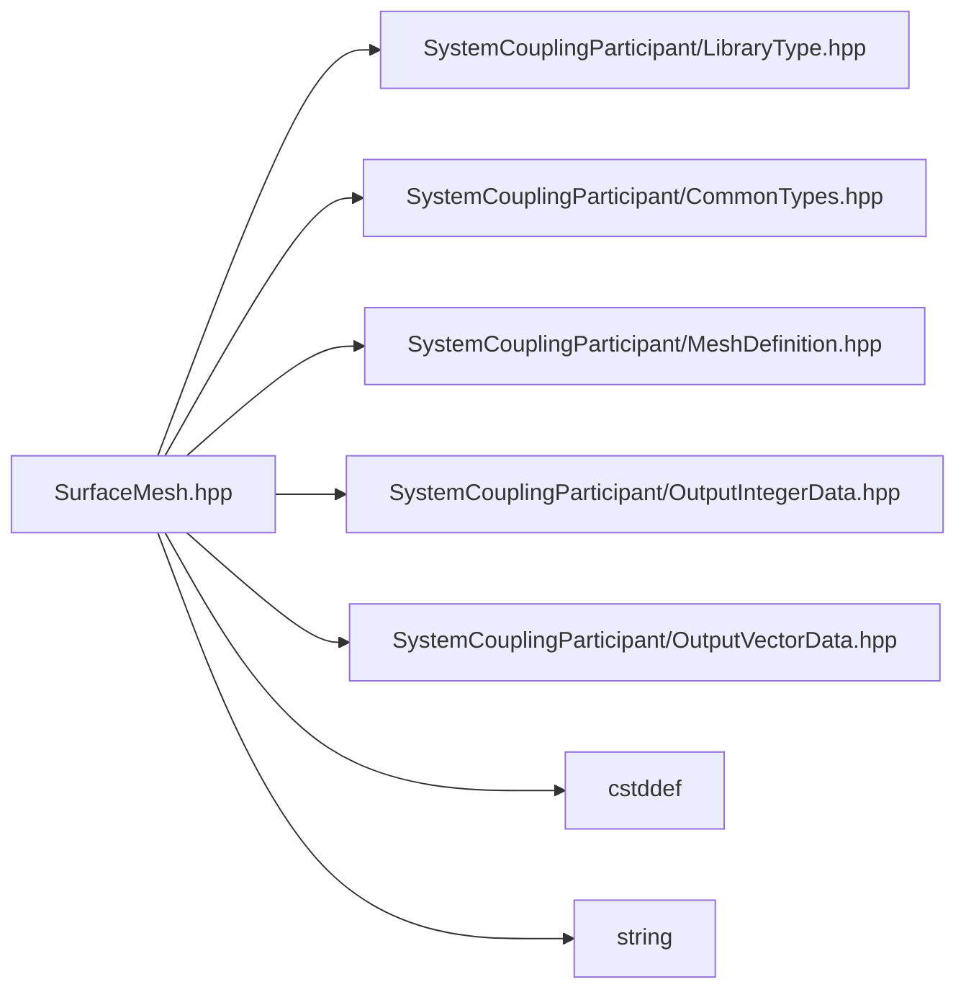

# File SurfaceMesh.hpp

![][C++]

**Location**: `SurfaceMesh.hpp`


## Classes

* [sysc::SurfaceMesh](classsysc_1_1SurfaceMesh.md#classsysc_1_1SurfaceMesh)

## Namespaces

* [sysc](namespacesysc.md#namespacesysc)

## Includes

* SystemCouplingParticipant/LibraryType.hpp
* SystemCouplingParticipant/CommonTypes.hpp
* SystemCouplingParticipant/MeshDefinition.hpp
* SystemCouplingParticipant/OutputIntegerData.hpp
* SystemCouplingParticipant/OutputVectorData.hpp
* <cstddef>
* <string>



## Source

```cpp
/*
 * Copyright ANSYS, Inc. Unauthorized use, distribution, or duplication is prohibited.
 */

#pragma once

#include "SystemCouplingParticipant/LibraryType.hpp"

#include "SystemCouplingParticipant/CommonTypes.hpp"
#include "SystemCouplingParticipant/MeshDefinition.hpp"
#include "SystemCouplingParticipant/OutputIntegerData.hpp"
#include "SystemCouplingParticipant/OutputVectorData.hpp"

#include <cstddef>
#include <string>

namespace sysc {

class SYSTEM_COUPLING_PARTICIPANT_DLL SurfaceMesh {
public:
  std::int64_t connectivityStamp{0};

  std::int64_t coordinatesStamp{0};

  std::int64_t partitioningStamp{0};

  SurfaceMesh(
    NodeData nodes,
    FaceData faces);

  SurfaceMesh() = default; /* \brief Provide a default constructor. */

  SurfaceMesh(const SurfaceMesh&) = default;

  SurfaceMesh(SurfaceMesh&&) = default;

  SurfaceMesh& operator=(const SurfaceMesh&) = default;

  SurfaceMesh& operator=(SurfaceMesh&&) = default;

  const NodeData& getNodeData() const noexcept;

  const FaceData& getFaceData() const noexcept;

  std::size_t getNumNodes() const;

  std::size_t getNumElems() const;

  OutputIntegerData getNodeIds() const;

  OutputVectorData getNodeCoords() const;

  OutputIntegerData getElemTypes() const;

  OutputIntegerData getElemNodeCounts() const;

  OutputIntegerData getElemNodeIds() const;

  FaceCellConnectivityData getFaceCellConnectivity() const noexcept;

  void setSide0(const RegionName& regionName);

  void setSide1(const RegionName& regionName);

  bool hasSide0() const noexcept;

  bool hasSide1() const noexcept;

  const RegionName& getSide0() const;

  const RegionName& getSide1() const;

  ValidityStatus checkValidity() const;

  SurfaceMesh(
    NodeData nodes,
    ElementTypeData elemTypes,
    ElementNodeCountData elemNodeCounts,
    ElementNodeConnectivityData elemNodeIds,
    FaceCellConnectivityData faceCellConnectivity);

  SurfaceMesh(
    NodeData nodes,
    ElementTypeData elementTypes,
    ElementNodeConnectivityData elementNodeIds);

  SurfaceMesh(
    NodeData meshNodes,
    ElementNodeCountData faceNodeCounts,
    ElementNodeConnectivityData faceNodeIds);

  SurfaceMesh(
    NodeData meshNodes,
    ElementNodeCountData faceNodeCounts,
    ElementNodeConnectivityData faceNodeIds,
    FaceCellConnectivityData faceCellConnectivity);

  /* Deprecated - do not use. */
  SurfaceMesh(
    OutputIntegerData nodeIds,
    OutputVectorData nodeCoords,
    OutputIntegerData elemNodeCounts,
    OutputIntegerData elemNodeIds);

  /* Deprecated - do not use. */
  SurfaceMesh(
    OutputVectorData nodeCoords,
    OutputIntegerData elemNodeCounts,
    OutputIntegerData elemNodeIds);

  MeshValidityStatus checkMeshValidity() const;

private:
  NodeData m_nodes;
  FaceData m_faces;

  RegionName m_side0;
  RegionName m_side1;
};

}  // namespace sysc
```

[public]: https://img.shields.io/badge/-public-brightgreen (public)
[C++]: https://img.shields.io/badge/language-C%2B%2B-blue (C++)
[private]: https://img.shields.io/badge/-private-red (private)
[const]: https://img.shields.io/badge/-const-lightblue (const)