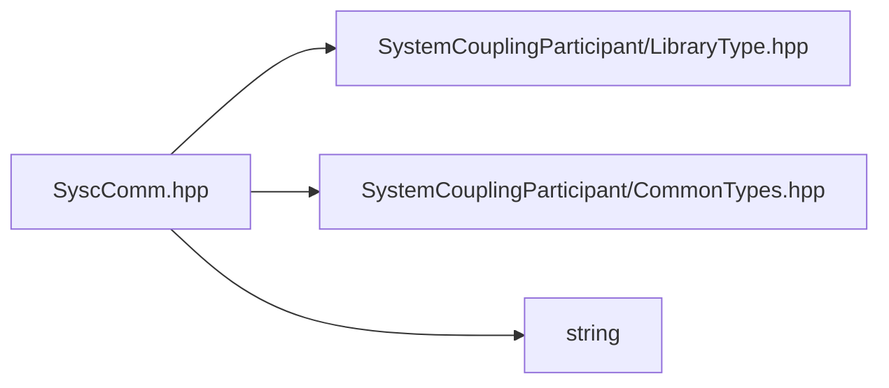

# File SyscComm.hpp

![][C++]

**Location**: `SyscComm.hpp`


## Classes

* [sysc::HostAndPort](structsysc_1_1HostAndPort.md#structsysc_1_1HostAndPort)

## Namespaces

* [sysc](namespacesysc.md#namespacesysc)

## Includes

* SystemCouplingParticipant/LibraryType.hpp
* SystemCouplingParticipant/CommonTypes.hpp
* <string>



## Source

```cpp
/*
* Copyright ANSYS, Inc. Unauthorized use, distribution, or duplication is prohibited.
*/

#pragma once

#include "SystemCouplingParticipant/LibraryType.hpp"

#include "SystemCouplingParticipant/CommonTypes.hpp"

#include <string>

namespace sysc {

struct HostAndPort {
  HostAndPort() = default;

  HostAndPort(Host host, Port port) :
      host(std::move(host)), port(port) {}

  HostAndPort(Port port) :
      port(port) {}

  Host host;
  Port port{0};
};

HostAndPort SYSTEM_COUPLING_PARTICIPANT_DLL createRootServer(Host host, Port port);

bool SYSTEM_COUPLING_PARTICIPANT_DLL isRootServerCreated();

int SYSTEM_COUPLING_PARTICIPANT_DLL getMyRank();

int SYSTEM_COUPLING_PARTICIPANT_DLL getNumRanks();

double SYSTEM_COUPLING_PARTICIPANT_DLL reduceMax(double value);

std::uint64_t SYSTEM_COUPLING_PARTICIPANT_DLL reduceSum(std::uint64_t value);

bool SYSTEM_COUPLING_PARTICIPANT_DLL reduceAnd(bool value);

}  // namespace sysc
```

[public]: https://img.shields.io/badge/-public-brightgreen (public)
[C++]: https://img.shields.io/badge/language-C%2B%2B-blue (C++)
[private]: https://img.shields.io/badge/-private-red (private)
[const]: https://img.shields.io/badge/-const-lightblue (const)