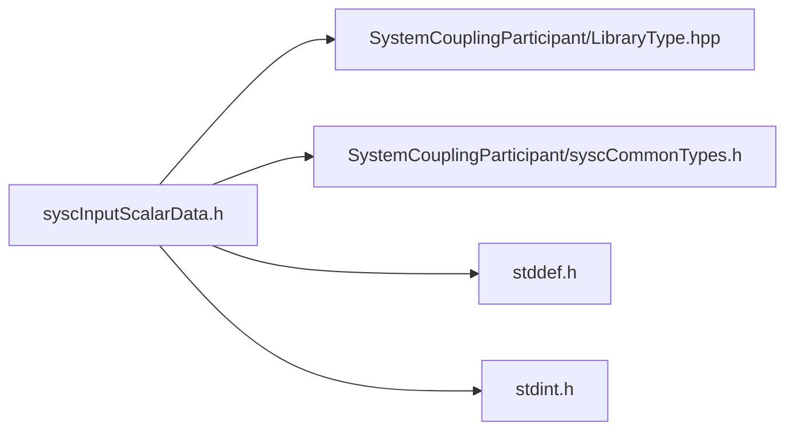

# File syscInputScalarData.h

![][C]

**Location**: `syscInputScalarData.h`


## Classes

* [SyscInputScalarData](structSyscInputScalarData.md#structSyscInputScalarData)

## Includes

* SystemCouplingParticipant/LibraryType.hpp
* SystemCouplingParticipant/syscCommonTypes.h
* <stddef.h>
* <stdint.h>



## Functions

<a id="group__SyscParticipantLibraryCAPI_1ga4f26c699d6b93f7d62ad88e69822e1e2"></a>
### Function syscGetInputScalarData

![][public]

```
SyscInputScalarData syscGetInputScalarData()
```

Create an input scalar data access struct.

Primitive type will default to double-precision. Data size will be set to zero. Data pointer will be set to null.


**Return type**: [SyscInputScalarData](structSyscInputScalarData.md#structSyscInputScalarData)

<a id="group__SyscParticipantLibraryCAPI_1ga3b76afcedb8ced51695a0a56dabfb3af"></a>
### Function syscGetInputScalarDataDouble

![][public]

```
SyscInputScalarData syscGetInputScalarDataDouble(double *const data, size_t dataSize)
```

Create an input scalar data access struct.

**Parameters**:

* **data**: - pointer to the double-precision (64-bit) array of data.
* **dataSize**: - number of elements in the array.


**Parameters**:

* double *const **data**
* size_t **dataSize**

**Return type**: [SyscInputScalarData](structSyscInputScalarData.md#structSyscInputScalarData)

<a id="group__SyscParticipantLibraryCAPI_1ga09e03b4996d73e37c1748eb00a8c76c8"></a>
### Function syscGetInputScalarDataFloat

![][public]

```
SyscInputScalarData syscGetInputScalarDataFloat(float *const data, size_t dataSize)
```

Create an input scalar data access struct.

**Parameters**:

* **data**: - pointer to the single-precision (32-bit) array of data.
* **dataSize**: - number of elements in the array.


**Parameters**:

* float *const **data**
* size_t **dataSize**

**Return type**: [SyscInputScalarData](structSyscInputScalarData.md#structSyscInputScalarData)

## Source

```
/*
* Copyright ANSYS, Inc. Unauthorized use, distribution, or duplication is prohibited.
*/

#pragma once

#include "SystemCouplingParticipant/LibraryType.hpp"

#include "SystemCouplingParticipant/syscCommonTypes.h"

#include <stddef.h>
#include <stdint.h>

#ifdef __cplusplus
extern "C" {
#endif

/* ******** Input scalar data ********************************************** */

typedef struct {
  enum SyscPrimitiveType primitiveType; 
  void* data;                           
  size_t size;                          
} SyscInputScalarData;

SyscInputScalarData syscGetInputScalarData();

SyscInputScalarData syscGetInputScalarDataDouble(
  double* const data,
  size_t dataSize);

SyscInputScalarData syscGetInputScalarDataFloat(
  float* const data,
  size_t dataSize);

#ifdef __cplusplus
}
#endif
```

[public]: https://img.shields.io/badge/-public-brightgreen (public)
[C]: https://img.shields.io/badge/language-C-blue (C)