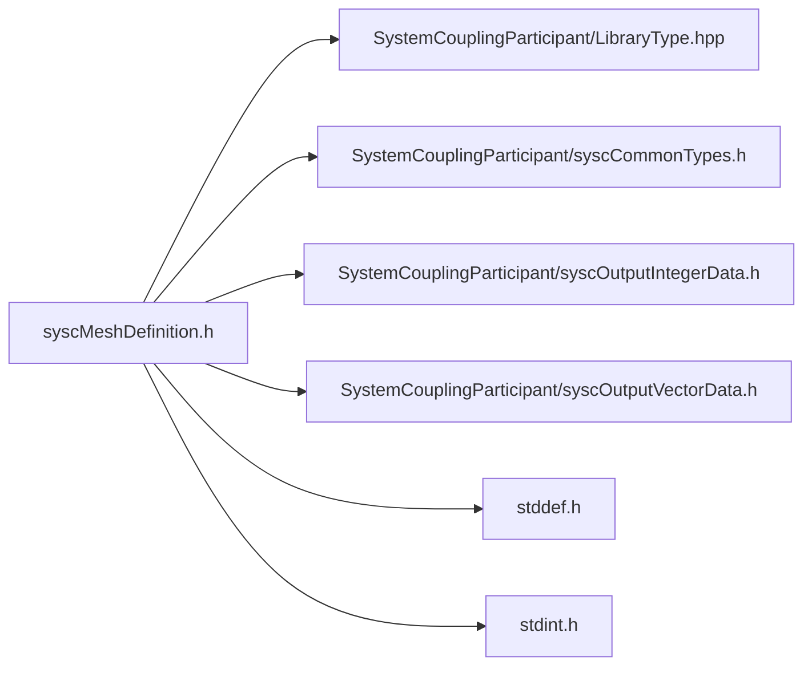

# File syscMeshDefinition.h

![][C]

**Location**: `syscMeshDefinition.h`


## Classes

* [SyscNodeData](structSyscNodeData.md#structSyscNodeData)
* [SyscElementTypeData](structSyscElementTypeData.md#structSyscElementTypeData)
* [SyscElementNodeCountData](structSyscElementNodeCountData.md#structSyscElementNodeCountData)
* [SyscElementNodeConnectivityData](structSyscElementNodeConnectivityData.md#structSyscElementNodeConnectivityData)
* [SyscFaceCellConnectivityData](structSyscFaceCellConnectivityData.md#structSyscFaceCellConnectivityData)
* [SyscCellIdData](structSyscCellIdData.md#structSyscCellIdData)
* [SyscElementIdData](structSyscElementIdData.md#structSyscElementIdData)
* [SyscFaceData](structSyscFaceData.md#structSyscFaceData)
* [SyscCellData](structSyscCellData.md#structSyscCellData)

## Includes

* SystemCouplingParticipant/LibraryType.hpp
* SystemCouplingParticipant/syscCommonTypes.h
* SystemCouplingParticipant/syscOutputIntegerData.h
* SystemCouplingParticipant/syscOutputVectorData.h
* <stddef.h>
* <stdint.h>



## Functions

<a id="group__SyscParticipantLibraryCAPI_1gaf412d269c5805e7e6b8600f2690cb874"></a>
### Function syscGetNodeData

![][public]

```
SyscNodeData syscGetNodeData()
```

Create a mesh node data access struct.

Returns an empty mesh node data access struct. All member will be assigned default values.


**Return type**: [SyscNodeData](structSyscNodeData.md#structSyscNodeData)

<a id="group__SyscParticipantLibraryCAPI_1ga8b43e51f7a5fa3f6a2d280c177ca3f8e"></a>
### Function syscGetNodeDataIC

![][public]

```
SyscNodeData syscGetNodeDataIC(SyscOutputIntegerData nodeIds, SyscOutputVectorData nodeCoords)
```

Create a mesh node data access struct, given node ids and node coords in same order.


**Parameters**:

* [SyscOutputIntegerData](structSyscOutputIntegerData.md#structSyscOutputIntegerData) **nodeIds**
* [SyscOutputVectorData](structSyscOutputVectorData.md#structSyscOutputVectorData) **nodeCoords**

**Return type**: [SyscNodeData](structSyscNodeData.md#structSyscNodeData)

<a id="group__SyscParticipantLibraryCAPI_1gaf5a3d9825d0c59c4517ccaccb332e6b5"></a>
### Function syscGetNodeDataC

![][public]

```
SyscNodeData syscGetNodeDataC(SyscOutputVectorData nodeCoords)
```

Creates a mesh node data access struct, given node coordinates in ascending node ids order.


**Parameters**:

* [SyscOutputVectorData](structSyscOutputVectorData.md#structSyscOutputVectorData) **nodeCoords**

**Return type**: [SyscNodeData](structSyscNodeData.md#structSyscNodeData)

<a id="group__SyscParticipantLibraryCAPI_1gac9a38bc69d5b0a77d09be64f73693f46"></a>
### Function syscGetElementTypeDataEmpty

![][public]

```
SyscElementTypeData syscGetElementTypeDataEmpty()
```

Create an empty mesh element type data access struct.

Returns an empty mesh element type data access struct. All member will be assigned default values.


**Return type**: [SyscElementTypeData](structSyscElementTypeData.md#structSyscElementTypeData)

<a id="group__SyscParticipantLibraryCAPI_1ga0edaf6355561dfffffeeea47d5ff796d"></a>
### Function syscGetElementTypeData

![][public]

```
SyscElementTypeData syscGetElementTypeData(SyscOutputIntegerData elemTypes)
```

Create an mesh element type data access struct, given element types.


**Parameters**:

* [SyscOutputIntegerData](structSyscOutputIntegerData.md#structSyscOutputIntegerData) **elemTypes**

**Return type**: [SyscElementTypeData](structSyscElementTypeData.md#structSyscElementTypeData)

<a id="group__SyscParticipantLibraryCAPI_1ga621f044b4d075369865572cc0d68aa97"></a>
### Function syscGetElementNodeCountDataEmpty

![][public]

```
SyscElementNodeCountData syscGetElementNodeCountDataEmpty()
```

Create an empty mesh element node count data access struct.

Returns an empty mesh element node count data access struct. All member will be assigned default values.


**Return type**: [SyscElementNodeCountData](structSyscElementNodeCountData.md#structSyscElementNodeCountData)

<a id="group__SyscParticipantLibraryCAPI_1ga69b8dd901387b03935a8f2aa4c576903"></a>
### Function syscGetElementNodeCountData

![][public]

```
SyscElementNodeCountData syscGetElementNodeCountData(SyscOutputIntegerData elemNodeCount)
```

Create an mesh element node count data access struct, given element node counts.


**Parameters**:

* [SyscOutputIntegerData](structSyscOutputIntegerData.md#structSyscOutputIntegerData) **elemNodeCount**

**Return type**: [SyscElementNodeCountData](structSyscElementNodeCountData.md#structSyscElementNodeCountData)

<a id="group__SyscParticipantLibraryCAPI_1ga827af0f4c18717284c76b8804056a24d"></a>
### Function syscGetElementNodeConnectivityDataEmpty

![][public]

```
SyscElementNodeConnectivityData syscGetElementNodeConnectivityDataEmpty()
```

Create an empty element-to-node connectivity data access struct.

Returns an empty element-to-node connectivity data access struct. All member will be assigned default values.


**Return type**: [SyscElementNodeConnectivityData](structSyscElementNodeConnectivityData.md#structSyscElementNodeConnectivityData)

<a id="group__SyscParticipantLibraryCAPI_1gae4888763deed0388634cd4174e06a027"></a>
### Function syscGetElementNodeConnectivityData

![][public]

```
SyscElementNodeConnectivityData syscGetElementNodeConnectivityData(SyscOutputIntegerData elemNodeIds)
```

Create an element-to-node connectivity data access struct, given element node ids.


**Parameters**:

* [SyscOutputIntegerData](structSyscOutputIntegerData.md#structSyscOutputIntegerData) **elemNodeIds**

**Return type**: [SyscElementNodeConnectivityData](structSyscElementNodeConnectivityData.md#structSyscElementNodeConnectivityData)

<a id="group__SyscParticipantLibraryCAPI_1ga5efb9f82d5def3b2399291a763d72d65"></a>
### Function syscGetFaceCellConnectivityDataEmpty

![][public]

```
SyscFaceCellConnectivityData syscGetFaceCellConnectivityDataEmpty()
```

Create empty face-to-cell connectivity.


**Return type**: [SyscFaceCellConnectivityData](structSyscFaceCellConnectivityData.md#structSyscFaceCellConnectivityData)

<a id="group__SyscParticipantLibraryCAPI_1ga604b682ca22d2b4898d6aedae4d9fb1c"></a>
### Function syscGetFaceCellConnectivityData

![][public]

```
SyscFaceCellConnectivityData syscGetFaceCellConnectivityData(SyscOutputIntegerData cell0Ids, SyscOutputIntegerData cell1Ids)
```

Create face-to-cell connectivity given cell0 and cell1 arrays.


**Parameters**:

* [SyscOutputIntegerData](structSyscOutputIntegerData.md#structSyscOutputIntegerData) **cell0Ids**
* [SyscOutputIntegerData](structSyscOutputIntegerData.md#structSyscOutputIntegerData) **cell1Ids**

**Return type**: [SyscFaceCellConnectivityData](structSyscFaceCellConnectivityData.md#structSyscFaceCellConnectivityData)

<a id="group__SyscParticipantLibraryCAPI_1ga9c98c0bc4f190c90ec8bb034ab6e6781"></a>
### Function syscGetCellIdDataEmpty

![][public]

```
SyscCellIdData syscGetCellIdDataEmpty()
```

Create empty cell id data.


**Return type**: [SyscCellIdData](structSyscCellIdData.md#structSyscCellIdData)

<a id="group__SyscParticipantLibraryCAPI_1gaf52ba7465086cb0c3faf0a6b9473853e"></a>
### Function syscGetCellIdData

![][public]

```
SyscCellIdData syscGetCellIdData(SyscOutputIntegerData cellIds)
```

Create cell id data given cell ids array.


**Parameters**:

* [SyscOutputIntegerData](structSyscOutputIntegerData.md#structSyscOutputIntegerData) **cellIds**

**Return type**: [SyscCellIdData](structSyscCellIdData.md#structSyscCellIdData)

<a id="group__SyscParticipantLibraryCAPI_1ga7c6f7645530e97adaa7fca97bebbf050"></a>
### Function syscGetElementIdDataEmpty

![][public]

```
SyscElementIdData syscGetElementIdDataEmpty()
```

Create empty element id data.


**Return type**: [SyscElementIdData](structSyscElementIdData.md#structSyscElementIdData)

<a id="group__SyscParticipantLibraryCAPI_1ga1d1688e7751b27c15a57a78a244b0261"></a>
### Function syscGetElementIdData

![][public]

```
SyscElementIdData syscGetElementIdData(SyscOutputIntegerData elementIds)
```

Create cell id data given cell ids array.


**Parameters**:

* [SyscOutputIntegerData](structSyscOutputIntegerData.md#structSyscOutputIntegerData) **elementIds**

**Return type**: [SyscElementIdData](structSyscElementIdData.md#structSyscElementIdData)

<a id="group__SyscParticipantLibraryCAPI_1ga5fe1aa7a9f98270030fc7138c4860217"></a>
### Function syscGetFaceDataEmpty

![][public]

```
SyscFaceData syscGetFaceDataEmpty()
```

Create empty face data.


**Return type**: [SyscFaceData](structSyscFaceData.md#structSyscFaceData)

<a id="group__SyscParticipantLibraryCAPI_1gadc25b2855aac9a4c02706bb94cb1d47e"></a>
### Function syscGetFaceDataITCNF

![][public]

```
SyscFaceData syscGetFaceDataITCNF(SyscElementIdData faceIds, SyscElementTypeData faceTypes, SyscElementNodeCountData faceNodeCounts, SyscElementNodeConnectivityData faceNodeConnectivity, SyscFaceCellConnectivityData faceCellConnectivity)
```

Create face data given face ids, types, node counts, node-to-face connectivity, face-to-cell connectivity.


**Parameters**:

* [SyscElementIdData](structSyscElementIdData.md#structSyscElementIdData) **faceIds**
* [SyscElementTypeData](structSyscElementTypeData.md#structSyscElementTypeData) **faceTypes**
* [SyscElementNodeCountData](structSyscElementNodeCountData.md#structSyscElementNodeCountData) **faceNodeCounts**
* [SyscElementNodeConnectivityData](structSyscElementNodeConnectivityData.md#structSyscElementNodeConnectivityData) **faceNodeConnectivity**
* [SyscFaceCellConnectivityData](structSyscFaceCellConnectivityData.md#structSyscFaceCellConnectivityData) **faceCellConnectivity**

**Return type**: [SyscFaceData](structSyscFaceData.md#structSyscFaceData)

<a id="group__SyscParticipantLibraryCAPI_1gab1f554f37a4e5dc06cdfc15d7ca4b6c7"></a>
### Function syscGetFaceDataICNF

![][public]

```
SyscFaceData syscGetFaceDataICNF(SyscElementIdData faceIds, SyscElementNodeCountData faceNodeCounts, SyscElementNodeConnectivityData faceNodeConnectivity, SyscFaceCellConnectivityData faceCellConnectivity)
```

Create face data given face ids, types, node-to-face connectivity, face-to-cell connectivity.


**Parameters**:

* [SyscElementIdData](structSyscElementIdData.md#structSyscElementIdData) **faceIds**
* [SyscElementNodeCountData](structSyscElementNodeCountData.md#structSyscElementNodeCountData) **faceNodeCounts**
* [SyscElementNodeConnectivityData](structSyscElementNodeConnectivityData.md#structSyscElementNodeConnectivityData) **faceNodeConnectivity**
* [SyscFaceCellConnectivityData](structSyscFaceCellConnectivityData.md#structSyscFaceCellConnectivityData) **faceCellConnectivity**

**Return type**: [SyscFaceData](structSyscFaceData.md#structSyscFaceData)

<a id="group__SyscParticipantLibraryCAPI_1ga7fecaea46eac9057909b0d0901cfbea8"></a>
### Function syscGetFaceDataITN

![][public]

```
SyscFaceData syscGetFaceDataITN(SyscElementIdData faceIds, SyscElementTypeData faceTypes, SyscElementNodeConnectivityData faceNodeConnectivity)
```

Create face data given face ids, types, node-to-face connectivity, face-to-cell connectivity.


**Parameters**:

* [SyscElementIdData](structSyscElementIdData.md#structSyscElementIdData) **faceIds**
* [SyscElementTypeData](structSyscElementTypeData.md#structSyscElementTypeData) **faceTypes**
* [SyscElementNodeConnectivityData](structSyscElementNodeConnectivityData.md#structSyscElementNodeConnectivityData) **faceNodeConnectivity**

**Return type**: [SyscFaceData](structSyscFaceData.md#structSyscFaceData)

<a id="group__SyscParticipantLibraryCAPI_1gae75c9db974a962c76ce593cc24ddd85c"></a>
### Function syscGetFaceDataCN

![][public]

```
SyscFaceData syscGetFaceDataCN(SyscElementNodeCountData faceNodeCounts, SyscElementNodeConnectivityData faceNodeConnectivity)
```

Create face data given face node counts, node-to-face connectivity.


**Parameters**:

* [SyscElementNodeCountData](structSyscElementNodeCountData.md#structSyscElementNodeCountData) **faceNodeCounts**
* [SyscElementNodeConnectivityData](structSyscElementNodeConnectivityData.md#structSyscElementNodeConnectivityData) **faceNodeConnectivity**

**Return type**: [SyscFaceData](structSyscFaceData.md#structSyscFaceData)

<a id="group__SyscParticipantLibraryCAPI_1gaea5a7a8c0e8b5424fbaa50edb7bc32ce"></a>
### Function syscGetCellDataEmpty

![][public]

```
SyscCellData syscGetCellDataEmpty()
```

Create empty cell data.


**Return type**: [SyscCellData](structSyscCellData.md#structSyscCellData)

<a id="group__SyscParticipantLibraryCAPI_1gabc9c52c2b18a3bbb00d87891b4039315"></a>
### Function syscGetCellDataITN

![][public]

```
SyscCellData syscGetCellDataITN(SyscElementIdData cellIds, SyscElementTypeData cellTypes, SyscElementNodeConnectivityData cellNodeConnectivity)
```

Create cell data given cell ids, types, cell-to-node connectivity.


**Parameters**:

* [SyscElementIdData](structSyscElementIdData.md#structSyscElementIdData) **cellIds**
* [SyscElementTypeData](structSyscElementTypeData.md#structSyscElementTypeData) **cellTypes**
* [SyscElementNodeConnectivityData](structSyscElementNodeConnectivityData.md#structSyscElementNodeConnectivityData) **cellNodeConnectivity**

**Return type**: [SyscCellData](structSyscCellData.md#structSyscCellData)

<a id="group__SyscParticipantLibraryCAPI_1gadb4f24988bf2684dd5bb9d6032a37fca"></a>
### Function syscGetCellDataI

![][public]

```
SyscCellData syscGetCellDataI(SyscElementIdData cellIds)
```

Create cell data given cell ids.


**Parameters**:

* [SyscElementIdData](structSyscElementIdData.md#structSyscElementIdData) **cellIds**

**Return type**: [SyscCellData](structSyscCellData.md#structSyscCellData)

<a id="group__SyscParticipantLibraryCAPI_1ga900dee185f65895511a89b29af40c6f8"></a>
### Function syscGetCellDataTN

![][public]

```
SyscCellData syscGetCellDataTN(SyscElementTypeData cellTypes, SyscElementNodeConnectivityData cellNodeConnectivity)
```

Create cell data given cell types, cell-to-node connectivity.


**Parameters**:

* [SyscElementTypeData](structSyscElementTypeData.md#structSyscElementTypeData) **cellTypes**
* [SyscElementNodeConnectivityData](structSyscElementNodeConnectivityData.md#structSyscElementNodeConnectivityData) **cellNodeConnectivity**

**Return type**: [SyscCellData](structSyscCellData.md#structSyscCellData)

## Source

```
/*
* Copyright ANSYS, Inc. Unauthorized use, distribution, or duplication is prohibited.
*/

#pragma once

#include "SystemCouplingParticipant/LibraryType.hpp"

#include "SystemCouplingParticipant/syscCommonTypes.h"
#include "SystemCouplingParticipant/syscOutputIntegerData.h"
#include "SystemCouplingParticipant/syscOutputVectorData.h"

#include <stddef.h>
#include <stdint.h>

#ifdef __cplusplus
extern "C" {
#endif

/* ***************** Node data ********************************************* */

typedef struct {
  SyscOutputIntegerData nodeIds;   
  SyscOutputVectorData nodeCoords; 
} SyscNodeData;

SyscNodeData syscGetNodeData();

SyscNodeData syscGetNodeDataIC(
  SyscOutputIntegerData nodeIds,
  SyscOutputVectorData nodeCoords);

SyscNodeData syscGetNodeDataC(SyscOutputVectorData nodeCoords);

/* ***************** Element type data ************************************* */

typedef struct {
  SyscOutputIntegerData elementTypes; 
} SyscElementTypeData;

SyscElementTypeData syscGetElementTypeDataEmpty();

SyscElementTypeData syscGetElementTypeData(SyscOutputIntegerData elemTypes);

/* ***************** Element node count data ******************************* */

typedef struct {
  SyscOutputIntegerData elementNodeCounts; 
} SyscElementNodeCountData;

SyscElementNodeCountData syscGetElementNodeCountDataEmpty();

SyscElementNodeCountData syscGetElementNodeCountData(
  SyscOutputIntegerData elemNodeCount);

/* **************** Element node connectivity data ************************* */

typedef struct {
  SyscOutputIntegerData elementNodeIds;
} SyscElementNodeConnectivityData;

SyscElementNodeConnectivityData syscGetElementNodeConnectivityDataEmpty();

SyscElementNodeConnectivityData syscGetElementNodeConnectivityData(
  SyscOutputIntegerData elemNodeIds);

/* ******************* Face cell connectivity data ************************* */

typedef struct {
  SyscOutputIntegerData cell0Ids; 
  SyscOutputIntegerData cell1Ids; 
} SyscFaceCellConnectivityData;

SyscFaceCellConnectivityData syscGetFaceCellConnectivityDataEmpty();

SyscFaceCellConnectivityData syscGetFaceCellConnectivityData(
  SyscOutputIntegerData cell0Ids,
  SyscOutputIntegerData cell1Ids);

/* ************************* Cell ids data ********************************* */

typedef struct {
  SyscOutputIntegerData cellIds; 
} SyscCellIdData;

SyscCellIdData syscGetCellIdDataEmpty();

SyscCellIdData syscGetCellIdData(SyscOutputIntegerData cellIds);

/* ************************* Element ids data ****************************** */

typedef struct {
  SyscOutputIntegerData elementIds; 
} SyscElementIdData;

SyscElementIdData syscGetElementIdDataEmpty();

SyscElementIdData syscGetElementIdData(SyscOutputIntegerData elementIds);

/* ***************************** Face data ********************************* */

typedef struct {
  SyscElementIdData faceIds;                            
  SyscElementTypeData faceTypes;                        
  SyscElementNodeCountData faceNodeCounts;              
  SyscElementNodeConnectivityData faceNodeConnectivity; 
  SyscFaceCellConnectivityData faceCellConnectivity;    
} SyscFaceData;

SyscFaceData syscGetFaceDataEmpty();

SyscFaceData syscGetFaceDataITCNF(
  SyscElementIdData faceIds,
  SyscElementTypeData faceTypes,
  SyscElementNodeCountData faceNodeCounts,
  SyscElementNodeConnectivityData faceNodeConnectivity,
  SyscFaceCellConnectivityData faceCellConnectivity);

SyscFaceData syscGetFaceDataICNF(
  SyscElementIdData faceIds,
  SyscElementNodeCountData faceNodeCounts,
  SyscElementNodeConnectivityData faceNodeConnectivity,
  SyscFaceCellConnectivityData faceCellConnectivity);

SyscFaceData syscGetFaceDataITN(
  SyscElementIdData faceIds,
  SyscElementTypeData faceTypes,
  SyscElementNodeConnectivityData faceNodeConnectivity);

SyscFaceData syscGetFaceDataCN(
  SyscElementNodeCountData faceNodeCounts,
  SyscElementNodeConnectivityData faceNodeConnectivity);

/* ***************************** Cell data ********************************* */

typedef struct {
  SyscElementIdData cellIds;                            
  SyscElementTypeData cellTypes;                        
  SyscElementNodeConnectivityData cellNodeConnectivity; 
} SyscCellData;

SyscCellData syscGetCellDataEmpty();

SyscCellData syscGetCellDataITN(
  SyscElementIdData cellIds,
  SyscElementTypeData cellTypes,
  SyscElementNodeConnectivityData cellNodeConnectivity);

SyscCellData syscGetCellDataI(SyscElementIdData cellIds);

SyscCellData syscGetCellDataTN(
  SyscElementTypeData cellTypes,
  SyscElementNodeConnectivityData cellNodeConnectivity);

#ifdef __cplusplus
}
#endif
```

[public]: https://img.shields.io/badge/-public-brightgreen (public)
[C]: https://img.shields.io/badge/language-C-blue (C)