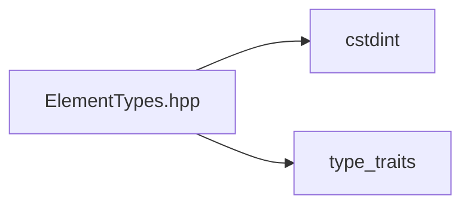

# File ElementTypes.hpp

![][C++]

**Location**: `ElementTypes.hpp`


## Namespaces

* [sysc](namespacesysc.md#namespacesysc)

## Includes

* <cstdint>
* <type_traits>



## Source

```cpp
/*
 * Copyright ANSYS. All rights reserved.
 */

#pragma once

#include <cstdint>
#include <type_traits>
namespace sysc {

enum class ElementTypes : std::uint16_t {
  Tri3 = 5u,
  Tri6 = 6u,
  Quad4 = 7u,
  Quad8 = 8u,
  Tet4 = 9u,
  Tet10 = 10u,
  Hex8 = 11u,
  Hex20 = 12u,
  Wedge6 = 13u,
  Wedge15 = 14u,
  Pyramid5 = 15u,
  Pyramid13 = 16u,
  Polygon = 18u,
  Polyhedron = 19u
};

using ElementTypeUnderlyingType = typename std::underlying_type<ElementTypes>::type;

}  // namespace sysc
```

[public]: https://img.shields.io/badge/-public-brightgreen (public)
[C++]: https://img.shields.io/badge/language-C%2B%2B-blue (C++)
[private]: https://img.shields.io/badge/-private-red (private)
[const]: https://img.shields.io/badge/-const-lightblue (const)