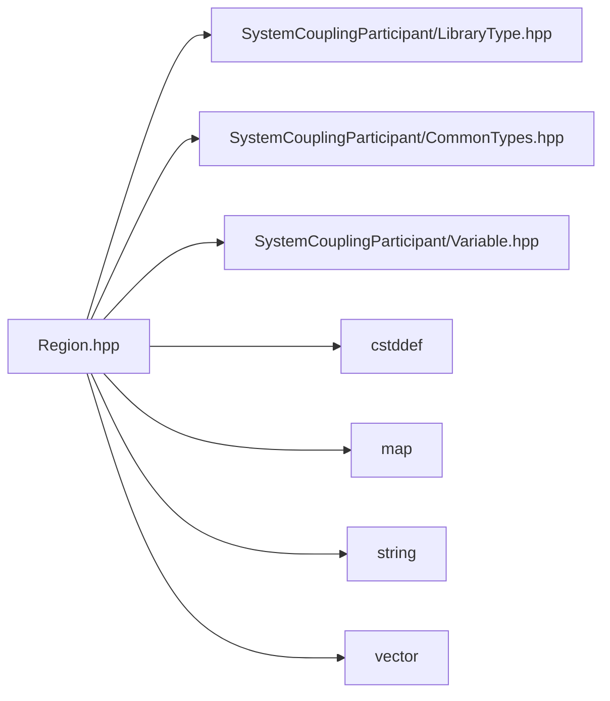

# File Region.hpp

![][C++]

**Location**: `Region.hpp`


## Classes

* [sysc::Region](classsysc_1_1Region.md#classsysc_1_1Region)

## Namespaces

* [sysc](namespacesysc.md#namespacesysc)

## Includes

* SystemCouplingParticipant/LibraryType.hpp
* SystemCouplingParticipant/CommonTypes.hpp
* SystemCouplingParticipant/Variable.hpp
* <cstddef>
* <map>
* <string>
* <vector>



## Source

```cpp
/*
* Copyright ANSYS, Inc. Unauthorized use, distribution, or duplication is prohibited.
*/

#pragma once

#include "SystemCouplingParticipant/LibraryType.hpp"

#include "SystemCouplingParticipant/CommonTypes.hpp"
#include "SystemCouplingParticipant/Variable.hpp"

#include <cstddef>
#include <map>
#include <string>
#include <vector>

namespace sysc {

class SYSTEM_COUPLING_PARTICIPANT_DLL Region {
public:
  Region(const RegionName& name);

  Region(
    const RegionName& name,
    enum Topology topology);

  Region(
    const RegionName& name,
    enum Topology topology,
    const DisplayName& displayName);

  Region(
    const RegionName& name,
    enum Topology topology,
    enum RegionDiscretizationType regionDiscretizationType);

  Region(
    const RegionName& name,
    enum Topology topology,
    const DisplayName& displayName,
    enum RegionDiscretizationType regionDiscretizationType);

  void addInputVariable(const Variable& variable);

  void addOutputVariable(const Variable& variable);

  const RegionName& getName() const noexcept;

  Topology getTopology() const noexcept;

  const DisplayName& getDisplayName() const noexcept;

  RegionDiscretizationType getRegionDiscretizationType() const noexcept;

  const Variable& getInputVariable(const VariableName& name) const;

  const Variable& getOutputVariable(const VariableName& name) const;

  std::size_t getNumOutputVariables() const noexcept;

  std::size_t getNumInputVariables() const noexcept;

  const Variable& getOutputVariable(std::size_t index) const;

  const Variable& getInputVariable(std::size_t index) const;

private:
  RegionName m_name;
  Topology m_topology;
  RegionDiscretizationType m_regionDiscretizationType;
  DisplayName m_displayName;

  std::vector<Region> m_side0Regions;
  std::vector<Region> m_side1Regions;

  std::vector<Variable> m_inputVariables;
  std::map<VariableName, std::size_t> m_inputVarNameToIndex;

  std::vector<Variable> m_outputVariables;
  std::map<VariableName, std::size_t> m_outputVarNameToIndex;
};

}  // namespace sysc
```

[public]: https://img.shields.io/badge/-public-brightgreen (public)
[C++]: https://img.shields.io/badge/language-C%2B%2B-blue (C++)
[private]: https://img.shields.io/badge/-private-red (private)
[const]: https://img.shields.io/badge/-const-lightblue (const)