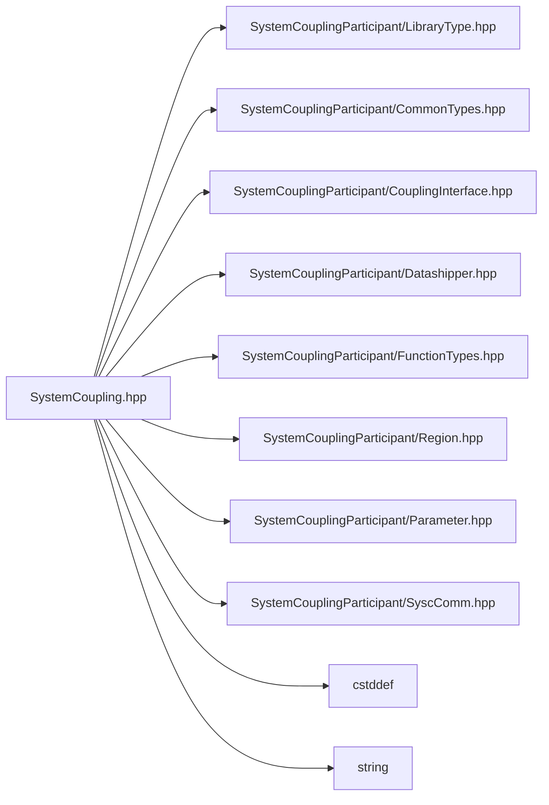

# File SystemCoupling.hpp

![][C++]

**Location**: `SystemCoupling.hpp`


## Classes

* [sysc::SystemCoupling](classsysc_1_1SystemCoupling.md#classsysc_1_1SystemCoupling)

## Namespaces

* [sysc](namespacesysc.md#namespacesysc)

## Includes

* SystemCouplingParticipant/LibraryType.hpp
* SystemCouplingParticipant/CommonTypes.hpp
* SystemCouplingParticipant/CouplingInterface.hpp
* SystemCouplingParticipant/Datashipper.hpp
* SystemCouplingParticipant/FunctionTypes.hpp
* SystemCouplingParticipant/Region.hpp
* SystemCouplingParticipant/Parameter.hpp
* SystemCouplingParticipant/SyscComm.hpp
* <cstddef>
* <string>



## Source

```cpp
/*
* Copyright ANSYS, Inc. Unauthorized use, distribution, or duplication is prohibited.
*/

#pragma once

#include "SystemCouplingParticipant/LibraryType.hpp"

#include "SystemCouplingParticipant/CommonTypes.hpp"
#include "SystemCouplingParticipant/CouplingInterface.hpp"
#include "SystemCouplingParticipant/Datashipper.hpp"
#include "SystemCouplingParticipant/FunctionTypes.hpp"
#include "SystemCouplingParticipant/Region.hpp"
#include "SystemCouplingParticipant/Parameter.hpp"
#include "SystemCouplingParticipant/SyscComm.hpp"

#include <cstddef>
#include <string>

namespace sysc {

class SYSTEM_COUPLING_PARTICIPANT_DLL SystemCoupling {
public:
  SystemCoupling();

  SystemCoupling(std::size_t mpiCommunicator);

  SystemCoupling(
    const ParticipantInfo& participantInfo);

  SystemCoupling(
    const ParticipantInfo& participantInfo, std::size_t mpiCommunicator);

  SystemCoupling(
    const std::string& scHost,
    unsigned short scPort,
    const std::string& participantName,
    const std::string& buildInformation = "Unknown");

  SystemCoupling(
    const std::string& scHost,
    unsigned short scPort,
    const std::string& participantName,
    std::size_t mpiCommunicator,
    const std::string& buildInformation);

  // \brief Provide a destructor for SystemCoupling object.
  ~SystemCoupling();

  void completeSetup(const sysc::SetupInfo& setupInfo);

  void initializeAnalysis();

  sysc::TimeStep getCurrentTimeStep();

  bool doIteration();

  bool doTimeStep();

  void updateInputs();

  void updateOutputs(ConvergenceStatus status);

  void disconnect();

  void fatalError(const std::string& errorMessage);

  void addRegion(const Region& region);

  void addInputParameter(Parameter parameter);

  void addOutputParameter(Parameter parameter);

  void addRealAttribute(const RealAttribute& realAttribute);

  void addIntegerAttribute(const IntegerAttribute& integerAttribute);

  void addStringAttribute(const StringAttribute& stringAttribute);

  void addCouplingInterface(const CouplingInterface& couplingInterface);

  void addCouplingInterface(
    const CouplingInterface& couplingInterface,
    bool autoGenerateTransfers);

  double getParameterValue(const ParameterName& parameterName);

  void setParameterValue(
    const ParameterName& parameterName,
    double value);

  double getRealAttributeValue(const AttributeName& attributeName);

  int64_t getIntegerAttributeValue(const AttributeName& attributeName);

  std::string getStringAttributeValue(const AttributeName& attributeName);

  void registerInputScalarDataAccess(InputScalarDataAccess* dataAccess);

  void registerInputScalarDataAccess(
    OpaqueDataAccess opaqueDataAccess,
    InputScalarDataAccessWithPointer* dataAccess);

  void registerInputVectorDataAccess(InputVectorDataAccess* dataAccess);

  void registerInputVectorDataAccess(
    OpaqueDataAccess opaqueDataAccess,
    InputVectorDataAccessWithPointer* dataAccess);

  void registerOutputScalarDataAccess(OutputScalarDataAccess* dataAccess);

  void registerOutputScalarDataAccess(
    OpaqueDataAccess opaqueDataAccess,
    OutputScalarDataAccessWithPointer* dataAccess);

  void registerOutputVectorDataAccess(OutputVectorDataAccess* dataAccess);

  void registerOutputVectorDataAccess(
    OpaqueDataAccess opaqueDataAccess,
    OutputVectorDataAccessWithPointer* dataAccess);

  void registerInputComplexScalarDataAccess(
    InputComplexScalarDataAccess* dataAccess);

  void registerInputComplexScalarDataAccess(
    OpaqueDataAccess opaqueDataAccess,
    InputComplexScalarDataAccessWithPointer* dataAccess);

  void registerInputComplexVectorDataAccess(
    InputComplexVectorDataAccess* dataAccess);

  void registerInputComplexVectorDataAccess(
    OpaqueDataAccess opaqueDataAccess,
    InputComplexVectorDataAccessWithPointer* dataAccess);

  void registerOutputComplexScalarDataAccess(
    OutputComplexScalarDataAccess* dataAccess);

  void registerOutputComplexScalarDataAccess(
    OpaqueDataAccess opaqueDataAccess,
    OutputComplexScalarDataAccessWithPointer* dataAccess);

  void registerOutputComplexVectorDataAccess(
    OutputComplexVectorDataAccess* dataAccess);

  void registerOutputComplexVectorDataAccess(
    OpaqueDataAccess opaqueDataAccess,
    OutputComplexVectorDataAccessWithPointer* dataAccess);

  void registerSurfaceMeshAccess(SurfaceMeshAccess* meshAccess);

  void registerSurfaceMeshAccess(
    OpaqueDataAccess opaqueDataAccess,
    SurfaceMeshAccessWithPointer* meshAccess);

  void registerZoneCountAccess(
    OpaqueDataAccess opaqueDataAccess,
    ZoneCountAccess* zoneCountAccess);

  void registerSurfaceMeshAccess(
    OpaqueDataAccess opaqueDataAccess,
    SurfaceMeshMultiZoneAccess* dataAccess);

  void registerVolumeMeshAccess(
    OpaqueDataAccess opaqueDataAccess,
    VolumeMeshMultiZoneAccess* dataAccess);

  void registerInputScalarDataAccess(
    OpaqueDataAccess opaqueDataAccess,
    InputScalarDataMultiZoneAccess* dataAccess);

  void registerOutputScalarDataAccess(
    OpaqueDataAccess opaqueDataAccess,
    OutputScalarDataMultiZoneAccess* dataAccess);

  void registerInputVectorDataAccess(
    OpaqueDataAccess opaqueDataAccess,
    InputVectorDataMultiZoneAccess* dataAccess);

  void registerOutputVectorDataAccess(
    OpaqueDataAccess opaqueDataAccess,
    OutputVectorDataMultiZoneAccess* dataAccess);

  void registerVolumeMeshAccess(VolumeMeshAccess* meshAccess);

  void registerVolumeMeshAccess(
    OpaqueDataAccess opaqueDataAccess,
    VolumeMeshAccessWithPointer* meshAccess);

  void registerPointCloudAccess(PointCloudAccess* pointCloudAccess);

  void registerPointCloudAccess(
    OpaqueDataAccess opaqueDataAccess,
    PointCloudAccessWithPointer* pointCloudAccess);

  void registerPointCloudAccess(
    OpaqueDataAccess opaqueDataAccess,
    PointCloudMultiZoneAccess* pointCloudAccess);

  void registerRestartPointCreation(RestartPointCreation* restartPointCreation);

  void registerTargetDataCreation(TargetDataCreation* targetDataCreation);

  void registerTargetDataCreation(
    OpaqueDataAccess opaqueDataAccess,
    TargetDataCreationWithPointer* targetDataCreation);

  void registerDoesTargetDataExist(TargetDataExistenceChecker* doesTargetDataExist);

  void registerDoesTargetDataExist(
    OpaqueDataAccess opaqueDataAccess,
    TargetDataExistenceCheckerWithPointer* doesTargetDataExist);

  bool writeSetupFile(const SetupFileInfo& setupFileInfo) const;

  void writeResults(const ResultsInfo& resultsInfo) const;

  std::size_t getNumRegions() const;

  const Region& getAddedRegion(std::size_t index) const;

  SolutionControl getSolutionControl() const;

  const SetupInfo& getSetupInfo() const;

  std::size_t getNumCouplingInterfaces() const;

  const CouplingInterface& getAddedCouplingInterface(std::size_t index) const;

  const Parameter& getInputParameter(std::size_t index) const;

  const Parameter& getOutputParameter(std::size_t index) const;

  std::size_t getNumInputParameters() const;

  std::size_t getNumOutputParameters() const;

  std::size_t getNumRealAttributes() const;

  std::size_t getNumIntegerAttributes() const;

  std::size_t getNumStringAttributes() const;

  const RealAttribute& getRealAttribute(std::size_t index) const;

  const IntegerAttribute& getIntegerAttribute(std::size_t index) const;

  const StringAttribute& getStringAttribute(std::size_t index) const;

  /* Deprecated functions */

  void completeCouplingSetup();

  void completeCouplingSetup(sysc::AnalysisType analysisType);

  void registerInputScalarVariableAccess(InputScalarVariableAccess* dataAccess);

  void registerInputVectorVariableAccess(InputVectorVariableAccess* dataAccess);

  void registerOutputScalarVariableAccess(OutputScalarVariableAccess* dataAccess);

  void registerOutputVectorVariableAccess(OutputVectorVariableAccess* dataAccess);

  MeshValidityStatus checkMeshValidity(const Region& region);

  MeshValidityStatus checkMeshValidity(const std::string& regionName);

  const Region& getRegion(std::size_t index) const;

  SystemCoupling(const SystemCoupling&) = delete;

  SystemCoupling(SystemCoupling&&) = default;

  SystemCoupling& operator=(const SystemCoupling&) = delete;

  SystemCoupling& operator=(SystemCoupling&&) = default;
};

}  // namespace sysc
```

[public]: https://img.shields.io/badge/-public-brightgreen (public)
[C++]: https://img.shields.io/badge/language-C%2B%2B-blue (C++)
[private]: https://img.shields.io/badge/-private-red (private)
[const]: https://img.shields.io/badge/-const-lightblue (const)