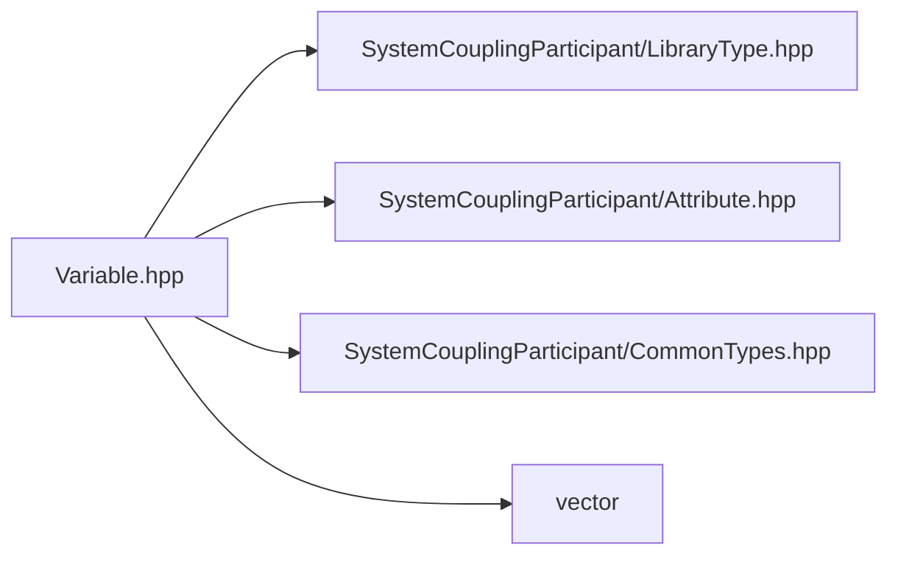

# File Variable.hpp

![][C++]

**Location**: `Variable.hpp`


## Classes

* [sysc::Variable](classsysc_1_1Variable.md#classsysc_1_1Variable)

## Namespaces

* [sysc](namespacesysc.md#namespacesysc)

## Includes

* SystemCouplingParticipant/LibraryType.hpp
* SystemCouplingParticipant/Attribute.hpp
* SystemCouplingParticipant/CommonTypes.hpp
* vector



## Source

```cpp
/*
 * Copyright ANSYS, Inc. Unauthorized use, distribution, or duplication is prohibited.
 */

#pragma once

#include "SystemCouplingParticipant/LibraryType.hpp"

#include "SystemCouplingParticipant/Attribute.hpp"
#include "SystemCouplingParticipant/CommonTypes.hpp"

#include "vector"

namespace sysc {

class SYSTEM_COUPLING_PARTICIPANT_DLL Variable {
public:
  explicit Variable(const VariableName& name);

  Variable(const VariableName& name,
           enum TensorType tensorType,
           bool isExtensive,
           enum Location location);

  Variable(const VariableName& name,
           enum TensorType tensorType,
           bool isExtensive,
           enum Location location,
           enum DataType dataType);

  Variable(const VariableName& name,
           const DisplayName& displayName,
           enum TensorType tensorType,
           bool isExtensive,
           enum Location location,
           enum QuantityType quantityType);

  Variable(const VariableName& name,
           const DisplayName& displayName,
           enum TensorType tensorType,
           bool isExtensive,
           enum Location location,
           enum QuantityType quantityType,
           enum DataType dataType);

  Variable(const VariableName& name,
           enum QuantityType quantityType,
           enum Location location = Node,
           const DisplayName& displayName = DisplayName());

  const VariableName& getName() const noexcept;

  enum TensorType getTensorType() const noexcept;

  bool getIsExtensive() const noexcept;

  enum QuantityType getQuantityType() const noexcept;

  enum Location getLocation() const noexcept;

  const DisplayName& getDisplayName() const noexcept;

  enum DataType getDataType() const noexcept;

  void addRealAttribute(const RealAttribute& attribute);

  void addIntegerAttribute(const IntegerAttribute& attribute);

  void addStringAttribute(const StringAttribute& attribute);

  std::size_t getNumRealAttributes() const noexcept;

  std::size_t getNumIntegerAttributes() const noexcept;

  std::size_t getNumStringAttributes() const noexcept;

  const RealAttribute& getRealAttribute(std::size_t index) const;

  const IntegerAttribute& getIntegerAttribute(std::size_t index) const;

  const StringAttribute& getStringAttribute(std::size_t index) const;

private:
  VariableName m_name;         
  QuantityType m_quantityType; 
  Location m_location;         
  DisplayName m_displayName;   
  TensorType m_tensorType;     
  bool m_isExtensive;          
  DataType m_dataType;         
  std::vector<RealAttribute> m_realAttributes;
  std::vector<IntegerAttribute> m_integerAttributes;
  std::vector<StringAttribute> m_stringAttributes;
};

}  // namespace sysc
```

[public]: https://img.shields.io/badge/-public-brightgreen (public)
[C++]: https://img.shields.io/badge/language-C%2B%2B-blue (C++)
[private]: https://img.shields.io/badge/-private-red (private)
[const]: https://img.shields.io/badge/-const-lightblue (const)