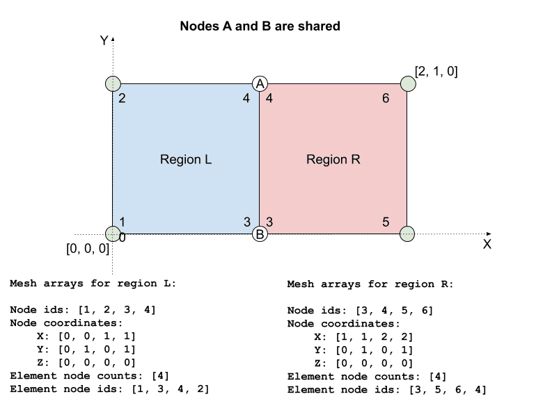
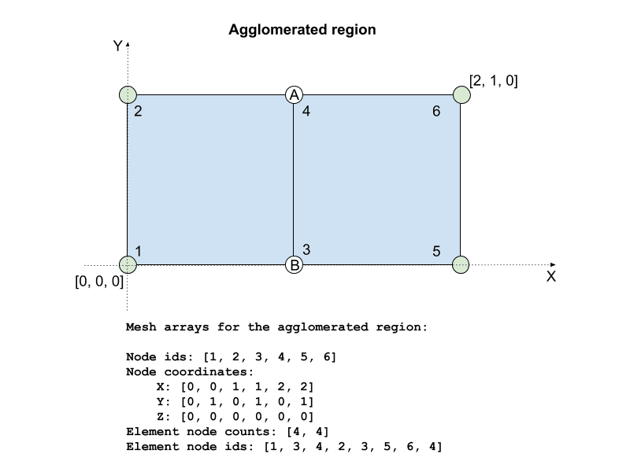

# Multi-region coupling interfaces

System Coupling supports multi-region coupling interfaces,
where more than one region is specified per side.
Generally, the preferred approach is to use one region
per coupling interface - that is, to agglomerate multiple
topological regions into a single
coupling region inside the participant solver.
However, if agglomeration is not feasible,
the implementation of the participant library APIs should
be consistent with the rules described in this section.

## Mesh definition for multi-region coupling interfaces

When providing access to region mesh for a multi-region case,
care should be taken when handling shared nodes.
Shared nodes are nodes that are used in more than one region.
Figure 1 illustrates this scenario.
In this example, there are two surface regions defined,
and each region has a simple mesh that consists of one
quadrilateral element. Region L has 4 mesh nodes,
as does Region R. However, when taken together,
there are only 6 unique nodes between these two regions,
because the 2 nodes in the middle (marked A and B) are shared nodes.

  
*Figure 1: Example of two regions with shared mesh nodes*

System Coupling will detect a shared node by its node id.
For example, if node A is given an id of 4 when defining
the mesh for Region L and the same id of 4 when defining
mesh for the Region R, then System Coupling will interpret
the node A as shared between the two regions.
To further illustrate this example,
surface mesh arrays for both regions are shown in Figure 2.

  
*Figure 2: Mesh arrays for the case with shared nodes*

As shown in Figure 2, nodes with ids 3 and 4 are repeated
in the definitions of both regions. From the above example,
it is obvious that some redundant information is provided
for shared nodes &mdash; node coordinates are provided multiple times,
once for each shared node for each region.
For a given shared node, System Coupling will use only
one set of coordinates (from one of the regions) and will
disregard all others. Therefore, it is critical that nodal
coordinates for shared nodes are identical.

To contrast the case with shared nodes and the case without shared nodes,
compare Figure 2 to Figure 3. The latter figure shows the case
without shared nodes. Note that this is a different setup and
may result in a different solution.

  
*Figure 3: Mesh arrays for the case with non-shared nodes*

Finally, these two regions can be agglomerated into a single region,
as shown in Figure 4. If the two regions above are to be used in a
single coupling interface, then agglomeration is preferred but not necessary.

  
*Figure 4: Mesh arrays for the case where regions are agglomerated into one*

## Solution field data for multi-region coupling interfaces

When working with multi-region cases, one should also be careful with
how the solution field data is handled on shared nodes.
If solution data is defined on mesh nodes, then different treatment
is required, depending on whether the variable is extensive or not.

Values for extensive variables are accumulated on shared nodes by
System Coupling. Figure 5  shows an example of a extensive nodal
variable (heat rate) for two regions, where each region consists
of one quadrilateral mesh face (see previous section for how to
define the mesh for this example). Nodes A and B are shared between
these two regions. Note that in Region L, nodes A and B each have
heat rate value of 2 Watts. In Region R, nodes A and B each have heat
rate values of 3 Watts. Since heat rate is an extensive variable,
the values on shared nodes will be accumulated. Therefore, when
both regions are taken together, the shared nodes A and B will
each have heat rate value of 5 Watts. The sum of heat rate values
for both regions in this example is 30 Watts.

*Figure 5: Nodal extensive variable (heat rate) values for the multi-region case with shared nodes*

Values for intensive variables should be identical
on shared nodes. Figure 6 shows an example of intensive
nodal variable (temperature) for the same two regions as in
the previous example. Note that shared nodes A and B each have
identical temperature values in both Region L and Region R.
To get the average temperature on these two regions,
the sum of temperature nodal values is divided by the number
of unique nodes. In this example,
the average temperature is
$$
(500 + 300 + 800 + 600 + 500 + 300) / 6 = 500 [K]
$$.

*Figure 6: Nodal intensive variable (temperature) values for the multi-region case with shared nodes*

> **NOTE:** *Sometimes, variable values on shared nodes can differ.
> For example, a shared node can exist between a region that
> represents a fluid flow inlet and a region that represents a
> non-slip wall. In this situation, fluid flow velocity on the
> "inlet" node could be non-zero, while on the "wall" node, the
> velocity will be zero. However, in these situations, do not include both these
> regions in a single coupling interface. If multiple regions with shared nodes
> are included in one coupling interface, then the intensive variable
> values on those shared nodes should be identical.*
