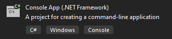

# Troubleshooting

## Unhandled exception. System.IO.FileNotFoundException: Could not load file or assembly […]. The system cannot find the file specified.

When you try to run your program, it throws an exception like the above, referring to a dll such as SinapsXNet, CRlog4net, or something else. This likely means you tried to create a .NET Core or Standard project instead of a .NET Framework project, or your Thermal Desktop installation is corrupt. If the former, start a new .NET Framework project. In Visual Studio the project template should look something like this:

If that does not work, download and reinstall Thermal Desktop.

## SINDA/FLUINT throws an error when I try to run a case using OpenTD

You have tried to run a case using CaseSet.Run but it does not work, even though you can normally run cases using the GUI. Are you running your client program from within Visual Studio using the debugger or the “Start Without Debugging” command? Try building your client and launching it by double-clicking on the exe file in Windows Explorer instead. Sometimes Visual Studio introduces environment variables into child processes that interfere with SINDA/FLUINT and cause it to fail.

## Unhandled Exception: System.BadImageFormatException: Could not load file or assembly 'OpenTD.Results […]’ or one of its dependencies. An attempt was made to load a program with an incorrect format.

When you try to run a program that references OpenTD.Results.dll, you might get this exception. We had to compile OpenTD.Results.dll for x64 platforms, not “Any CPU” like many .NET assemblies. This means that if you reference it, your program also needs to compile for x64 platforms. See the [Work directly with results using OpenTD.Results](reading-results.md#work-directly-with-results-using-OpenTDresults) section for more information on how to set up your program correctly.

## My problem is not listed here

Please contact us at [crtech.support@ansys.com](mailto:crtech.support@ansys.com). Please include “OpenTD” and a descriptive title for your problem in the subject line, with a detailed description in the main body. We will be happy to help get OpenTD working for you.
